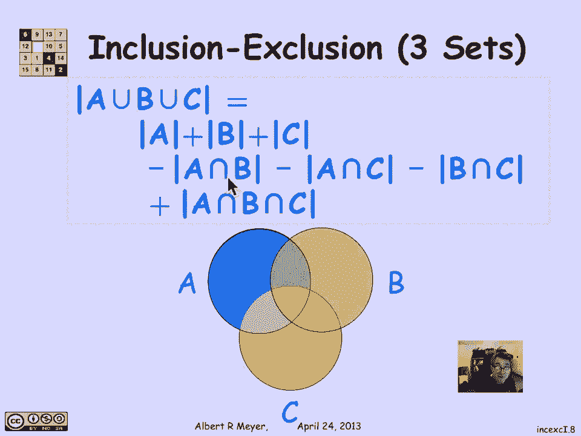
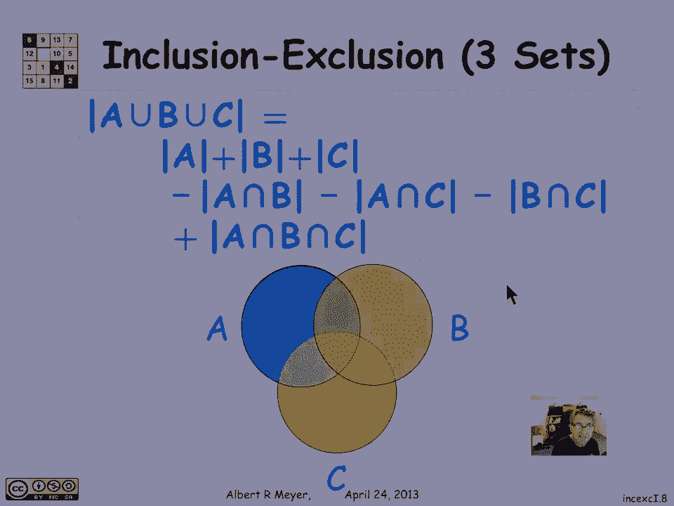
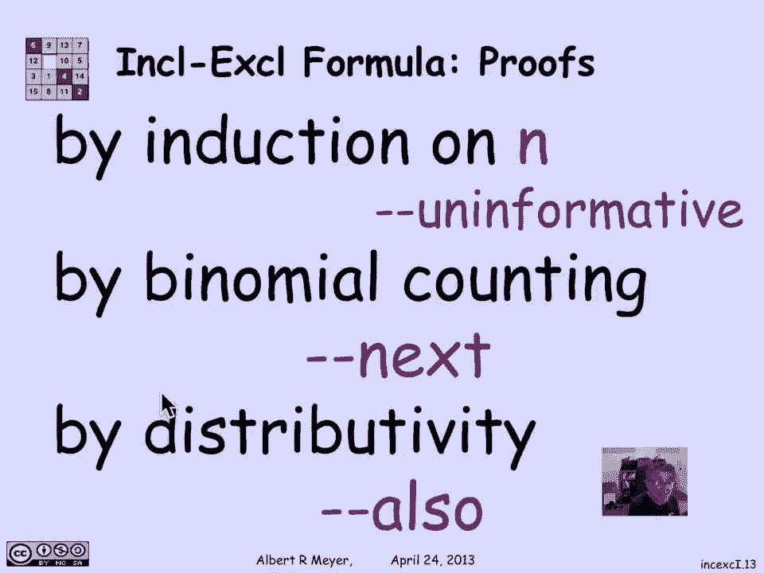

# 集合论与计数：L3.5.4：容斥原理（两个集合）🎯

在本节课中，我们将学习集合论中的一个重要工具——容斥原理。我们将从两个集合的情况开始，通过严谨的证明来理解其背后的逻辑，并初步了解如何将其推广到更多集合。

## 概述

容斥原理是计算多个集合的并集大小的一种方法，尤其当这些集合存在重叠时。它通过“先加后减”的方式，避免重复计算被多个集合共享的元素。本节我们将专注于两个集合的情况，并给出两种证明方法。

## 两个集合的容斥原理

对于任意两个集合 A 和 B，它们的并集大小可以通过以下公式计算：
\[
|A \cup B| = |A| + |B| - |A \cap B|
\]
这个公式的含义是：要计算 A 和 B 中所有元素的总数，我们可以先将 A 和 B 的大小相加，然后减去被重复计算了一次的、同时属于 A 和 B 的元素（即交集部分）。

上一节我们回顾了通过“计算点的次数”来直观理解容斥原理。本节中，我们将通过集合论恒等式来严格证明它。

### 证明方法一：利用不相交并集

证明的核心思想是将并集 \(A \cup B\) 分解为两个互不相交的集合，这样我们就可以直接使用求和法则。

以下是具体的证明步骤：

1.  **分解并集**：集合 \(A \cup B\) 可以表示为两个不相交集合的并集：
    *   集合 A 本身。
    *   集合 B 中不属于 A 的部分，即 \(B \setminus A\)。
    因此，\(A \cup B = A \cup (B \setminus A)\)，且 \(A\) 与 \(B \setminus A\) 不相交。

2.  **应用求和法则**：由于两个集合不相交，它们的并集大小等于各自大小之和：
    \[
    |A \cup B| = |A| + |B \setminus A|
    \]

3.  **关键引理**：为了得到最终公式，我们需要证明一个引理：\(|B \setminus A| = |B| - |A \cap B|\)。
    *   我们可以将集合 B 分解为两个不相交的部分：属于 A 的部分（即 \(A \cap B\)）和不属于 A 的部分（即 \(B \setminus A\)）。
    *   因此，\(B = (A \cap B) \cup (B \setminus A)\)。
    *   再次应用求和法则，得到：\(|B| = |A \cap B| + |B \setminus A|\)。
    *   将 \( |B \setminus A| \) 移到等式一边，即证明了引理：\(|B \setminus A| = |B| - |A \cap B|\)。

4.  **完成证明**：将步骤3的引理代入步骤2的等式：
    \[
    |A \cup B| = |A| + (|B| - |A \cap B|) = |A| + |B| - |A \cap B|
    \]
    至此，两个集合的容斥原理得证。

## 向多个集合的推广

理解了两个集合的情况后，我们可以将其推广到三个乃至 n 个集合。

对于三个集合 A, B, C，其容斥原理公式为：
\[
|A \cup B \cup C| = |A| + |B| + |C| - |A \cap B| - |A \cap C| - |B \cap C| + |A \cap B \cap C|
\]
其模式是：先加所有单个集合的大小，再减去所有两两交集的大小，最后加上所有三个集合交集的大小。

对于 n 个集合 \(A_1, A_2, ..., A_n\)，其广义容斥原理公式如下：
\[
\left| \bigcup_{i=1}^{n} A_i \right| = \sum_{\emptyset \neq S \subseteq \{1,2,...,n\}} (-1)^{|S|+1} \left| \bigcap_{i \in S} A_i \right|
\]
这个公式的含义是：
*   对索引集合 \(\{1,2,...,n\}\) 的每一个非空子集 S 进行求和。
*   计算子集 S 中所有指定集合的交集大小 \(\left| \bigcap_{i \in S} A_i \right|\)。
*   根据子集 S 的大小 \(|S|\) 来决定该项的符号：如果 \(|S|\) 是奇数，则符号为正（因为 \((-1)^{|S|+1} = 1\)）；如果 \(|S|\) 是偶数，则符号为负（因为 \((-1)^{|S|+1} = -1\)）。

## 如何证明广义容斥原理

有多种方法可以证明这个通用公式。

1.  **数学归纳法**：这是最直接的方法。以两个集合的公式为基础，假设公式对 n-1 个集合成立，然后考虑第 n 个集合的加入，并应用两个集合的容斥原理进行推导。这个过程是严谨且机械的，但可能对理解原理的本质帮助有限。

2.  **组合计数法**：这是更富洞察力的方法。其核心思想是追踪并集中每个元素被计算的次数。在公式右边的求和中，一个恰好属于 k 个原始集合的元素，会被所有包含它的交集项所计数。通过分析二项式系数，可以证明该元素在公式右边恰好被计算了一次。这种方法将非正式的“先加后减”论证变得严谨，并揭示了公式与二项式定理之间的深刻联系。

## 总结

本节课中我们一起学习了容斥原理。我们从两个集合的基本公式出发，通过将其分解为不相交子集并利用求和法则，给出了一个严谨的证明。随后，我们了解了该原理如何推广到任意 n 个集合，并给出了通用公式。最后，我们讨论了证明通用公式的两种主要方法：数学归纳法和更具启发性的组合计数法。容斥原理是解决复杂计数问题的基础工具，理解其证明过程有助于我们更灵活地应用它。