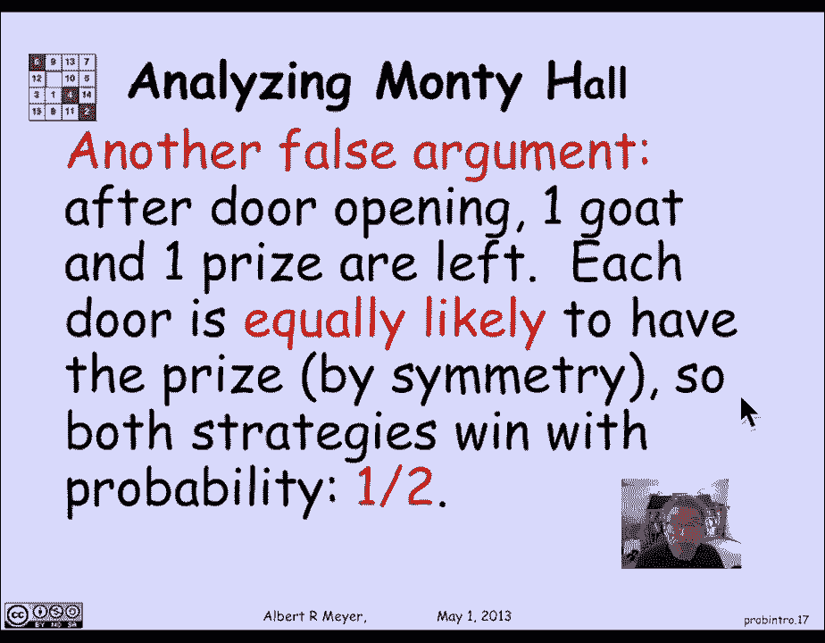
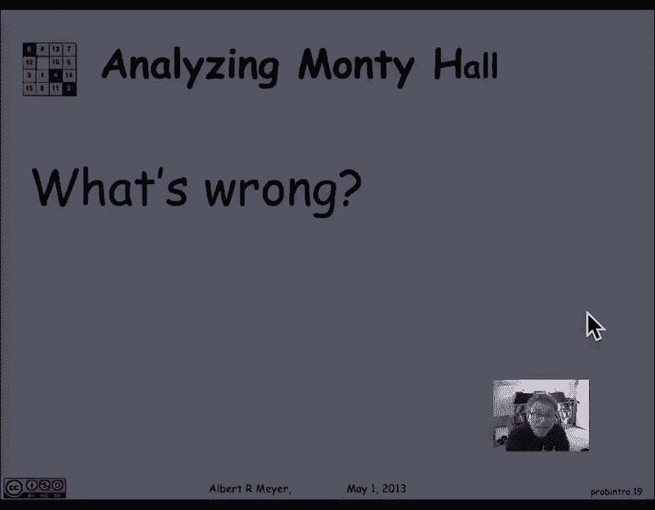
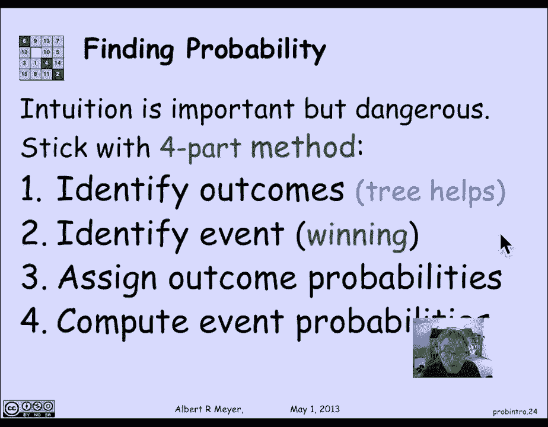

# 计算机科学的数学基础：L4.1.1：树模型 🌳


在本节课中，我们将要学习概率论的基础知识，特别是如何通过构建**树模型**来分析和计算复杂随机事件的概率。我们将从一个经典的扑克牌问题入手，然后深入探讨著名的“蒙提霍尔问题”，以展示概率的直观理解有时会出错，而系统性的树模型方法则能提供清晰的答案。

## 概率的初步概念 🎲

概率论在科学、工程和社会科学中扮演着基础性角色。历史上，它起源于对赌博的分析，后来发展成为保险业和数据分析的基石。理解概率论的基本原理是现代教育的重要组成部分。

概率的第一个朴素想法是：对于一个随机实验，我们有一组可能的结果。我们感兴趣的某些结果构成一个**事件**。事件的概率被定义为该事件包含的结果数量除以所有可能结果的总数。

**公式**：`P(事件) = (事件中的结果数) / (所有可能结果的总数)`

例如，在扑克牌中，计算拿到恰好两张J的概率。一副牌有52张，总共有 `C(52, 5)` 种可能的5张手牌组合。拿到两张J的组合数是：先选J的花色 `C(4, 2)`，再从剩下的48张牌中选3张 `C(48, 3)`。

**代码/公式**：
```
总手牌数 = C(52, 5)
两张J的手牌数 = C(4, 2) * C(48, 3)
P(两张J) = [C(4, 2) * C(48, 3)] / C(52, 5) ≈ 0.04
```

在这个解释下，概率可以理解为：如果我们认为所有手牌出现的可能性相同，那么抽到特定手牌的频率就是其概率。

## 蒙提霍尔问题：一个反直觉的案例 🚪

上一节我们介绍了基于等可能结果的概率计算。本节中我们来看看一个著名的反例——蒙提霍尔问题，它说明了朴素概率模型的局限性。

蒙提霍尔是一个电视游戏节目。规则如下：
1.  有三扇门，其中一扇后面有汽车（大奖），另外两扇后面是山羊。
2.  参赛者先选择一扇门（例如2号门）。
3.  主持人（知道汽车在哪里）会打开一扇**参赛者未选择的、后面是山羊的**门（例如3号门）。
4.  然后，参赛者可以选择**坚持**最初的选择（2号门），或者**换**到另一扇未打开的门（1号门）。

问题是：坚持和更换策略，哪个赢得汽车的概率更高？

关于这个问题曾有过激烈的公开辩论，甚至包括一些数学家。主要形成了两种对立的观点：
*   **观点一**：坚持和更换策略的获胜概率相同，都是1/2。
*   **观点二**：更换策略更好，获胜概率是2/3。

为了系统地解决这个争论，我们需要一个更严谨的方法来为这个随机过程建立概率模型。

## 构建概率树模型 🌲

面对蒙提霍尔这样的复杂问题，直觉可能不可靠。我们提出一个四步法来建立概率模型，其核心是**树模型**。

以下是构建和分析概率模型的四个步骤：

1.  **找出样本空间**：识别随机实验所有可能的结果。树结构可以帮助我们一步步分解实验过程。
2.  **确定目标事件**：在所有结果中，明确哪些结果属于我们关心的事件（例如“获胜”）。
3.  **为结果分配概率**：利用树的结构和逻辑，为每条路径（即每个结果）分配概率权重。
4.  **计算事件概率**：将目标事件中所有结果的概率相加，得到该事件的概率。

现在，让我们将这个四步法应用到蒙提霍尔问题上，分析“总是更换”策略。

### 为“更换策略”建立树模型

我们按照实验步骤构建决策树：





*   **第一层（奖品位置）**：工作人员随机放置汽车。三个选择（门1、门2、门3）的概率各为 **1/3**。
*   **第二层（参赛者初选）**：参赛者随机选择一扇门。三个选择（门1、门2、门3）的概率各为 **1/3**。
*   **第三层（主持人开门）**：主持人必须打开一扇有山羊且未被参赛者选择的门。他的选择取决于前两步：
    *   如果参赛者初选就选中了汽车（例如奖品在1，选1），那么主持人可以在两扇山羊门（2和3）中**随机**打开一扇，每扇概率为 **1/2**。
    *   如果参赛者初选未选中汽车（例如奖品在1，选2），那么主持人**只能**打开剩下的那扇山羊门（3），概率为 **1**。

以下是获胜情况的分析（假设总是更换）：
*   如果初选就选中汽车（概率路径权重小），更换后必然失败。
*   如果初选未选中汽车（概率路径权重大），更换后必然获胜。

通过计算树上所有路径的概率，我们可以汇总：

**公式**：
```
P(更换获胜) = P(初选未中奖) = 2/3
P(坚持获胜) = P(初选中奖) = 1/3
```

因此，**更换策略的获胜概率是2/3，而坚持策略的获胜概率只有1/3**。树模型清晰地显示了，虽然某些结果路径数量相同，但它们的**概率权重**不同，这正是直觉容易出错的地方。

## 核心要点与四步法总结 📝

本节课中我们一起学习了概率论的基础和树模型的应用。

我们首先了解了概率的经典定义，即事件结果数与总结果数之比。然后，通过蒙提霍尔问题，我们发现并非所有结果都具有相同的可能性（权重），因此需要更精细的模型。

我们引入了用于分析概率问题的**四步法**：
1.  **找出样本空间**（用树模型描述过程）。
2.  **确定目标事件**（哪些结果代表“赢”）。
3.  **为结果分配概率**（根据逻辑为树的分支赋予概率）。
4.  **计算事件概率**（将相关结果的概率相加）。




这个方法的优势在于，它用结构化的逻辑取代了容易出错的直觉，尤其适用于涉及多个步骤和条件的随机过程。记住，在概率论中，直觉是重要的，但也需要严谨的方法来验证。