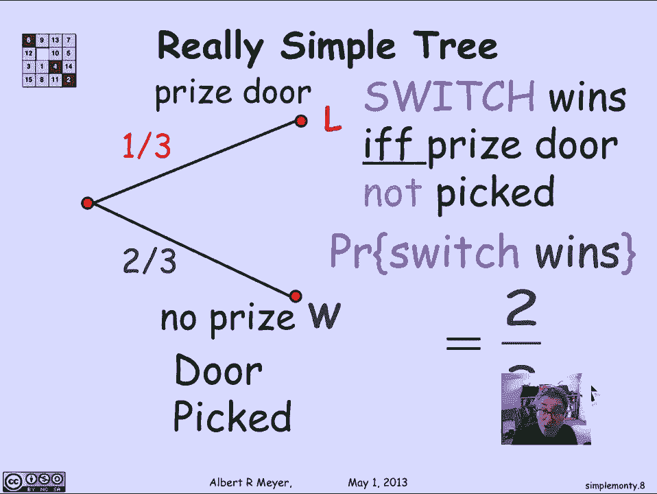
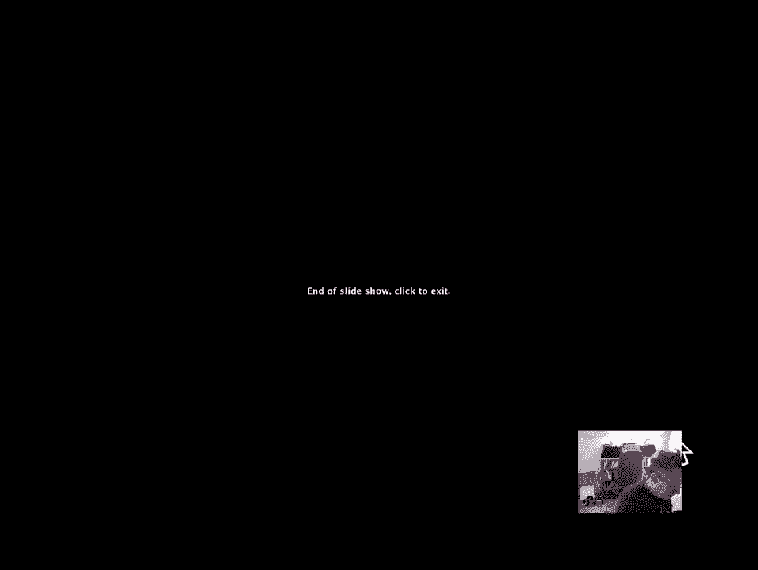

# 计算机科学的数学基础：L4.1.3：简化的蒙提霍尔问题树 🌳

在本节课中，我们将学习如何通过构建一个更简化的概率树模型，来分析蒙提霍尔问题中“换门”策略的获胜概率。我们将看到，通过巧妙的建模，可以极大地简化分析过程，并清晰地得出结论。

---

上一节我们介绍了使用详尽概率树分析蒙提霍尔问题的方法。本节中我们来看看如何通过简化这个树模型，让分析过程变得更加直观和高效。

最初构建的树模型非常庞大和复杂。它完整地枚举了奖品在三个门后的所有情况、参赛者的选择以及主持人开门的所有可能。这个树具有对称结构，即奖品在门1、门2、门3后的三个子树结构完全相同。因此，我们实际上只需要分析其中一个子树，就能推断出整体的结果。

与其分析一个包含三个对称分支的庞大树，不如从一开始就构建一个更精简的模型。我们可以假设奖品固定在某个门后（例如门2），然后分析参赛者选择不同门的情况。这样，我们得到的子树如下所示：

```
奖品在门2
├── 参赛者选门1 (概率 1/3)
│   └── 主持人必须开空门3 (概率 1) -> 换门则赢
├── 参赛者选门2 (概率 1/3)
│   └── 主持人可开空门1或3 (各概率 1/2) -> 换门则输
└── 参赛者选门3 (概率 1/3)
    └── 主持人必须开空门1 (概率 1) -> 换门则赢
```

然而，一个更好的建模思路是**相对化**参赛者的选择。我们并不关心具体选了哪扇门，只关心参赛者的选择与奖品门之间的关系。这可以分为三种情况：

以下是三种相对情况：
1.  参赛者选中了奖品门。
2.  参赛者选中了“第一个”非奖品门（即按某种顺序，离奖品门最近的那个空门）。
3.  参赛者选中了“第二个”非奖品门（即剩下的那个空门）。

每种情况的概率都是 **1/3**。在这种视角下，树模型可以进一步简化。特别是，当我们只关心“换门”策略的最终胜负时，许多中间步骤可以合并。

如果我们只分析“换门”策略，那么：
*   只要参赛者**最初选中的是非奖品门**（上述情况2或3），那么主持人别无选择，只能打开另一扇空门，此时换门就一定会赢。
*   如果参赛者**最初选中了奖品门**（上述情况1），那么无论主持人打开哪扇空门，换门都一定会输。

因此，整个实验过程可以压缩为一个极其简单的树：

```
初始选择
├── 选到非奖品门 (概率 = 2/3) -> 换门则赢
└── 选到奖品门 (概率 = 1/3) -> 换门则输
```

从这个简化模型中，我们可以直接读出结论：采用“换门”策略时，获胜的概率是 **2/3**。用公式表达就是：
**P(换门获胜) = P(初始选择非奖品门) = 2/3**

---





本节课中我们一起学习了如何通过构建简化的概率树模型来分析蒙提霍尔问题。核心在于，对同一个场景进行概率建模时，可能存在多种有效的模型。选择一个能够抓住问题本质、忽略不必要细节的模型，往往能让分析过程更清晰、结论更直观。简化的树模型直接揭示了“换门获胜等价于初始猜错”这一核心关系，从而高效地得出了 **2/3** 的获胜概率。