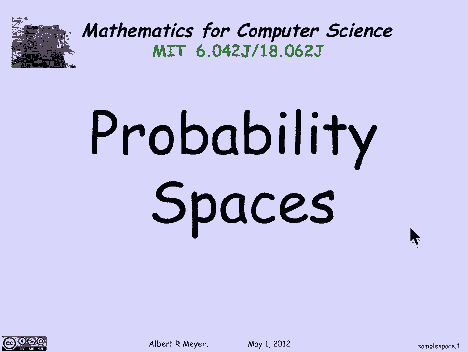
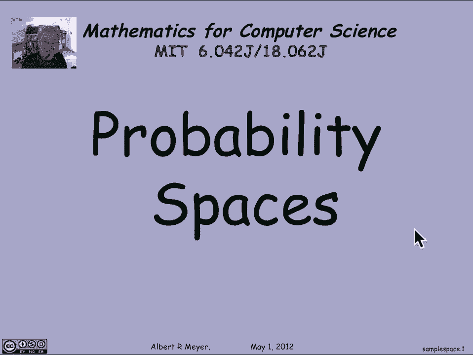
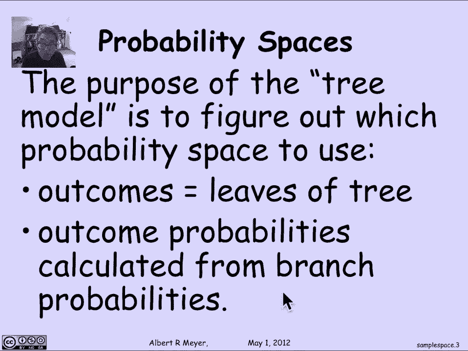
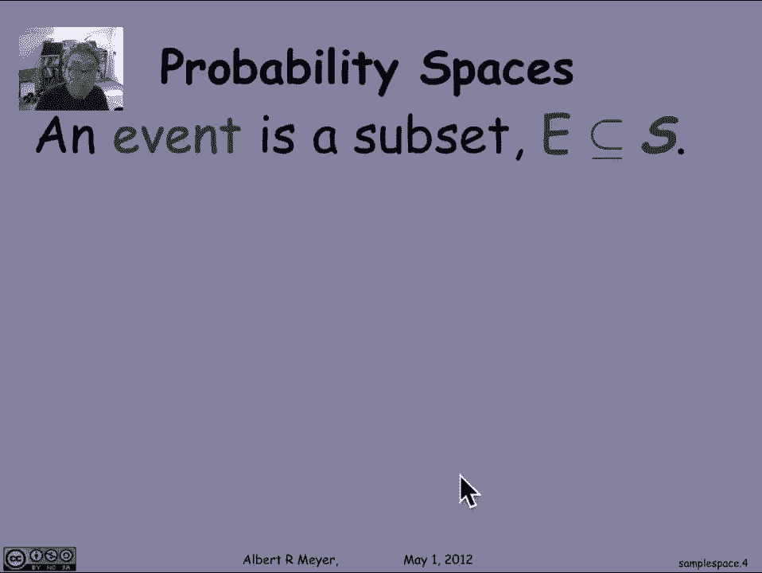
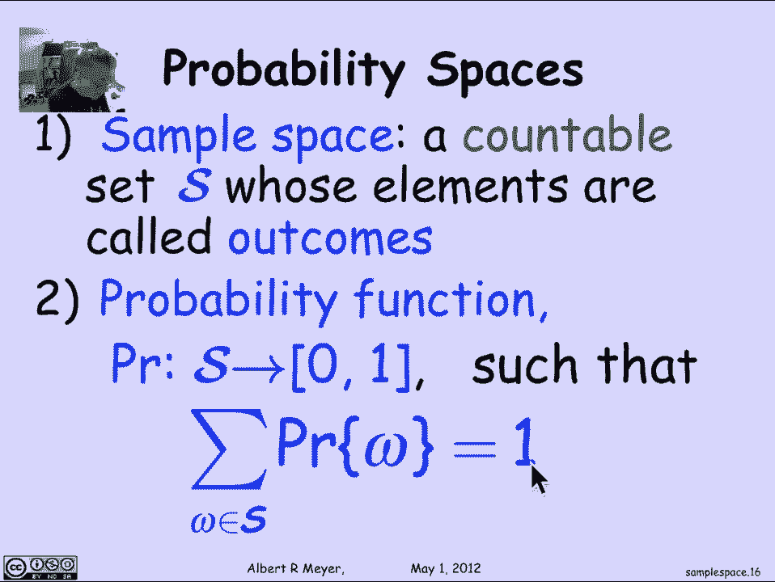

# 概率论基础：L4.1.5：样本空间 📊





在本节课中，我们将学习概率论的数学基础，即概率空间的基本定义。我们将从之前讨论的具体例子转向更抽象、更形式化的概念。

## 概率空间的定义

上一节我们通过树模型分析了具体问题。本节中，我们来看看支撑这些分析的抽象数学框架——概率空间。

一个**概率空间**由两个基本部分组成：一个**样本空间**和一个**概率函数**。

### 样本空间

样本空间 `S` 是一个**可数**的结果集合。它旨在建模你的随机实验中所有可能发生的事情，即所有可能的结果。我们要求结果的数量是可数的。目前我们看到的例子都是有限的，但很快我们会看到需要无限（但可数）结果的例子。

### 概率函数

概率函数 `Pr` 的任务是为每个结果分配概率。它必须满足以下条件：
*   对于样本空间 `S` 中的每一个结果 `ω`，其概率 `Pr(ω)` 是一个介于 0 和 1 之间（包含 0 和 1）的数。
*   所有结果的概率之和必须等于 1。这是定义概率函数的关键条件。

用公式表示，即：
```
对于所有 ω ∈ S，有 0 ≤ Pr(ω) ≤ 1。
且 Σ_{ω ∈ S} Pr(ω) = 1。
```



一个配备了概率函数的样本空间就构成了一个**概率空间**。我们之前使用的树模型，其目的正是为了帮助我们确定使用哪个概率空间。在得到概率空间之前是建模部分，这非常重要，但模型的对错取决于它与现实的吻合程度以及我们的使用目的。在树模型中，**叶子节点**对应着**结果**，而我们从根节点到叶子节点推理出的分支概率，最终决定了每个结果的概率，从而构建出概率空间。



## 事件及其概率

另一个关键概念是**事件**。形式上，事件就是样本空间的一个子集。它代表你感兴趣的一组结果（例如“获胜”）。

事件 `E` 的概率定义非常简单：它是事件 `E` 中所有结果的概率之和。

用公式表示，即：
```
Pr(E) = Σ_{ω ∈ E} Pr(ω)
```

我们在分析蒙提霍尔问题和扑克手牌时已经使用了这个定义，但这是官方的一般性定义。一旦我们有了为结果分配概率的函数，就可以用它来定义事件的概率。

从这个定义可以立即推导出一个概率论的核心规则，称为**求和规则**。

以下是求和规则的内容：
*   如果有一系列事件 `A₀, A₁, A₂, ...` 是**两两互斥**的（即任意两个事件没有共同的结果），那么这些事件的并集（即至少有一个事件发生）的概率，等于各个事件概率之和。

用公式简洁地表示为：
```
如果对于所有 i ≠ j，有 Aᵢ ∩ Aⱼ = ∅，
则 Pr(⋃_{i} Aᵢ) = Σ_{i} Pr(Aᵢ)
```

这个规则我们将经常使用。它将复杂问题分解为互斥的个案，分别计算每个个案的概率后再相加，非常方便。在一些更一般的概率论方法中，这实际上被当作一条公理。但在离散情况下，它只是我们定义概率方式的一个推论。

## 为什么是“离散”概率？

我们研究的是**离散概率**，因为样本空间是可数的。这使得我们可以使用**求和**而非**积分**来处理概率。如果允许连续的概率（例如，飞镖落在一条线上某个区间的概率），就必须用积分来定义概率，其理论基础要复杂得多。对于计算机科学中的几乎所有应用，我们都不需要它，因此可以愉快地避开积分或测度论，只用求和就足够了。

## 其他概率规则

基于可数求和规则，可以推导出一些常用的概率论规则。

### 差集规则

事件 `A` 减去事件 `B`（即 `A` 发生但 `B` 不发生）的概率，等于 `A` 的概率减去 `A` 与 `B` 交集的概率。

用公式表示为：
```
Pr(A \ B) = Pr(A) - Pr(A ∩ B)
```

这个规则的证明与集合基数差集规则的证明类似，直接源于概率的求和规则。

### 容斥原理

如果 `A` 和 `B` 不是互斥的，那么 `A` 或 `B` 发生的概率，等于 `A` 的概率加 `B` 的概率，再减去两者同时发生的概率。

用公式表示为：
```
Pr(A ∪ B) = Pr(A) + Pr(B) - Pr(A ∩ B)
```

证明与有限集合基数的容斥原理完全相同，并且可以推广到更多集合的情况。

### 布尔不等式

以下是一些有用的不等式：
1.  `A` 或 `B` 发生的概率，总是小于或等于 `A` 发生的概率加上 `B` 发生的概率。这是容斥原理的简单推论。
    ```
    Pr(A ∪ B) ≤ Pr(A) + Pr(B)
    ```
2.  `A` 或 `B` 发生的概率，总是大于或等于 `A` 发生的概率。
    ```
    Pr(A ∪ B) ≥ Pr(A)
    ```
3.  上述不等式可以推广到可数的事件集合：一系列事件中至少有一个发生的概率，小于或等于各个事件概率之和。
    ```
    Pr(⋃_{i} Aᵢ) ≤ Σ_{i} Pr(Aᵢ)
    ```

## 总结 📝

本节课中我们一起学习了概率论的核心数学基础。关键概念是**概率空间**，它由一个可数的结果集合（**样本空间**）和一个**概率函数**组成。概率函数为每个结果分配一个介于0和1之间的值，并且所有结果的概率之和必须为1。我们使用树模型等工具的目标就是构建这样一个概率空间。



我们还定义了**事件**（样本空间的子集）及其概率（事件中所有结果的概率之和）。由此推导出了重要的**求和规则**（用于互斥事件）以及其他实用规则，如差集规则、容斥原理和布尔不等式。这些规则构成了离散概率计算的基础。