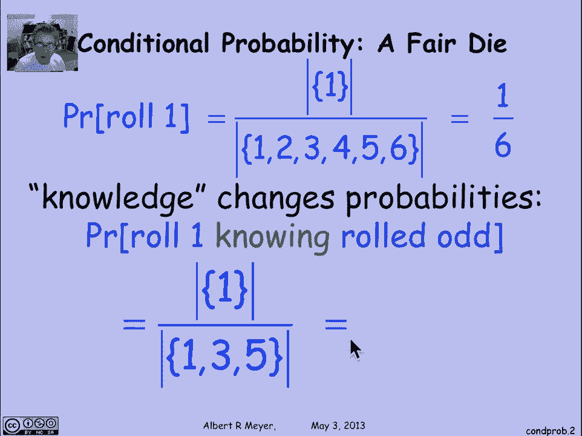
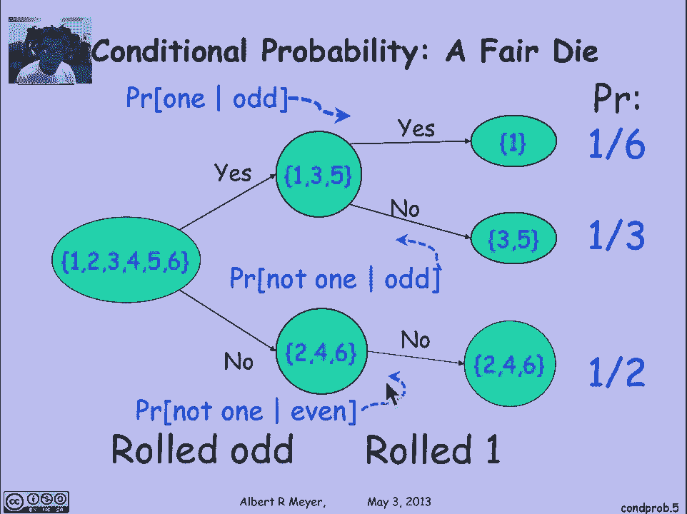
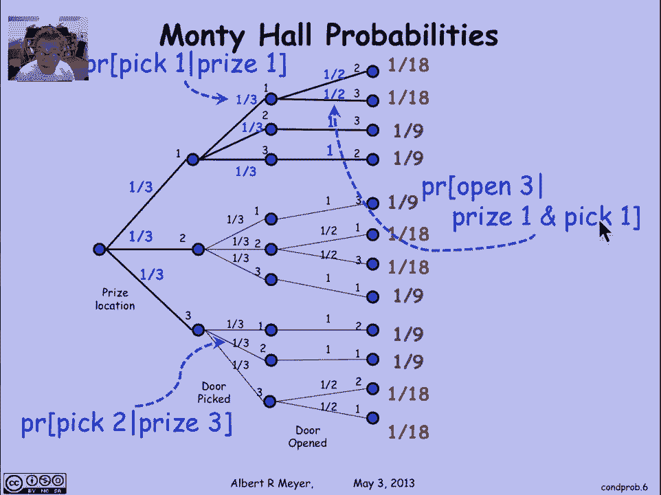
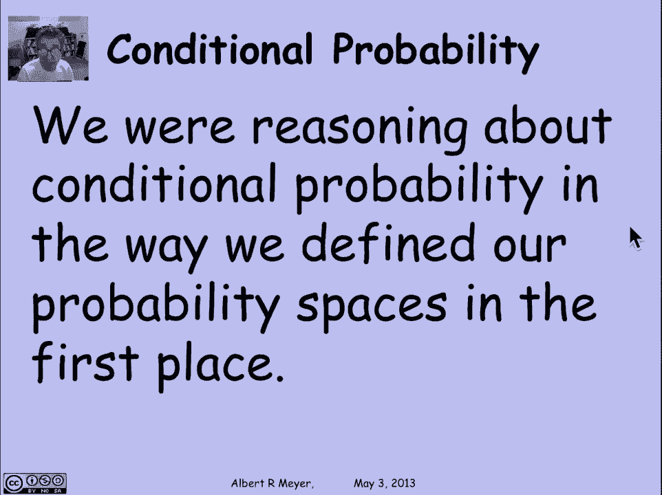
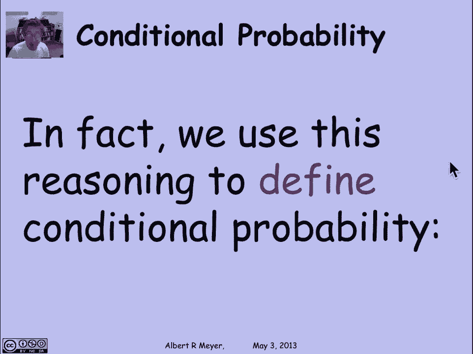
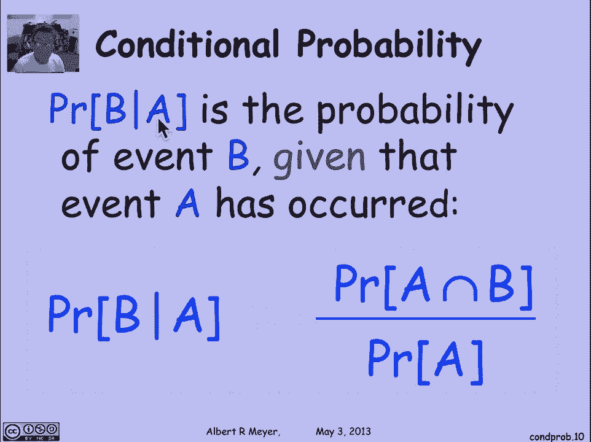
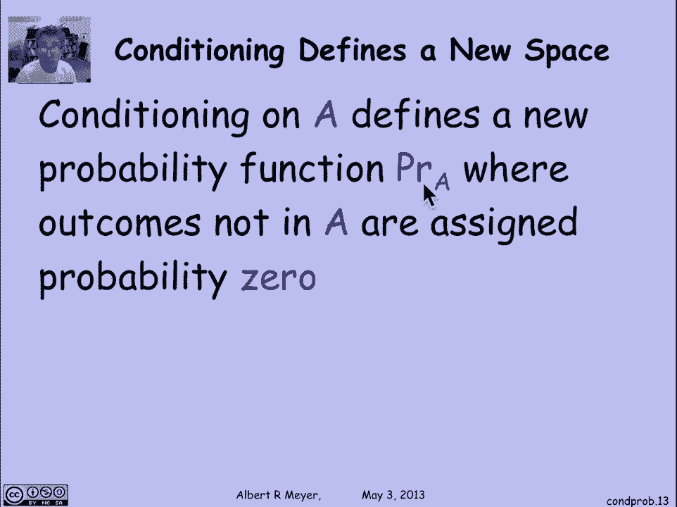
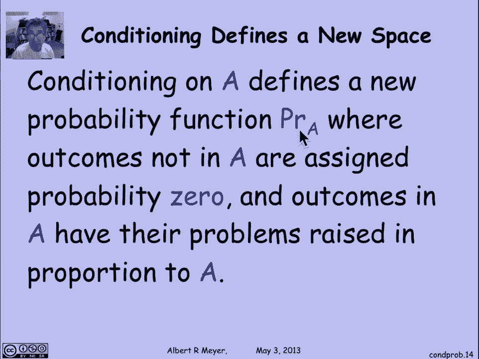
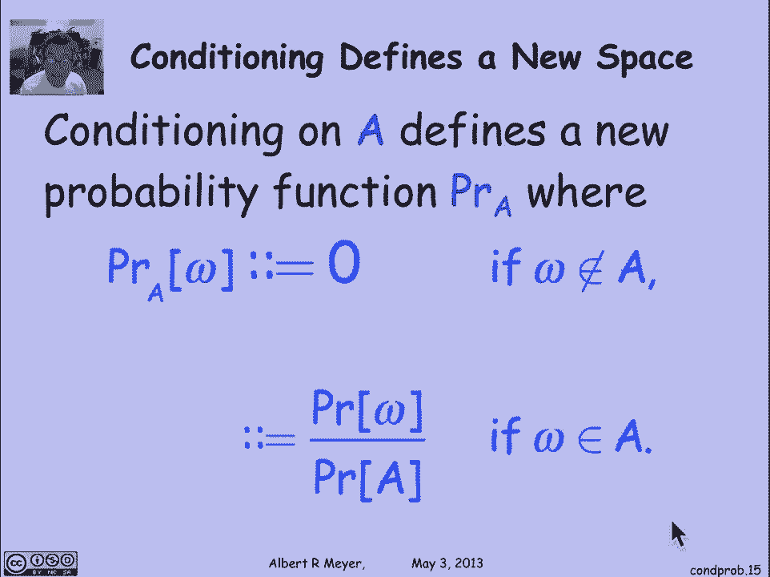
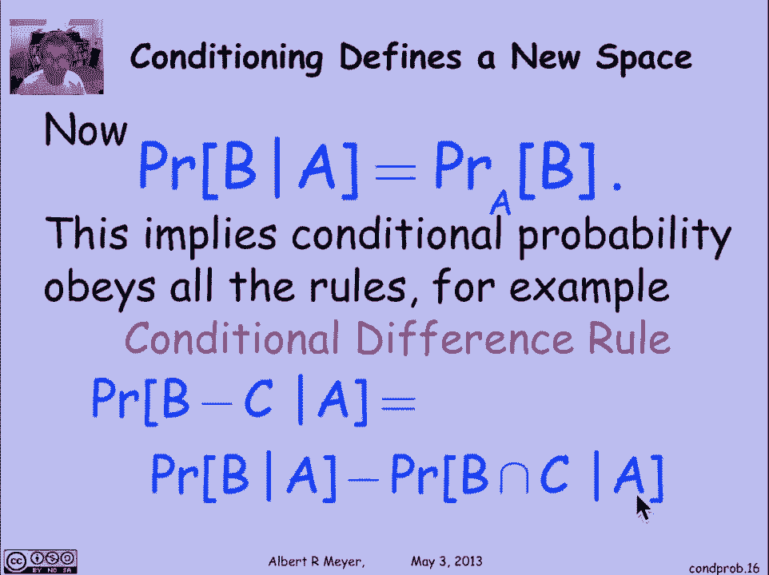

# 计算机科学的数学基础：L4.2.1：条件概率定义 📊

在本节课中，我们将要学习概率论中的一个核心概念——**条件概率**。条件概率描述了在已知某些信息（即某个事件已经发生）的情况下，另一个事件发生的可能性。它在保险、金融、工程乃至日常推理中都有广泛应用。

## 条件概率的直观理解 🤔

上一节我们介绍了概率的基本概念，本节中我们来看看条件概率。条件概率是给定某一事件发生的条件下，另一事件发生的概率。例如：
*   保险公司想知道，考虑到客户的病史，客户再活十年的可能性有多大。
*   投资者想知道，考虑到股票过去一个月的价格波动，其明天上涨的可能性有多大。
*   系统工程师想知道，考虑到最近请求的速率，系统发生过载的可能性有多大。

## 一个简单的例子：掷骰子 🎲

让我们通过一个简单的掷骰子例子来具体理解。假设我们掷一个公平的六面骰子。样本空间是 {1, 2, 3, 4, 5, 6}，每个结果的概率是 **1/6**。

现在，如果我告诉你，我掷出的点数是**奇数**。在这个新信息下，我想知道掷出 **1** 点的概率是多少？
*   已知点数为奇数，可能的结果只剩下 {1, 3, 5}。
*   这三个结果可能性相同。
*   因此，掷出 **1** 点的概率变为 **1/3**。

这个额外的信息（点数为奇数）改变了我们对概率的判断。

## 树状图与条件概率 🌳

理解条件概率的一种方法是将其视为一个两阶段的实验。首先，我们看是否掷出奇数；然后，再看具体掷出哪个数字。

以下是描述这个过程的树状图：

1.  第一层分支：掷出奇数的概率是 **1/2**（对应结果 {1, 3, 5}），掷出偶数的概率也是 **1/2**（对应结果 {2, 4, 6}）。
2.  第二层分支（在“掷出奇数”的前提下）：
    *   掷出 **1** 点的概率是 **1/3**。
    *   掷出 **3** 或 **5** 点的概率各是 **1/3**。
    *   在“掷出偶数”的前提下，掷出 **1** 点的概率是 **0**。

通过这棵树，我们可以计算任何结果的概率。例如，最终掷出 **1** 点的总概率是 **(1/2) * (1/3) = 1/6**，这与最初的结论一致。

树状图上的第二层概率，如 **1/3** 和 **0**，就是我们所说的**条件概率**。**1/3** 是“在掷出奇数的条件下，掷出 **1** 点”的概率。

## 蒙蒂·霍尔问题回顾 🚪

让我们回顾之前讨论过的蒙蒂·霍尔问题，其中也隐含使用了条件概率。

在分析该问题的树状图中，分支上的标签很多都是条件概率。例如，图中 **1/2** 这个概率，表示“在奖品在1号门且参赛者选择了1号门的条件下，主持人打开3号门”的概率。我们在构建概率模型时，已经自然地使用了条件概率来标记树的分支。

## 条件概率的正式定义与乘积规则 📝

以上讨论引出了条件概率的正式定义。

**定义**：对于概率空间中的两个事件 **A** 和 **B**，且 **P(A) > 0**，则在事件 **A** 发生的条件下，事件 **B** 发生的概率（记为 **P(B | A)**）定义为：
**P(B | A) = P(A ∩ B) / P(A)**

这个定义非常直观：我们将 **A** 和 **B** 同时发生的概率，除以 **A** 自身发生的概率，从而将样本空间缩小到 **A** 发生的范围内，再看其中 **B** 所占的比例。

由这个定义可以直接推导出**乘积规则**：
**P(A ∩ B) = P(A) * P(B | A)**

乘积规则表明，两个事件同时发生的概率，等于第一个事件发生的概率乘以在第一个事件发生的条件下第二个事件发生的概率。

乘积规则可以推广到多个事件。例如，三个事件交集的概率为：
**P(A ∩ B ∩ C) = P(A) * P(B | A) * P(C | A ∩ B)**

## 条件概率空间 🔄

另一种理解条件概率的有用视角是：以事件 **A** 为条件，定义了一个**新的概率空间**。

具体来说，我们定义一个新的概率函数 **P_A**（或写作 **P(· | A)**），其样本空间不变，但概率分配规则改变：
*   对于不在 **A** 中的结果，其概率为 **0**（因为已知 **A** 发生，它们不可能发生）。
*   对于在 **A** 中的结果，其新概率等于其原始概率除以 **P(A)**。这使得 **A** 本身在新空间中的概率为 **1**。

可以验证，这个新的概率函数 **P_A** 满足所有概率公理，因此它本身构成一个合法的概率测度。这意味着，所有适用于普通概率的规则（如加法规则、差分规则）同样适用于条件概率。

例如，条件概率的差分规则为：
**P(B \ C | A) = P(B | A) - P(B ∩ C | A)**

## 总结 📚

本节课中我们一起学习了条件概率的核心内容：
1.  **直观概念**：条件概率是在已知某事件发生的前提下，另一事件发生的概率。
2.  **正式定义**：当 **P(A) > 0** 时，**P(B | A) = P(A ∩ B) / P(A)**。
3.  **乘积规则**：**P(A ∩ B) = P(A) * P(B | A)**，该规则是构建概率树和进行序列推理的基础。
4.  **新概率空间**：以事件 **A** 为条件，可以诱导出一个新的、定义在相同样本空间上的概率测度 **P(· | A)**。

理解条件概率是进行复杂概率推理、使用贝叶斯定理以及分析随机过程的关键第一步。