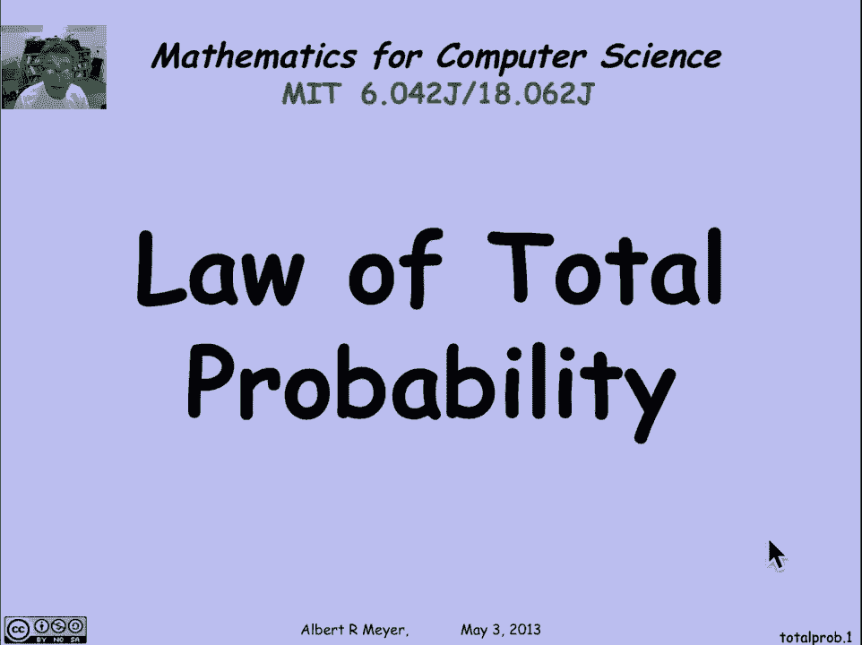
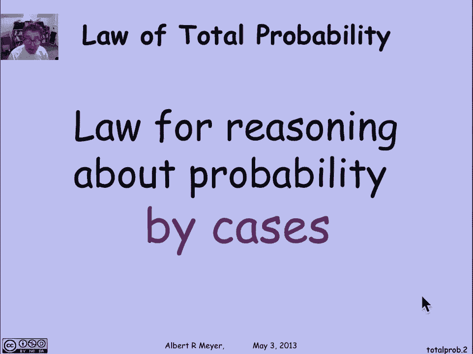
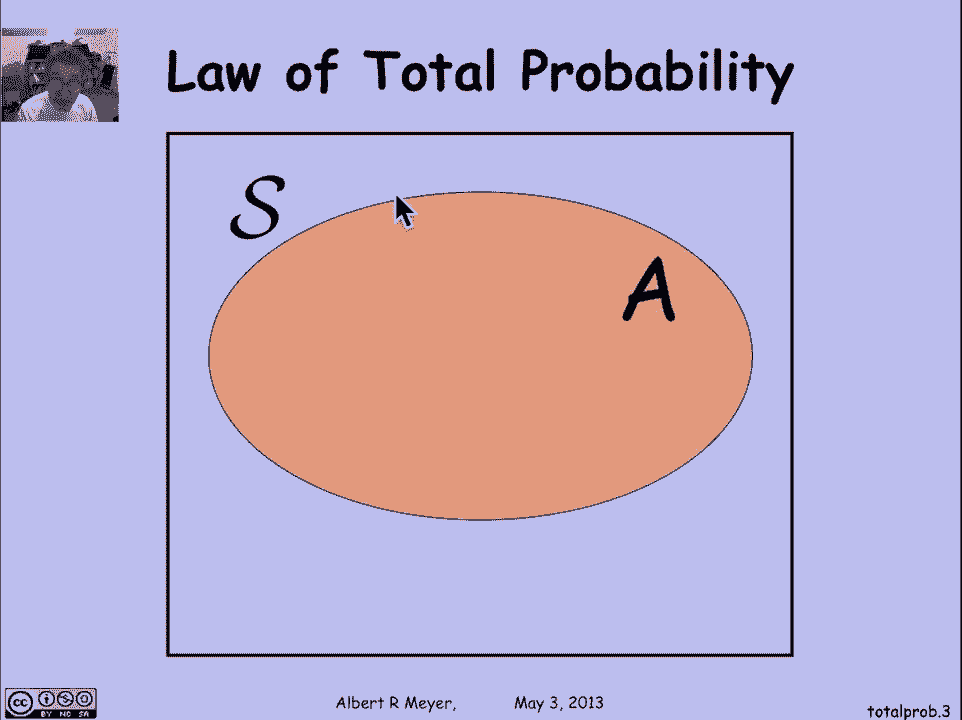
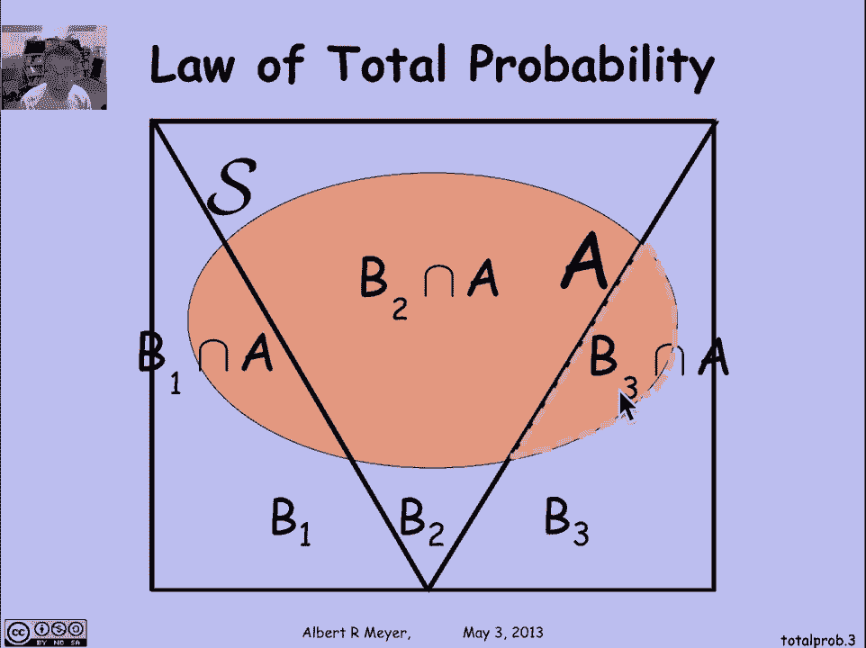
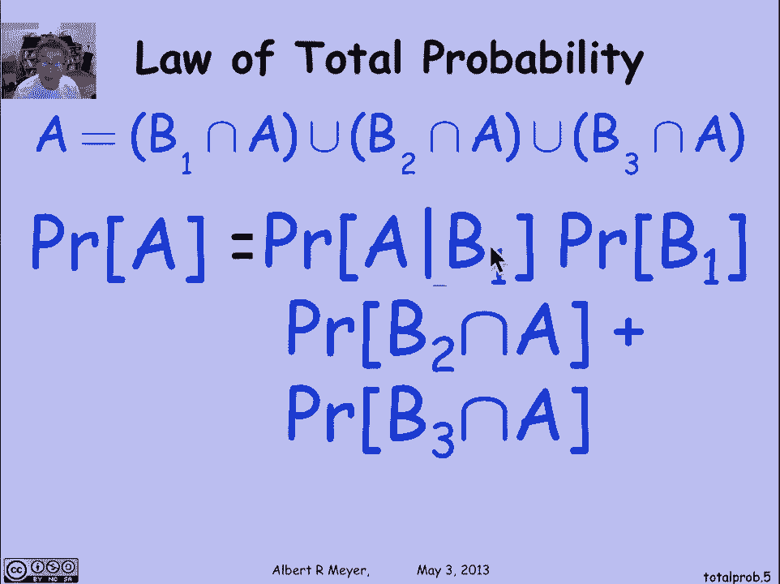
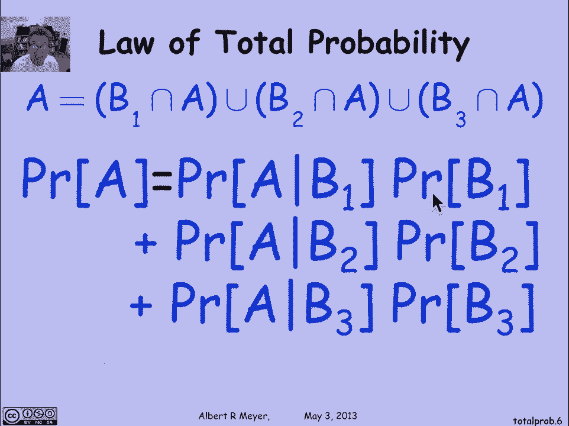
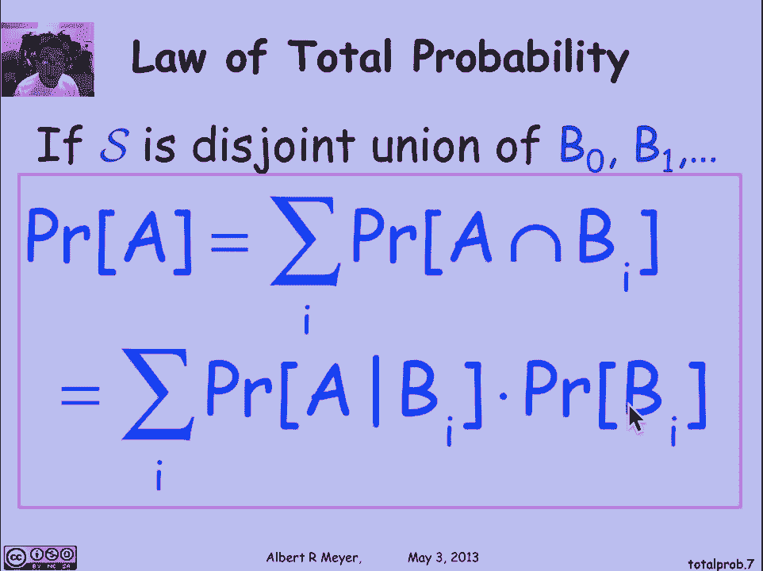

# 计算机科学的数学基础：L4.2.3：总概率定律 📊

在本节课中，我们将要学习总概率定律。这是一个重要的概率论工具，它提供了一种通过将复杂事件分解为更简单的子事件（或“情况”）来进行推理的方法。

## 概述

总概率定律是处理各种概率问题的基本技术。其核心思想是，通过将一个事件分解为若干个互斥且完备的子事件，我们可以更容易地计算该事件的概率。

## 总概率定律的直观理解

上一节我们介绍了条件概率和乘法法则，本节中我们来看看如何将它们结合起来用于分解事件。

首先，我们从集合论的角度来理解。假设在一个更大的样本空间中有一个事件 **A**。同时，我们有三组事件 **B₁**、**B₂** 和 **B₃**，它们构成了样本空间的一个“划分”。这意味着：

1.  **B₁**、**B₂**、**B₃** 互不相交（即，它们之间没有重叠）。
2.  它们的并集覆盖了整个样本空间（即，样本空间中的每个结果都属于且仅属于其中一个 **Bᵢ**）。

现在，考虑事件 **A**。**A** 可以被分解为它与每个 **Bᵢ** 的交集部分：
*   **A ∩ B₁**：既属于 **A** 又属于 **B₁** 的结果。
*   **A ∩ B₂**：既属于 **A** 又属于 **B₂** 的结果。
*   **A ∩ B₃**：既属于 **A** 又属于 **B₃** 的结果。

由于 **B₁**、**B₂**、**B₃** 互不相交，这些交集 **A ∩ Bᵢ** 也互不相交。因此，事件 **A** 可以表示为这些互不相交部分的并集：

**A = (A ∩ B₁) ∪ (A ∩ B₂) ∪ (A ∩ B₃)**

## 从集合论到概率论

根据概率的加法法则，互不相交事件的并集的概率等于它们各自概率之和。因此：

**Pr[A] = Pr[A ∩ B₁] + Pr[A ∩ B₂] + Pr[A ∩ B₃]**

接下来，我们对每个交集项 **Pr[A ∩ Bᵢ]** 应用乘法法则（即条件概率公式 **Pr[A ∩ B] = Pr[A | B] · Pr[B]**）。将其代入上式，我们得到总概率定律的标准形式：

**Pr[A] = Pr[A | B₁] · Pr[B₁] + Pr[A | B₂] · Pr[B₂] + Pr[A | B₃] · Pr[B₃]**

## 定律的一般形式

以上推导基于三个划分事件，但该定律可以推广到任意有限或可数多个划分事件的情况。

假设样本空间 **S** 被划分为一组事件 **B₁, B₂, B₃, ...**，它们满足：
1.  互斥性：对于任意 **i ≠ j**，有 **Bᵢ ∩ Bⱼ = ∅**。
2.  完备性：所有 **Bᵢ** 的并集等于 **S**。

那么，对于任意事件 **A**，其概率为：

**Pr[A] = Σᵢ Pr[A | Bᵢ] · Pr[Bᵢ]**

其中，求和符号 **Σᵢ** 表示对所有划分事件 **Bᵢ** 进行求和。

这个公式是总概率定律最常用和最有用的表述。它告诉我们，一个事件 **A** 的总概率，等于它在各种可能“情况” **Bᵢ** 下发生的条件概率，乘以这些“情况”本身发生的概率，然后将所有“情况”的结果相加。

## 总结

本节课中我们一起学习了总概率定律。我们了解到，该定律允许我们将一个复杂事件的概率计算，分解为在一系列互斥且完备的场景下的条件概率的加权和。其核心公式为：

**Pr[A] = Σᵢ Pr[A | Bᵢ] · Pr[Bᵢ]**

这是一个非常强大的工具，在接下来的内容中，我们将看到它的广泛应用。

