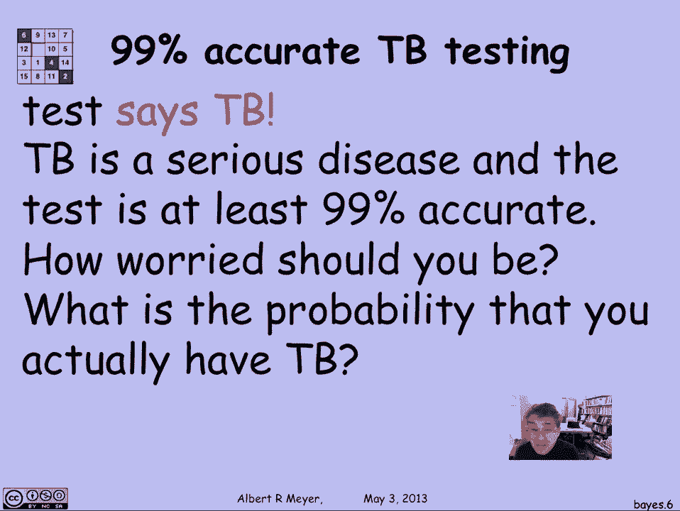
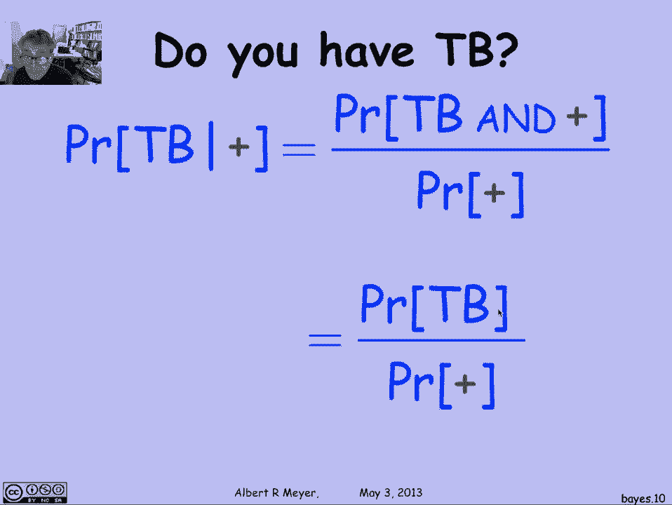
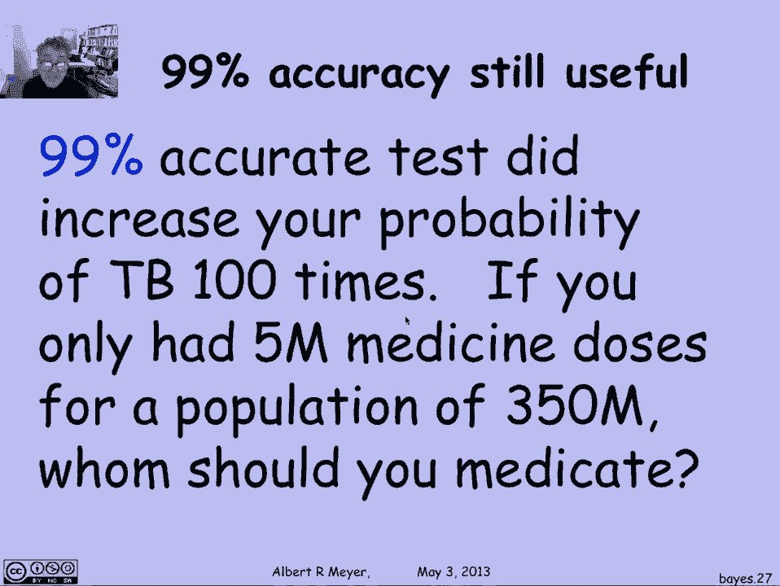
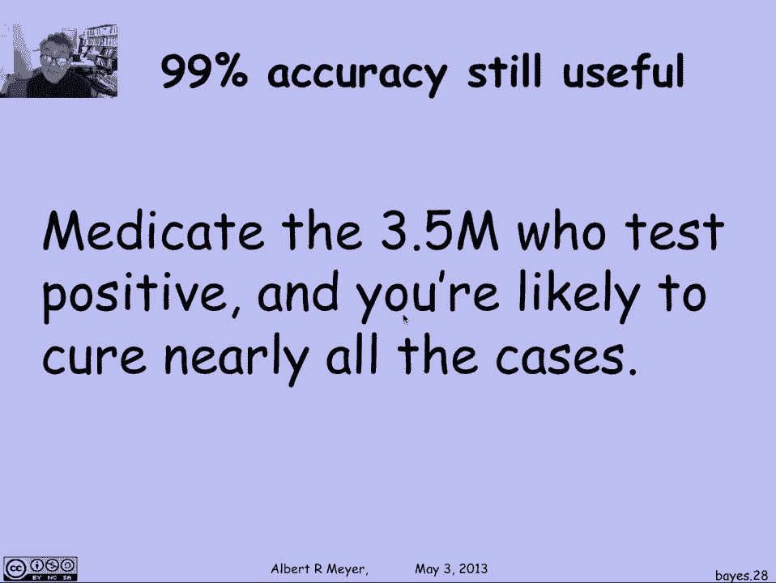

# 计算机科学的数学基础：4.2.5：贝叶斯定理 🧮

在本节课中，我们将要学习条件概率的一个重要应用——贝叶斯定理。我们将通过一个诊断测试的例子，来理解如何利用已知的测试准确率，结合疾病的先验概率，来计算在得到特定测试结果后，真正患病的概率。这个定理是处理不确定性信息的有力工具。

## 问题引入：诊断测试的可靠性

上一节我们介绍了条件概率的基本概念，本节中我们来看看它在现实中的一个经典应用场景：分析诊断测试结果的可靠性。

假设有一种用于检测肺结核的诊断测试。这个测试声称具有超过99%的准确性。具体来说，它的属性如下：
*   如果你患有肺结核，测试**保证**能检测出来，结果为阳性。
*   如果你没有肺结核，测试在99%的情况下会正确显示阴性，但在1%的情况下会错误地显示阳性（即假阳性）。

现在，假设医生为你做了这个测试，结果是阳性。这听起来很令人担忧，因为测试的准确率很高。但我们需要从概率的角度分析：在这个“非常精确”的测试显示阳性的情况下，你**真正**患有肺结核的概率是多少？

## 定义目标概率

我们首先要明确需要计算的目标。用符号表示：
*   设事件 **TB** 表示“患有肺结核”。
*   设事件 **+** 表示“测试结果为阳性”。

我们想要计算的是：在已知测试结果为阳性的条件下，患有肺结核的概率。这可以写作条件概率 **P(TB | +)**。

## 将已知信息转化为概率

以下是关于测试准确性的已知信息，我们可以用条件概率的语言来描述它们：

1.  **真阳性率**：如果确实患病，测试结果为阳性的概率是100%。即 **P(+ | TB) = 1**。
2.  **假阳性率**：如果没有患病，测试结果为阳性的概率是1%。即 **P(+ | ¬TB) = 0.01**。（¬TB 表示“未患肺结核”）

此外，我们还需要一个关键信息：在没有任何测试信息的情况下，一个随机个体患肺结核的概率，即 **P(TB)**。这被称为**先验概率**。根据示例，我们假设在美国，这个概率大约是 **P(TB) ≈ 1/10,000 = 0.0001**。

## 推导与计算过程

现在，我们开始计算 **P(TB | +)**。

首先，根据条件概率的定义：
**P(TB | +) = P(TB ∩ +) / P(+)**

其中，分子 **P(TB ∩ +)** 是“患病且测试为阳性”的联合概率。我们可以再次利用条件概率定义将其展开：
**P(TB ∩ +) = P(+ | TB) * P(TB)**

根据已知信息，**P(+ | TB) = 1**，所以：
**P(TB ∩ +) = 1 * P(TB) = P(TB)**

接下来，计算分母 **P(+)**，即测试结果为阳性的总概率。我们使用**全概率公式**，考虑“患病”和“未患病”这两种互斥的情况：
**P(+) = P(+ | TB) * P(TB) + P(+ | ¬TB) * P(¬TB)**

代入已知数值：
*   P(+ | TB) = 1
*   P(TB) = p （我们先用符号 p 表示）
*   P(+ | ¬TB) = 0.01
*   P(¬TB) = 1 - P(TB) = 1 - p

因此：
**P(+) = 1 * p + 0.01 * (1 - p) = p + 0.01 - 0.01p = 0.99p + 0.01**

现在，我们将分子和分母的结果组合起来：
**P(TB | +) = P(TB) / P(+) = p / (0.99p + 0.01)**

这就是我们要求的条件概率公式。现在，代入先验概率 **p = 0.0001**：
**P(TB | +) = 0.0001 / (0.99*0.0001 + 0.01) ≈ 0.0001 / (0.000099 + 0.01) ≈ 0.0001 / 0.010099 ≈ 0.0099**

计算结果约为 **0.99%**。这意味着，即使一个准确率高达99%的测试显示为阳性，你真正患上肺结核的概率也只有大约1%。

## 贝叶斯定理

我们刚才的推导过程，其实就是**贝叶斯定理**的一个具体应用。贝叶斯定理的一般形式如下：

对于任意两个事件 A 和 B（其中 P(B) > 0）：
**P(A | B) = [P(B | A) * P(A)] / P(B)**

在我们的例子中：
*   A 对应事件 TB（患病）
*   B 对应事件 +（测试阳性）
*   **P(TB | +)** 是我们想求的**后验概率**（得到证据后的概率）。
*   **P(+ | TB)** 是**似然度**（假设患病时得到该证据的概率）。
*   **P(TB)** 是**先验概率**（得到证据前的概率）。
*   **P(+)** 是**证据的边际概率**，通常通过全概率公式计算。

## 结果分析与实际意义

这个看似反直觉的结果（99%准确的测试只带来1%的患病确信度）原因在于：疾病的先验概率（0.01%）极低，而假阳性率（1%）相对较高。绝大多数阳性结果实际上来自庞大健康人群中的假阳性，而非极少数真正的患者。

然而，这并不意味着测试无用。虽然阳性结果后患病的绝对概率不高，但相比测试前的先验概率（0.01%），它已经提升了近100倍。这在公共卫生决策中极具价值：

假设我们有有限的医疗资源（如500万剂药物），需要分配给3.5亿人口。
*   **随机分配**：你治疗到真实患者的概率极低。
*   **先测试再分配**：用这个99%准确的测试筛查所有人，大约会有350万人呈阳性。如果我们用500万剂药物治疗所有阳性者，就几乎能覆盖全部约1.1万名真实患者，从而极大地提高资源利用效率。

因此，测试的价值在于它显著改变了概率，为决策提供了信息增量，而不仅仅是看最终的后验概率绝对值。

## 总结

本节课中我们一起学习了贝叶斯定理及其应用。我们通过一个肺结核诊断测试的例子，完整展示了如何从测试的准确率（条件概率）和疾病的普遍程度（先验概率）出发，计算出在得到特定测试结果后患病的真实概率（后验概率）。关键点在于：
1.  高准确率的测试在罕见病诊断中，阳性预测值可能仍然很低。
2.  贝叶斯定理 **P(A|B) = [P(B|A) * P(A)] / P(B)** 是融合先验知识和新证据的数学框架。
3.  理解先验概率、似然度和证据在最终结论中的共同作用，对于做出理性判断至关重要。