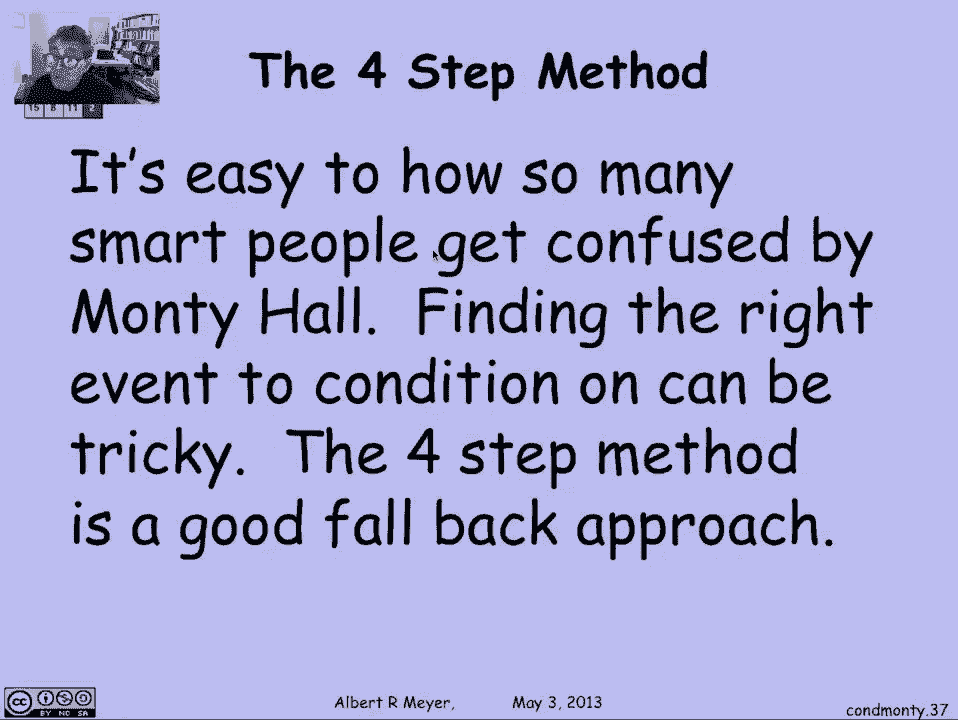
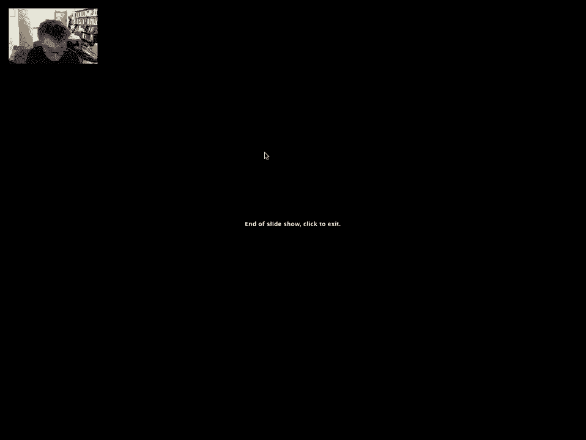

# 概率论入门：L4.2.7：蒙提霍尔问题 🎲

在本节课中，我们将学习条件概率，并运用它来分析和解释著名的蒙提霍尔问题。我们将看到，即使是一些听起来合理的论证，也可能因为错误地应用了条件概率而得出错误的答案。通过构建概率树，我们可以清晰地理解整个游戏过程，并计算出在不同策略下获胜的正确概率。

## 回顾概率树 🌳

上一节我们介绍了概率树的概念，本节中我们来看看如何用它来分析蒙提霍尔问题。为了计算“换门”策略的获胜概率，我们之前构建了一个详细的概率树，它描述了奖品放置、参赛者选门以及主持人卡罗尔开门这三个步骤。

这个概率树包含了所有可能的结果，虽然比我们单纯计算换门获胜概率所需的更复杂，但它能帮助我们讨论各种事件及其概率，从而理解那些导致错误答案的论证。

## 分析不同的事件 🧩

现在，让我们来具体分析几个关键事件，看看不同的条件如何影响概率计算。

首先，我们来看事件“山羊在2号门后”。这对应着奖品在1号或3号门后的所有分支。在概率树的12个结果中，有8个属于这个事件。

其次，事件“奖品在1号门后”只对应概率树中的一个分支。

### 一个常见的错误论证

以下是导致错误结论的一个常见论证思路：

当参赛者看到卡罗尔打开了2号门（后面是山羊）后，他们需要决定是坚持原来的选择还是换门。此时，他们知道“山羊在2号门后”。于是，他们可能会计算：**在已知山羊在2号门后的条件下，奖品在1号门后的概率是多少？**

通过计算 `P(奖品在1号门 | 山羊在2号门)`，我们确实会得到结果 **1/2**。这个论证听起来正确，并且得出了“换不换门无所谓，概率都是50%”的结论。

然而，这个论证并没有计算出“坚持”策略的真实获胜概率。为什么呢？因为参赛者掌握的信息并不仅仅是“山羊在2号门后”。

### 纳入更多信息

参赛者不仅知道山羊在2号门后，还知道自己最初选择了哪扇门。假设参赛者最初选择了1号门，然后得知山羊在2号门后。这是一个不同的事件：`（参赛者选1号门）且（山羊在2号门后）`。

当我们计算 `P(奖品在1号门 | 参赛者选1号门 且 山羊在2号门)` 时，我们仍然会得到结果 **1/2**。这似乎进一步强化了“坚持和换门胜率相同”的错觉。

但这仍然不是参赛者所知的全部信息。

### 最关键的信息：主持人的行为

参赛者最关键的信息是：**卡罗尔打开了2号门**。事件“卡罗尔打开2号门”与事件“山羊在2号门后”并不完全相同，因为主持人的行为遵循特定的规则（不会打开有奖品的门）。

因此，正确的条件事件应该是：`（参赛者选1号门）且（卡罗尔打开2号门）`。

在概率树中，这个事件只对应两个结果：
*   一个结果的概率为 **1/18**（对应奖品在1号门）。
*   另一个结果的概率为 **1/9**（对应奖品在3号门）。

现在，我们计算在已知参赛者选1号门且卡罗尔打开2号门的条件下，奖品在1号门（即坚持获胜）的概率：

`P(奖品在1号门 | 选1号门且开2号门) = (1/18) / (1/18 + 1/9) = (1/18) / (3/18) = 1/3`

这意味着，当你选择了1号门并且看到卡罗尔打开了2号门时，你最初的选择只有 **1/3** 的概率是正确的。因此，你应该换到另一扇未打开的门（3号门），这样获胜的概率将是 **2/3**。

## 核心教训与总结 📝

本节课中我们一起学习了如何运用条件概率和概率树来精确分析蒙提霍尔问题。

我们揭示了导致“50/50”错误答案的关键原因：**错误地选择了条件事件**。当人们只条件于“山羊在某扇门后”时，忽略了“参赛者初始选择”和“主持人特定开门行为”这些关键信息，从而得出了误导性的结论。

核心的教训是：在进行条件概率推理时，必须确保你条件于的事件**完整且精确地**反映了你所掌握的所有信息。任何信息的遗漏或简化都可能导致错误的计算结果。

当你对如何定义事件感到不确定时，一个可靠的方法是退回到**四步法**，从头开始构建完整的概率树，枚举所有基本结果。这能帮助你避免落入此类思维陷阱。

**总结**：在蒙提霍尔问题中，正确的分析表明，“换门”策略的获胜概率是 **2/3**，而“坚持”策略的获胜概率只有 **1/3**。这个反直觉的结论通过严谨的概率论分析得到了清晰的解释。