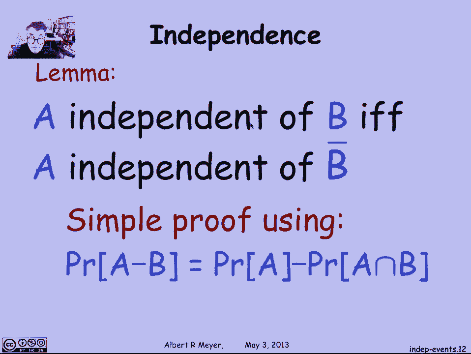

# 概率论入门：4.3.1：独立事件 🎲

在本节课中，我们将要学习概率论中的一个核心概念——独立事件。理解独立事件对于简化复杂概率问题的分析至关重要。

## 概述

独立事件是指彼此之间没有相互影响的事件。处理独立事件通常更为简单，因为无需考虑事件之间复杂的相互作用。一个典型的例子是多次抛硬币：前五次抛掷的结果，通常不会影响第六次抛掷的结果。本节我们将正式定义独立事件，并探讨其关键性质。

## 独立事件的定义

上一节我们介绍了条件概率，本节中我们来看看如何形式化地定义“互不影响”的事件。

独立事件有两个等价的标准定义。

**定义一（直观定义）**：事件A和B独立，当且仅当知道B发生与否，不会改变A发生的概率。用条件概率公式表示为：
`P(A|B) = P(A)`

**定义二（乘积定义）**：事件A和B独立，当且仅当它们同时发生的概率等于各自概率的乘积。用公式表示为：
`P(A ∩ B) = P(A) * P(B)`

这两个定义是等价的，可以通过条件概率的定义进行推导。定义二有一个优点：它不要求`P(B) > 0`，因此适用范围更广。

## 独立事件的性质

了解了定义之后，我们来看看独立事件具备哪些重要性质。

以下是独立事件的一些关键性质：
1.  **对称性**：如果A独立于B，那么B也独立于A。这是因为定义中的乘法和交集运算都是可交换的。
2.  **与零概率事件的关系**：根据定义二，如果事件B的概率为零（`P(B)=0`），那么B与任何事件（包括其自身）都是独立的。
3.  **与补事件的关系**：事件A独立于B，当且仅当A也独立于B的补事件（即“B不发生”的事件）。这个引理可以通过概率的差运算法则简单证明。

## 总结

本节课中我们一起学习了独立事件的概念。我们掌握了独立事件的两个等价定义：基于条件概率不变性的直观定义，以及基于概率乘积的运算定义。我们还探讨了独立事件的三个重要性质：对称性、与零概率事件的关系，以及与补事件的关系。理解这些内容，是分析许多随机试验（如多次抛硬币、掷骰子）的基础。