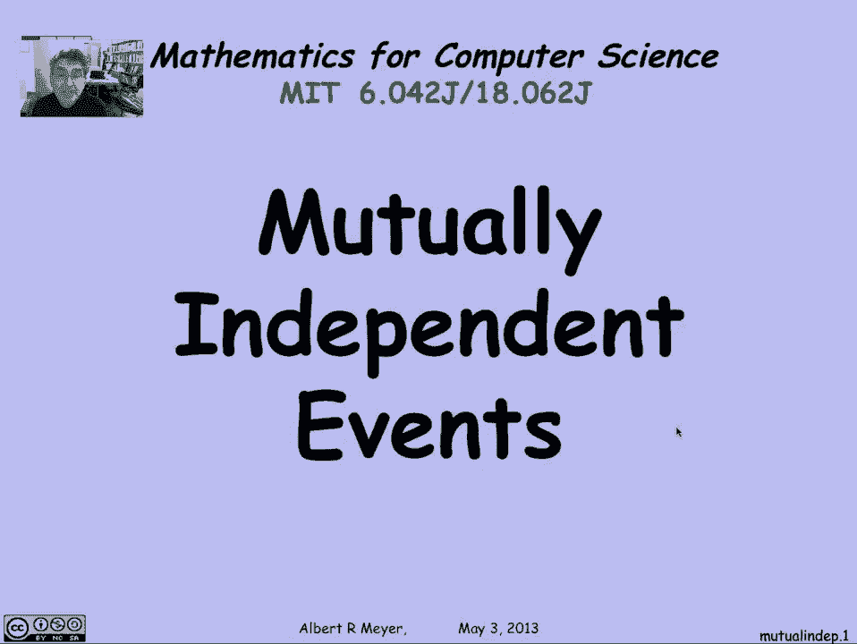
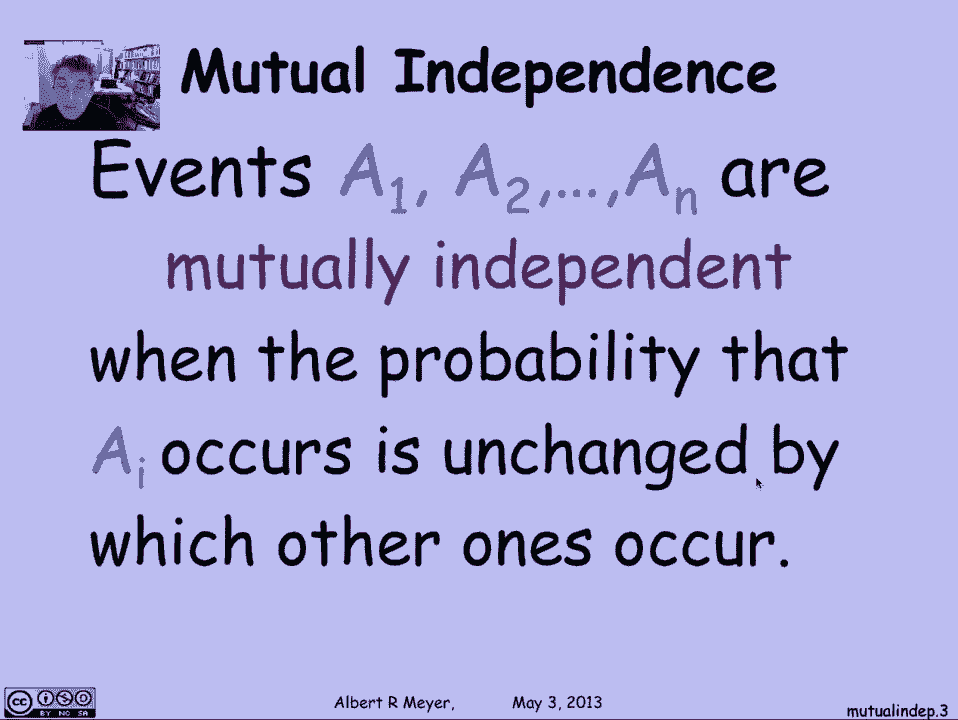
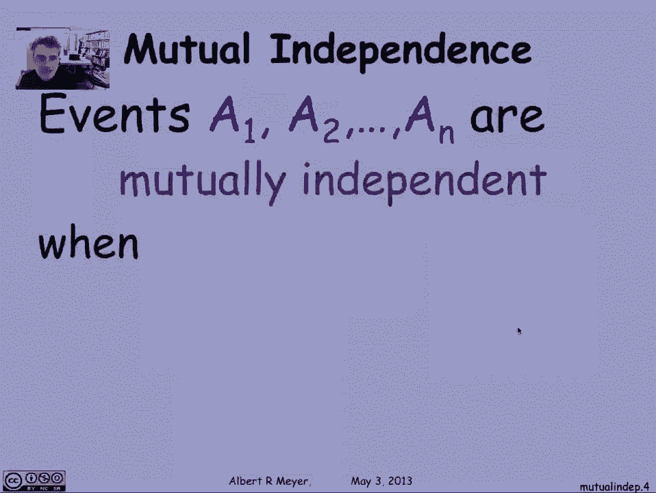
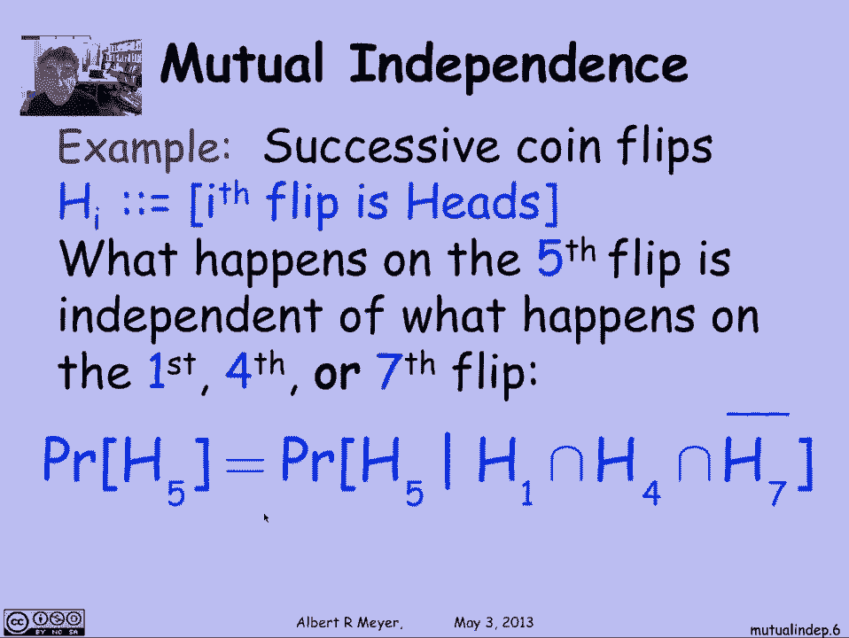
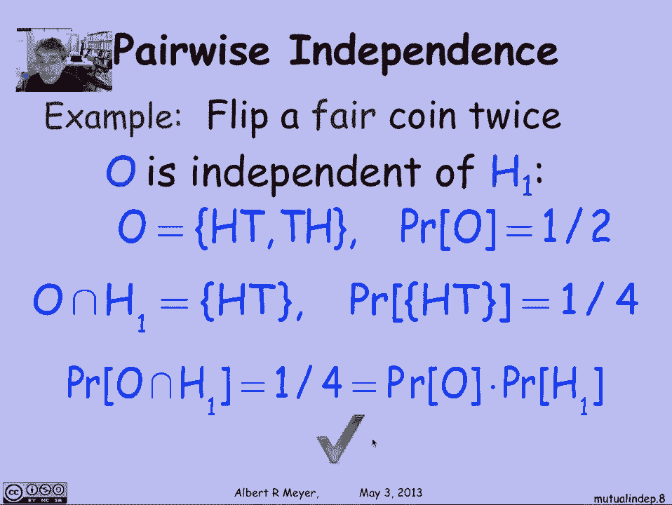
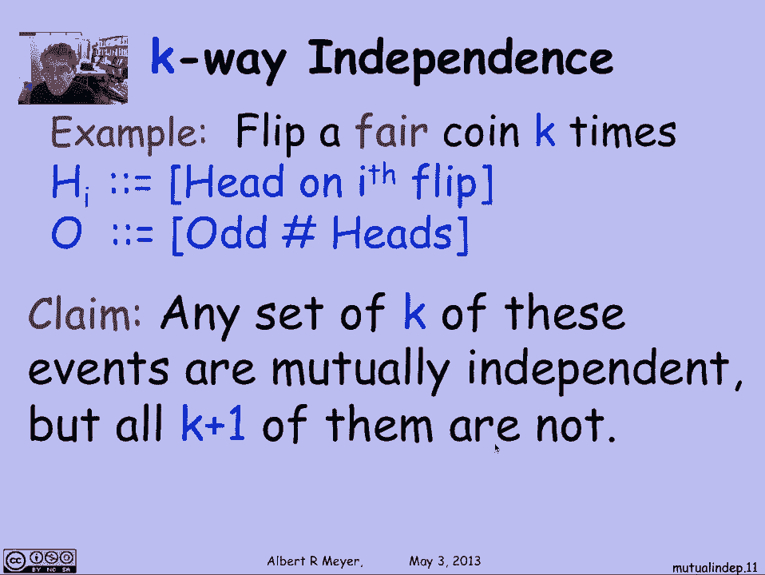
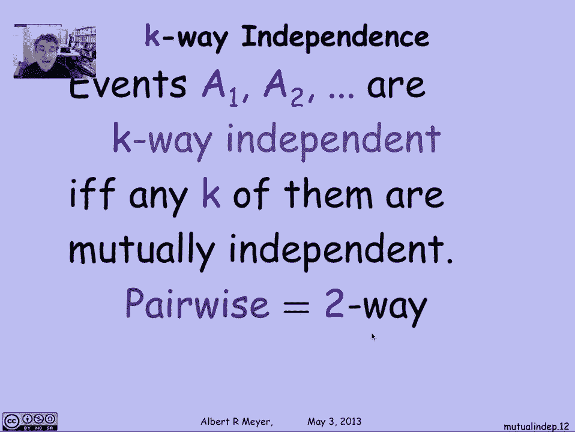
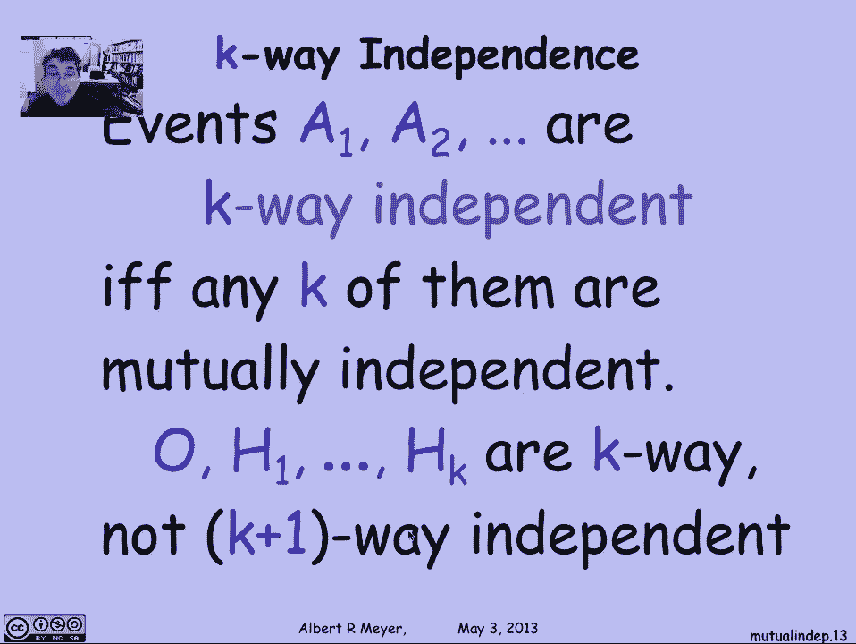
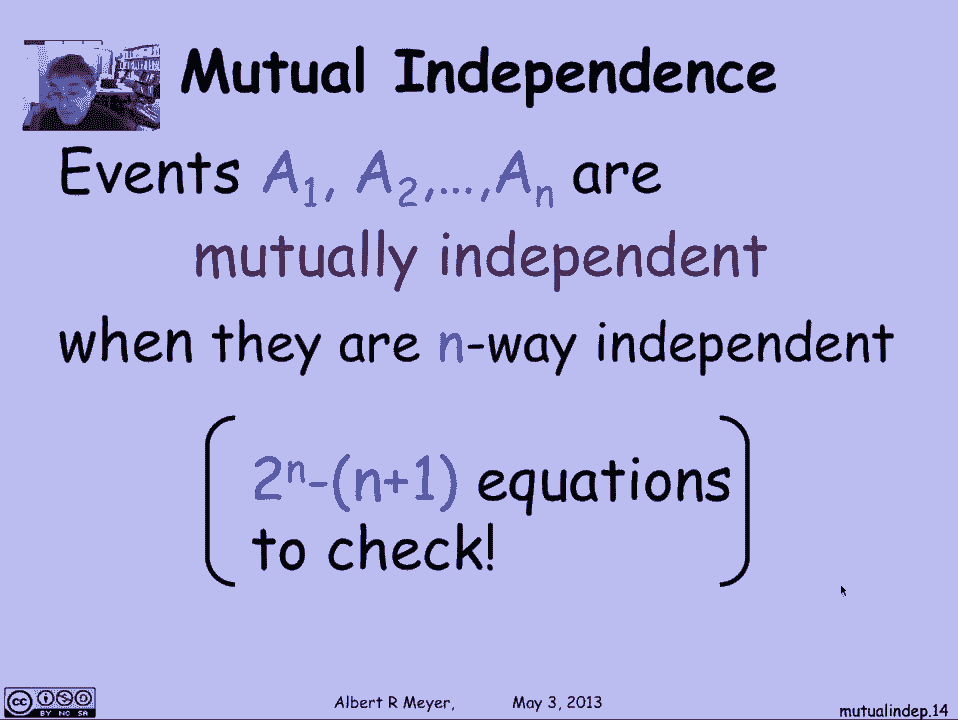

# 计算机科学的数学基础：L4.3.3：相互独立性 🎲

在本节课中，我们将要学习事件独立性的概念从两个事件扩展到多个事件的情况，即**相互独立性**。我们将通过定义、示例和公式来理解这一核心概念。

## 相互独立性的定义

上一节我们介绍了两个事件的独立性。本节中我们来看看当事件数量超过两个时，如何定义独立性。

直观上，如果一组事件是相互独立的，那么其中任何一个事件发生的概率，都不会因为知道其他某些事件是否发生而改变。用数学语言精确描述如下：

对于事件集合 **A₁, A₂, ..., Aₙ**，它们是**相互独立**的，当且仅当对于任意子集 **I ⊆ {1, 2, ..., n}**，都有以下等式成立：

**P(⋂_{i∈I} Aᵢ) = ∏_{i∈I} P(Aᵢ)**

这意味着，任意一组事件的交集概率，等于这些事件各自概率的乘积。

## 一个经典示例：独立抛硬币

理解相互独立性最好的例子是多次独立抛掷一枚公平硬币。

假设我们抛掷硬币多次，定义事件 **Hᵢ** 为“第 i 次抛掷结果为正面”。根据独立抛硬币的模型，任何一次抛掷的结果都与其他所有抛掷的结果无关。例如，第五次抛掷出现正面的概率，不会因为第一次、第四次或第七次抛掷的结果而改变。

用条件概率公式表示就是：
**P(H₅ | H₁ ∩ H₂ ∩ H₄ ∩ ¬H₇) = P(H₅)**
这仅仅是相互独立性所蕴含的众多等式中的一个。

## 成对独立 vs. 相互独立

接下来，我们通过一个具体例子来区分“成对独立”和“相互独立”这两个重要概念。

假设我们抛掷一枚公平硬币两次。
*   定义 **H₁**：第一次抛掷为正面。
*   定义 **H₂**：第二次抛掷为正面。
*   定义 **O**：两次抛掷中正面总数为奇数（即一次正面一次反面）。

以下是关于这些事件独立性的分析：

1.  **O 与 H₁ 独立吗？**
    我们来验证。样本空间为 {HH, HT, TH, TT}。
    *   **P(O)** = P({HT, TH}) = 1/2。
    *   **P(H₁)** = P({HH, HT}) = 1/2。
    *   **P(O ∩ H₁)** = P({HT}) = 1/4。
    由于 **P(O ∩ H₁) = 1/4 = P(O) * P(H₁)**，根据定义，O 与 H₁ 是独立的。同理可证 O 与 H₂ 也独立。

2.  **H₁ 与 H₂ 独立吗？**
    是的，因为它们是两次独立的抛掷。

3.  **那么，O、H₁、H₂ 三者相互独立吗？**
    答案是否定的。相互独立要求**任意**子集的交集概率等于概率乘积。考虑子集 {O, H₁, H₂}：
    *   **P(O | H₁ ∩ H₂)** = P(奇数个正面 | 两次都是正面) = 0。
    *   而 **P(O)** = 1/2。
    由于 **P(O | H₁ ∩ H₂) ≠ P(O)**，所以 O、H₁、H₂ 三者**不是**相互独立的。

这个例子表明，一组事件可以两两之间都独立（**成对独立**），但整体上却不是相互独立的。

## K 阶独立性

上面的例子引出了一个更一般的概念：**K 阶独立性**。

一组事件被称为 **K 阶独立**的，如果其中任意 **K** 个事件都是相互独立的。

*   **成对独立**就是 **2 阶独立**。
*   **相互独立**（对于 n 个事件而言）就是 **n 阶独立**。

我们可以构造一个例子：抛掷一枚公平硬币 **K** 次，定义 H₁ 到 Hₖ 为各次抛掷的正面事件，O 为总正面数为奇数的事件。可以证明，这 **K+1** 个事件中，任意 **K** 个都是相互独立的（即 **K 阶独立**），但全部 **K+1** 个事件放在一起却不是相互独立的（即不是 **K+1 阶独立**）。

## 验证相互独立性的复杂性

最后需要指出，严格验证 n 个事件是否相互独立是一项计算量很大的任务。

根据定义，我们需要检查对于事件集合 {A₁, A₂, ..., Aₙ} 的**每一个非空子集**，概率乘积公式是否成立。这总共需要检查 **2ⁿ - n - 1** 个等式（排除空集和 n 个单元素集）。当 n 很大时，这是不现实的。因此在实际中，我们通常根据问题的物理或逻辑背景来**假设**独立性，而不是通过计算来验证。

---

本节课中我们一起学习了：
1.  **相互独立性**的正式定义：任意子集的事件交集概率等于各事件概率的乘积。
2.  通过**独立抛硬币**的模型理解了相互独立性的直观含义。
3.  区分了**成对独立**与**相互独立**，并通过硬币例子看到二者不等价。
4.  引入了更一般的 **K 阶独立性** 概念。
5.  了解了验证相互独立性在计算上的复杂性。