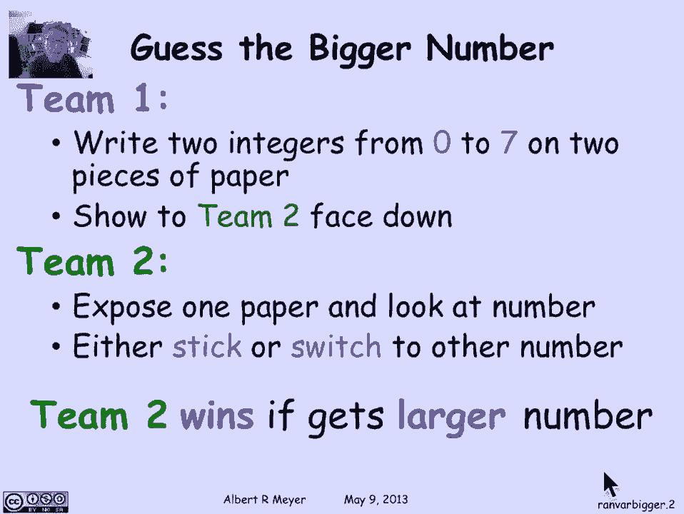
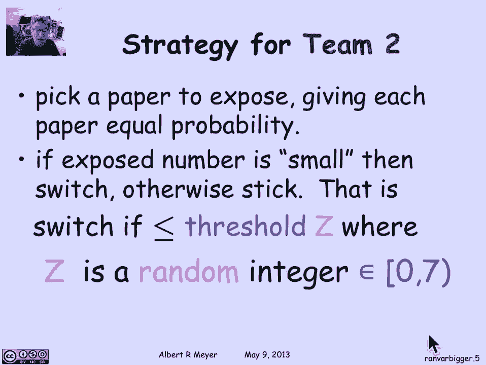
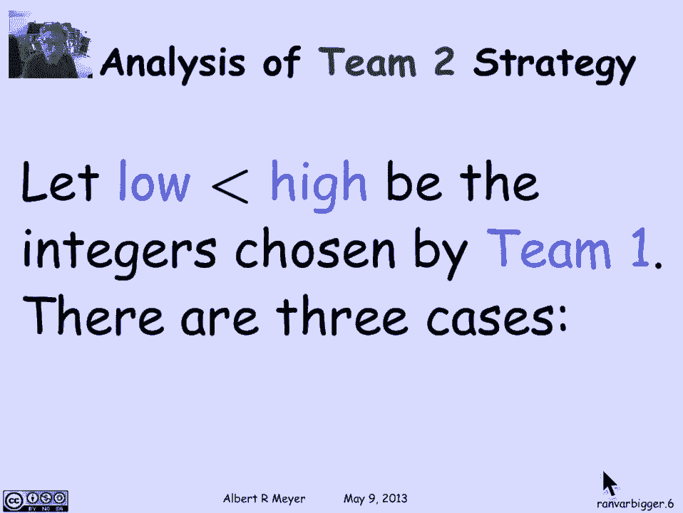
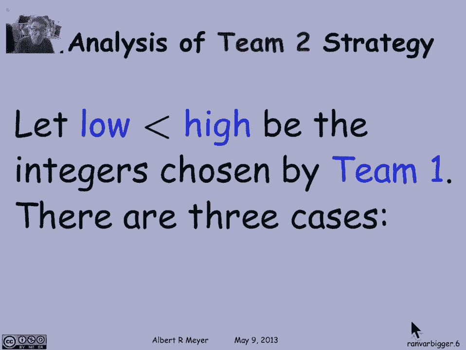
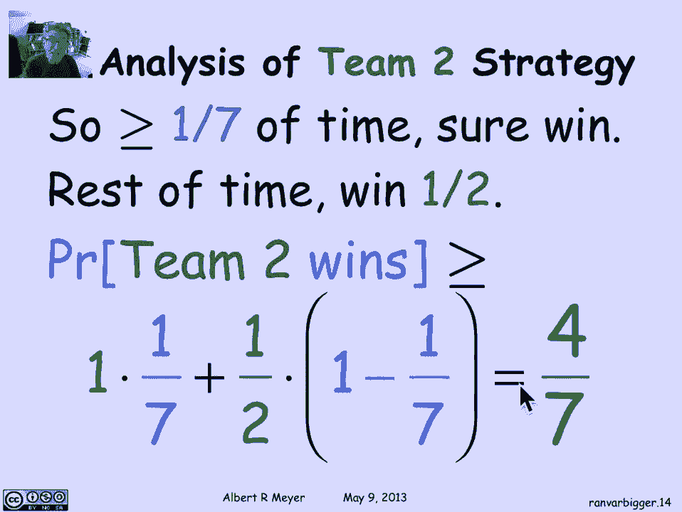
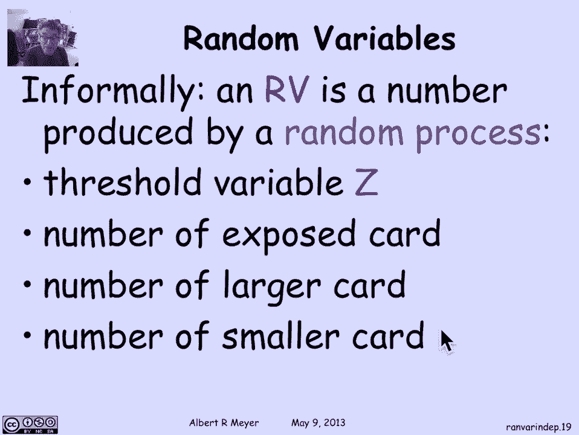

# 计算机科学的数学基础：P93：L4.4.1- 更大的数字游戏 🎲

在本节课中，我们将学习概率论中的一个核心概念——**随机变量**。我们将通过一个有趣的“更大的数字”游戏来引入这个概念，并分析游戏中的策略与获胜概率。

---

## 游戏规则 🃏

游戏中有两个队伍。队伍一的任务是**从0到7（包含0和7）中挑选两个不同的整数**，分别写在两张纸的背面，然后将纸正面朝下放在桌上。队伍二的任务是**随机选择一张纸**，翻开查看上面的数字，然后决定是**保留这个数字**，还是**换成另一张未知数字的纸**。队伍二的最终目标是**获得较大的那个数字**。

上一节我们介绍了游戏的基本规则，本节中我们来看看队伍二可以采取的策略。

## 队伍二的策略 🧠

队伍二需要一种系统性的方法来决定何时“保留”，何时“交换”。他们的策略基于一个**阈值Z**：
*   如果翻开的数字 **≤ Z**，则视为“小”数字，选择**交换**。
*   如果翻开的数字 **> Z**，则视为“大”数字，选择**保留**。

问题的关键在于如何选择阈值Z。如果固定一个Z（例如Z=3），队伍一就能通过总是选择两个都小于或等于Z（或都大于Z）的数字来抵消队伍二的优势，使队伍二的获胜概率仅为50%。

因此，队伍二需要引入**随机性**。他们应该**随机地选择Z**，Z可以是0到6（包含0和6）中的任意一个整数，每个数字被选中的概率相等（1/7）。这样，队伍一就无法预测并针对特定的Z来制定策略。

## 获胜概率分析 📊

现在我们来分析队伍二采用随机阈值策略时的获胜概率。假设队伍一挑选的两个数字为`low`和`high`，且`low < high`。

根据随机选择的阈值Z与`low`、`high`的关系，可以分为三种情况：

以下是三种可能的情况分析：

1.  **情况M（中间情况）**：`low ≤ Z < high`
    *   此时阈值Z能正确区分大小。
    *   如果翻开的是`low`（≤ Z），队伍二会交换，得到`high`并获胜。
    *   如果翻开的是`high`（> Z），队伍二会保留，并获胜。
    *   **在此情况下，队伍二获胜的概率为1**。
    *   由于`low`和`high`至少相差1，Z落入这个区间的概率**至少为1/7**。

2.  **情况H（Z偏大）**：`Z ≥ high`
    *   此时两个数字对队伍二来说都显得“小”（因为都≤ Z），队伍二总是选择交换。
    *   交换后，队伍二有50%的概率拿到`high`（即最初没翻到的那张）。
    *   **在此情况下，队伍二获胜的概率为1/2**。

3.  **情况L（Z偏小）**：`Z < low`
    *   此时两个数字对队伍二来说都显得“大”（因为都> Z），队伍二总是选择保留。
    *   保留时，队伍二有50%的概率最初就翻到了`high`。
    *   **在此情况下，队伍二获胜的概率为1/2**。

## 计算总获胜概率 🧮

我们可以使用**全概率公式**来计算队伍二的总体获胜概率。设`P(赢)`为队伍二获胜的概率。

根据全概率公式：
`P(赢) = P(赢 | M) * P(M) + P(赢 | 非M) * P(非M)`

代入我们分析的值：
*   `P(赢 | M) = 1`
*   `P(M) ≥ 1/7`
*   `P(赢 | 非M) = 1/2`
*   `P(非M) ≤ 6/7`

因此：
`P(赢) ≥ 1 * (1/7) + (1/2) * (6/7) = 1/7 + 3/7 = 4/7`

**结论：无论队伍一选择哪两个数字，队伍二采用此随机策略的获胜概率至少为4/7（约57.1%），高于50%。**

更有趣的是，队伍一也可以采用一个**随机策略**（例如随机地选择两个数字）来确保队伍二的获胜概率**至多为4/7**。因此，当双方都采用最优策略时，这个游戏的“价值”就是**4/7**。

## 与随机变量的关联 🔗

这个游戏自然地引出了**随机变量**的概念。简单来说，随机变量是一个由随机过程产生的数值。

在游戏中，我们看到了多个随机变量的例子：
*   **阈值Z**：由队伍二随机生成，取值范围是{0, 1, 2, ..., 6}，每个值概率为1/7。
*   **被翻开的牌的数字**：如果队伍一也随机选数，且队伍二随机选牌，那么这个数字本身也是一个随机变量。
*   **较大的数字（high）和较小的数字（low）**：如果队伍一随机选择，它们也是随机变量。

这些由游戏中的随机过程（如“随机选择”、“随机决定”）所产生的数值，都是随机变量的具体体现。

---

本节课中我们一起学习了“更大的数字”游戏，并通过策略分析得出了队伍二的最优获胜概率。更重要的是，我们通过这个生动的例子，直观地理解了**随机变量**这一概率论基础概念——它本质上就是**随机试验结果的数值化描述**。在接下来的课程中，我们将对随机变量进行更正式的定义和深入探讨。