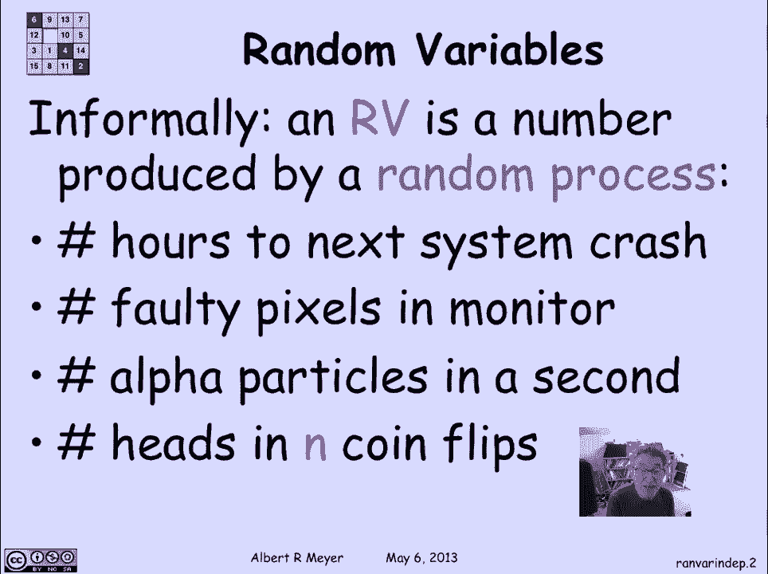
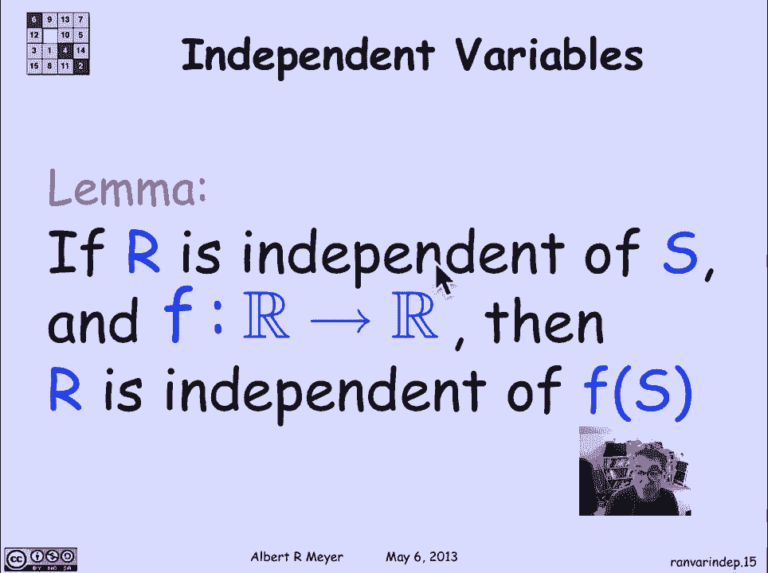
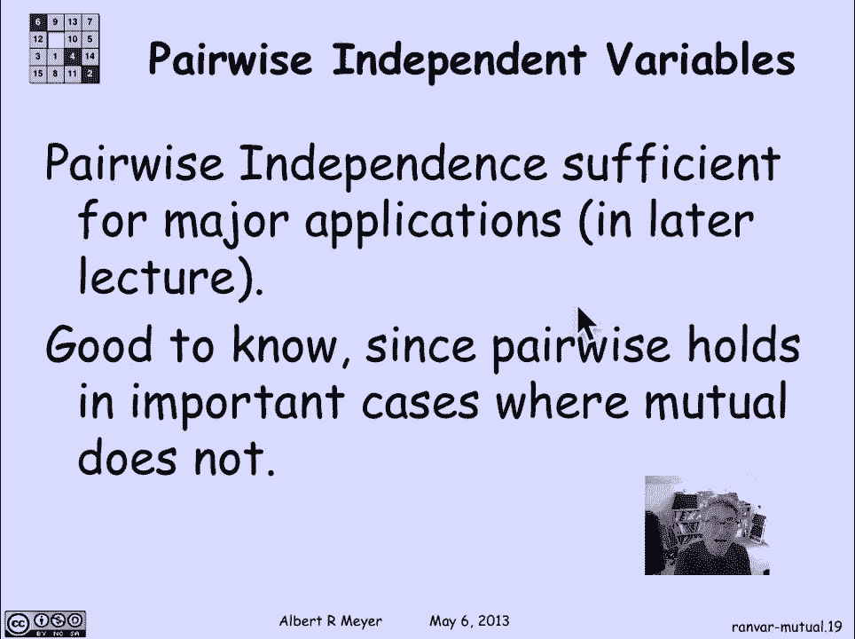

# 计算机科学的数学基础：4.4.2：随机变量与独立性 🎲

在本节课中，我们将要学习随机变量的正式定义，以及随机变量之间独立性的概念。我们将从直观的例子入手，逐步过渡到形式化的数学定义，并通过具体的例子来加深理解。

## 随机变量的直观概念

上一节我们介绍了概率论中的基本事件。本节中，我们来看看如何用数值来量化随机过程的结果，这就是随机变量。

随机变量是由随机过程产生的一个数值。以下是一些典型的例子：

*   **系统崩溃时间**：观察一个系统，记录从现在到下一次系统崩溃的小时数。这个时间是一个由系统是否工作的随机过程产生的数值。
*   **显示器坏点数量**：在制造显示器时，数百万像素中可能出现坏点。坏点的数量是由制造过程中不可预测的随机性产生的。
*   **盖革计数器读数**：盖革计数器在一秒内检测到的α粒子数量，在物理学中被建模为一个随机数，它服从某种分布，但每秒的读数并不相同。
*   **抛硬币正面次数**：抛掷一枚硬币n次，出现正面的次数是一个标准的随机变量。

## 随机变量的形式化定义

了解了直观概念后，我们现在给出随机变量的精确定义。

形式上，随机变量是一个将样本空间中的结果映射到实数的函数。样本空间中的结果是随机实验的可能结果，每个结果有其概率。随机变量将这些结果转化为一个实数，这个实数被视为该结果产生的数值。

因此，随机变量本质上是一个**函数**，记作 **R: S → ℝ**，其中S是样本空间，ℝ是实数集。它通常是一个实值函数，但也可以是整数值或其他子集。

从直观上看，随机变量**R**将一系列形如“R等于某个值a”的事件打包在一起。如果我们知道了所有“R = a”事件的答案，就掌握了随机变量所包含的信息。

## 随机变量的独立性

由于随机变量可以定义事件，事件独立性的概念可以直接推广到随机变量上。

一组随机变量 **R₁, R₂, ..., Rₙ** 被称为**相互独立**的，当且仅当由它们定义的任何事件集合都是相互独立的。更具体地说，对于所有可能的取值 **a₁, a₂, ..., aₙ**，以下等式成立：

**Pr[R₁ = a₁ ∧ R₂ = a₂ ∧ ... ∧ Rₙ = aₙ] = Pr[R₁ = a₁] × Pr[R₂ = a₂] × ... × Pr[Rₙ = aₙ]**

这意味着，知道其中一些随机变量的取值，不会影响其他随机变量取值的概率。

### 示例：判断独立性

让我们通过一个具体例子来实践。考虑抛掷三枚公平硬币的实验。定义两个随机变量：
*   **C**：出现正面的次数（取值0, 1, 2, 3）。
*   **M**：指示三枚硬币结果是否一致（全正或全反为1，否则为0）。

**C**和**M**是否独立？答案是否定的。因为事件“C ≥ 1”（至少有一个正面）和事件“M = 1”（三枚一致）都有正概率，但事件“C ≥ 1 且 M = 1”等价于“三枚全是正面”，其概率为1/8。然而，Pr[C ≥ 1] × Pr[M = 1] = (7/8) × (1/4) ≠ 1/8。因此，它们不满足独立性的乘积公式，故不独立。

## 指示变量

指示变量是一个非常重要的概念，它建立了事件与随机变量之间的桥梁。

对于任何事件**A**，其**指示变量 I_A** 定义如下：
**I_A = 1**， 如果事件A发生。
**I_A = 0**， 如果事件A不发生。

通过指示变量，我们可以将事件视为特殊的随机变量（0-1值）。一个关键的性质是：**两个事件A和B是独立的，当且仅当它们的指示变量 I_A 和 I_B 是独立的**。这个性质的证明是一个很好的练习。

### 示例：指示变量的独立性

再次考虑抛三枚硬币。定义：
*   **O**：事件“出现奇数个正面”。
*   **M**：事件“三枚硬币结果一致”（其指示变量即之前的M）。

**I_O**（O的指示变量）和**M**是否独立？尽管两者都依赖于全部三枚硬币的结果，但事实上它们是独立的。验证这一点需要检查所有可能的取值组合（(0,0), (0,1), (1,0), (1,1)）是否都满足独立性的乘积公式。这是一个重要的练习。

## 独立性的进一步性质

如果随机变量**R**独立于**S**，那么**R**也独立于**S**的任何函数。也就是说，对于任意（全）函数 **f**，**R** 独立于 **f(S)**。这直观地表明，R独立于关于S的任何信息。

独立性概念可以推广到**K阶独立**。一组随机变量是K阶独立的，如果其中任意K个变量都是相互独立的。特别地，当K=2时，我们称之为**两两独立**。

两两独立之所以被单独强调，是因为在许多重要应用中，两两独立性就足够了，而且验证两两独立比验证相互独立要容易得多（需要检查的等式更少）。

### 示例：两两独立

考虑抛掷K枚公平硬币。令 **H_i** 为第i枚硬币出现正面的指示变量（i从1到K）。此外，定义 **O** 为出现奇数个正面的事件，它可以表示为 **O = (Σ_{i=1}^K H_i) mod 2**。

可以证明，这 **K+1** 个随机变量（K个H_i和O）是**K阶独立**的，即任意K个都是相互独立的。特别地，它们是两两独立的。我们在之前的事件版本中讨论过这个例子，现在可以用随机变量的语言重新表述。

---

本节课中我们一起学习了随机变量的形式定义，理解了它本质上是一个从样本空间到实数的函数。我们重点探讨了随机变量独立性的概念，其核心是它们定义的事件满足概率乘积公式。我们还介绍了指示变量这一有力工具，它将事件与随机变量联系起来。最后，我们了解了K阶独立，特别是两两独立的意义，这将在后续的应用中发挥作用。