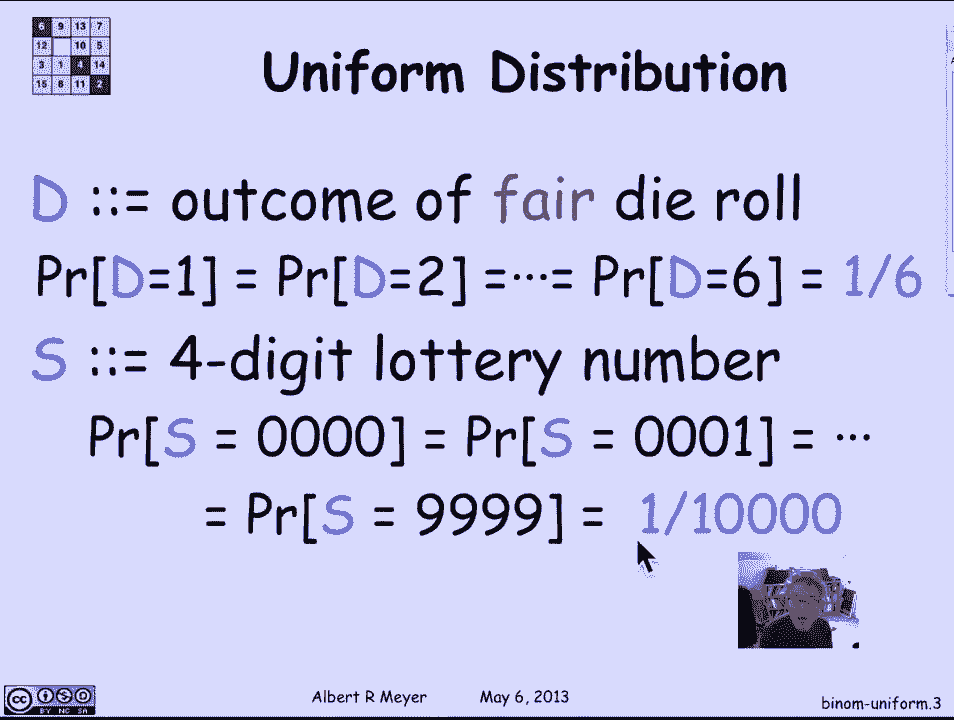
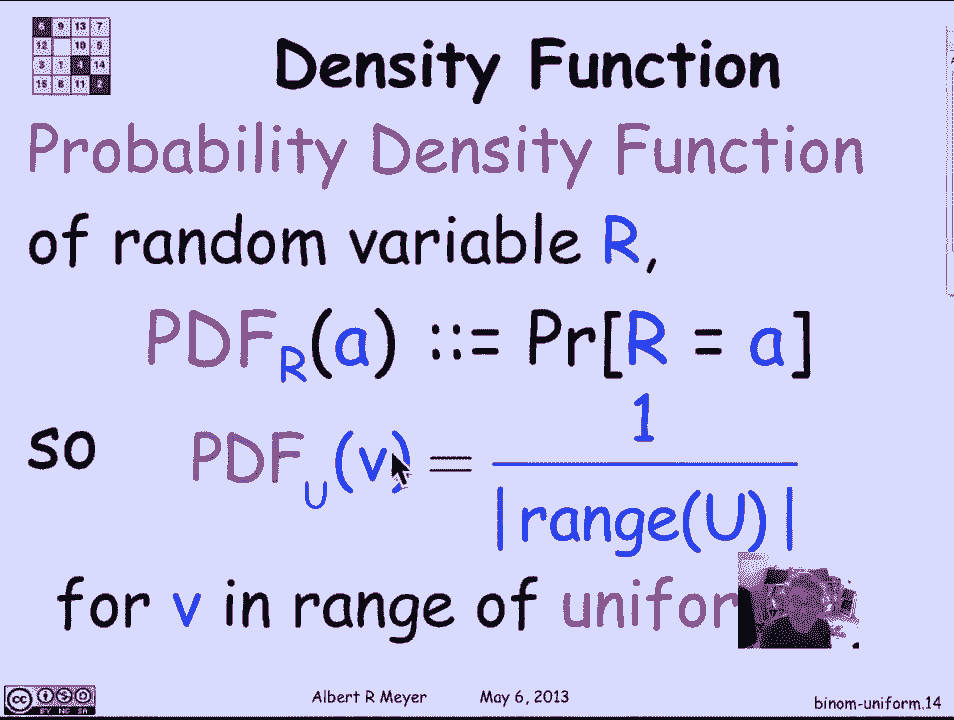
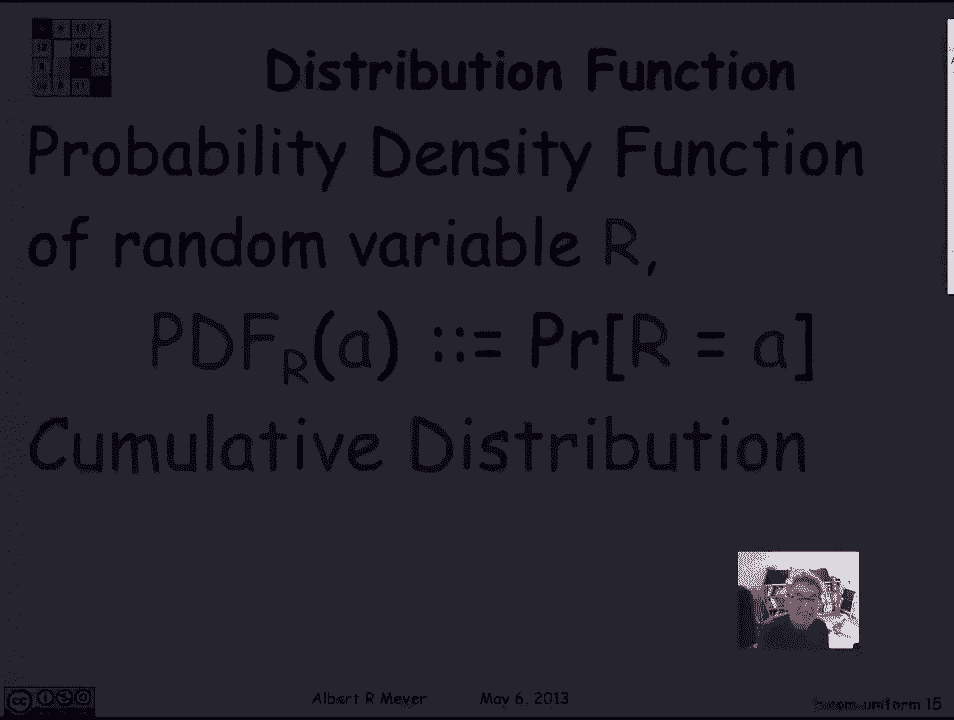
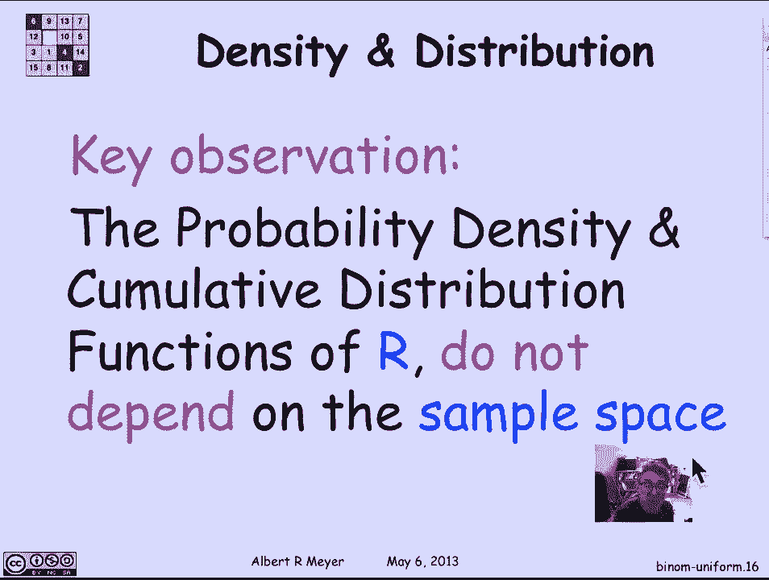

# 计算机科学的数学基础：L4.4.4：随机变量 - 均匀分布与二项分布 📊

在本节课中，我们将学习两种在概率论中极为常见且基础的随机变量：均匀随机变量和二项式随机变量。我们将了解它们的定义、性质以及如何用概率密度函数和累积分布函数来描述它们。

## 均匀随机变量 🎲

上一节我们介绍了随机变量的基本概念，本节中我们来看看均匀随机变量。均匀随机变量意味着它所取的所有可能值都具有相等的概率。

例如，一个随机变量 Z 可以取从 0 到 6（包含）的所有整数值，每个值出现的概率都是 1/7。这是一个均匀随机变量的基本例子。

以下是其他均匀随机变量的例子：

*   如果 D 是一个公平的六面骰子的结果，那么它出现 1、2 或 6 的概率都是 1/6。
*   一个四位数的彩票号码，其四个数字都是随机独立选择的，可能值从 0000 到 9999。彩票最终结果为 0000 的概率，与结果为 1111 或 9999 的概率相同，都是 1/10000。

现在，让我们证明一个后续会有用的小引理。假设 R1, R2, R3 是三个相互独立的随机变量，其中 R1 是均匀分布的。那么，每一对相等的事件是相互独立的。具体来说，事件 “R1 = R2” 独立于事件 “R2 = R3”，也独立于事件 “R1 = R3”。

直观的论证是：因为 R1 是均匀的且独立于 R2 和 R3，所以 R1 等于任何特定值的概率是固定的。无论 R2 和 R3 取什么值（例如，无论 R2 是否等于 R3），R1 恰好等于 R2 当前值的概率仍然是那个固定的值。因此，这些相等事件是成对独立的（尽管它们不是三方独立的）。

## 二项式随机变量 🔢

从均匀随机变量转向二项式随机变量，它们可能是最重要的随机变量例子之一，无处不在。

二项式随机变量的最简单定义是：进行 n 次相互独立的试验（例如抛硬币），每次试验成功的概率为 p。它有两个参数：试验次数 n 和单次成功概率 p。

例如，设 n=5, p=2/3。考虑一个特定的抛掷序列：正、反、反、正、正。由于每次抛掷独立，这个特定序列出现的概率是每次结果的概率乘积：
`P(正) * P(反) * P(反) * P(正) * P(正) = p * (1-p) * (1-p) * p * p = (2/3)^3 * (1/3)^2`

更一般地，在 n 次试验中，恰好出现 i 次成功的概率，等于：
*   任何一个指定的、恰好有 i 次成功的序列出现的概率：`p^i * (1-p)^(n-i)`
*   乘以所有这样的序列的数量，即从 n 个位置中选择 i 个位置放置成功：`C(n, i)`（组合数）

因此，我们得到二项式分布的概率公式：

**公式：P(成功次数 = i) = C(n, i) * p^i * (1-p)^(n-i)**

这是一个非常基本的公式，其中 i 的取值范围是从 0 到 n 的整数。

## 概率密度函数与累积分布函数 📈

为了抽象地描述随机变量的行为，我们引入两个关键函数。

**概率密度函数** 描述了随机变量取每一个特定值的概率。
*   对于二项式随机变量，其 PDF 在值 i 上就是上述公式：`f(i) = C(n, i) * p^i * (1-p)^(n-i)`
*   对于在集合 U 上的均匀随机变量，其 PDF 在 U 中任意值 v 上是常数：`f(v) = 1 / |U|`（其中 |U| 是集合 U 的大小）。

**累积分布函数** 描述了随机变量小于或等于某个值的概率。
*   CDF 在点 a 的值定义为：`F(a) = P(R ≤ a)`

PDF 和 CDF 是等价的，知道其中一个可以推导出另一个。它们的关键优势在于，一旦我们抽象到 PDF 和 CDF，就无需再考虑底层的样本空间。这些函数本身包含了关于随机变量行为的所有重要信息。这使得许多分析可以基于分布本身进行，从而适用于所有具有相同分布的随机变量，无论其背后的具体实验是什么。

## 总结 🎯

本节课中我们一起学习了：
1.  **均匀随机变量**：所有可能结果等可能发生。
2.  **二项式随机变量**：描述 n 次独立伯努利试验中成功次数的分布，其核心概率公式为 `P(X=i) = C(n, i) * p^i * (1-p)^(n-i)`。
3.  **描述工具**：我们引入了**概率密度函数** 和**累积分布函数** 来抽象地描述随机变量的分布特性，这使我们能脱离具体样本空间来分析和理解随机变量。

理解这些基本分布及其描述方式是学习更复杂概率模型的重要基石。