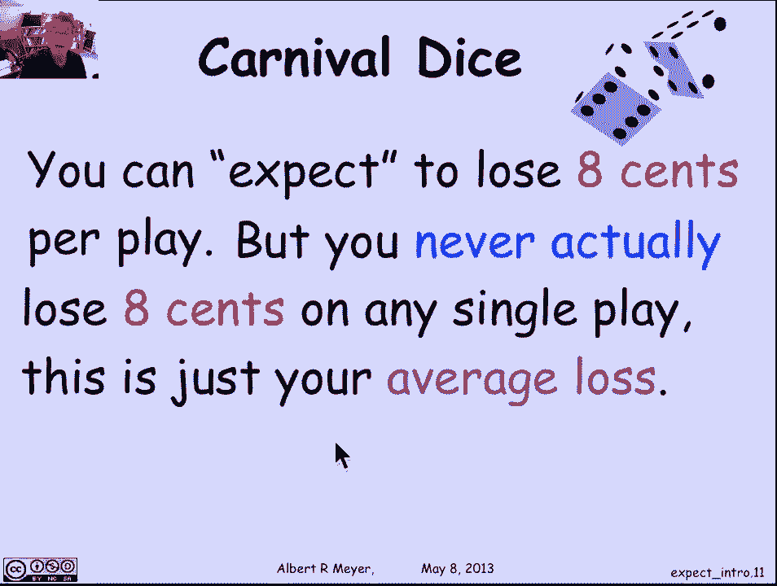
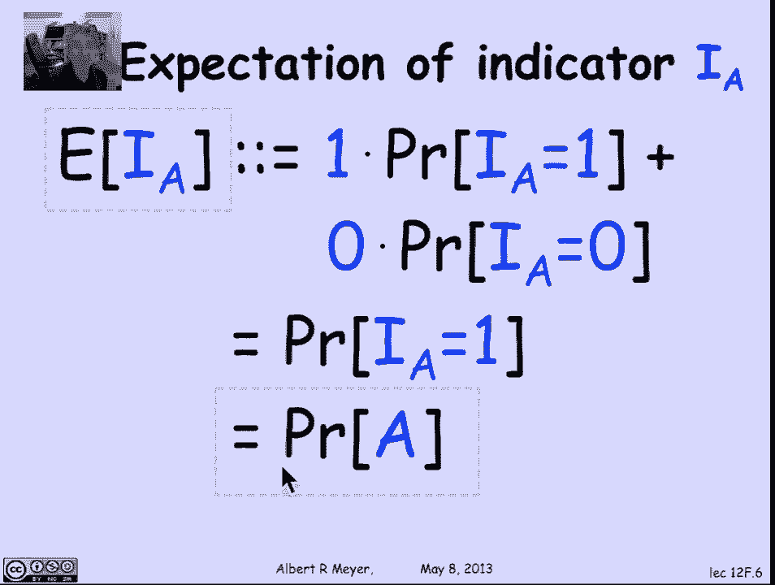
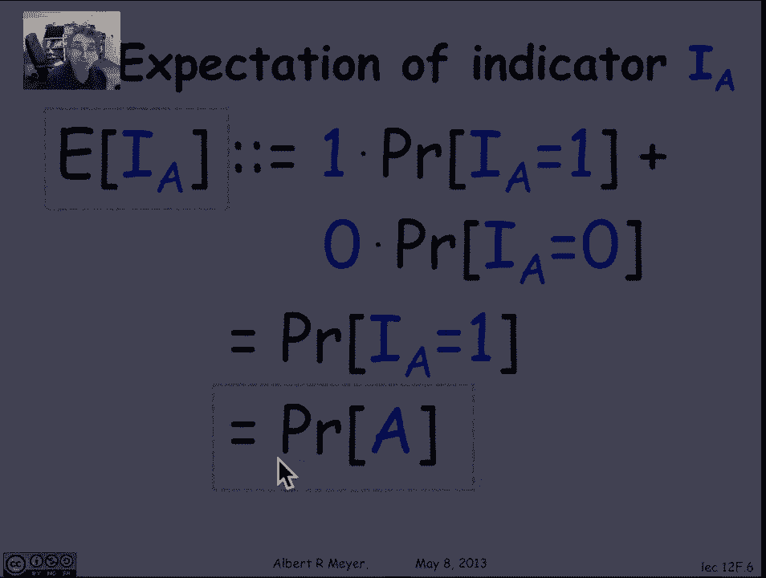
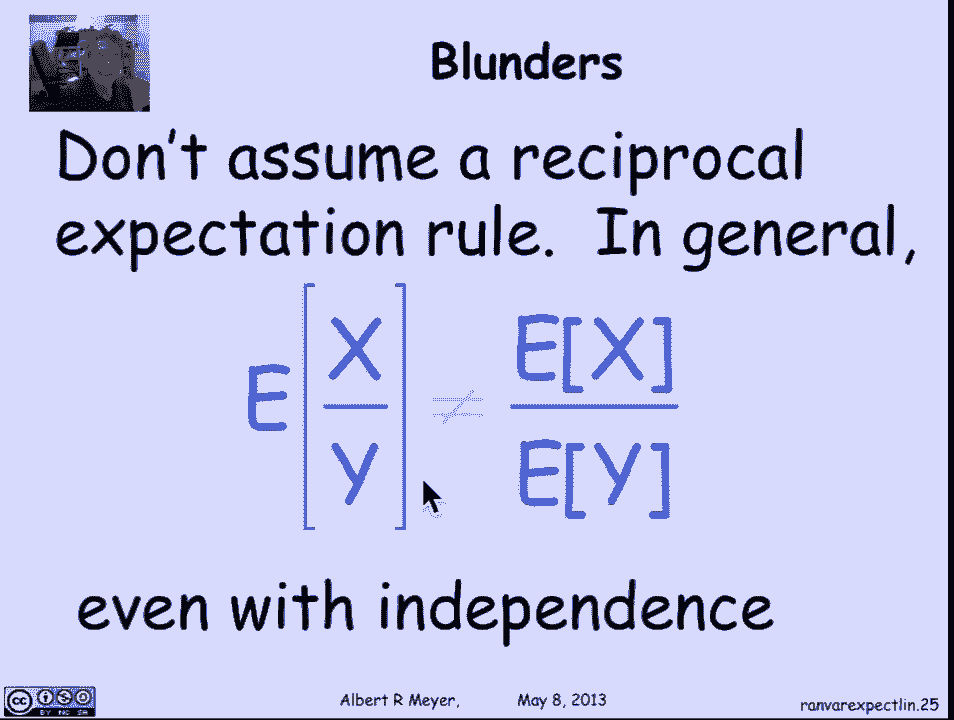

# 计算机科学的数学基础：L4.5：期望值 🎲

在本节课中，我们将学习概率论中的一个核心概念——**期望值**。期望值是随机变量所有可能取值的加权平均，它为我们提供了一种量化随机过程“平均”结果的方法。我们将从赌博游戏入手，直观理解期望值，然后给出其精确定义，并探讨其重要性质，如线性性和乘积规则。

## 从赌博游戏说起 🎰

我们经常询问平均值，在随机变量的语境下，这个概念被抽象为一个美妙的概念——**随机变量的期望值**。

让我们从一个激发兴趣的例子开始，这个例子通常来自赌博。有一种在赌场里玩的游戏，叫做“嘉年华骰子”。游戏规则是：你有三颗公平的骰子，你先从1到6中选一个你最喜欢的数字。然后你掷出这三颗骰子，每颗骰子出现任何给定数字的概率都是1/6。奖金规则如下：每有一个骰子与你选的数字匹配，你就赢得1美元。如果没有一个骰子显示你选的数字，你就输掉1美元。

让我们举个例子。假设你最喜欢的数字是5。你向庄家宣布这个数字，然后开始掷骰子。
*   如果掷出的数字是2、3和4，没有5，你输掉1美元。
*   如果掷出的数字是5、4、6，有一个5，你赢得1美元。
*   如果掷出的数字是5、4、5，有两个5，你赢得2美元。
*   如果全是5，你赢得3美元。

关于这个游戏的基本问题是：这是一个公平的游戏吗？值得玩吗？我们如何思考这个问题？我们将从概率的角度来思考。

## 计算游戏的概率分布 📊

让我们思考掷出“没有5”的概率。如果5是我最喜欢的数字，那么我没有掷出5的概率是多少？第一颗骰子不是5的概率是5/6，第二颗和第三颗也是。由于骰子掷出是独立的，所以没有5的概率是 (5/6)³，即 125/216。我写成分数形式是为了方便比较。

那么，掷出“一个5”的概率是多少？任何包含一个5的特定掷骰序列的概率是 (5/6) × (5/6) × (1/6)。并且，在三个位置中选一个出现5，其他位置不是5的序列有 C(3,1) 种。类似地，对于“两个5”，有 C(3,2) 种方式选择出现5的两个位置，概率为 C(3,2) × (5/6) × (1/6)²。“三个5”的概率就是 (1/6)³。

我们可以轻松计算这些概率。让我们把它们列在表格里：
*   **0次匹配** 的概率是 125/216，此时我输掉1美元。
*   **1次匹配** 的概率是 75/216，此时我赢得1美元。
*   **2次匹配** 的概率是 15/216，此时我赢得2美元。
*   **3次匹配** 的概率是 1/216，此时我赢得3美元。

## 期望收益的计算 💰

现在我可以问：我期望赢多少？假设我玩了216次游戏，并且结果完全按照这些概率分布，那么我期望：
*   大约有125次是0次匹配（即输1美元）。
*   大约有75次是1次匹配（即赢1美元）。
*   大约有15次是2次匹配（即赢2美元）。
*   大约有1次是3次匹配（即赢3美元）。

我的平均收益将是：`[125 × (-1) + 75 × 1 + 15 × 2 + 1 × 3] / 216`。计算结果约为 -17/216 美元，即大约 -0.08美元（-8美分）。

所以，我平均每次游戏损失约8美分。这不是一个公平的游戏，它对我有偏见。如果我玩得足够久，平均下来我每次游戏会稳定地损失约8美分。

因此，我们总结为：你**期望**损失8美分，意思是你的平均损失是8美分。如果你反复玩这个游戏，就会出现这种现象。重要的是要注意，你**从未**在任何单次游戏中实际损失8美分。“期望损失8美分”这个概念永远不会在单次游戏中发生，它只是你的平均损失。每次游戏你只会损失1美元，或赢得1美元、2美元、3美元，根本不会出现8美分。

## 期望值的正式定义 📝

上一节我们通过具体游戏理解了期望值的直观含义，现在让我们抽象出随机变量期望值的正式定义。

随机变量R是一个以不同概率取不同值的东西。它的期望值定义为它的平均值，其中不同的值按其概率加权。

我们可以将其写成一个精确的公式。随机变量R的期望值定义为，对其所有可能取值V求和：`V × P(R = V)`。

**公式：** `E[R] = Σ (v ∈ 所有可能值) [ v * P(R = v) ]`

这就是随机变量期望值的基本定义。这里求和成立是因为我们假设了可数样本空间，R只定义在可数个结果上，这意味着它只能取可数个值。所以我们是在对所有R可能取的值进行可数求和。

我们刚刚得出的结论是，嘉年华骰子游戏的期望收益是 -17/216。对照这个期望值的正式定义，以及定义为“你在一次嘉年华骰子游戏中赢多少钱”的随机变量，结果就是那个平均值 -17/216。

## 期望值的另一种定义 🔄

有一个在证明中很有用的技术性结果指出，期望值还有另一种表达方式：它也可以表示为，对样本空间中所有可能的结果求和：`随机变量在该结果下的值 × 该结果的概率`。

**公式：** `E[R] = Σ (ω ∈ 样本空间) [ R(ω) * P(ω) ]`

这与“对所有值求和：值 × 该值的概率”是另一种定义。这两个定义等价并非完全显而易见。这种形式的定义在一些证明中技术上很有帮助，尽管在应用中使用不多。证明这个等价性是一个不错的练习。

我们来推导一下这个等价性。记住，记号 `[R = v]` 描述了随机变量取值为v的事件，根据定义，这个事件是满足该性质的**结果集合**，即 `{ ω | R(ω) = v }`。因此，`P(R = v)` 就是该事件中所有结果的概率之和。

从期望的标准定义开始：`E[R] = Σ_v [ v * P(R = v) ]`。
1.  将 `P(R = v)` 替换为 `Σ_{ω: R(ω)=v} P(ω)`。
2.  将v分配到内层求和：得到 `Σ_v Σ_{ω: R(ω)=v} [ v * P(ω) ]`。
3.  对于这些结果ω，有 `R(ω) = v`，所以可以将v替换为 `R(ω)`，得到 `Σ_v Σ_{ω: R(ω)=v} [ R(ω) * P(ω) ]`。
4.  现在，对外层所有可能的v求和，并对每个v求所有满足 `R(ω)=v` 的ω的和，这等价于对所有可能的结果ω求和。因此，最终得到 `Σ_ω [ R(ω) * P(ω) ]`。

证明完成。这个推导涉及大量对求和项的重新排列。

## 期望值与平均值的关系 📈

我们说过期望值是平均值的一种抽象，但它与平均值的联系比那更紧密。

举个例子：假设你有一堆批改好的试卷。你随机抽取一份。让S代表随机抽取试卷的分数。我将“从一堆试卷中随机抽取一份”这个随机过程定义为一个随机变量S。“随机抽取”意味着均匀抽取。所以，S本身不是均匀随机变量，但我以等概率抽取试卷，而它们有不同的分数。因此，结果是等概率的，但S不是，因为可能有很多相同分数的试卷。

S是由这个“随机抽取试卷”过程定义的随机变量。那么，你可以验证，S的期望值恰好等于试卷的平均分数。这正是考试结束后学生通常想知道的东西：平均分是多少？实际上，平均分通常不如中位数（中间分数）信息量大，但人们总是想知道平均值。

平均值可能信息量不大的原因是它有一些奇怪的性质，我稍后会说明。但这里的重点是，我们通过定义一个基于随机抽取试卷的随机变量，得到了考试的平均分数。这是一个通用过程：我们可以通过估计随机变量的期望值，来估计某个事物总体中的平均值，这个随机变量基于从我们要计算平均值的事物中随机抽取元素。这被称为**抽样**。这是概率论的一个基本思想：我们能够通过将平均值的计算抽象为定义随机变量并计算其期望值，来掌握平均值。

## 期望值的性质：线性性 ✨

到目前为止，我们通过定义或巧妙的方法（如生成函数）计算期望值。现在，我们将介绍一个使期望计算变得非常简单的性质，它绕过了许多我们迄今为止使用的巧妙方法，即：**期望是线性的**。

这意味着，如果你有两个随机变量R和S，以及两个常数a和b，那么期望函数是线性的。即，你取R和S的线性组合 `aR + bS`，其期望值等于对应期望的线性组合。

**公式：** `E[aR + bS] = a * E[R] + b * E[S]`

这是一个绝对基本的公式，你应该熟练掌握。记住，它不仅适用于任意有限多个变量，在一定的收敛条件下，甚至可以扩展到可数个变量的和。但今天我们先讨论两个随机变量的情况。

使其如此强大和有用的关键在于，这个事实与**独立性无关**。无论R和S是否独立或相等，都不重要。这个线性性始终成立。

证明并不特别有启发性，它只是对求和项进行操纵和重新排列。但让我们完成这个练习。我们感兴趣的是随机变量 `aR + bS` 的期望值。根据期望的定义（对结果求和的形式），它是 `Σ_ω [ (aR(ω) + bS(ω)) * P(ω) ]`。展开后，我们可以将求和分成两部分：`a * Σ_ω [ R(ω) * P(ω) ] + b * Σ_ω [ S(ω) * P(ω) ]`。根据定义，这等于 `a * E[R] + b * E[S]`。证明完成。

## 指示器随机变量的期望 🎯

在利用线性性之前，我们先做一个非常简单但非常重要的观察：关于**指示器随机变量**的期望。

记住，`I_A` 是一个随机变量，如果事件A发生则等于1，如果A不发生则等于0。那么 `I_A` 的期望值是多少？根据定义，它是 `1 * P(I_A = 1) + 0 * P(I_A = 0)`。我们可以忽略第二项（0乘以某数）。`P(I_A = 1)` 恰好就是 `P(A)`。所以我们得到了基本公式：

**公式：** `E[I_A] = P(A)`

记住这个公式，我们马上会多次用到它。

## 应用线性性：n次抛硬币的期望正面数 🪙

让我们回到“n次抛硬币的期望正面数”这个问题，我们已经见过至少两种方法（生成函数论证和使用全期望的递归论证）。现在，我们将使用线性性非常优雅地解决它。

令 `H_i` 为第i次抛掷出现正面的指示器变量。那么，总正面数这个随机变量，就等于第一次抛掷出现正面的指示器变量，加上第二次的，一直加到第n次的。

**公式：** `总正面数 = H_1 + H_2 + ... + H_n`

突然之间，我想要计算的随机变量变成了n个随机变量（实际上是n个指示器变量）的和。根据线性性，总正面数的期望等于这些指示器变量期望的和：`E[H_1] + E[H_2] + ... + E[H_n]`。

每次抛掷出现正面的期望是多少？由于抛掷是独立的，每次的期望就是出现正面的概率p。所以，总和是 `n * p`。

**公式：** `E[总正面数] = n * p`

这是我们之前用其他方法推导出的公式，现在它几乎不费吹灰之力就优雅地得出了，唯一的巧妙之处在于将正面数表达为指示器变量之和。

## 更多线性性的应用示例 🎩

让我们看一个相关的例子：问在n个人寄存帽子后，帽子被混乱归还时，期望有多少人拿回自己的帽子。

假设帽子被无能的员工完全打乱，使得每个人拿回自己帽子的概率是1/n（即所有n!种排列等可能）。我们问，在所有排列等可能的情况下，期望有多少人拿回自己的帽子？

令 `R_i` 为指示器变量，表示第i个人是否拿回了自己的帽子。注意，`R_i` 和 `R_j` 并不独立。例如，如果我知道R1拿回了帽子，那么R2拿回自己帽子的概率就从1/n变成了1/(n-1)，因为1号帽子已经不在选择池中了。所以它们不是独立的。

然而，**独立性对线性性不重要**。所以我仍然可以说，归还帽子数的期望等于每个人拿回帽子指示器变量之和的期望。根据线性性，这等于每个指示器变量期望的和。每个 `E[R_i]` 我们算出来是1/n，共有n个，所以总和是 `n * (1/n) = 1`。

**结论：** 当所有帽子被打乱且所有排列等可能时，我期望有1个人拿回自己的帽子。

现在让我们稍微改变一下情景，考虑一个中式宴会。传统上，9个人围坐在一张有转盘（懒人转盘）的圆桌旁，每个人面前有一道菜。假设有n个人，n道不同的菜。现在我们随机旋转转盘。问：旋转后，期望有多少人面前还是原来那道菜？

令 `R_i` 表示第i个人面前还是原来那道菜。现在，这些 `R_i` 比之前的帽子例子依赖性更强：它们要么全是1（如果转盘转回原位），要么全是0（如果转盘偏移了）。这些变量是尽可能依赖的。

**但这没关系，因为线性性仍然成立。** 这意味着，关于“拿回原来那道菜的人数期望”的论证仍然有效，期望值仍然是1，尽管所有的 `R_i` 都相等。

以上就是关于期望线性性的美妙规则，它无论变量是否独立都成立。

## 独立随机变量的乘积规则 ✖️

对于乘积，有一个规则，但它要求独立性。**独立乘积规则**指出：如果两个随机变量X和Y独立，那么它们乘积的期望等于它们期望的乘积。

**公式：** 若 X 与 Y 独立，则 `E[X * Y] = E[X] * E[Y]`

如果多个变量相互独立，这也扩展到多个变量。

证明是通过重新排列定义X*Y期望的和式中的项来完成的。关键步骤在于一开始利用独立性，将 `P(X=x ∧ Y=y)` 拆分为 `P(X=x) * P(Y=y)`。

## 需要注意的常见错误 ⚠️

让我以人们常犯的几个错误作为结束。

首先，**不要忘记独立性是期望乘积规则的关键条件**。它在某些变量相关的情况下也可能成立，但这不是必要条件，而是充分条件。你需要某种条件才能使乘积规则成立。让我们举个简单的例子来记住如果独立性不成立会发生什么。

假设我有一个随机变量X，它以相等的概率取正值和负值（例如，以1/2概率取1，以1/2概率取-1；或者以某种对称方式取π和-π等）。这样的X关于0对称，其期望值E[X]为0，因为正负项相互抵消。另一方面，如果我取X²，那么所有这些正负值都变成正的，所以E[X²]是正的。因此，E[X] * E[X] = 0，小于E[X²]。这说明了当没有类似独立性的条件时，乘积规则可能失败。

第二个错误更有趣，人们可能会陷入其中，因为有一种诱惑认为，如果乘积规则对独立成立，那么倒数规则也应该成立。即，你可能会认为当X和Y独立时，`E[X / Y] = E[X] / E[Y]`。但**这是不正确的**。即使它们独立，`E[X/Y]` 通常也不等于 `E[X] / E[Y]`。反例是：如果X是常数1，那么 `E[1/Y]` 通常不等于 `1 / E[Y]`。一些知名人士曾犯过这个错误，你不应该犯。

## 总结 📚

在本节课中，我们一起学习了概率论的核心概念——**期望值**。

1.  我们从具体的“嘉年华骰子”游戏入手，直观理解了期望值作为长期平均结果的含义。
2.  我们给出了期望值的两种等价数学定义：基于值域的加权和 `E[R] = Σ v * P(R=v)`，以及基于样本空间的和 `E[R] = Σ R(ω) * P(ω)`。
3.  我们探讨了期望值与平均值（如考试平均分）的紧密联系，以及如何通过抽样用期望估计总体平均。
4.  我们学习了期望值最重要的性质之一：**线性性**。即 `E[aR + bS] = aE[R] + bE[S]`，且该性质不要求R和S独立。
5.  我们掌握了指示器随机变量期望的简单公式：`E[I_A] = P(A)`。
6.  利用线性性和指示器变量，我们优雅地解决了“n次抛硬币期望正面数”和“帽子归还问题”等多个例子。
7.  对于独立的随机变量，我们介绍了**乘积规则**：`E[X*Y] = E[X] * E[Y]`。
8.  最后，我们指出了两个常见错误：忽略乘积规则对独立性的要求，以及错误地将倒数规则与乘积规则类比。

期望值是分析和理解随机现象的有力工具，其线性性使得许多复杂问题的计算变得简单直接。