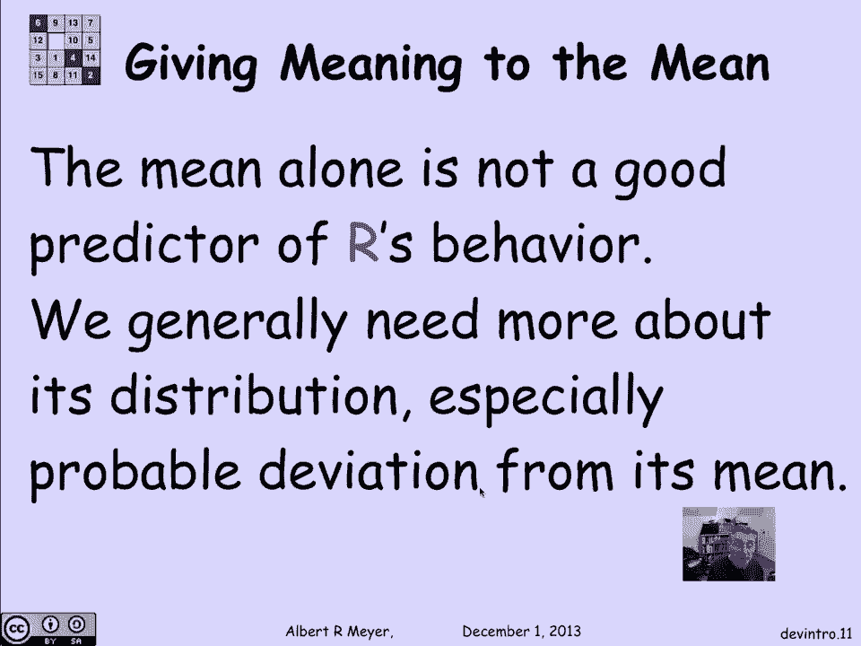
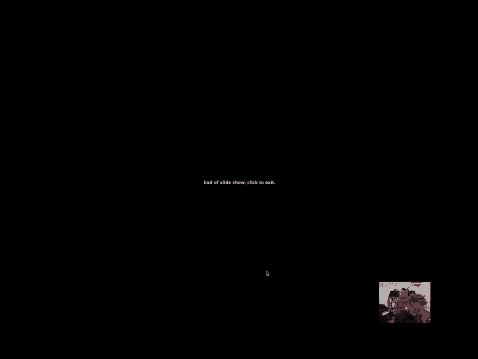
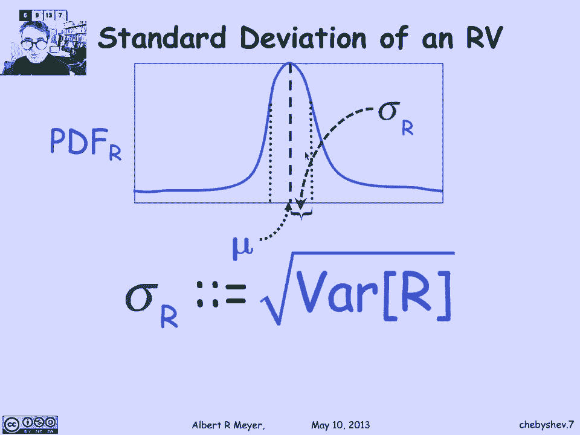
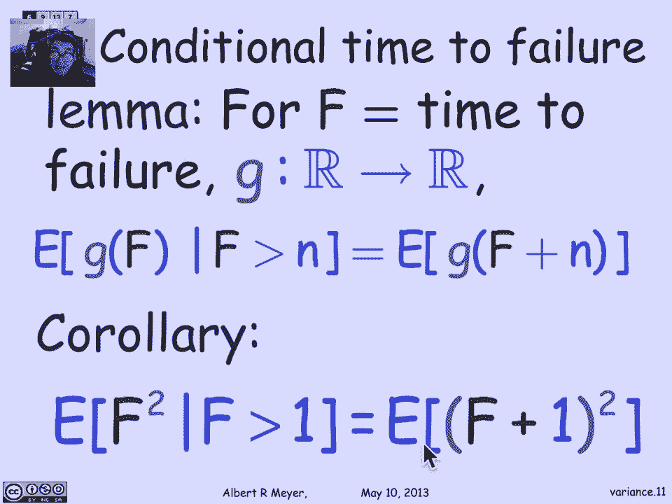
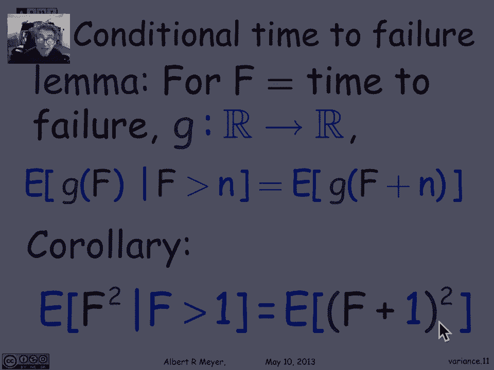
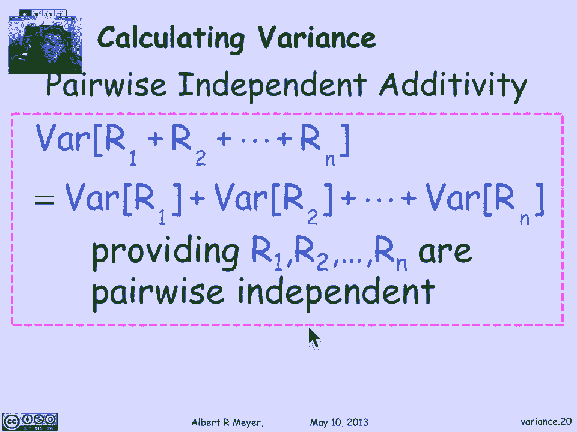

# 计算机科学的数学基础：L4.6：期望的偏离：马尔可夫与切比雪夫界 🎯

在本节课中，我们将要学习随机变量偏离其期望值的概率。我们将探讨两个重要的概率不等式：马尔可夫界和切比雪夫界。它们能帮助我们理解，即使单次实验的结果几乎不可能恰好等于期望值，但大量实验的平均结果会如何围绕期望值波动。

## 从期望值谈起 📊

上一节我们介绍了期望值及其最重要的性质——线性性。现在，让我们退一步思考：期望值究竟意味着什么？我们为何关心它？我们有一个直观的想法：如果你对一个随机变量进行足够多次的实验，其长期平均值将接近其期望值。本节中，我们将尝试让这个想法变得更精确。我们将讨论“偏离期望值”这一主题，或者说，期望值的真正含义是什么。

让我们看一个熟悉的例子来把握我们感兴趣的具体概念。假设我抛一枚公平的硬币101次。由于可能的结果是从0到101，中间值就是期望值，所以期望的正面次数是50.5次。然而，我们永远不会恰好得到50.5次正面，因为不可能抛出一半的正面。所以，我们并不“期望”单次实验的结果恰好等于期望值。期望值是我们预期在平均意义上会出现的结果。

我们可以问：得到尽可能接近期望值的概率是多少？例如，恰好得到50次正面的概率大约是1/13。或者，得到50或51次正面（即在期望值±1范围内）的概率大约是1/7。如果我们抛更多的硬币，比如1001次，期望的正面次数是500.5次。恰好得到500次正面的概率是1/39，在期望值±1范围内的概率大约是1/19。这些概率比之前（100次抛掷时）降低了。所以，随着抛掷次数的增加，正面次数落在期望值某个固定距离（比如±1）内的概率实际上降低了。

但是，当我们开始看百分比时，情况会好转。对于1001次抛掷，落在期望值1%范围内的概率是多少？1001的1%大约是10。所以，我们问的是落在490到510次正面之间的概率。这个概率大约是49%，几乎是50%。所以，当我抛1001次硬币时，实际上有大约50%的机会落在期望值的1%范围内。

因此，我们可以开始说，当我们试图解释期望值的含义时，如果我们用 **μ** 表示随机变量 **R** 的期望值（这只是为了在公式中更美观），我们问的基本问题有两个：
1.  随机变量 **R** 远离其期望值 **μ** 的概率是多少？即 **P(|R - μ| ≥ x)**。
2.  平均偏离是多少？即偏离距离的期望值 **E(|R - μ|)**。





当然，我们试图用偏离距离的期望值来解释期望值的含义，这里有一点循环论证。但让我们暂且接受并继续。

## 理解偏离：两个骰子的例子 🎲

让我们看一个例子来具体化这些概念。考虑两个具有相同期望值的骰子。绿色骰子是一个标准的公平骰子，数字1到6出现的概率相等，其期望值正好是1和6的中点，即3.5。现在，假设我们看一个灌铅的骰子（骰子2），它只掷出1或6，且概率相等。根据同样的推理，它的期望值也是3.5。这是两个不同的随机变量：一个以等概率取1到6的值，另一个只取1和6两个值，但它们有相同的期望值。

那么，如何捕捉它们的区别呢？如果我们看公平骰子到其期望值的平均距离，我断言是1.5。而灌铅骰子到其相同期望值的平均距离实际上是2.5。事实上，第二个骰子总是恰好偏离其期望值2.5。

让我们看看概率质量函数来理解发生了什么。这是公平骰子的PMF。在1到6上，每个绿色柱子的高度是1/6，它们的总和为1，表示公平骰子以等概率取1到6中的某个值。期望值正好在中间的3.5处。这些点到期望值的平均距离：你可以看到，有1/3的时间（取值为2和5时）距离是1.5；另外1/3的时间（取值为1和6时）距离是2.5；剩下的1/3时间（取值为3和4时）距离是0.5。这些距离平均下来是1.5。所以，公平骰子偏离其期望值的平均距离是1.5。另一方面，对于灌铅骰子，正如我们所说，它总是恰好偏离其期望值2.5，这意味着它的期望偏离距离也是2.5。

通过这个简短的例子，我们可以看到，尽管这两个分布（两种骰子）有相同的期望值，但其中一个更可能且具有更大的期望偏离距离。其寓意是：仅凭均值本身并不能很好地预测随机变量的行为。正如你可能想到的，一个参数、一个数字无法捕捉PMF的形状，而PMF能提供关于随机变量值分布的更完整信息。我们需要比期望值更多的信息，其中一个有价值且信息量仍远小于整个PMF形状的额外信息，就是了解它可能偏离其均值的程度。

## 马尔可夫界：一个简单而强大的起点 📉

关于随机变量显著偏离其期望值的最简单界限，是由一位名叫马尔可夫的俄罗斯概率论学家提出的，这就是我们将要讨论的马尔可夫界。让我们用一个在MIT背景下令人难忘的IQ例子来说明。IQ（智商）是19世纪末（也可能是20世纪初）发明的概念，旨在打破哈佛大学聘用富裕校友子女的模式，其想法是基于成绩录取，并采用一种不依赖于社会阶层的客观能力衡量标准。心理学家们最初设计的智商平均值为100。

现在，让我们问一个极端的问题：在精英大学周围，有很多人的智商远高于100，但有多大比例的人口可能拥有高达300的智商？我不确定是否有记录显示智商高达300的人，但我们在这里进行逻辑讨论：是否可能有很多人的智商大于等于300？答案是否定的。你不可能有超过三分之一的人口智商达到300，因为如果超过三分之一的人智商为300，那么仅这三分之一的人对平均值的贡献就会超过100（即 (1/3)*300 > 100），而平均值只有100。这就是基本的界限。

我们可以这样重述：随机选择一个人，其智商大于等于300的概率绝对小于等于智商的期望值（100）除以300。将其参数化，如果我们问智商大于等于某个值 **x** 的概率，根据同样的推理，它小于等于100/**x**。这基本上就是马尔可夫界，只是我们在推导上一个等式或不等式时使用了一个隐含事实：智商是非负的。我们的逻辑是，你不能有超过人口比例 **100/x** 的人智商超过 **x**，因为那将对平均值贡献超过 **x * (100/x) = 100**，而平均值只有100。只有当没有负值来抵消高智商人群的额外贡献时，这才是个问题。我们隐含地使用了智商从不负这一事实。智商从0到无限，但从不负。这意味着，那三分之一智商超过300的人口的贡献不能被负值抵消，它存在并会拉高平均值。

通过同样的推理（我不会用更正式的证明来烦你，课本上有一个简单的证明），马尔可夫定理指出：如果 **R** 是非负的，那么 **R** 大于等于 **x** 的概率小于等于 **R** 的期望值除以 **x**。即：
```
P(R ≥ x) ≤ E[R] / x
```
这对任何 **x > 0** 都成立。当然，如果这个界限大于等于1，那就没意思了，因为概率永远不会大于等于1。所以我们不妨将 **x** 限制为大于 **E[R]**，因为只有这样的 **x** 才会给我们一个小于1的非平凡界限。

再次强调，如果 **R** 是非负的，那么 **R** 超过某个量 **x** 的概率小于等于 **E[R]/x**。这就是马尔可夫界。如果我们用偏离均值的术语来重述，可以这样表述：**R** 大于等于其均值 **μ**（**μ** 是 **E[R]** 的缩写）的常数 **c** 倍的概率小于等于 **1/c**。所以现在我们可以将其理解为对高于均值的偏离概率的界限。随着 **R** 作为期望值的倍数增加，概率成比例地减小。例如，**R** 大于等于期望值三倍的概率小于等于三分之一，这就是我们在智商例子中看到的。

总的来说，马尔可夫界通常非常弱。正如我所说，我不认为有记录显示智商高达300的人，在你遇到的大多数例子中，都会有其他信息让你能推导出随机变量显著大于其期望值的更紧界限。但是，如果你除了知道随机变量非负之外没有任何其他信息，那么事实上马尔可夫界是紧的，你不可能得到一个更强的结论，因为存在一些非负随机变量，其大于等于给定值 **x** 的概率确实等于其期望值除以 **x**。所以马尔可夫界在应用中较弱，但它是基于其对随机变量属性所做的非常有限的假设所能做出的最强条件。而且，我希望通过我们讨论的例子，它也是相当明显的。但令人惊讶的是，它非常有用。我们将通过巧妙的方式使用它来获得收益。

## 改进马尔可夫界：一个巧妙的技巧 🛠️

让我们谈谈第一个巧妙的方法。假设我们正在考虑智商大于等于300的情况，但我引入另一个之前未提及的事实：假设实际上，智商低于50的情况不会发生。也许实际上会发生，但存在一个临界点，低于该点的人根本无法正常运作，讨论处于昏迷状态的人是否有智商可能没有意义，也许他们的智商为0。但让我们假设，实际上智商永远不会小于等于50。

现在，如果我告诉你我知道智商大于等于50，那么我实际上可以从马尔可夫界得到一个更好的界限。因为现在，知道智商大于等于50，**IQ - 50** 就变成了一个非负随机变量（之前我不能确定，因为智商可能低于50）。既然我知道它总是高于50，马尔可夫界将适用于 **IQ - 50**。将其应用于 **IQ - 50** 会给你一个更好的界限，因为现在看智商大于等于300的概率，当然，这等同于说 **IQ - 50** 大于等于250。这个非负随机变量的期望值是 **100 - 50 = 50**。所以我们问这个非负随机变量是否大于等于250。答案是，概率小于等于其期望值除以250，即 **50/250 = 1/5**。这比我们之前得到的三分之一界限更紧。

这是一个普遍现象，可以帮助你从马尔可夫界得到稍强的界限：如果你有一个非负变量，通过平移它使其均值为0（或者即使它为负，如果你能将其最小值强制提升到0以上），然后对其应用马尔可夫界，你会得到一个更好的界限。

## 切比雪夫界：利用方差获得更强界限 📈




我们的主题是偏离均值，即随机变量取值显著偏离其均值的概率。马尔可夫界利用关于 **R** 的极少信息（仅非负性），给出了 **R** 过大的粗略界限。不出所料，如果你对 **R** 的分布了解得比仅仅非负性多一点，你就可以陈述更紧的界限。这一点被一位名叫切比雪夫的数学家注意到，他提出了一个称为切比雪夫界的界限。有趣的是，马尔可夫界虽然非常弱且似乎不太有用，但切比雪夫界（通常能给出显著更强且有价值的界限）实际上是马尔可夫定理的一个简单推论。这只是使用马尔可夫界推导切比雪夫界的一种非常简单而巧妙的方法。

让我们看看如何推导。我们感兴趣的是随机变量 **R** 偏离其均值某个量 **x** 的概率，即距离 **|R - μ|** 大于等于 **x** 的概率 **P(|R - μ| ≥ x)**。我们试图把握这个概率作为 **x** 的函数。关键在于，事件 **|R - μ| ≥ x** 等价于将该不等式两边平方，即事件 **(R - μ)² ≥ x²**。这两个事件只是表述同一件事的不同方式，因此它们的概率显然相等。

现在，这样做的好处当然是 **(R - μ)²** 是一个非负随机变量，马尔可夫定理适用于它。实数的平方总是非负的。所以让我们将马尔可夫定理应用于这个新的随机变量 **(R - μ)²**。马尔可夫界告诉我们这个平方变量大于等于 **x²** 的概率是多少？只需代入马尔可夫界，它告诉我们这个概率小于等于该平方变量的期望值除以 **x²**。这只是将马尔可夫界应用于变量 **(R - μ)²**。

现在，这个分子 **E[(R - μ)²]** 看起来可能不太容易记住，但你应该记住它，因为它非常重要，有自己的名字，称为 **R** 的**方差**。这是关于 **R** 分布形状的一个额外信息，结果证明它能让你对 **R** 偏离其均值某个给定量的概率做出更强大的论断。

因此，我们可以用其名称“方差”来重述切比雪夫界。这就是切比雪夫界所说的：**R** 与其均值的距离大于等于 **x** 的概率小于等于 **R** 的方差除以 **x²**。其中 **R** 的方差是 **(R - μ)** 平方的期望值，即 **Var(R) = E[(R - μ)²]**。切比雪夫界的一个重要技术方面是，我们得到了概率的**平方反比**缩减。记住，马尔可夫界的分母是线性的，而这里它是二次的。所以，当我们问及偏离量更大时的概率时，这些界限减小得更快。

**R** 的方差，也许有助于你记住它的另一种方式是记住它的另一个名字：**均方误差**。如果你把 **R - μ** 看作 **R** 偏离其应有值的误差，我们将其平方然后取平均，所以我们取的是平方误差的均值。

## 标准差：一个更直观的度量 📏

方差有一个难点，这促使我们想看看另一个对象，即方差的平方根，称为**标准差**。你可能会想，如果你理解了方差，取平方根并用它来工作有什么意义？答案很简单，如果你认为 **R** 是一个其值具有某种维度（比如秒或美元）的随机变量，那么 **R** 的方差是 **(R - μ)²** 的期望值，这意味着它的单位是秒²或美元²等等。方差本身是一个平方值，它并不反映你预期 **R** 会产生的误差大小，即你预期 **R** 偏离其均值的距离。我们可以通过取平方根将这个量的单位变回与 **R** 的单位匹配，同时也得到一个更接近你预期观察到的偏离程度的数字。它被称为 **R** 的**标准差**。如果对你有帮助，标准差也被称为**均方根误差**。你可能听说过这个短语，它在实验误差的讨论中经常出现。

再次强调，我们取误差（即随机变量与其均值的距离），将其平方，取该平方误差的期望值，然后取其平方根。这就是标准差。

回到直观理解标准差在熟悉形状的随机变量分布函数中的含义。假设 **R** 是一个具有相当标准的钟形曲线或高斯形状的随机变量，它有一个峰（单峰），并且随着你离均值越来越远，它以某种中等速率衰减。对于这种形状的分布，其均值由于对称性，将位于那个高点（众数）处，值平均下来就是这个中间值。

对于这样的曲线，标准差将是一个区间，你可以将其解释为围绕均值的一个区间，并且对于标准分布，你落在该区间内的概率相当高。我们将看到，切比雪夫界对于任意未知分布不会告诉我们太多，但一般来说，对于典型分布，你期望发现标准差告诉你，当你取随机变量的一个值时，你最可能位于该区间内。

## 重述与应用切比雪夫界 🔍

让我们回到我们陈述的切比雪夫界。我在这里只是用其平方根（标准差 **σ**）的平方来替换分子中的方差 **Var(R)**。这是一种有用的重述方式，因为它促使我们像之前重述马尔可夫界那样，用某个东西的倍数来重新表述切比雪夫界。我将用常数乘以标准差来替换 **x**。所以我要看误差大于等于常数倍标准差的概率，当 **x** 是常数乘以标准差时，标准差项会消掉，最终得到 **1/c²**。让我们来做一下。

公式如下：**R** 与其均值的距离大于等于其标准差 **σ** 的倍数 **c** 的概率小于等于 **1/c²**。所以随着 **c** 增长，概率减小得更快。

让我们看看这对一些数字意味着什么，让事情变得更真实一些。这个论断告诉我们，**R** 可能不会返回一个其标准差显著倍数的值。例如，这个公式告诉我们 **R** 将偏离其均值一个标准差的概率是多少？实际上它什么也没告诉我们，因为当 **c=1** 时，它只告诉我们概率至多为1，这是我们总是知道的，因为概率至多为1。但如果我问，**R** 的误差大于等于两倍标准差的概率是多少？那么这个定理告诉了我一些非平凡的东西：它告诉我这个概率至多是 **1/2² = 1/4**。对于任意具有标准差 **σ** 的随机变量，其误差超过两倍标准差的概率至多是四分之一，超过三倍的概率至多是九分之一，超过四倍的概率至多是十六分之一。

因此，要记住的定性信息是：对于**任何**随机变量，只要它有标准差 **σ**，那么你就可以对随机变量取值偏离其均值达标准差大倍数的概率做出一些明确的论断。这个概率会更小，并且随着标准差倍数的增加而迅速减小。





## 方差的计算方法 🧮

如果我们要利用切比雪夫界和其他依赖于方差的结果，我们将需要一些在各种情况下计算方差的方法。让我们在这里展开讨论。

一个基本的起点是询问指示器变量（或伯努利变量）的方差。记住，**I** 作为指示器变量意味着它是0或1值的。如果它等于1的概率是 **p**，那么这也是它的期望值，即 **E[I] = p**。我们问它的方差是多少，根据定义，方差是 **E[(I - p)²]**。这是一个几乎机械的证明，只需通过代数和期望的线性性即可完成。让我们一步一步来，只是为了让你放心，所涉及的只有这些。我不建议死记这个证明，因为我从来记不住，每次需要时我都会重新推导。



第一步是将 **(I - p)²** 代数展开。所以我们计算 **E[I² - 2pI + p²]**。现在我们可以应用期望的线性性，得到 **E[I²] - 2pE[I] + E[p²]**。当然，常数的期望就是常数本身，所以 **E[p²] = p²**。现在看这里，**I²** 是0或1值的，事实上 **I² = I**。所以 **E[I²] = E[I] = p**。