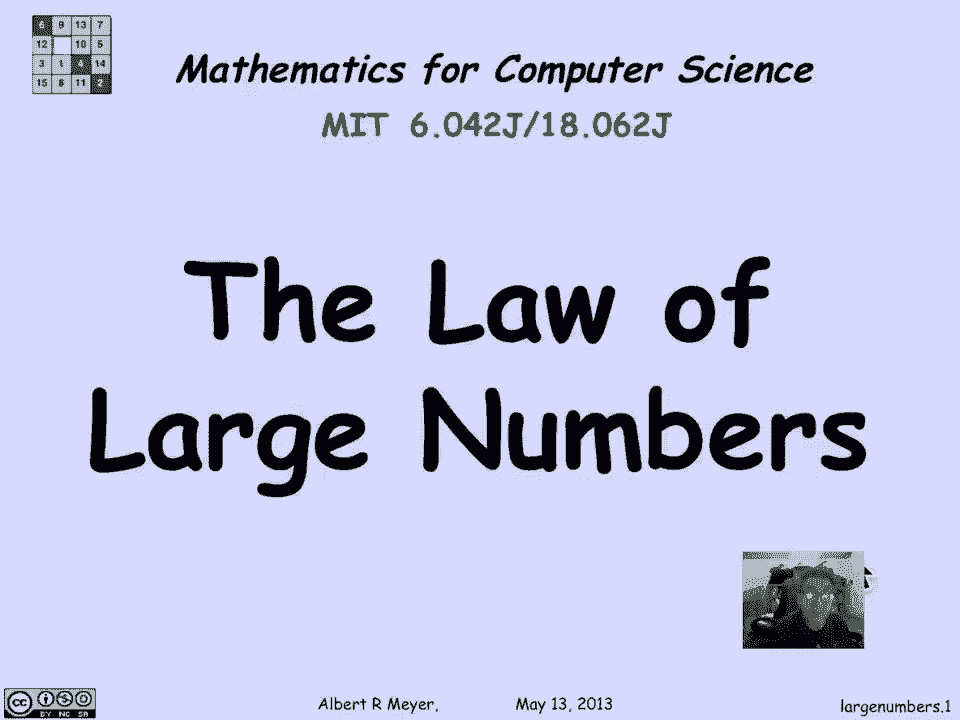
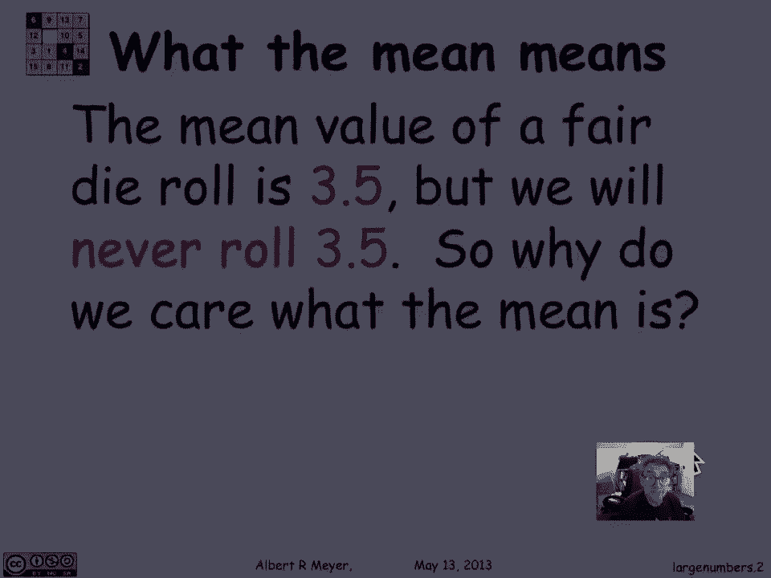

# 计算机科学的数学基础：P98：L4.7 抽样与置信度 🎲📊

在本节课中，我们将要学习大数定律及其在抽样和置信度估计中的应用。我们将从理解平均值的概念开始，逐步探讨如何通过多次试验来估计一个随机变量的期望值，并评估这种估计的可靠性。

## 概述：大数定律的直觉与重要性

大数定律为概率论中的一个基本直觉提供了精确的数学表述：当我们对一个随机变量进行大量独立重复试验时，其观测值的平均值会趋近于该随机变量的期望值。本节我们将正式介绍这一定律，并理解它为何是统计推断的基石。

---

## 平均值的意义与直觉

上一节我们介绍了大数定律的核心思想，本节中我们来看看为什么平均值如此重要。考虑掷一个公平的六面骰子，其期望值是 **3.5**。然而，你永远无法掷出“三点五”这个结果。那么，我们为何要关心这个永远不会出现的“平均值”呢？

答案是，我们相信在经历多次投掷后，骰子显示数字的平均值会接近 **3.5**。更基本地说，当我们为一个结果（例如掷出6点）分配概率 **1/6** 时，我们的直觉是：如果进行大量（N次）试验，出现该结果的次数比例将接近 **1/6**，即大约会出现 **N/6** 次。

这就是我们为结果分配概率背后的定义或直觉：从长远来看，一个事件发生的频率会趋近于其概率。

---

## 雅各布·伯努利与大数定律

雅各布·伯努利（1659-1705）是大数定律的发现者。他在其著作《猜测的艺术》中写道：“即使是最愚蠢的人，凭借某种本能……也能确信，观察的次数越多，偏离目标的危险就越小。”

他所说的正是我们刚才阐述的：如果你投掷一个公平的骰子 N 次，掷出6点的比例将接近 **1/6**。当 N 趋近于无穷大时，这个比例将无限接近 **1/6**。这是每个人都有的直觉，而伯努利的工作就是将其形式化。

当然，在实际实验中，你可能会“运气不好”，得到的比例与 **1/6** 相差甚远。大数定律的关键在于告诉我们这种情况发生的可能性有多大，并为我们提供定量的控制，这对于抽样和假设检验至关重要。

---

## 实际数据示例

让我们看一些实际计算的数据，以理解大数定律如何运作。

以下是投掷骰子不同次数时，掷出6点的比例落在期望值（1/6）的10%以内的概率：

*   **投掷 6 次**：概率约为 44%。（因为唯一满足“在期望值10%以内”的结果就是恰好掷出1次6点）。
*   **投掷 60 次**：概率约为 26%。
*   **投掷 600 次**：概率约为 72%。
*   **投掷 6000 次**：概率约为 99.9%。

这个列表说明，随着试验次数 N 的增加，观测平均值落在期望值附近指定区间内的概率会越来越高。这正是伯努利所说的“观察次数越多，偏离越小”。

如果我们要求更严格的容差（例如5%以内），那么达到该精度的概率会相应降低。例如，投掷3000次时，落在期望值10%以内的概率高达98%，而落在5%以内的概率约为78%。

这告诉我们，大数定律允许我们通过实验来评估一个假设。例如，如果你投掷骰子3000次，掷出6点的比例没有落在期望值（500次）的10%区间（450-550次）内，那么你就有98%的把握认为这个骰子是不公平的（即不是以1/6的概率掷出6点）。

---

## 伯努利问题的数学形式化

伯努利想将他的直觉转化为一个数学问题。他考虑一个期望值为 **μ** 的随机变量 **R**。我们对 **R** 进行 n 次独立观测（试验），并计算这些观测值的平均值 **A_n**。我们想知道，当 n 很大时，平均值 **A_n** 与真实期望值 **μ** 非常接近的可能性有多大。

更正式地说，我们考虑 n 个**独立同分布** 的随机变量 **R_1, R_2, ..., R_n**，它们都与 **R** 具有相同的分布和期望值 **μ**。它们的平均值定义为：
`A_n = (R_1 + R_2 + ... + R_n) / n`

伯努利的问题是：对于任意给定的正数容差 **δ**，概率 **P(|A_n - μ| ≤ δ)** 是多少？当试验次数 n 趋于无穷大时，这个概率会怎样？

他的答案是：这个概率的极限是 1。也就是说，只要进行足够多的试验，你就能以任意高的确定性，让平均值落在期望值的任意小的邻域内。这被称为**弱大数定律**。

然而，这个定性的极限结果在实际中并不直接有用。要真正应用它，我们需要知道它趋近于极限的**速度**，即需要一个**定量版本**。

---

## 弱大数定律的证明

现在，我们准备证明弱大数定律。我们将使用切比雪夫不等式，并额外假设这些随机变量具有有限的方差 **σ^2**。

首先，计算平均值 **A_n** 的期望值：
`E[A_n] = E[(R_1+...+R_n)/n] = (E[R_1]+...+E[R_n])/n = (nμ)/n = μ`
正如预期，平均值的期望值就是每个变量的期望值 **μ**。

接下来，将切比雪夫不等式应用于随机变量 **A_n**：
`P(|A_n - μ| ≥ δ) ≤ Var(A_n) / δ^2`

现在计算 **A_n** 的方差。由于变量是独立的（实际上成对独立就足够了），方差具有可加性。同时，常数因子 **1/n** 在方差中会以平方形式提出：
`Var(A_n) = Var((R_1+...+R_n)/n) = (Var(R_1)+...+Var(R_n)) / n^2 = (nσ^2) / n^2 = σ^2 / n`

因此，我们得到：
`P(|A_n - μ| ≥ δ) ≤ (σ^2 / n) / δ^2 = σ^2 / (n δ^2)`

当 n → ∞ 时，不等式右边趋于 0。这就证明了弱大数定律：`lim_{n→∞} P(|A_n - μ| ≥ δ) = 0`。

---

## 两两独立抽样定理

回顾上述证明，我们实际上证明了一个更强、更实用的定量定理。我们只使用了：随机变量**具有相同的有限期望值 μ**、**具有相同的有限方差 σ^2**，以及**成对独立**（方差可加性只需要成对独立）。

因此，我们证明的是**两两独立抽样定理**：
如果 **R_1, ..., R_n** 是成对独立的随机变量，具有相同的期望值 **μ** 和方差 **σ^2**，那么对于它们的平均值 **A_n** 和任意 **δ > 0**，有：
`P(|A_n - μ| ≥ δ) ≤ σ^2 / (n δ^2)`

这个定理非常实用。它告诉我们，如果你告诉我你想要的容差 **δ** 和可接受的最大失败概率（即不等式右边），我就能计算出需要多大的样本量 **n**。这就是独立抽样理论的基础。

---

## 应用示例：生日悖论

生日悖论是一个经典例子，它展示了成对独立（而非完全相互独立）的概念，并强化了方差可加性只要求成对独立这一关键思想。

假设一个房间里有 n 个人，一年有 d 天（通常 d=365）。我们假设每个人的生日是均匀随机且独立的。令 **P** 为匹配生日（至少两人同一天生日）的**对数**的随机变量。

我们可以将 **P** 表示为指示变量之和：对于每一对不同的个人 (i, j)，定义指示变量 **I_{i,j}**，当 i 和 j 生日相同时取值为1，否则为0。那么 `P = Σ_{i<j} I_{i,j}`。

*   **期望值**：对于任意一对 (i, j)，`E[I_{i,j}] = 1/d`。由期望的线性性，`E[P] = C(n,2) * (1/d)`。对于 n=110, d=365，`E[P] ≈ 16.4`。
*   **方差**：关键在于，尽管不同对的匹配事件不是完全相互独立的（例如，知道“A和B同天”与“A和C同天”会告诉你“B和C同天”），但它们是**成对独立**的。因此，方差具有可加性：`Var(P) = C(n,2) * Var(I_{i,j}) = C(n,2) * ((1/d)*(1-1/d))`。计算可得标准差 σ ≈ 4。
*   **应用切比雪夫不等式**：`P(|P - E[P]| ≥ 2σ) ≤ 1/4`。这意味着有至少 75% 的概率，匹配生日对数在 `16.4 ± 8`，即大约 9 到 25 对之间。

在实际的110人班级数据中，我们确实发现了12对匹配生日和3组“三胞胎”（每组算作3对），总共15个匹配事件，相当于 `12 + 3*3 = 21` 对，落在了预测的区间内。

---

## 置信度与估计：查尔斯河案例

现在，我们来看一个使用两两独立抽样定理进行实际估计的例子。假设我们想评估在查尔斯河游泳的安全性。环保局（EPA）规定，水体中大肠杆菌的平均密度（CMD）必须低于 **200**。

我们通过在河流周围随机选取时间和地点进行测量来估计平均CMD。假设我们取了 **n=32** 个样本，得到的样本平均值 **A_n = 180**。我们想说服EPA，真实的平均CMD **μ**（我们记为 **c**）确实低于200。

我们的论点是：如果我们的估计值 **180** 与真实值 **c** 的差距在 **20** 以内，那么 **c** 就一定小于 **200**。因此，我们需要评估 `P(|A_n - c| ≤ 20)` 有多大。

根据两两独立抽样定理：
`P(|A_n - c| ≥ 20) ≤ σ^2 / (n * 20^2)`

问题在于，我们不知道真实的标准差 **σ**。但是，如果我们根据历史经验知道，任何单次CMD测量值之间的最大差距不会超过 **L=50**，那么我们可以论证，标准差 **σ** 最大不会超过 **L/2 = 25**。

代入 **n=32, σ ≤ 25, δ=20**：
`P(|A_32 - c| ≥ 20) ≤ 25^2 / (32 * 20^2) = 625 / (32 * 400) ≈ 625 / 12800 ≈ 0.049`

因此，`P(|A_32 - c| ≤ 20) ≥ 1 - 0.049 ≈ 0.951`。

---

## 重要区分：置信度 vs. 概率

这里有一个至关重要的概念需要区分。我们**不能**说“真实平均值 **c** 小于200的概率是95%”。因为 **c** 是现实世界中的一个固定常数（尽管未知），它不是随机变量。概率性来自于我们的**抽样过程**。

正确的表述是：**我们的抽样和估计过程，有95%的几率会产生一个区间（样本平均值 ± 20），这个区间会覆盖住真实的平均值 c**。这一次，我们通过这个过程得到了区间 `[160, 200]`，并且这个过程在95%的情况下是可靠的，因此我们**有95%的置信度**认为真实值 **c** 落在这个区间内，从而小于200。

当我们听到“某项研究以95%的置信度表明……”时，需要理解其背后的含义：研究者设计了一个随机实验，该实验在95%的重复中会产生包含真相的结果。同时，我们也应警惕“发表偏倚”——即只有那些得出“显著”或“有趣”结果的研究被发表，而许多未达到显著性水平的研究被搁置，这可能会扭曲我们对整体证据的看法。

---

## 总结

本节课中我们一起学习了：
1.  **大数定律**的直觉与正式表述：大量独立试验的平均值会趋近期望值。
2.  伯努利的工作将这一直觉数学化，提出了弱大数定律。
3.  利用**切比雪夫不等式**，我们证明了弱大数定律，并得到了一个更强大的**两两独立抽样定理**：`P(|A_n - μ| ≥ δ) ≤ σ^2/(nδ^2)`。
4.  通过**生日悖论**的例子，我们理解了成对独立与方差可加性的关系。
5.  最后，通过**查尔斯河水质评估**的案例，我们学习了如何应用抽样定理进行参数估计，并深刻理解了**置信度**（关于抽样过程的可靠性）与**概率**（关于固定参数）之间的关键区别。这是理解统计推断和科学报告的基础。