# 计算机科学的数学基础：L4.8：随机游动与PageRank 🚶‍♂️🔍

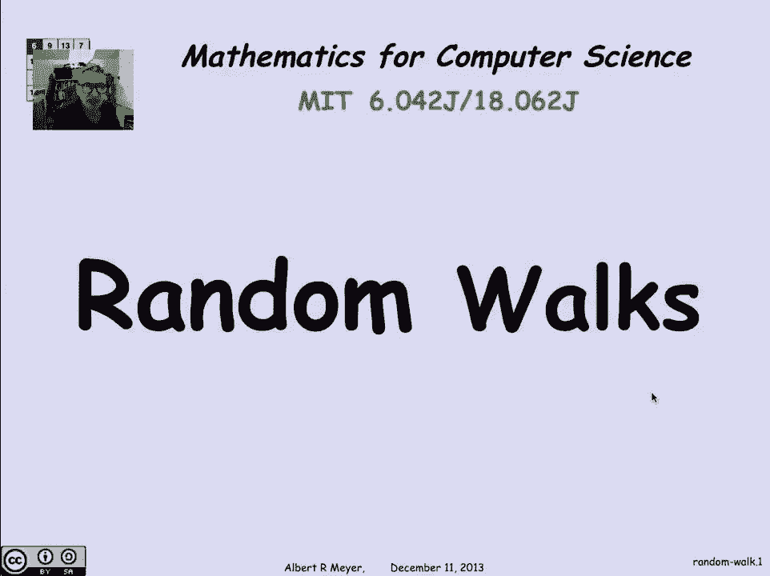

在本节课中，我们将要学习**随机游动**的概念及其在建模中的应用，特别是它在**PageRank算法**中的核心作用。随机游动为一系列场景提供了概率模型，我们将从基本定义开始，逐步探讨其性质、计算方法以及一个著名的应用实例。

## 随机游动的基本概念

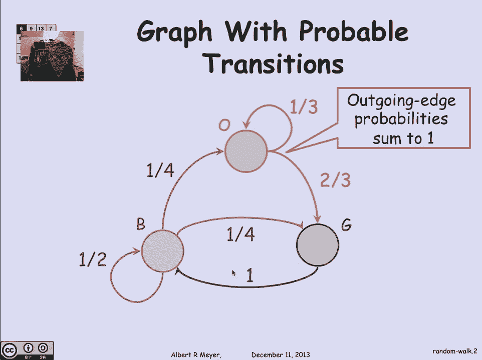

随机游动的设置基于一个**图**。我们通常考虑有向图，它可以被视为一个状态机，其中节点代表状态，边代表状态间的转移。


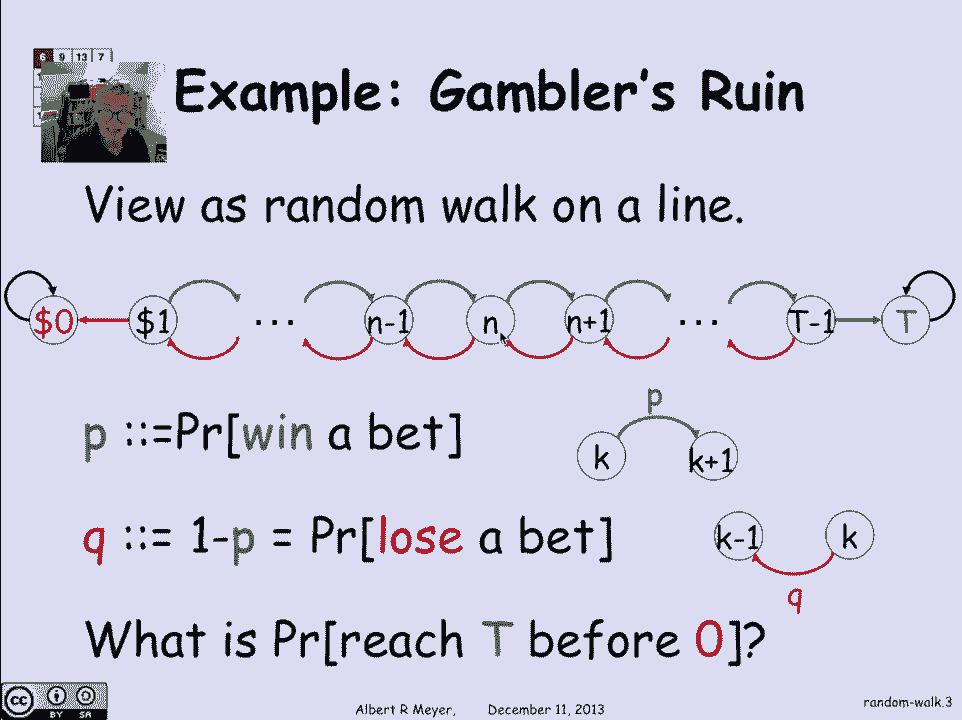

上图展示了一个三状态图（蓝色、橙色、绿色）。为了使它成为一个概率模型，我们需要为边分配概率。唯一的规则是：**从一个节点出发的所有出边的概率之和必须为1**。

例如，在橙色(O)节点：
*   有 `1/3` 的概率沿着边从 O 到 O（自环）。
*   有 `2/3` 的概率沿着边从 O 到 绿色(G)。

让我们以合法的方式填写图中其余边的概率：
*   在蓝色(B)节点：有 `1/2` 的概率从 B 到 B，`1/4` 的概率从 B 到 O，`1/4` 的概率从 B 到 G。
*   在绿色(G)节点：只有一条出边指向蓝色(B)，因此其概率为 `1`。

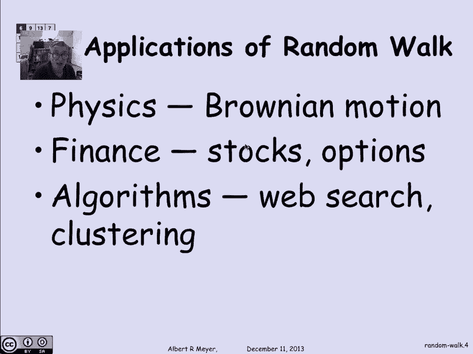


**赌徒破产问题**就是这种随机游动的一个例子。状态代表赌徒拥有的钱数，从破产时的 `0` 到目标 `T`。`n` 是初始赌注。代表“赢”的边（如从状态 `k` 到 `k+1`）以概率 `p` 加权；代表“输”的边（如从状态 `k` 到 `k-1`）以概率 `q = 1-p` 加权。这样，我们就得到了一个描述赌徒破产问题的概率状态图。

关于图上随机游动的典型问题包括：
*   从某个状态开始，在达到状态 `0`（破产）之前达到目标状态 `T` 的概率是多少？
*   从某个状态出发，到达另一个特定状态的期望步数是多少？

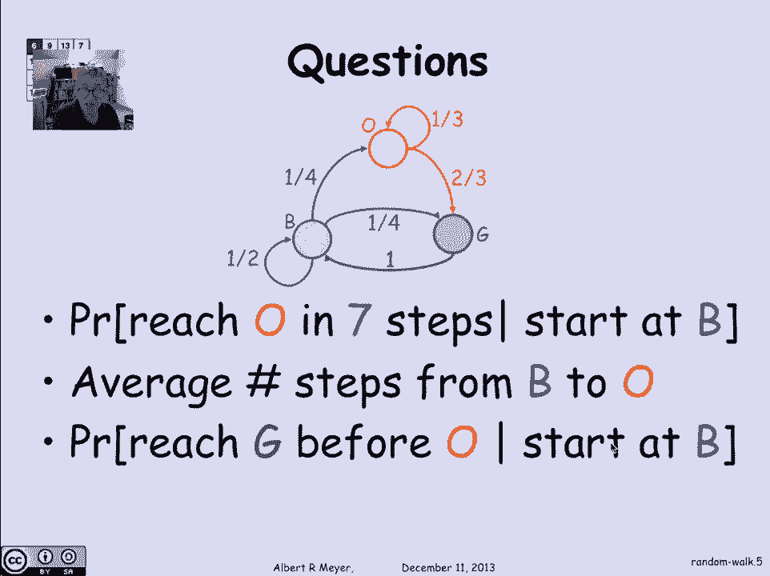

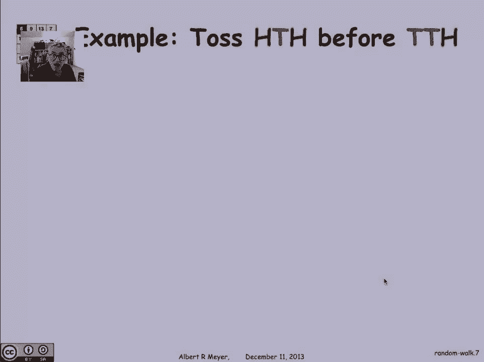

## 随机游动的应用场景

随机游动出现在许多完全不同的场景中。


*   **物理学中的布朗运动**：这是粒子受到原子力冲击而产生的随机运动。爱因斯坦首次提出用随机游动模型来描述粒子在布朗运动下的行为，这成为了他获得诺贝尔奖的主要成果之一。
*   **金融**：股票价格随时间的波动可以被建模为有偏的随机游动，这与赌徒破产问题有相似之处。
*   **网络搜索与聚类**：在本节末尾我们将看到，图上的随机游动被用于对**网络搜索**和**聚类**进行建模。

## 分析随机游动：典型问题

让我们通过简单的三状态图（蓝、橙、绿）来说明随机游动中出现的典型问题。


我们可能会问：
1.  **概率问题**：从状态 B 开始，恰好 `7` 步后到达状态 O 的概率是多少？（在这个小例子中可以显式计算）
2.  **期望问题**：从状态 B 出发，**平均**需要多少步才能首次到达状态 O？（这涉及到计算所有可能步数的加权平均）
3.  **吸收概率问题**：从状态 B 开始，在到达状态 O **之前** 到达状态 G 的概率是多少？（在这个简单例子中，答案是 `50%`，因为从 B 出发，以相等概率去往 O 或 G）

一般来说，这些问题可以表述为求解**线性方程组**，其结构直接反映了状态图的转移结构。

## 通过线性方程组求解

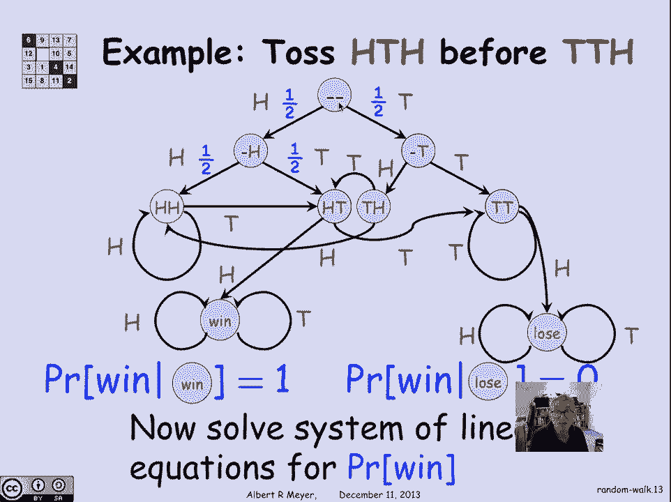

我们之前研究过的一些标准问题，如“从A地到B地的概率”或“从A地到B地的期望时间”，都可以通过求解线性方程组来解决。


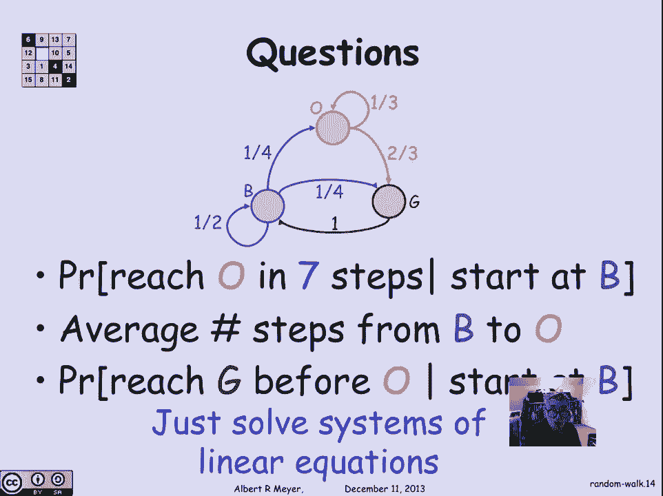

让我们回顾一个有趣的例子：在抛硬币游戏中等待特定模式（如 `HHH` 或 `HTH`）出现。我们可以用一个**状态图**来建模这个过程，状态记录最近两次抛掷的结果（或更少，如果抛掷次数不足）。


例如，从“无先前抛掷”的初始状态开始。第一次抛掷后，我们进入状态 `H` 或 `T`。如果我们想知道“模式A先于模式B出现”的获胜概率，我们可以为每个状态定义一个变量，表示“从该状态开始最终获胜的概率”。

这些变量通过**全概率定律**相互关联。例如，从状态 `H` 开始的获胜概率，等于“从状态 `HH` 开始的获胜概率”乘以 `1/2`，加上“从状态 `HT` 开始的获胜概率”乘以 `1/2`。对于终止状态（如已出现模式A或B），其获胜概率是 `1` 或 `0`。


最终，我们得到一个**线性方程组**，通过求解它，就能得到从初始状态开始的获胜概率。这展示了如何将随机游动问题转化为线性代数问题。

## 状态分布与转移矩阵

现在，让我们考虑一个不同的问题：**经过若干步后，处于各个状态的概率分布是怎样的？**


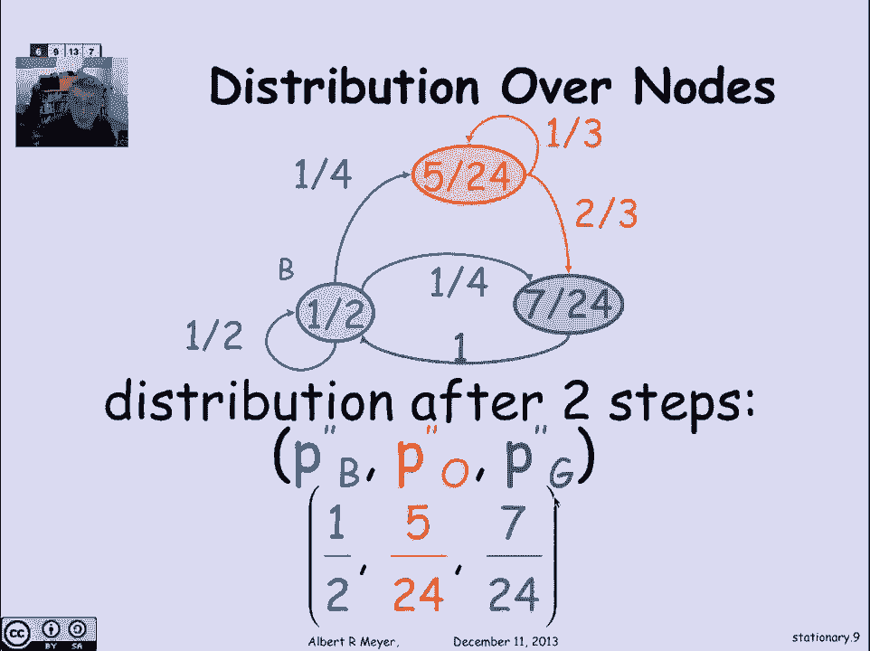

再次使用我们的三状态图。假设从状态 B 开始。初始分布向量为 `P(0) = [1, 0, 0]`（分别对应处于 B, O, G 的概率）。

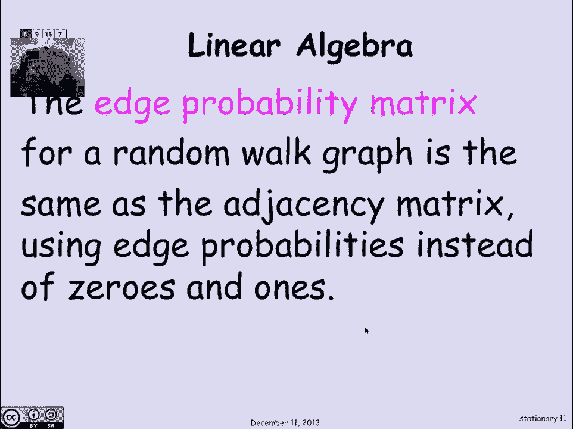

**一步之后**的分布 `P(1)` 是什么？根据图的转移概率：
*   `P(1)_B`（一步后在B的概率）：只能从B状态停留，概率为 `1/2 * 1 = 1/2`。
*   `P(1)_O`：从B转移到O，概率为 `1/4`。
*   `P(1)_G`：从B转移到G，概率为 `1/4`。
所以 `P(1) = [1/2, 1/4, 1/4]`。

**两步之后**的分布 `P(2)` 呢？我们可以使用全概率定律计算。例如，两步后在 O 的概率：
*   路径1：B -> B -> O。概率 = `P(1)_B * (B->O概率) = (1/2) * (1/4) = 1/8`。
*   路径2：B -> O -> O。概率 = `P(1)_O * (O->O概率) = (1/4) * (1/3) = 1/12`。
*   路径3：B -> G -> O。概率 = `P(1)_G * (G->O概率) = (1/4) * 0 = 0`。
因此，`P(2)_O = 1/8 + 1/12 = 5/24`。类似地可以计算 `P(2)_B` 和 `P(2)_G`。


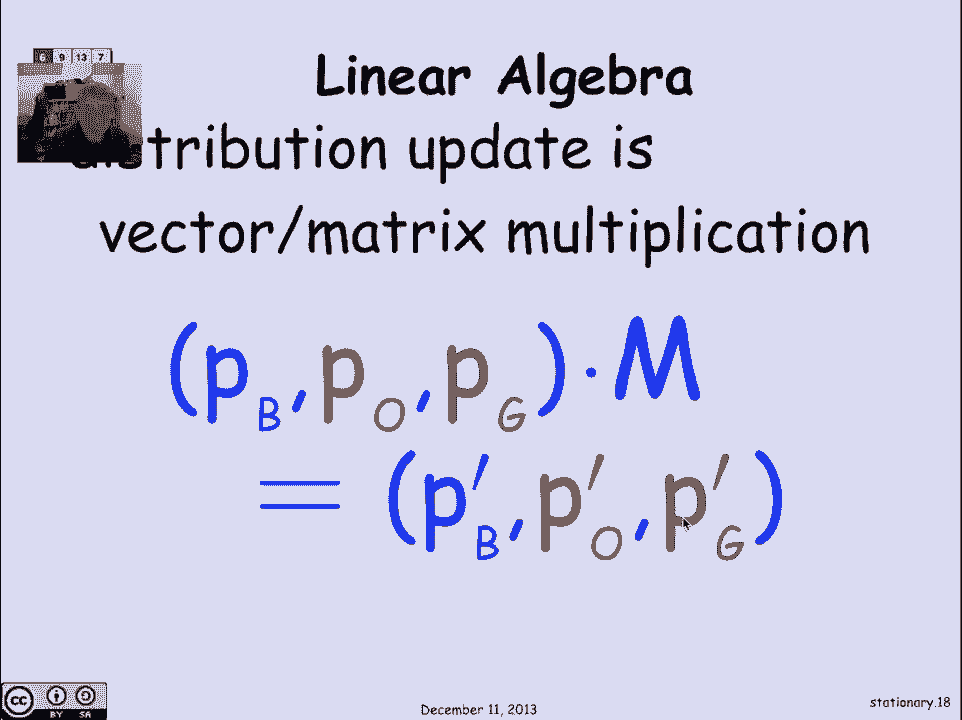

## 用线性代数描述：转移矩阵

我们可以用线性代数来系统化这些计算。首先定义图的**转移概率矩阵 M**。

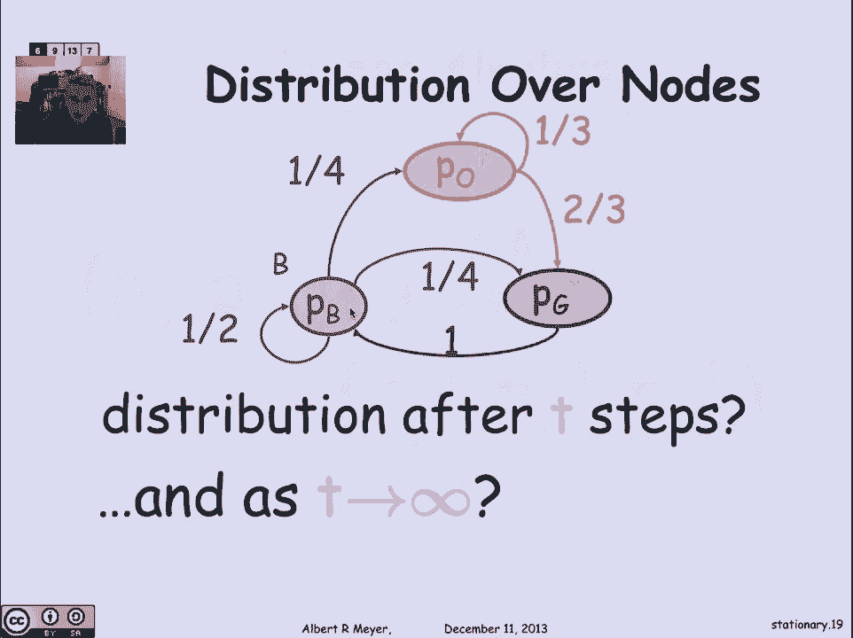


`M` 是一个 `n x n` 矩阵（`n` 是状态数）。矩阵元素 `M[i][j]` 表示从状态 `i` 转移到状态 `j` 的概率。对于我们的三状态图（顺序：B, O, G），矩阵为：

```
M = [ [1/2, 1/4, 1/4],
      [1/3, 1/3, 1/3],
      [ 1,   0,   0 ] ]
```

**关键性质**：如果当前的概率分布向量是 `P_t`，那么下一步的分布向量 `P_{t+1}` 可以通过矩阵乘法得到：
`P_{t+1} = P_t * M`

因此，从初始分布 `P_0` 开始，`t` 步后的分布为：
`P_t = P_0 * M^t` （其中 `M^t` 是矩阵 `M` 的 `t` 次幂）


这为我们提供了一种计算 `t` 步后分布的有效方法（例如，通过矩阵的快速幂运算）。

## 平稳分布

我们想要研究的一个核心概念是**平稳分布**（或稳态分布）。


平稳分布 `S` 是一个概率分布向量，满足：
`S = S * M`
这意味着，一旦系统处于分布 `S`，经过一步转移后，它仍然保持在分布 `S`。分布是“稳定”的。

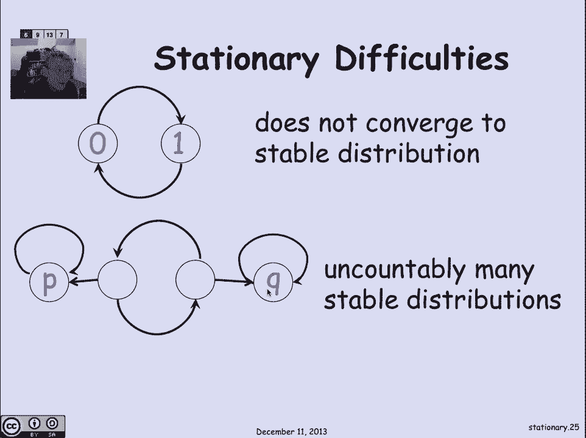

对于我们的三状态图，通过求解方程 `S = S * M` 以及 `S` 各分量之和为 `1` 的条件，可以得到平稳分布。计算结果是：
`S = [8/15, 1/3, 4/15]` （约等于 `[0.533, 0.333, 0.267]`）。

你可以验证，用 `S` 乘以 `M` 确实会得到 `S`。

关于平稳分布，有几个关键问题：
1.  **是否存在**？对于有限状态图，平稳分布总是存在。
2.  **是否唯一**？不一定。如果图是**强连通**的（即任意两个状态可以相互到达），则通常存在唯一的平稳分布。
3.  **是否收敛**？从任意初始分布出发，随机游动是否最终会趋近于平稳分布？这也不一定。

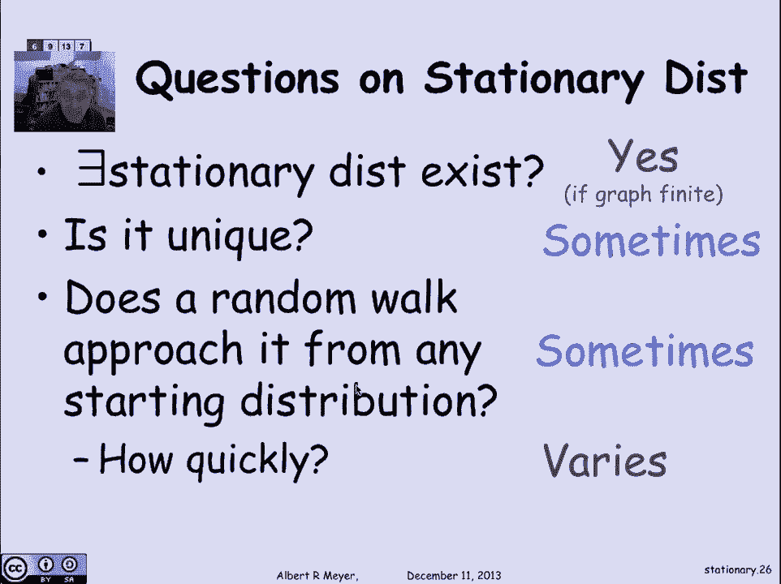


考虑两个反例：
*   **二分振荡**：一个两状态图，总是从状态1跳到状态2，再从状态2跳回状态1。其平稳分布是 `[1/2, 1/2]`，但若从状态1开始，分布会在 `[1,0]` 和 `[0,1]` 之间振荡，永不收敛到平稳分布。
*   **非强连通图**：一个图由两个互不连通的强连通分量组成。每个分量内部都有自己的平稳分布，因此整个图有无数种平稳分布（两个分量分布的任意凸组合）。


因此，**强连通性**是保证唯一平稳分布以及从任意点出发最终收敛到该分布的重要条件（还需排除周期性，如二分振荡的例子）。

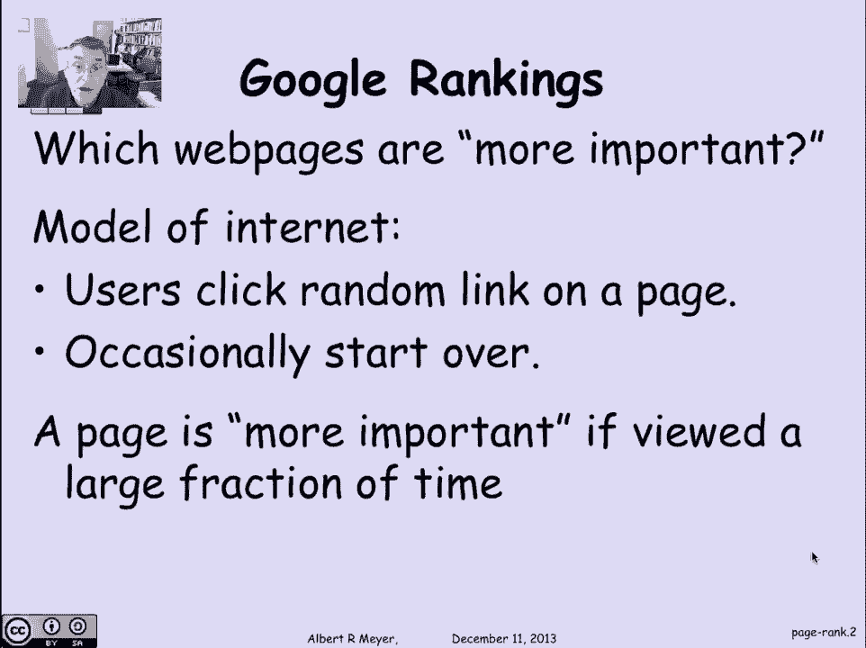

## PageRank：网络重要性的随机游动模型

PageRank 是衡量网页重要性的指标。需要澄清的是，它之所以叫 **PageRank**，是因为其发明者之一是谷歌联合创始人 **拉里·佩奇 (Larry Page)**，而非直译为“网页排名”。


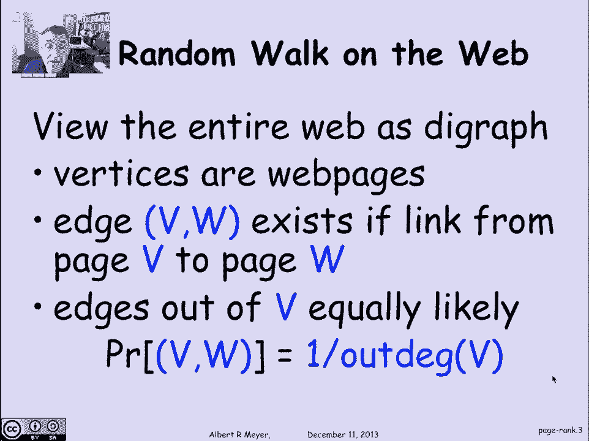

在早期网络搜索中，关键字搜索会返回数百万结果，难以区分质量高低。PageRank 的想法是利用**网络本身的结构**来识别重要页面。

**模型**：将整个万维网视为一个有向图。
*   **顶点**：每个网页（URL）。
*   **边**：如果网页 A 包含指向网页 B 的链接，则存在一条从 A 到 B 的有向边。

我们想象一个用户在网络上进行**随机游动**：
1.  在当前页面，用户随机点击一个链接前往下一个页面。
2.  为了模拟用户可能重新开始浏览（例如，输入新网址、感到无聊或陷入循环），我们引入一个**超级节点**（或“跳转节点”）。
    *   从超级节点到所有其他网页都有边，且概率均等（表示随机选择一个新页面开始）。
    *   从每个网页也以一定概率（例如 `15%`，在原始论文中称为“阻尼因子”）指向超级节点（表示随机跳转，重新开始）。


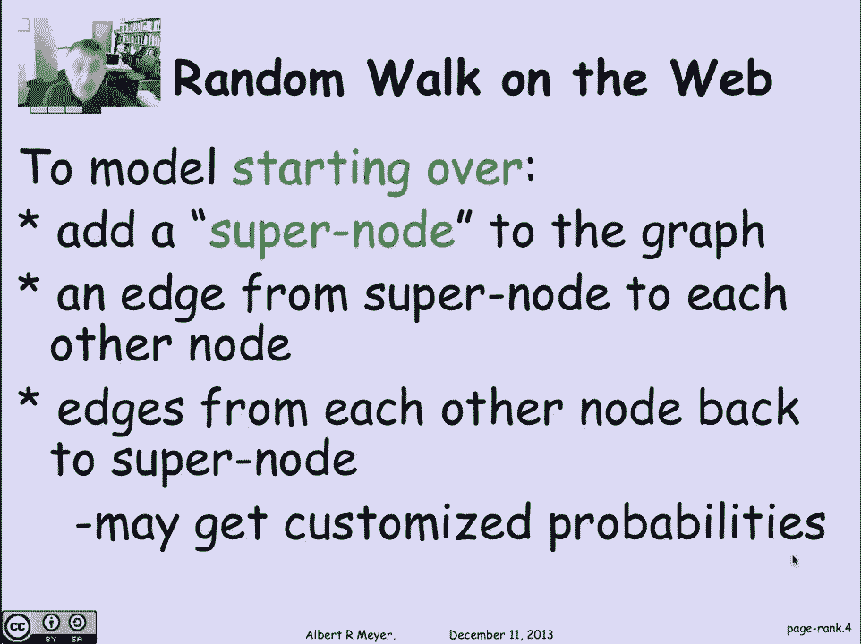

这样，整个浏览过程就构成了一个强连通图上的随机游动。**PageRank 值**就定义为这个随机游动模型的**平稳分布**。


更正式地说，网页 `v` 的 PageRank `PR(v)` 是平稳分布向量 `S` 中对应于 `v` 的分量 `S_v`。排名时，`PR(v)` 值高的网页被认为更重要。

**超级节点的作用**：它确保了最终得到的随机游动图是强连通的（因为从任何网页都可以通过跳转到超级节点，再到达任何其他网页），从而保证了**唯一平稳分布的存在**，并且从任何初始分布出发，随机游动最终都会**收敛**到这个平稳分布。此外，收敛速度通常很快，使得计算可行。


**关于操纵排名**：PageRank 的设计使其对某些简单的操纵具有鲁棒性。
*   创建大量只指向自己的“假”页面不会显著提高你的 PageRank，因为这些假页面本身的权重很低（没人指向它们）。
*   仅仅让大量页面链接到一个重要页面，如果那些重要页面不回链，也不会显著提升该页面的 PageRank。


当然，实际的谷歌排名算法远比原始的 PageRank 复杂，它融合了文本内容、用户位置、付费广告以及十多年来为对抗垃圾信息而演进的数百种信号。PageRank 是其奠基性的核心思想之一。


## 总结

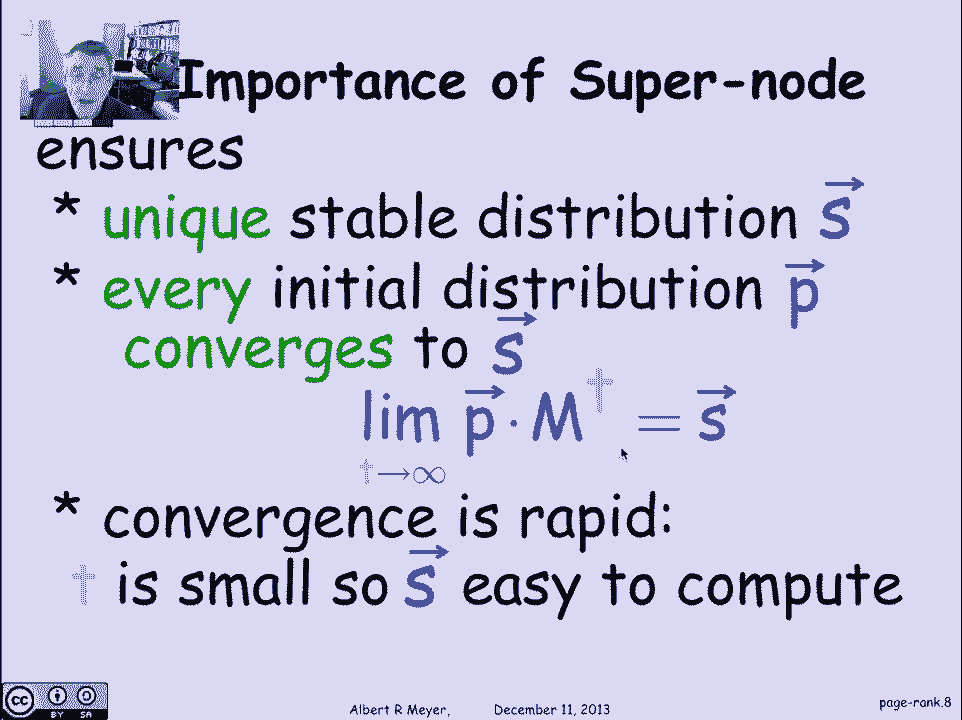

本节课中我们一起学习了：
1.  **随机游动**的基本概念：基于图的状态转移概率模型。
2.  随机游动的**典型问题**：到达概率、期望步数、吸收概率，这些问题常可转化为**线性方程组**求解。
3.  使用**转移概率矩阵** `M` 来描述随机游动，`t` 步后的状态分布由 `P_0 * M^t` 给出。
4.  **平稳分布** `S` 的概念：满足 `S = S * M` 的稳定分布。强连通性等条件影响其存在性、唯一性和收敛性。
5.  **PageRank 算法**：将万维网建模为一个带有“随机跳转”（超级节点）的随机游动图，网页的重要性定义为该随机游动的平稳分布概率。这是一个将图论、概率论和线性代数应用于信息检索的经典范例。

---

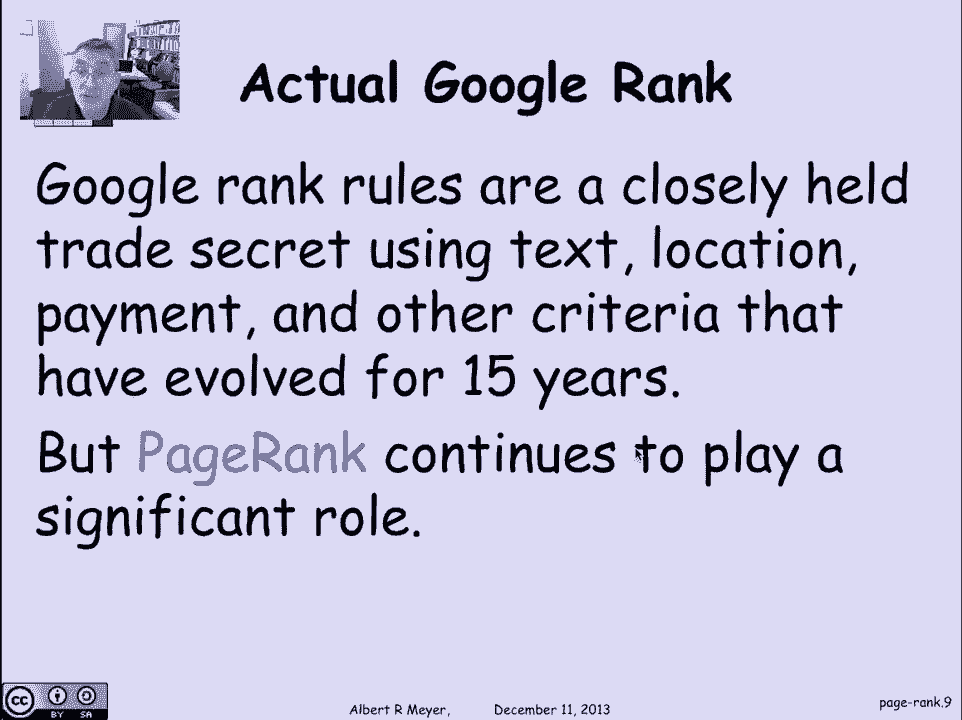

**注**：本教程根据提供的英文视频字幕内容整理，保留了原文每一句话的核心含义，并按照要求进行了结构化、简化和格式优化。文中的公式和代码以加粗或行内代码块形式标出。图片引用保留了原占位符。