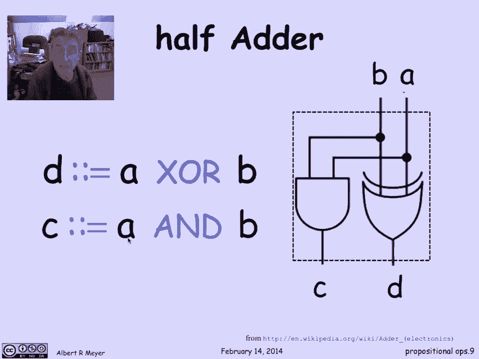
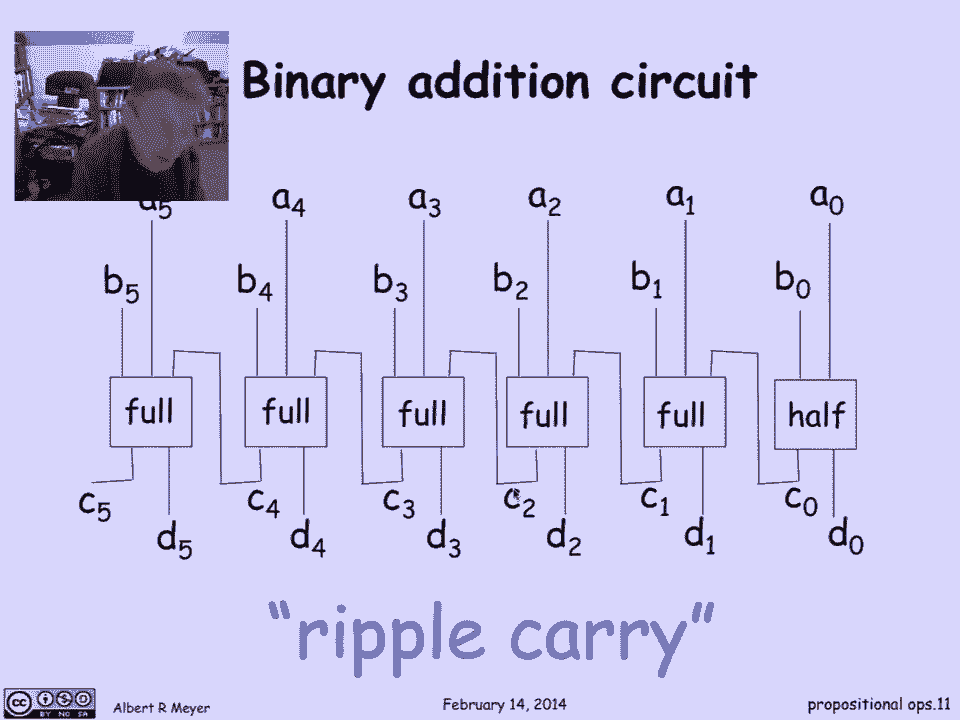

# 【双语字幕+资料下载】MIT 6.042J ｜ 计算机科学的数学基础(2015·完整版) - P10：L1.4.3- Digital Logic - ShowMeAI - BV1o64y1a7gT

propositional operators play a basic，role in the design of digital circuitry。

and we're going to illustrate that in，this section by designing a little。

binary addition circuit so let's begin，with a review of binary notation and。

addition and binary so the way binary，works is like decimal except instead of。

using powers of 10 you're using powers，of 2 so here is the binary。

representation of the number 39 the way，to understand that is this is the ones。

place that's the twos place that's the，forest place so at 1 plus 2 plus 4 is 7。

then this is the 8th place with nothing，this is the 16th place with something。

and this is the 32 place with 1 so we，add 32 to 7 and get 39 likewise the。

binary representation of 28 is 0 1 1 1 0，0 I'll let you check out that works with。

contributing 1 2 4 8 16 and 32 and，binary，now binary addition works just like。

decimal addition except that the only，numbers are ones and zeros so that when。

you get 1 plus 1 you have to carry one，let's do that so 1 plus 0 is 1 that。

fills in the first column then we have，another 1 plus 0 is 1 that's fine now we。

have a 1 plus 1 and that's gonna do a 0，here and contribute a carry of 1 to the，next column。

now the next column has two ones so it，becomes a 0 and contributes to another。

carry now we have two ones we get a 0，and contribute another carry and now we。

have two ones and we finally get a 1 0，so this is the binary representation of。

the sum and you can check that this is 1。

plus 2 is 3 plus 64 so the answer should，be 67 and you can check that it is so。

that's how binary addition works now，let's try to design a bit of circuitry。

using digital logic the signals of 0 & 1。

which will do addition and so we're，going to try to design a。

little 6 bit binary addition circuits so，I'm going to have as inputs the six。

digits of the first binary number a 5，down through a zero and then the second。

binary number let's call it B zero，through B 5 so these are two binary。

numbers six digits long and I'm going to，add them up by thinking of a 1 is 0 or 1。

signal a 0 is a 0 1 signal B 0 is a 0 1，signal these can be transmitted down。

wires into some boxes that contain，digital operators that will cause the。

right signals to come out and what we，want to come out of here is the possibly。

seven digit representation of their，binary sum so these 0 is the sum of a 0。

and B 0 the lower did you possibly with，a carry and so on and then C 5 is if the。

number if the sum of two six digit，numbers runs to seven digits which it。

might as we saw in the previous example，and C five would become one of the Y's。

zero so this is the specification I want，a and B to come in and I want their。

binary sum to come out as these with a，high order seed if need be now the way。

you're going to do that is it's clear，that the behavior of the inputs for a。

and B which produced a lower digit might，produce a carry and that carry has to be。

transmitted to the next column，if it exists and so I'm going to need a。

wire that sends a 0 1 signal from this，box over to that one that can be。

carrying this that carries 0 or 1 and，likewise for all of the others so this。

is the kind of basic structure of my，binary additions circuit this is called。

a ripple carry organization its limiting，its mimicking exactly the way that we。

added up the two numbers column by，column possibly propagating a comma。

column on carry of 0 1 or really a carry，of just 1 to the next column and I've。

got all the wires in place that I need，what we need to do is design the digital。

circuitry that's in those boxes well，this box is different from the others。

because it's only got 2 in，puts all the others have three inputs so。

the three input boxes we'll call full，adders and the two input boxes a half an。

adder and the specification of a half an，adder again is that the output is the。

binary representation of a 0 plus a 0，plus B 0 so it's a 2 binary。

representation never be bigger than 2，because there's only two numbers the。

output of a full adder is it gets inputs，of 3 inputs in this case B 1 a 1 and the。

carry C 0 and it produces the binary，representation of the sum of those three。

numbers which is a two digit binary，representation there might be anything。

from 0 to 3 ok well let's start with the。

easy case what's a half adder well a，half adder again has inputs being a and。

it's supposed to produce as output the，binary representation of B plus a so B。

is the lower digit in the the 0 or the，the zeros place and C is the high or。

digit namely the twos place well what，does that look like well here's the。

circuit this is the digital designers，symbol for a exclusive or gate that。

returns so D is going to be the，exclusive or of a and B according to。

this pictorial diagnose I am notice I'm，using this colon colon equal symbol。

which is convenient as a reminder that，this is that I'm defining the thing on。

the left so this is you can replace it，by equal but it's informative to realize。

that it's not an equality that you've，proved or if in some derivation the two。

interesting things are proven to be，equal but rather than I'm just defining。

what D is so D is Devon this output D is，defined to be a XOR B and likewise this。

is a NAND gate so the outputs a is a and，B and let's check that the lower two。

digit is definitely the month to sum the，XOR of a and B and when is there a carry。

well the only way does a carry went is，when the value is 2 in which case the。

output C would be 1 and D would be 0 and，that's exactly when both a and B or 1。

that is C is a and B so that's a half，adder that was easy，well a full adder looks like this it's a。

little bit more complicated，and I'm gonna write out the equations，without trying to justify them。

completely but I need a name in order to，describe this with with propositional。

operators I need a name for that，important signal call it s which is what。

we we're not calling in the previous one，but now this is a half adder with inputs。

a and B and outputs s which is a XOR B，and another output here in which we know。

is just going to be a and B ok how do i，express this set of connections as。

formulas well first of all s is the，output of this first half adder which is。

a XOR B okay the output D I get by，taking s and it's the first output of。

the second half adder which means it's，CN XOR s that's easy and what about C。

out well C out is getting and this is an，or gate by the way so C out is going to。

be an or of what comes out of this half，adder which is C in and C s and or with。

the output of this half adder which is，just a and B so there are a bunch of。

equations that completely characterize，the structure of this little bit of。

digital logic and how it is wired up and，fits together now let's go back to。

describing our ripple-carry circuit of，what was going on here now that we have。

the equations that characterize the，behavior of these full adders and half。

adders I can explain to you what the，formulas are for all of these outputs。

the C's and the DS and that goes as，follows so the first one looking at this。

half adder with a0 b0 coming in and C 0，D 0 coming out I know that D 0 is a 0 X。

or B 0 and C 0 is a 0 and B 0 that's，just the formulas that we have for the。

half adder when the inputs are a 0 and B，0 and I call the outputs the 0 and C 0。

now the more general case of the full，adder what's coming in here is an A and。

a B with the same subscript AI and bi，and，coming out is the eighth digit of the。

binary some di and the carry CI and I，can describe those just by using the。

formulas for the full adder so what it，means is that I'm going to introduce a。

new convenient variable si which I'm，going to define to be AI or X or bi di。

is then going to be CI minus 1 that，carry from the previous place ex-ored。

with Si and the new carry CI is going to，be the out of the output of the second。

half adder of the first half adder which，is CI minus 1 and si or the output of。

the first half adder which is AI and bi，so the point is that I've just taken the。

the wiring and translated into equations，like this and you can see how these。

equations might be more fair to use then，the particular way that you drew the。

picture with all the wires connected，because the logical behavior of the。

circuit doesn't depend on how it's laid，out it just depends on these logical。

