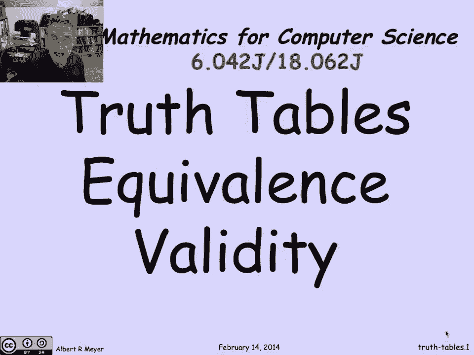
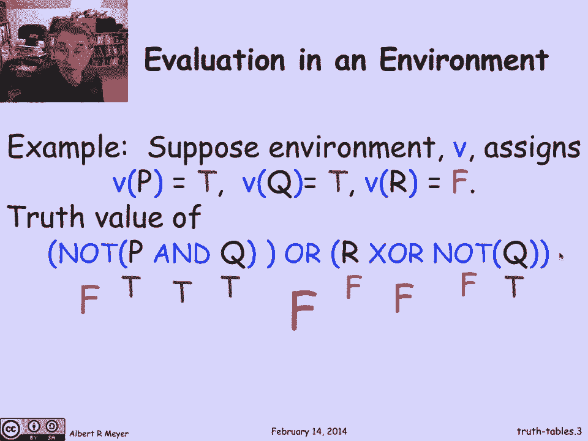
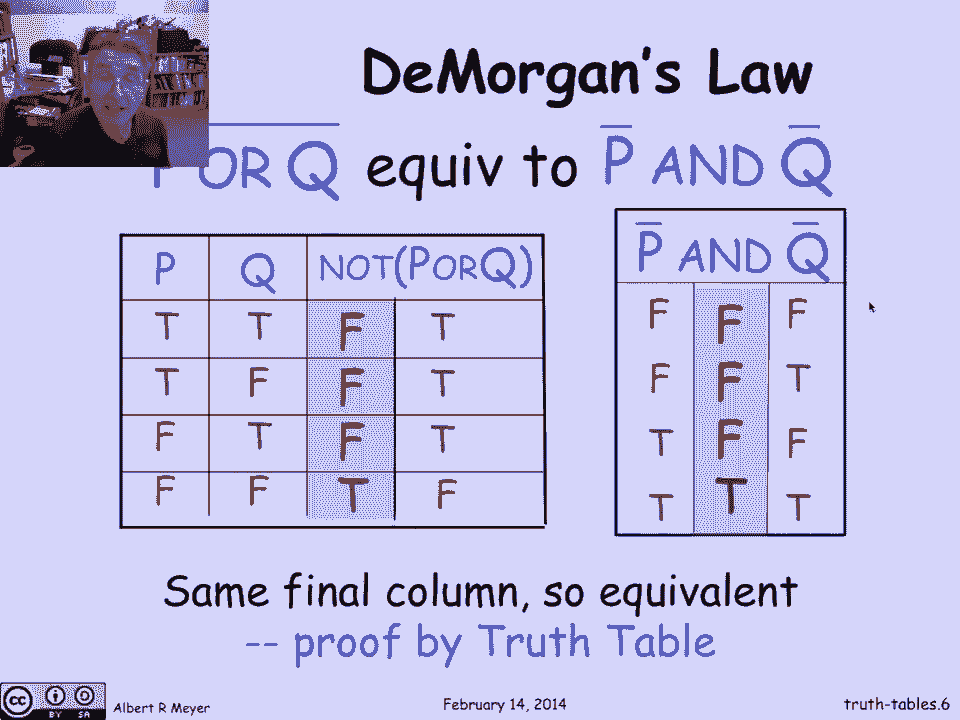
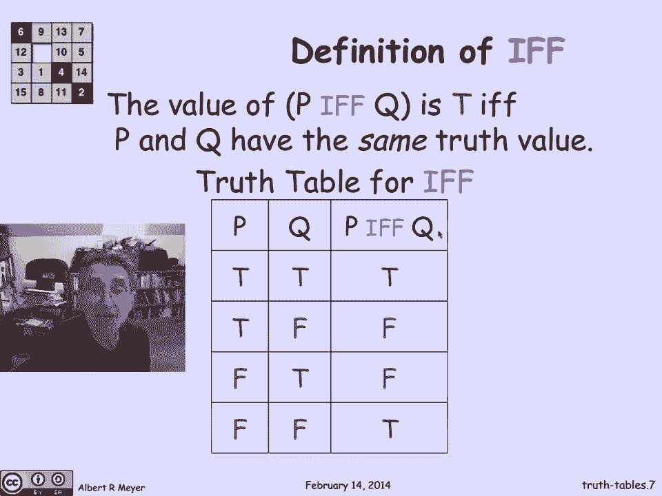
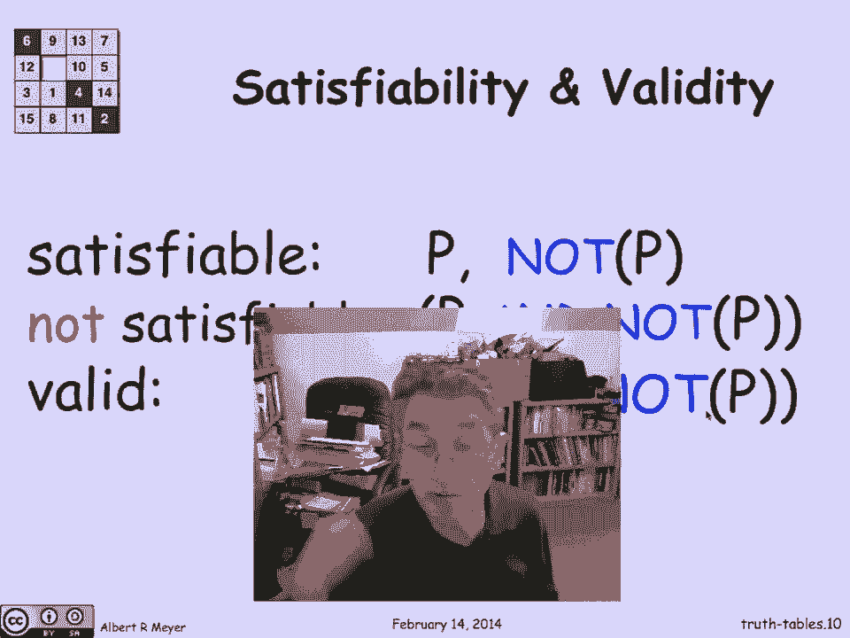
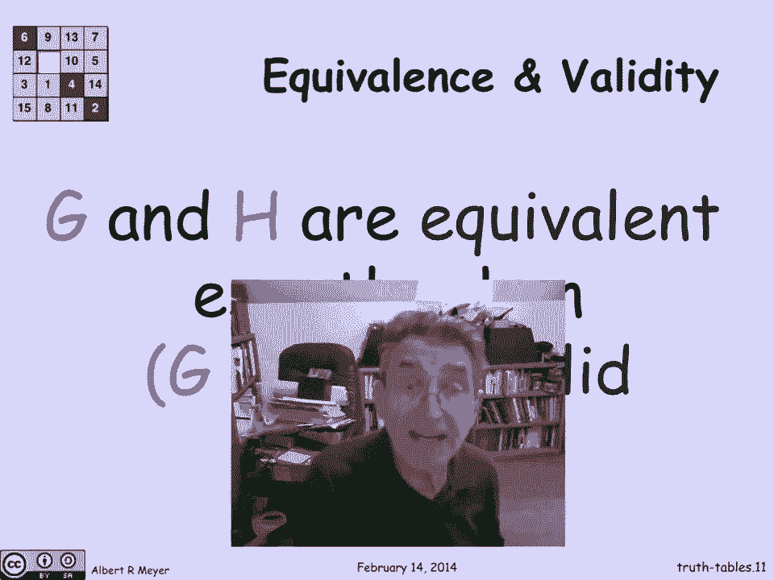
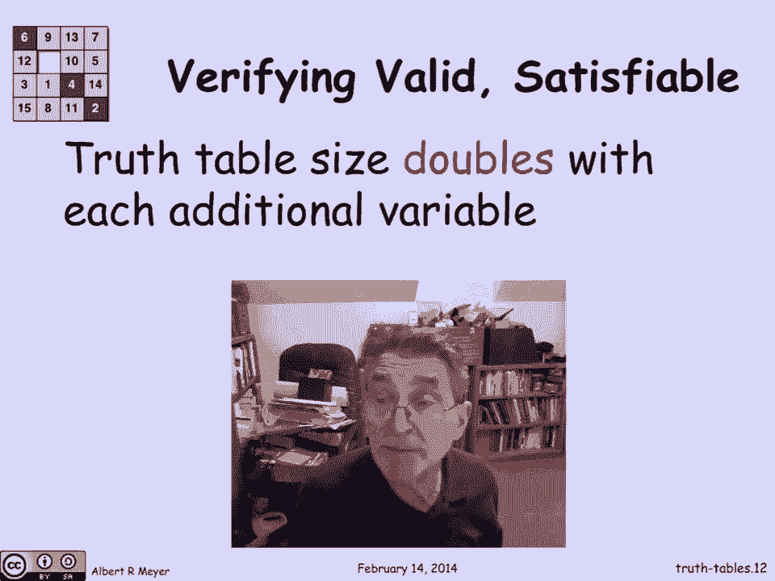
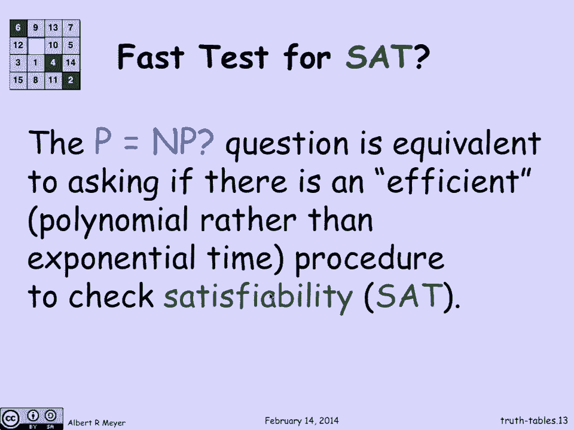
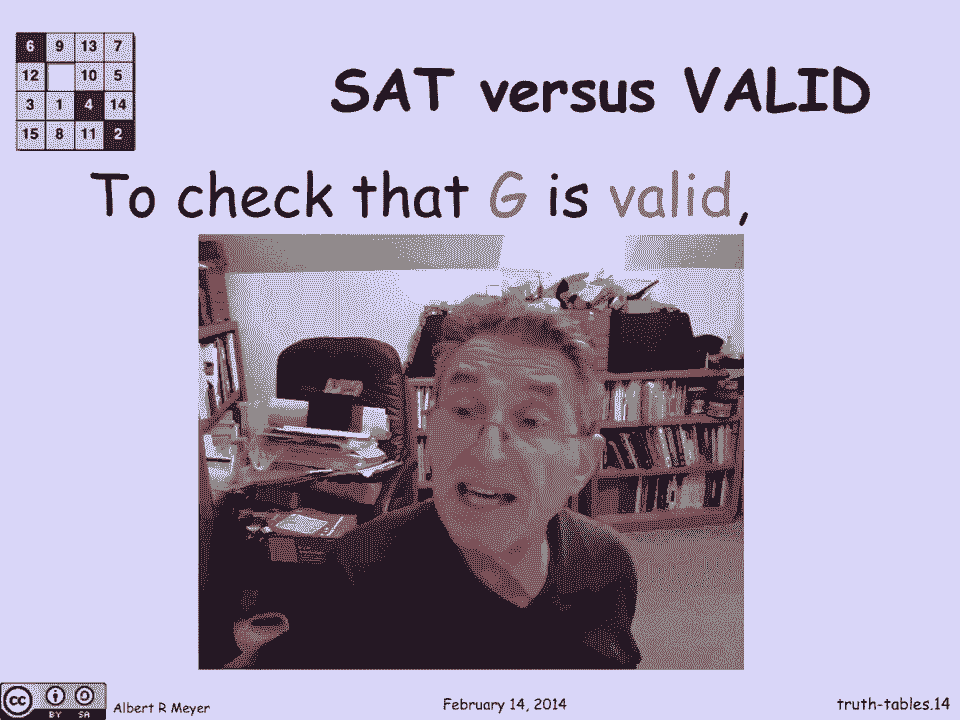
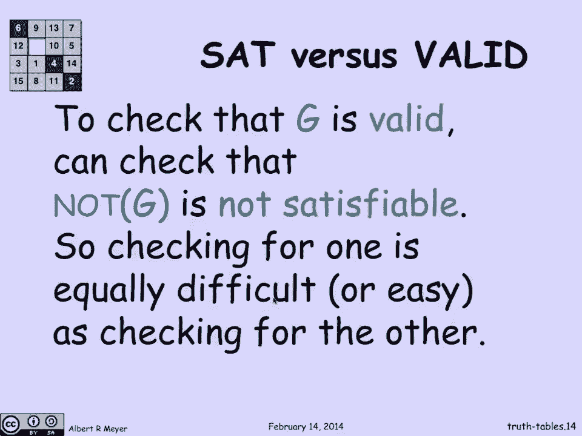

# 【双语字幕+资料下载】MIT 6.042J ｜ 计算机科学的数学基础(2015·完整版) - P11：L1.4.4- Truth Tables - ShowMeAI - BV1o64y1a7gT

just as truth tables provide a simply，direct way to define the meanings of the。

individual propositional connectives or，propositional operators they also。

provide a methodical way to understand，the behavior of formulas and in。

particular whether the two formulas are，equivalent or whether a formula is valid。

meaning that it's always true so let's。

take a look at that to begin with if I'm，thinking about a proposition with a warm。

ela it's a composite one that's built，out of lots of more atomic primitive。

ones then in order to figure out the，value of the whole thing I need to know。

the values of the individual components，so if we think of a formula involving。

P's and Q's and ours that are true false，value propositional variables then I。

need a truth assignment to know the，values of those variables in order to。

know whether or not the formula is true，or false so in computer science jargon。

this process of assigning values to，variables is called an environment。

logicians would call it a truth，assignment so an environment it tells。

you given a variable whether or not it's，true or false let's look at an example。

of three variables P Q and R they're，true/false value and I'm going to tell。

you that this I've got an environment V，in which P is true and Q is true and R。

is false so V of P is teh etcetera and，so I'm thinking of V as a function that。

map's a variable to its value now let's，see how I would use this particular。

environment to figure out the value of，this composite formula whose atomic。

parts are P and Q and R and and and Q，again okay let's take a look at how we。

would go about figuring out the value of，this whole formula given the values of P。

Q it's pretty straightforward but the，methodical way to do it is sort of from。

inside out let's begin by a by attaching，the truth values that were given to。

those particular variables okay now，notice here that I've got both arms of。

the and have been assigned truth values，and they're both true that means I can。

assign true to the conjunct，the end formula and I put I do that by。

putting the tea under that and which is，the principle connective of this sub。

formula now looking back at this queue，I've got it's true which means that not。

of Q is false and so I can put a false，under than not now notice I've got both。

arms of this XOR are defined they're，both false that means that the XOR is。

false because it's only supposed to be，true if exactly one of them is true and。

next I had this true for n that means，that naught of that formula is false and。

now that I have both arms of the or this，one is false and that one is false I can。

conclude that the entire expression is，false，by putting that final truth value under。

the principle connective of the whole，formula so that's actually an easily。

defined recursive process I've described，it from inside out but if you were。

programming it on you would be doing it，recursively top-down in order to。

evaluate the truth value of a formula，given the truth values of its。

constituent variables given an，environment now a basic idea about。

propositional formulas is two of them，are normally if and only if they have。

the same truth values in all，environments in all environments no。

matter what the values of the of the P's，and Q's in our zone no matter what the。

truth value is these two formulas come，out to the same Twitter that's what。

makes them equivalent let's look at an，important example you know as de。

Morgan's law so de Morgan's law says，that if I look at this formula the knot。

of P or Q the cut the negation of P or Q，I claim that that's equivalent to not P。

and not Q and let's check that with the，truth table，okay so here's going to be the truth。

table for the first formula not P or Q，so let's write out the four possible。

values for P and Q these are the four，possible environments one per row and。

there is the formula for the whose value，I'm trying to compute so we do it in the。

usual way I'm not going to repeat the，truth values of P and Q because they're。

given here but I can fill in the values，of the or，because I know the truth tango 4 or and。

I discovered that the first three rows，this sub or sub formulas during the last。

place is false when both of them are，false that means that I know the value。

of the whole formula which is the，negation the not of all those values。

just flips the trues and falses and that，is the final truth values for this not p。

or q in all possible environments let's，do the same thing for not P and not Q。

well this time I'll fill in the values，have not P and not Q because they're not。

just repeated there so they are so that，not P is the flip of the PE column and。

the not Q is the flip of the Q column，and now I can fill in the values of the。

and and of course the end is going to be，true only when they're both true and。

otherwise it's going to be false and，look what I've got the possible truth。

values of the first formula not P or Q，in all possible environments is exactly。

the same as the possible truth values of，not P and not Q in those corresponding。

environments the columns are the same，and that means these two formulas are。

equivalent which is the proof by truth，table we've just examined all possible。

environments and verified that in fact，they get the same truth value this。

brings us to a useful other connective，we haven't talked about yet called if。

and only if so the value of the if and，only if connective P if and only if Q is。

true if and only if P and Q have the，same truth value know this if and only。

if is an English word that you're，supposed to understand what it means and。

that if and only if is an operator on，truth values that we're defining this。

since the English not going to be，confusing between that if and only if an。

S if and only if let's disambiguate by，having the truth table for if and only。

if here it is what it says is that when，both of them are true P if and only if Q。

is true and both of them are false P if，and only if Q is true and otherwise it's。

false you can check that P if and only。

if is true Oh exactly when the，complement of px or Q is true so now we。

come to two crucial properties of，formulas called satis，viability and validity and let's examine。

what those are so a formula is，satisfiable if and only if it's true in。

some environment that is its satisfiable，if there's some way to set the values of。

the variables P and Q to be truth values，in such a way that the formula comes out。

to be true and a related idea is that，our formula is valid it's also called a。

tautology if and only if it's true in，all environments no matter what you set。

the variables to it's gonna come out to，be true let's look at some examples to。

solidify those two concepts so the，formula P all by itself is satisfiable。

because it can be true if P is true but，false，symmetrically not P is also satisfiable。

because it can be true if P is false but，it's not always true it's not valid。

because P might be true in which case，not many will be false to formulas a。

formula it's not satisfying all the，formulas means that there is no truth。

value that makes it true which is the，same as saying that it's always false is。

the formula P and not P it's probably，the simplest not satisfiable formula or。

unsatisfiable formula so this is clearly，false because either P or not P has got。

to be false in the end well then we'll，definitely come out to be false there。

was no value of 4p that makes this，formula true it's unsatisfiable a valid。

formula actually bite the Morgan's law，applied to the P and not P is P or not P。

is gonna be valid because no matter what，truth value P has it comes out to be。

true that is one of P and not P is true，and therefore the or is gonna get at。

least one true exactly one true really，and gonna come out to be true so this is。

valid now we can connect up the pieces，that we've just set up of related。

relating validity and equivalence two，formulas GNH are equivalent is the same。

as saying that g if and only if h is，valid so g if and only if h comes out to。

be true when g and h have the same truth，value，and G&H are equivalent says that they do。

have the same truth value no matter what，no matter what the environment is so。

that's the same as saying that if G and，H are equivalent no matter what the。

environment is G if and only if H comes，out to be true，so if G and H are equivalent G if and。

only if H is valid and the converse。

argument works the same way a very，important problem that comes up in。

multiple ways and we're going to examine，some of them later is the problem of。

whether or not a formula is valid，checking that or proving that it's valid。

and checking whether or not a formula is，satisfiable now there's a simple way to。

do that the truth table tells it to you，if you want to know whether the formula。

is satisfiable you just look at its，truth table try every possible。

environment and see whether one of the，meals the value true the problem with。

that approach which theoretically is，sound like pragmatically the truth table。

size doubles with each additional，variable so with two variables you've。

got four rows with three variables you，got eight roles with four variables。

you've got sixteen rows and this very。

rapidly gets out of hand once the number，of variables gets to be moderate-sized。

this is exponential growth it's doubling，each time you add a variable so really。

when you start having hundreds of，variables truth tables are out of the。

question you just can't write them down，they're too big and in fact in modern。

digital circuits when you think back，about how we designed the adder if you。

look at what's going on and all those，different wires corresponding to。

different truth out for different，variables there are millions of those in。

a typical modern digital circuit so，truth table approach is just not going。

one of the central problems in，theoretical computer science is the。

question of whether or not there is a，way to test for Sat that's more。

efficient than this impossible way of，trying to come up with a truth table。

that's too big to fit in the universe，when there are hundreds and thousands of。

variables so we're interested in the，question isn't there some other way to。

check a formula for satisfiability then，exhaustively trying to generate it so。

it's whole truth table to see if some，row yields。

this is the abstract version of the P，equals NP problem so we've talked about。

this before P equals NP question mark is，the considered to be the most important。

open problem in theoretical computer，science in the theory of computation and。

it's simply saying is there some fast or，efficient way to solve to tell whether。

or not a formula is satisfiable that's，more efficient than the truth table。

approach efficiency has a technical，definition which is that the number of，steps in rows。

much less than exponentially with the，number of variables let's say it grows。

polynomial like a quadratic or a cubic，but you're trying to beat exponential。

growth which is what ruins things，quickly and this is an open problem no。

one knows if there is some fast way to。

check for satisfiability or saat that's，the sad problem by the way we're very。

closely related to statins validity，because if I wanted to know whether a。

formula G is valid，well valine means that it's always true，that means its complement not G is。

always false which is the same as saying。

its complement is not satisfiable so to，check that G is valid all I need to do。

is check that not G is satisfiable and，of it it's not satisfiable and，vice-versa。

not G is not satisfiable if and only if，G is valid so the point is that sat and。

valid stand and fall together if you had，a fast way to do one you would very。

quickly get a fast way to do the other，one so checking for one is just as。

difficult as checking for the other and，we're going to examine in subsequent。

