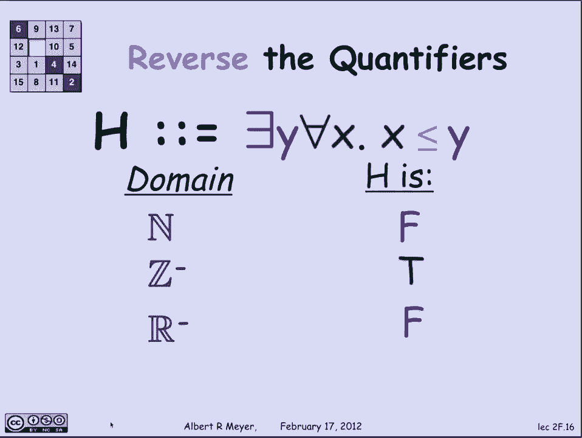

# 【双语字幕+资料下载】MIT 6.042J ｜ 计算机科学的数学基础(2015·完整版) - P12：L1.5.1- Predicate Logic 1 - ShowMeAI - BV1o64y1a7gT

谓词逻辑是数学语言中的一个基本概念，也是一个独立的话题，特别是，我现在要谈谈两个所谓量词的概念，因为所有这些都是颠倒的，存在的，那是落后的，e，那么什么是谓词呢，基本上谓词是命题，除了它有变量。

这里有一个例子，x y的p是依赖于x和y的谓词，假设它被定义为x加2等于y，为了弄清楚谓词是否为真，我需要知道变量的值，在这种情况下x和y，所以如果我告诉你x是1，Y是三，猜猜一和三的p是多少。

x和y的p，当x为1时，y是3是真的，因为事实上一加二等于三，如果我告诉你x是1，y是4，那么因为一加二不等于四，1和4的p是假的，另一方面，因为1和4的p是假的，这使得1和4的p不是真的。

那是容易的部分，现在，量词被读取为全部并存在，但他们控制着一个变量，我为所有X写，它的意思是，所以我写反了，AX和我读了所有的X，我很习惯读它，我忘了我需要从字面上和反向阅读符号。

e y被读为存在一些y，所以让我们看看这将如何工作，嗯，颠倒的A对所有的行为就像一个，并理解这意味着什么，让我们看看这个例子，让我们把变量的范围设为乘法器上的乘法器，在6-0-4-2中，本学期。

其中约有三十个，数着评分员，让我们定义一个依赖于变量s的谓词，称为s的p，上面写着S被泵入大约6-0-4-2，他们对成为员工充满热情，好的，如果我告诉你，对所有的人来说，这和说，德鲁的P是真的。

彼得的P是真的，克沙夫的P是真的，一大堆更多的米凯拉，会有两个九，如果有三十个工作人员，同样，向后e的存在就像一个，或者如果我告诉你T现在在6042五线谱上，就像S一样，我把t的b写成t的谓词。

这意味着工作人员T T之前拿了6-0-4-2，那么如果我告诉你有一个T B的T，我告诉你的是德鲁的B，要么是德鲁以前拿的，还是彼得以前拿的，或者克沙夫以前吃过，还是米凯拉之前拿的，这种说法是正确的。

因为之前有几个工作人员从我这里拿走了6-0-4-2，我喜欢认为，上一个每个人都对员工充满激情的说法是真的。

虽然我不能保证。

所以让我们用存在量词做一点练习，嗯，所以让我们同意变量x和y的范围，对于本例中的非负整数，让我们考虑下面关于y的谓词，它说有一些x小于y，存在一个x小于y的x，让我们看看会发生什么，3的q表示有一个x。

使x小于三，嗯，这样一个X的例子是一个，所以这意味着有一个小于三的x，因为一个不是，这使得Q为真，再来一口井的q怎么样，有一个x是非负整数，即小于1的零，因此1的q为真，另一方面，零的q是假的。

因为没有小于零的非负整数，嗯，所以你不能给x赋值，这是一个非负整数，将使它小于零，好的，那个还不错，我希望，让我们看看同一个带有通用量词的例子，这一次，我们会说y的r意味着对于每一个x x小于y，嗯。

1的r是假的，原因是五是一个反例，五不少于一，所以不是每个x都小于1，八的r是假的，因为十二不亚于八，因此并不是每个x都小于8，嗯，是谷歌的，十到百分之一是假的，因为如果你让X成为谷歌，它不亚于谷歌。

所以这是一个事实的例子，这并不适用所有人，X是零件，一开始容易让人困惑的是，当你开始混淆量词时会发生什么，所以让我们看一个直观的例子，首先，这可能会帮助你记住当你有一个a后跟一个e时会发生什么。

然后我们看一个e后面跟着一个a，所以假设我看看这个声明，这次我要告诉你们，v的范围是指可能存在的计算机病毒，不是生物病毒，d幅度超过，我想看看谓词，它说每个病毒，有一种防御，使D免受，v。

这种防御对那种病毒很好，每种病毒我都有防御，例如，顺便说一句，这些是过时的病毒，但那是幻灯片制作的时候，所以对抗我的厄运病毒，你可以用一个防守者，微软的捍卫者，对抗我爱你病毒，你可以用诺顿。

对抗Bois病毒，你可以用区域警报，嗯，那是我们想要的吗？它很贵，这意味着对于每一种不同的病毒，我需要一个不同的辩护，我得在软件上花一大笔钱，这不是我们想要的，所以这就是每一种病毒，有一种辩护。

但是量词的顺序不对，让我们把它们倒过来，假设我告诉你有一种辩护，那对所有病毒都有好处，对每一种病毒都有一种防御，d防止v，比如说，嗯，如果D是麻省理工学院病毒扫描，那就只能，那就太好了。

D确实能抵御所有病毒，对每一次攻击都有一种防御，这就是我们想要的，因为它便宜得多，所有的权利，让我们开始看一个具体的数学例子，嗯，我希望病毒的前奏，将帮助您破译量词的行为，嗯，让我们看看这个，这个谓词。

现在，对不起，这是一个命题，它真的不依赖于x和y的值，它在问所有可能的x和所有可能的y，为了弄清楚像g这样的命题是否为真，是否有一个，实际上我需要知道x和y的范围是多少，因为你会看到g是否为真。

将取决于这一点，在x和y范围内的论域，我们假设定义域是非负整数，现在g的意思是如果你给我一个非负整数，有一个大于x的y，换句话说，我可以找到另一个比x大的非负整数，那当然是真的。

有一个简单的方法可以找到Y，给我X，让我们选择y为x加一或x加二，但我不一定需要食谱，只要在某个地方有一个比x大的y，这是真的，所以g为真，当论域为非负整数时，另一方面，当我改变话语的领域。

不同的事情可能会发生，所以让我们看看负整数，整数小于零，然后问，对于每一个x，有一个大于x的y，对他们中的许多人来说，如果x是-3，就有，那么-2比x大，如果x是-2，那么负一大于x，但我有麻烦了。

如果x是-1，没有比x大的负数，所以g是假的，当论域为负整数时，嗯，我们再转移一下，在这里的重点是，我们都在看交替量词，我们明白，或者有量词的命题的真值，关键取决于话语的领域。

如果我们让话语的领域是负实相，那么这意味着每一个负面的卷轴，有一个更大的负卷轴，这当然是对的，因为如果你给我一个负的r，那么r/2，因为它的负值实际上比r大，如果r不是正数，则为正，果不其然。

在这种情况下g是真的，所有权利，让我们颠倒量词，看看会发生什么--这是值得思考的，所以让我们称h为断言，对于每一个y，很抱歉有一个Y，使得对于每x x小于y，所以直觉上这是在说，有一个最大的元素。

Y比一切都大，嗯，如果定义域是非负整数，那么h是假的，因为没有最大的非负整数，如果是负整数，它是假的，因为没有最大的负整数，如果是负实数，它是假的，因为没有最大的负面真实，但事实是。

这件事在任何情况下都是假的，小于在其中表现为它应该表现的话语领域，因为任何Y都不会比它自己大，所以你不可能找到一个最大的Y，它必须比自己大，这在所有这些明智的领域都是错误的，在那里。

行为不如我们预期的那样，所以让我们让这个稍微有趣一点，让y小于，或者让它小于，a小于，或等于，所以现在实际上有可能有一个最大的元素，大于或等于一切的，包括它自己，如果你好好看看这些领域。

没有任何最大的非负整数，因为对于任何XX加1都更大，没有什么最大的负面影响，对于任何大于2的r r的真实相同的推理会更大，但是对于负整数，有一个最大的Y，就是减一。

