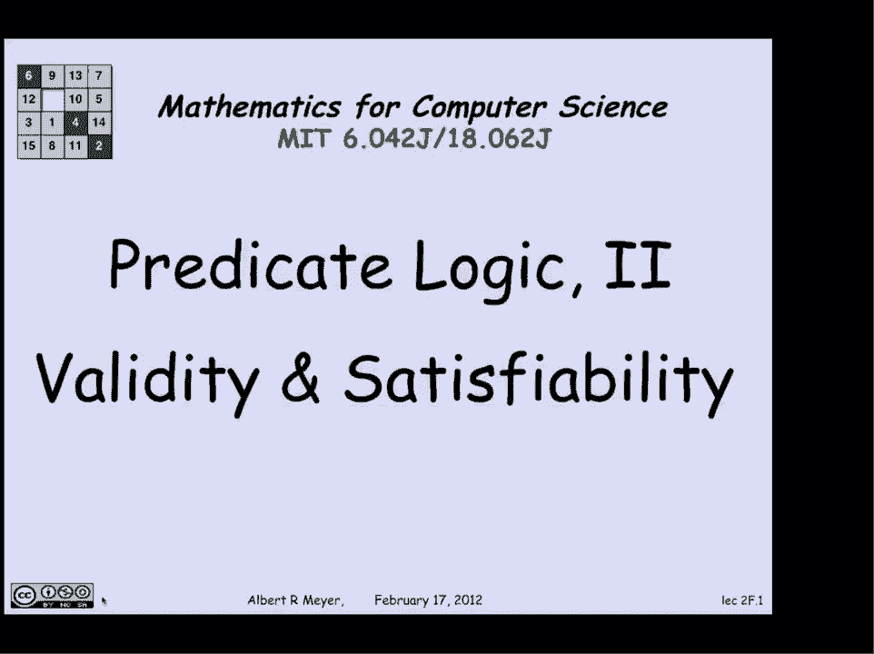
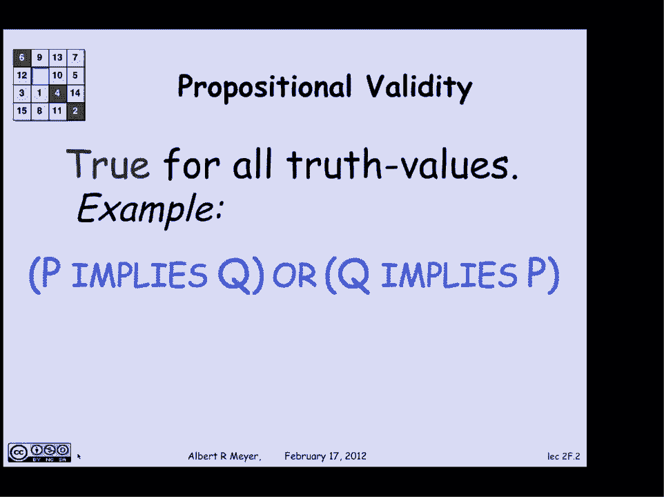
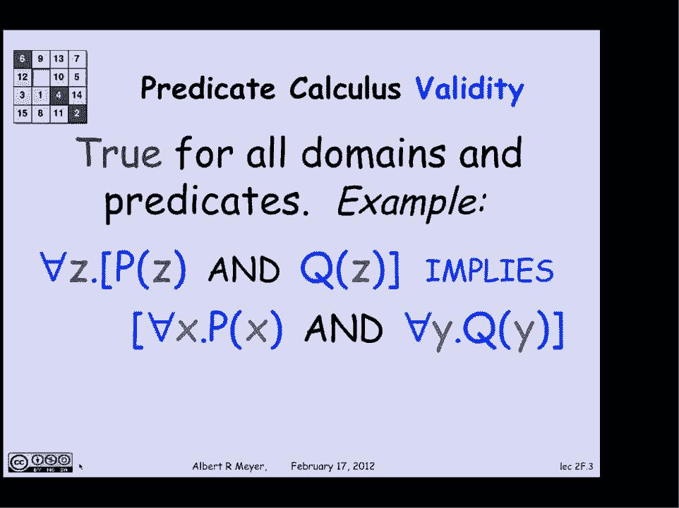
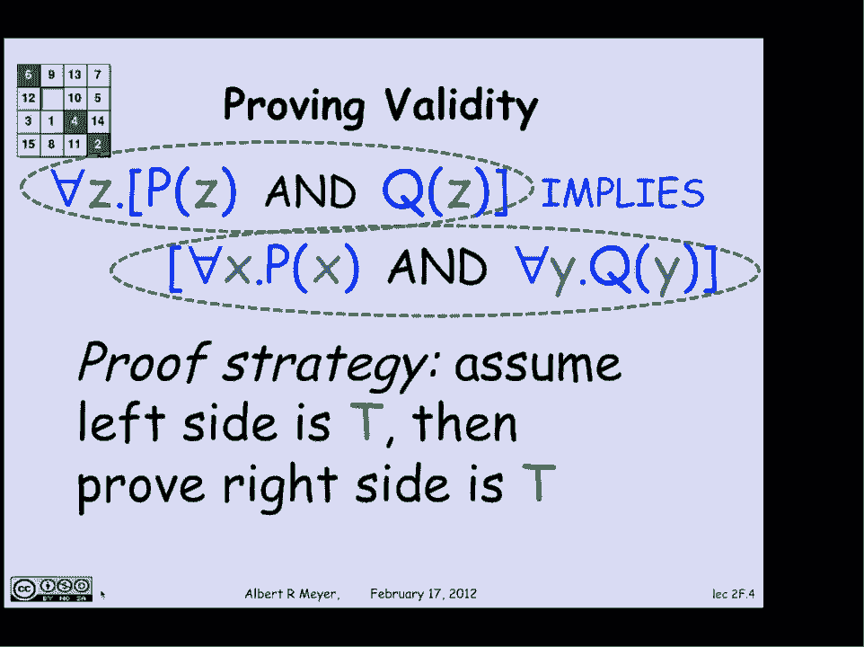
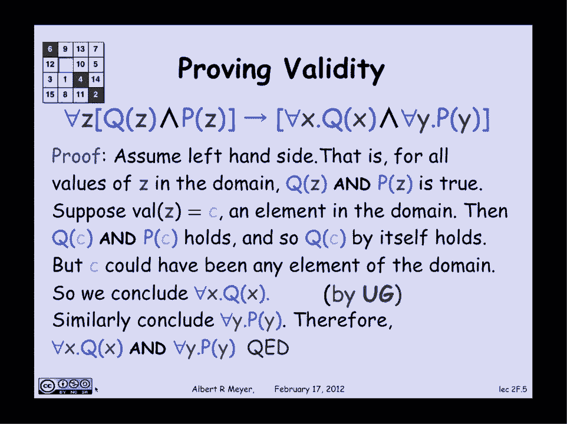
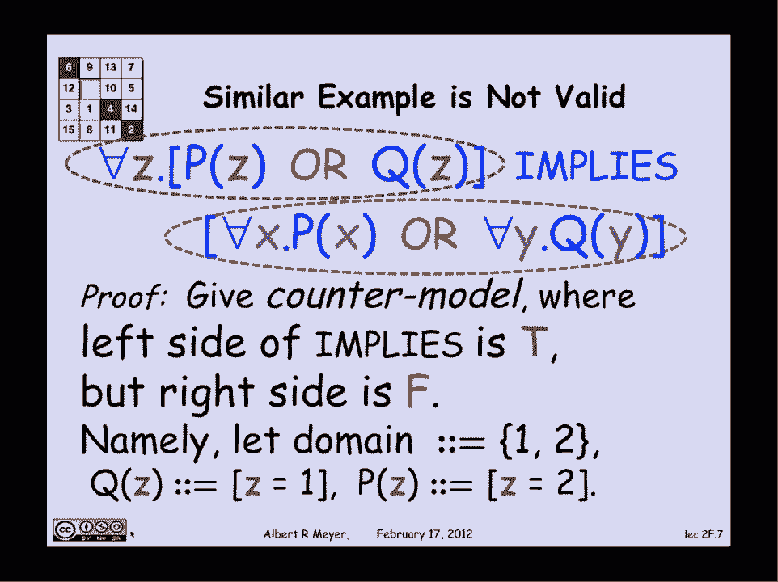
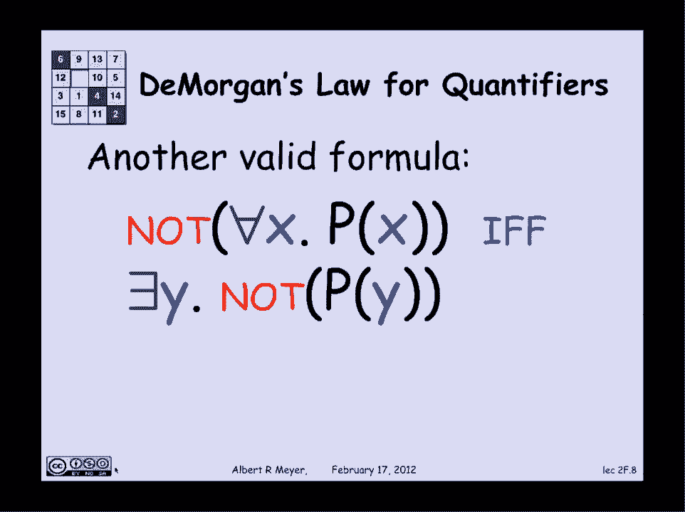

# 【双语字幕+资料下载】MIT 6.042J ｜ 计算机科学的数学基础(2015·完整版) - P13：L1.5.2- Predicate Logic 2 - ShowMeAI - BV1o64y1a7gT

所以现在，我们将讨论有效性和可满足性的概念，它们对谓词演算的上下文有一些额外的兴趣。

所以让我们记住命题的有效性，如果你有一个命题公式，变量的真值在真和假之间，那么当一个公式对所有可能的真值都为真时，它是有效的，这里有一个p暗示q或q暗示p的例子，你可以检查P和Q值的四种可能环境。

p和q的真假值，这或将证明是真的。

有一堆东西我需要给予价值，比真值更复杂的，特别是，我会说一个谓词演算公式是有效的，当它对所有可能的话语领域都是真的，变量在技术上的范围，它必须是非空的，但除此之外，所有可能的领域，每当公式中提到谓词时。

为了知道公式是真是假，我需要知道那个谓词是什么意思，所以如果一个公式为真，它就是有效的，不管谓词是什么意思，让我们看一个具体的例子来了解这一点，这里有一个谓词演算的有效公式，它提到了谓词p和q。

它是命题的形式，因为它在说每一个可能的Z，在定义域中，每一个可能的x和每一个可能的y，我们唯一需要知道的是，要理解这个公式，要弄清楚它是否为真，x的域是什么，y和z范围超过，P和Q到底是什么意思，嗯。

我想非正式地争论，让我们一起看看这说明了什么，它的意思是假设对于域中的所有东西，z的性质p和q的性质p，换句话说，域中的所有东西都有性质p和性质q，这当然意味着域中的所有东西都有属性p。

因为它们两者都有，域中的所有东西都有属性q，因为任何事物都有这两种性质，所以当你这么说的时候，这是一个基本的逻辑事实，这并不取决于P和Q的意思，或者域是什么，这只是一个关于意义本质的事实。

对于所有通用量词和连接词，它暗示了，嗯，这就是我们如何计算出这是有效的，让我再详细说一遍，我刚才非正式地说的话，嗯，试着更准确更清楚地说明一个原因。

为什么这个公式有效，所以假设我想证明这个公式是有效的，这是一种暗示，所以那里的证明策略，又写了一遍，证明策略是，我假设，如果部分，暗示或假设的左手边为真，也就是对于每一个z的p和q的z保持。

然后我要试着证明，基于结果成立，即对于所有x的x p和所有y的右手边，y的q保持。

好的，我怎样才能做好那件事，下面是为了适应这条线而写的公式，用简洁的数学符号，上下颠倒的V表示和箭头表示，我们想证明这是有效性，这是有效的，再仔细一点，正如我所说的策略是假设左手边保持得很好。

左手边写的是什么？它说对于每一个z q的z保持和p的z保持，这意味着对于为z赋值的每一个可能的环境，z的q和p都为真，假设环境将值C赋给Z的值，其中c是域的某个元素，那么这意味着在这种环境下。

z的q和z的p为真，这意味着c的q和c的p，但是c中的q成立，所以c中的q肯定成立，和C的P保持，所以c{\displaystyle c}的q{\displaystyle q}本身就包含了所有。

所以现在我们处于一个有趣的情况，因为我们刚刚证明了Q的C成立，我们对C一无所知，也一无所知，除了它是域的一个元素，c可以是域的任何元素，我们设法证明了C的Q成立，因此，事实上，我们已经证明了。

对于每一个x，q，x成立，现在这一步说，我对给定元素的q证明了它，不对给定的元素做任何假设，除了它在域中，因此，我可以得出结论，它对所有域元素都成立，非常自然、合理和可理解的规则。

这是逻辑的一个基本公理，叫做ug泛化，我们一会儿再来讨论这个问题，无论如何，我刚刚证明了对于所有的x q都成立，通过一个完全对称的论点，并且证明了对x的所有x q和y的所有y p，清楚地和持有。

我刚刚证明了这个暗示的右手边是正确的，考虑到左手边现在是真的，称之为证明有效性，让我立即澄清，这是不公平的称为证明，因为这里的游戏规则真的很模糊，这个定理，你可以说你可以读它，说通用量化分布在，和。

这些基本有效的公式之一，这是如此基本和易懂，很难看出你可以假设什么更基本的事情，当你证明它的时候，这个证明真的只不过是把一个，和符号翻译成英语，说我用的是普通的直觉规则，并将其用于证明。

所以这是一个很好的方法来思考公式，去了解它，但说这是证据是不对的，因为我们还不清楚证明规则是什么，有了这种非常基本的有效事实，这就变成了一个相当技术性的问题来决定什么是证明，什么是公平的假设。

什么是公平的不假设，把这作为一个公理实际上是完全合理的，然后证明其他事情作为它的结果。

不管怎样，发生了什么，出于文化原因，让我们来看看这个，我们永远不会要求你用它做任何事情，但是普遍的概括规则，ug在逻辑上是这样陈述的，作为一个演绎规则，嗯，吧台那边的东西意味着如果你证明了这一点。

那么你就可以得出结论，你已经证明了酒吧下面的东西，所以这是在说，如果你证明了常数，那么你就可以证明你可以推导出，对于x的每一个x p成立，这是假设c不出现在谓词p的任何其他部分，除了呃，你明确地谈论它。

嗯，目前很难更准确地说明这一点，别担心，但这个想法是，你不应该假设任何关于c的东西，除了它在域中，它有性质p，然后你可以得出结论，所有东西都有性质p，所以让我们看一个类似的例子，在有可能证明某事的地方。

也就是说，我可以证明某件事是无效的，所以这里有一个类似的公式，这个说对于每一个Z，如果z的p成立，或z的q保持，那么对于每x，x的p保持，或者对每一个Y，y的q保持，我们要展示的这个是无效的。

让我们考虑一下，它说的是，嗯，如果所有东西都有属性p或属性q，这意味着所有东西都有性质p或所有东西都有性质q，嗯，当你这么说的时候，显然不是这样，但让我们再精确一点，把它布局出来。

我要做的是让你相信它是无效的，通过给你一个计数器模型，在那里我做，我选择一种解释，我选择一个语篇和谓词的领域，Q、P和Q在那个域上的意思，这使得这个含义的左手边为真，然后我要告诉你右手边不是真的。

这意味着在那个域中，通过对p和q的解释，这个暗示失败了，所以它是无效的，所以我需要使左手边为真，右手边为假，嗯，我要选择论域，是使这是假的最简单的一个，那就让它，话语的领域只是数字一和数字二。

设z的q是谓词，表示z是1，z的p是说z是2的谓词，左手边是真的吗，是啊，是啊，领域里唯一的东西是一和二，所以很明显，域中的一切都是一个或两个，所以前件是真的，另一方面，域中的一切，它满足吗。

p是域中等于2的一切，没有人不等于两个，那么域中的所有东西都等于一呢，对于所有y的y q都不成立，这是真的吗，二在域中，它不等于一个，所以我们找到了我们想要的计数器模型，这使得暗示的左手边为真。

而右手边暗示着假。

让我以一个有效公式的例子来结束，我们可以讨论，这是适用于量词的德摩尔定律的版本，记得德摩尔定律说过，P或Q的否定与不P和不Q是一样的，并记住普遍量化与存在量化之间的联系，或者事实证明，通过同样的推理。

德摩根定律是这样出来的，上面说，嗯，如果不是所有东西都有性质p，那是可能的，当且仅当存在没有性质p的东西，这就是德摩尔定律，这是另一个你可以当作公理的东西，或者你可以试试这些挥舞的证明。

但我想我已经说得足够多了，可以给你们举另一个有趣的有效公式的例子。

