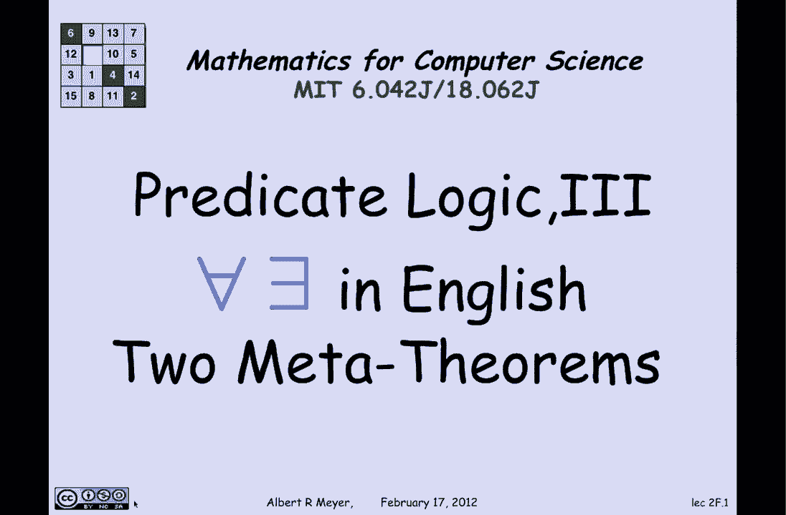
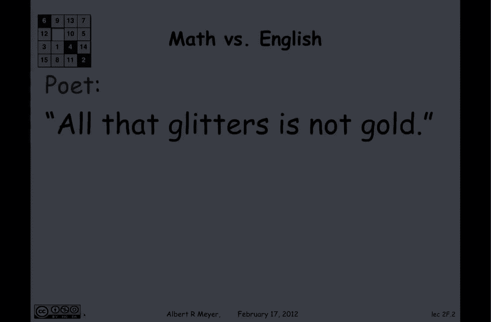
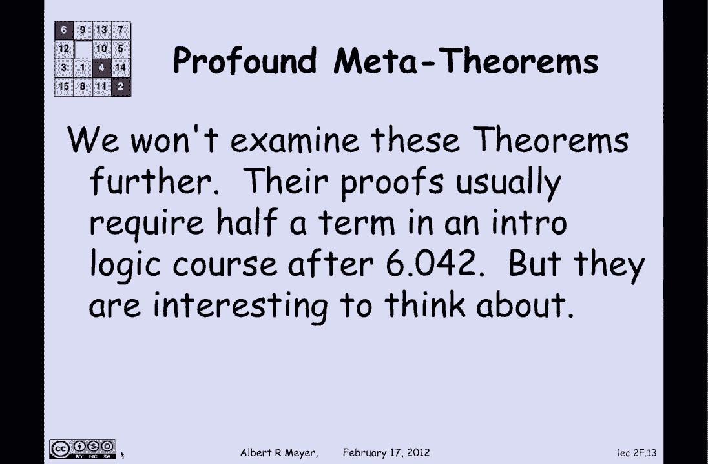

# 【双语字幕+资料下载】MIT 6.042J ｜ 计算机科学的数学基础(2015·完整版) - P14：L1.5.4- Predicate Logic 3 - ShowMeAI - BV1o64y1a7gT

in this final segment on predicate logic，there are two issues that I'm going to。

talk about the first is some problems，with translating AE，quantifiers and ei quantifiers into。

English rather from English into logic，we've seen examples in class that。

English is ambiguous and I want to show，you two there I think interesting and。

provocative just as a warning that the，translation is not always routine and。

then the second topic is an optional one，just to kind of make some comments about。

the amazing results in meta mathematics，the mathematics of mathematics or more。

precisely the the mathematics of，mathematical logic and two fundamental。

theorems about properties of predicate，calculus which go beyond this class and。

are optional I would suggest it's worth，listening to the AE in English example。

and if you want to skip the short。

discussion of the meta theorems that's，fine because it's never going to come up。

again in this class okay so let's look，at this phrase in English where the poet。

says all that glitters is not gold well，a literal translation of that would be。

that if we let G be glitters and I can't，use G again so we'll say au is gold。

then this translated literally would say，for every X G of X if X is gold implies。

that not gold of X all right so is that，a sensible translation well it's clearly。

false because gold glitters like gold，and you can't say that gold is not gold。

so this is not what's meant it's not a，good translation it doesn't make sense。

well what is meant well when the poet，says all that glitters is not gold he's。

really leaving out a key word to be，understood from context all that。

glitters is not necessarily gold he's，using poetic，license you're supposed to fill in and。

understand this meaning and the proper，translation would be that it is not true。

that everything that's gold but，everything that glitters is gold it is。

not the case that for all X if X，glitters then X is gold so it's just an。

example where a literal translation，without thinking about what the sentence。

means and what the the poet who，articulated the sentence intended will。

get you something that's nonsense，it's one of the problems with machine。

translation from natural language into，precise formal language okay let's look。

at another example that of the same kind，the poet says this time there is a。

season to every purpose under heaven，this is a variant of a biblical phrase，so what does it mean。

well the literal translation would be，there exists an S that's a season such。

that for every P that's a purpose S is，for P well that from the way that。

quantifies work means that there's some，season say summer that's supposed to be。

good for all purposes well that's not，right because summer is not good for。

snow shoveling and if your purpose is to，shovel snow then summer will not do for。

you as a season so even though it's，phrased there is a season to every。

purpose under heaven it's not the case，that the intended translation is there。

is a season for every purpose in fact，the poet really means to flip the。

quantifiers which is what's shown here，we're going to switch him around so that。

we are really saying for every purpose，there is a season such that s is for P。

for snow shoveling winters good for，planting spring is good for leaf。

watching fall is good and that is in，fact the intended translation here。

although I remind you that there's a，famous historical man Sir Thomas Moore。

who was described as a man for all，seasons，that would be a case where there was man。

a one man who was good for all seasons，he was a polymath a writer a cleric and。

the Chancellor of England for many years，until he had a falling out with Henry，the eighth。

which served him ill okay that's the end，of those two examples whose point is。

just to warn you that translation from，English from into math is not something。

that can be done in a mindless，mechanical way sometimes the quantifiers。

really are meant to go the other way，from the way that they literally appear。

now we're gonna shift to another topic，which is just too profound theorems from。

mathematical logic about the properties，of predicate calculus that are worth。

knowing about and describe sort of the，power and limits of logic so these are。

called meta theorems because they're，theorems about theorems they're theorems。

about systems for proving theorems and，that phrase meta means you know going up。

a level alright so the first theorem is，a good-news theorem it says that if you。

want to be able to prove every valid，assertion of predicate calculus there。

really is only a few axioms and rules，that will do the job as a matter of fact。

the rules that you need are just rules，that you've seen already namely modus。

ponens and universal generalization and，a few valid axioms which we've seen。

already so let's go back a little bit so，there's a little mark here that says。

that in practice if you're really going，to try to do automatic theorem proving。

you need much more than this minimal，system but it's intellectually。

interesting and satisfying that a fairly，economical set of axioms and inference。

rules are in theory sufficient to prove，every logically valid sentence this is。

known as girdle's completeness theorem，girdle was the great，mathematician German mathematician who。

spent the latter part of his life at the，Institute for Advanced Study in。

Princeton as an émigré and he has two，major theorems at least that are results。

of his one is the completeness theorem，this one there's an incompleteness。

theorem which maybe we'll talk about in，a few lectures but for now the good news。

is you can prove everything that's valid，using a few simple rules okay。

now the bad news is that there's no way，to tell whether your attempt to find a。

proof for something that you think is，valid is going to succeed there's no way。

to test whether or not a quantified，formula is valid this is in contrast to。

the case of propositional formulas where，you can do with the truth table truth。

table may blow up so it becomes，pragmatically infeasible but at least。

theoretically there's an exhaustive，search that will enable you to figure。

out whether a propositional formula is，valid that's not the case with predicate。

calculus predicate calculus is，undecidable meaning that it's logically。

impossible to write a computer program，that will take an arbitrary predicate。

calculus formula in and print out true，or false depending on whether or not。

it's valid can't be done now as I said，we're not going to go further into these。

theorems they these are the kind of，basic results that would be proved in an。

introductory course in logic usually，they take about a half a term to do。

maybe a little less and it goes beyond，our course you can look over in the math。

department for introductory courses in，logic and you will learn about these two。

