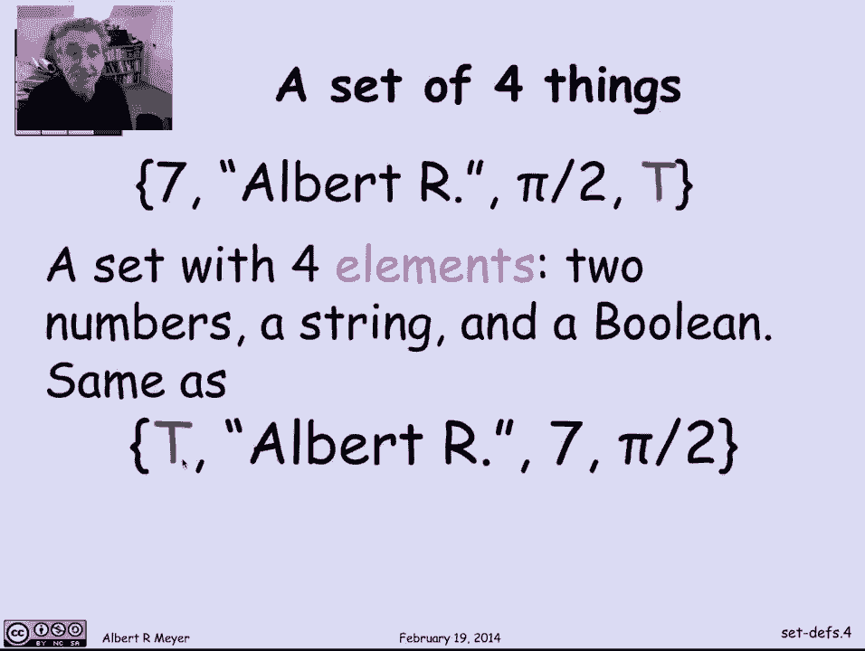
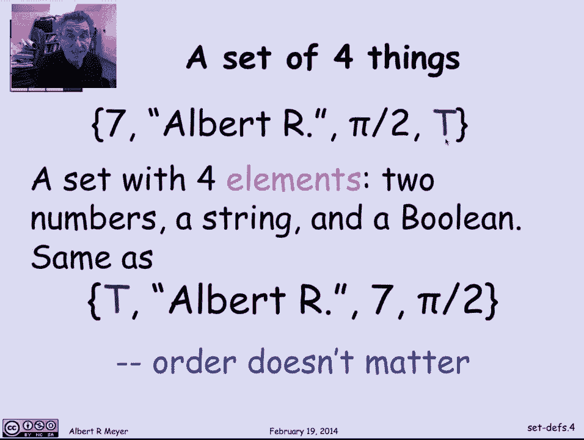

# 【双语字幕+资料下载】MIT 6.042J ｜ 计算机科学的数学基础(2015·完整版) - P15：L1.6.1- Sets Definitions - ShowMeAI - BV1o64y1a7gT

we're going to look at the most，fundamental of all mathematical data。

types namely sets and let's begin with。

the definitions so informally a set is a，collection of mathematical objects and。

the idea is that you treat the。

collection of objects as one new object，and that's a working definition but of。

course it really might help a little bit，but it's a circular definition this is。

not math yet because I haven't defined，what a collection is in a collection is。

no clearer or easier to define than a，set is so let's try to work up the idea。

of of sets by looking at some examples，so we've already talked about some。

familiar ones there's the real numbers，for which we had this symbol are in a。

special font and the complex numbers C，and the integers Z and we might have。

mentioned and you might have seen，already the idea of the empty set for。

which we use this symbol that looks like。

a 0 with a line through it let's look at。

an example to pin things down let's look，at this set of 4 things namely it's got。

two numbers PI over 2 and 7 a character，string in quotes Albert R and the。

boolean value true so those are the four，different things in it they're of mixed。

type and you might not like to have a，mixed type like this in a programming。

language but mathematicians don't worry，about such things very much readily。

anyway the first observation is that，though the order in which these elements。

are listed doesn't matter this set where，the braces indicates that it's a set of。

these things is the same if I listed T，first then the string and the two。

numbers last there is no notion of order，in a set now to a computer scientist。

this is a little unnatural the most，natural thing to be would be to define a。

sequence of things like the the sequence，that began with 7 then had the character。

string then had the number then had the，boolean and you can get by with working。

with working with lists of things as，long as they're finite but they very。

quickly get out of hand when you have to，talk about say a set of lists then it's。

not clear how to make a list out of。

those and you wind up needing sets again，so sets in fact are an unavoidable kind。

of idea so another basic thing to，understand about the notion of a set is。

that an element is either in a set or，not in a set like so if I write down 7。

PI over to 7 this is the same，description of the same set that a 7 PI。

over 2 I'm just telling you the same，thing twice here that 7 is in the set。

and the 7 is in the set again so no，notion of being in the set more than。

once now it sometimes technically you，want to add a notion of so-called multi。

sets in which elements can be in a set a，certain number of times an integer。

number of times but there's no real need，for that it's a secondary idea and from。

our point of view you're in or out of a。

set if you repeat elements it's the same，as mentioning them once so the most。

fundamental feature of a set is what's，in it and for that there's a special。

notation so we'll say that X is a member，of a where a is a set and use this。

epsilon symbol to indicate membership，it's red X as a member of a so for。

example PI over 2 is a member of that，set that we saw before that had PI over。

2 in it 14 over 2 is also a member that，said because 14 over 2 is just another。

description of 7 when I write 7 here I，don't mean the character 7 I mean the。

number 7 and so 14 over 2 is this，description of the same number it's in。

that set on the other hand PI over 3 is，a number that's simply not in that set。

so I'm using the epsilon with a vertical，bar through it or some kind of a line。

through it to mean not a member of，number ship is so basic that there's a。

lot of different ways to say it besides，using the membership symbol X is a。

member of a you can sometimes say X is，an element of a or X is in a as well as。

X is a member of a they're all synonyms，so for example 7 is a member of。

the integer Z is our symbol for the，integers 2/3 is not a member of the。

integers because it's a fraction that's，not an integer and in the other hand the。

set Z of integers itself is a member of，this three element set consisting of the。

truth value T the set of all integers，and the element 7 so here's an example。

where a set can contain sets quite big，ones even and that's fine。

we just [ __ ] that's not any problem，mathematically related to membership is。

another fundamental of subsets so a is a，subset of B it's pronounced so that。

horizontal you with a line under it is，meant to resemble a less than or equal。

to symbol so you can think of it as，being a as less than or equal to B but。

don't overload the symbols less than or，equal to is used on numbers and other。

things that we know how to order and，this is an upper a relation that's only。

allowed between sets so a is a subset of。

B a synonym is that a is contained and，basically means that every element of a。

is also an element of B and if I wrote，that out in predicate logic notation as。

a predicate formula I'd say for every X，X is in a implies X is in B if it's in a。

then it's in B everything in a is in。

vain so some examples of the subset，relation or that the integers are a kind。

of an integers or is a special case of a，real number so the set of integers is a。

subset of the real numbers a real number，is a special case of a complex number so。

the real numbers are a subset of the，complex numbers and here's a concrete。

example where I have a set of three，things 5 7 & 3 and this is the set with。

just the element 3 in it know we，sometimes are sloppy about，distinguishing the element 3 from the。

set that consisting of just 3 as its，only element but in fact it's a pretty。

important distinction to keep track of，in this case 3 is not a is not a subset。

of this set on the right but the set，consisting of 3 is a sub，set of the set on there on the right。

because after all the only member of，this set is three and that is a member。

of this set a consequence of this，general definition is that every subset。

is a subset of itself because everything，in a is in a that's not really very，interesting。

another important general observation is，that the empty set is a subset of。

everything the empty set is a subset of，every set let's look at why that is in。

more detail so the claim is that the，empty set is a subset of everything let。

B be any old set then the empty set is a，subset of B what exactly does that mean。

according to the definition of subset，well it says that everything that's in。

the empty set if it's in the empty set，then it implies that it's in B for every。

element if it's in the empty set then，it's in B well what do we know about。

this the assertion that X is in the，empty set is false no matter what X is。

there's nothing in the empty set and now，I have an implication and implies where。

the left-hand side the hypothesis is，false that means that the whole。

implication is true and it doesn't，depend on what B is I'm not even gonna。

look at B I can see that X is in empty，set is false so the whole implication is。

true and so what I'm saying is that for，everything every X something that's true。

has to be true well it is and that's why，the empty set is a subset of B satisfies。

this definition in a formal way and this，is an example of why that convention。

that false implies anything is。

convenient and is made use here so when，you're defining sets if they're if。

they're so small you can just list the，elements and as we did with that set。

with seven and PI over two and Albert，are sometimes we can even describe。

infinite sets as some kind of a list，like I might describe the set of of of。

integers as saying well it's 0 1 minus 1，2 minus 2 and so on and you'd understand。

that but in general what if，describing a set that it's not so easy。

to list say the real numbers then what，I'm going to do is define a set by a。

defining property of in the set so I'm，interested in a property P of elements。

and I'm going to look at the set of，elements X that are in some set a such。

that P of X is true and that's how we，that's the notation we'll use so this。

would be read as the set of X in a such，that P of X holds that X has property。

pay so notice this vertical bar is read，as such that it's just a mathematical or。

a deviation this is those elements in a，that have property pay that P of X holds。

for that defines a set of those elements，let's look at a simple example the set。

of even integers is simply the set of，numbers n that are integers such that n。

is even so in this case the property P。

of n means that n is even one last，concept is the concept of a power set。

rule so the power set of of a set a is，all of the subsets of a so we could。

define it using set notation as it's the，set of B such that B is a subset of a an。

example would be let's take the power，set of the two boolean values true and。

false so the power set of true and false，of that set consisting of two elements。

is well what are some of its subsets the，set consisting of just true is a subset。

of true truthful so is the set，consisting of false and so is the whole。

thing it's a subset of itself and one，final element the empty set is a subset。

of the set of boolean values true and，false so the power set of this two。

elements set is a set that has four，things in it one two elements of size 1。

1 element of size 2 1 element of size 0，and that's gonna be a general phenomenon。

that we'll examine more later how big is，the power set of a set the even numbers。

a that we just defined on the previous，slide is a member，of the powerset of Z because it's a。

subset of integers even integers are a，special case of integers and the。

integers are a member of the power set，of R this is just a synonym for saying。

that integers are a subset of reals，every integer is a real so the integers。

are a subset of reals which means。

they're a member of the power set of，reals so the general property is that a。

set B is a member of the power set of a，if and only if B is a subset of a that。

was the defining condition for power set，and that's a fact to remember and it may。

potentially confuse you but it's a good，exercise to keep in keeping track and。

