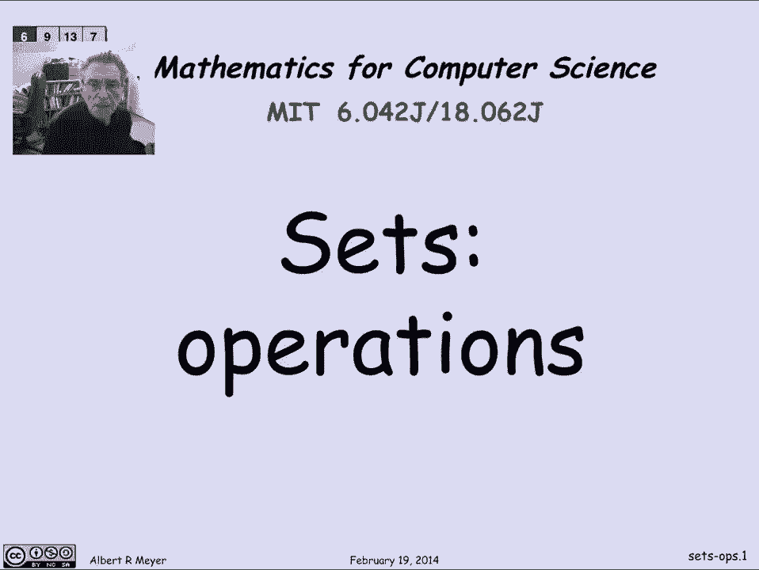
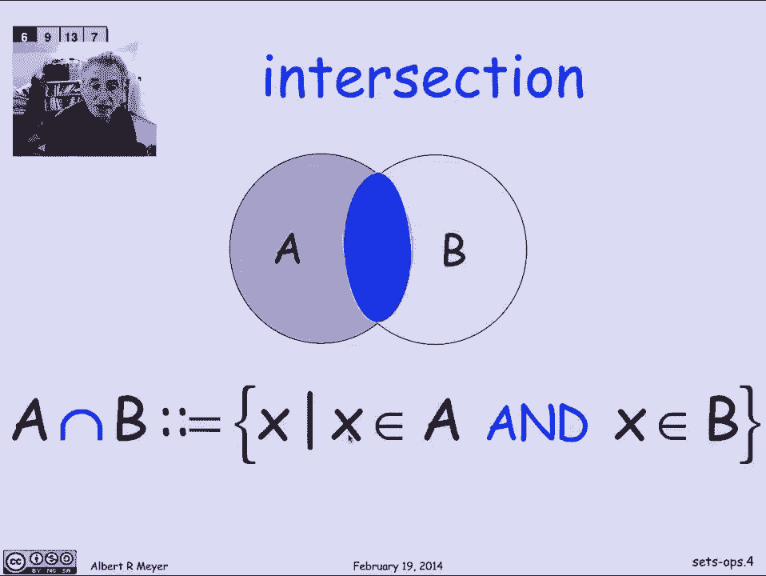
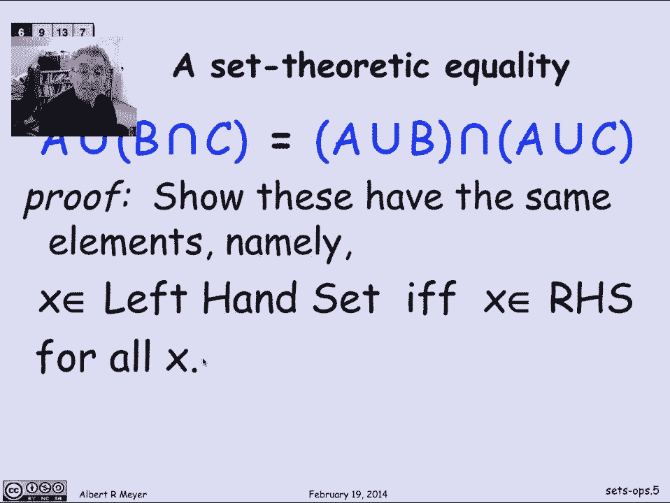
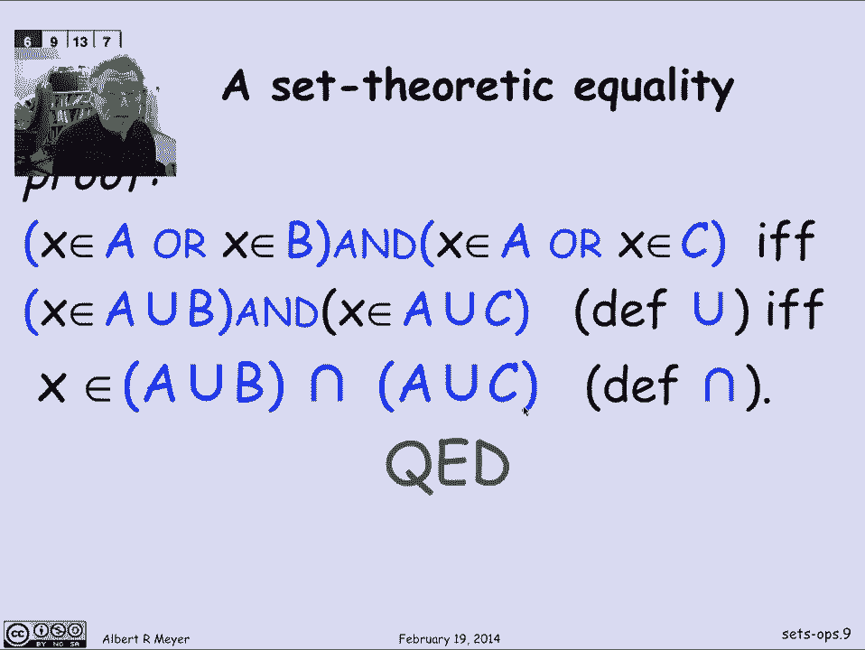
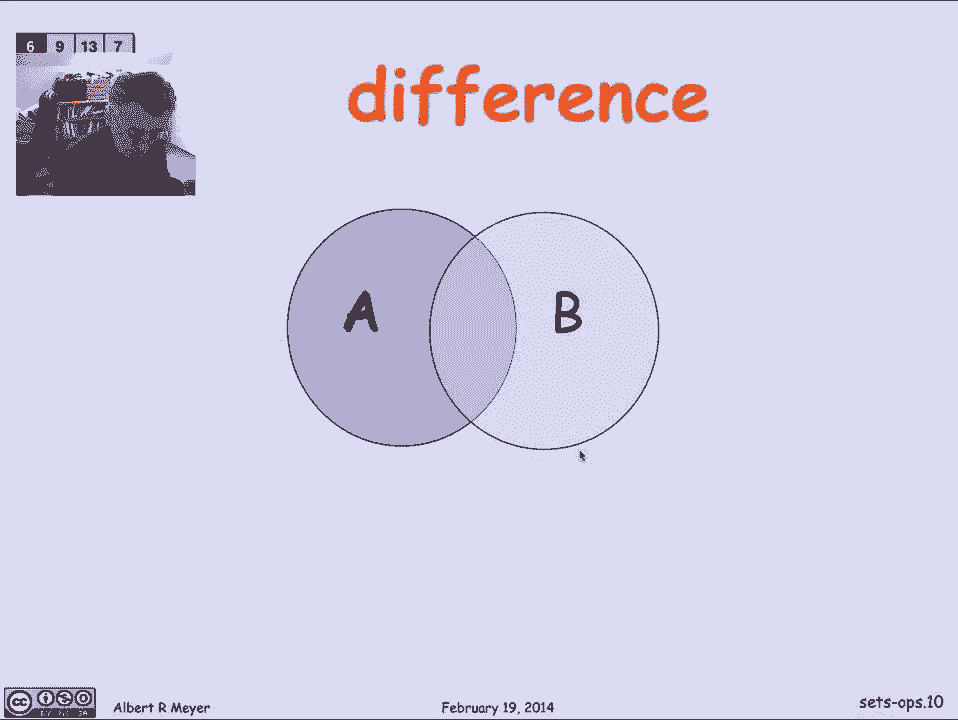
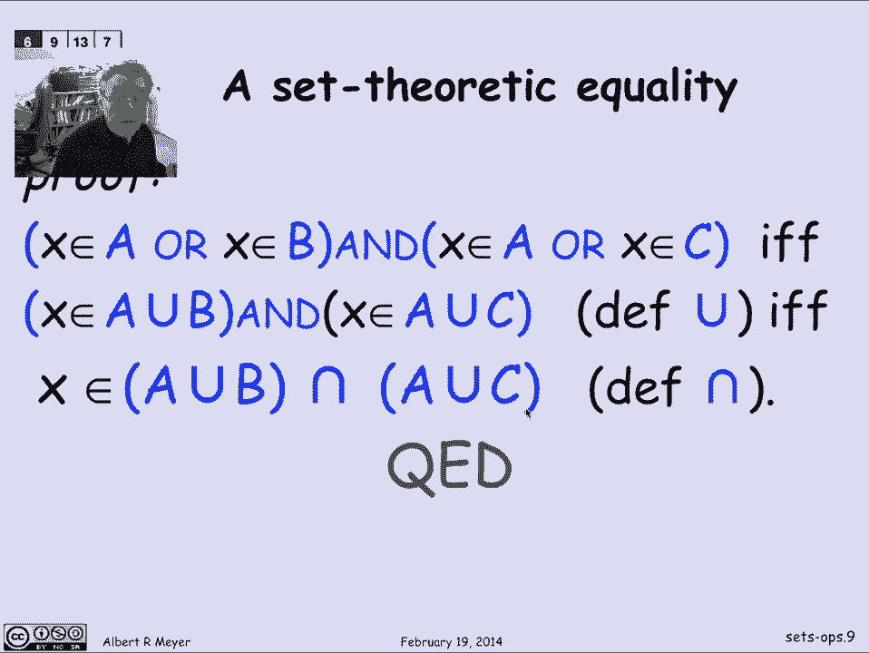
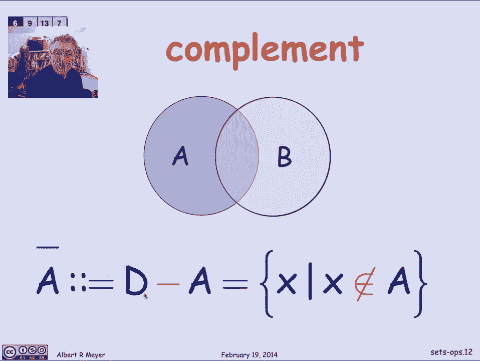
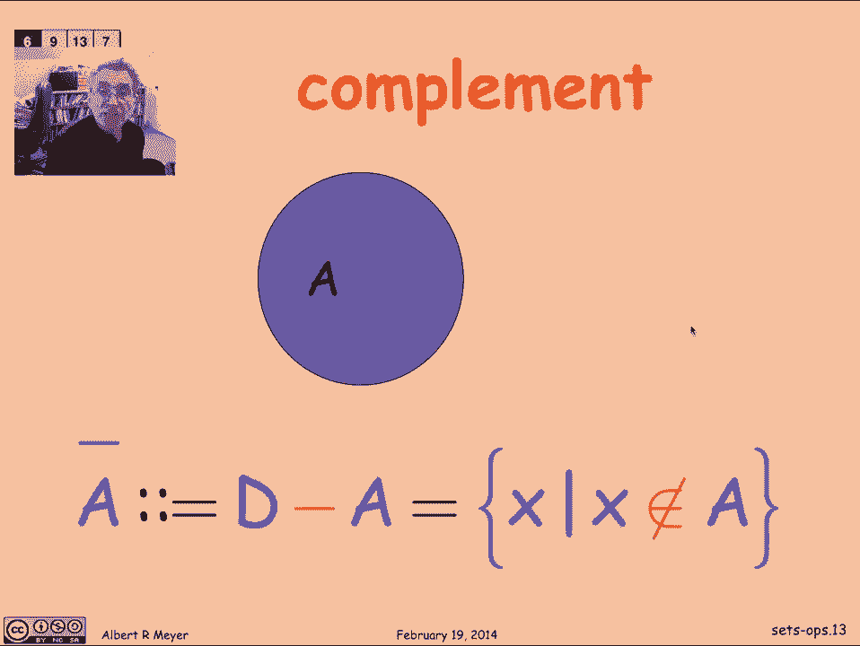

# 【双语字幕+资料下载】MIT 6.042J ｜ 计算机科学的数学基础(2015·完整版) - P16：L1.6.2- Sets Operations - ShowMeAI - BV1o64y1a7gT

let's define a few familiar and standard，operations on sets so here's a picture。

of two sets a and B where the idea is，that the circle represents the points in。

a the other circle represents the points，in B the overlapping area of this lens。

shaped region are the points that are in，both a and B and the background are the。

points that are in either a and B so，this is sort of a general picture allows。

you to classify points with respect to a，and B and it's called a Venn diagram in。

this case for two sets it's still useful，for three sets it gets more complicated。

for four sets and after about that after，that point they're not really very。

useful but a lot of the basic operations，can be illustrated nicely in terms of。

the Venn diagram for two sets and that's，we're about to do so the first operation。

is Union it's the set of points shown，here in magenta it's the set of points。

that are in either A or B all of them，and so if we were defining this as a in。

terms of set theoretic notation or，predicate notation the Union symbol the。

U is for the Union symbol so a union B，is defined to be those points X that are。

in a or are in B and you can already，begin to see an intimate relationship。

between the Union operation and the，propositional or connective but don't。

confuse them if you apply an or two sets，you're compiler is going to give you a。

type error and if you apply Union to，propositional variables your compiler is。

also going to give you a type error so，let's keep the propositional operators。

and the set theoretic operators separate，although and clearly distinct even。

though they resemble each other all，right，next basic operation is intersection。

where again it's the points that are，both in a and B the points in common。

which are now highlighted in blue so the，definition of a intersection B we use an。

upside-down Union symbol for an，intersection it's the set of points that。

are in a and are in B so let's stop for，a minute and make use of the similarity。

between the set theoretic operations and，the propositional operators。

let's look at a set theoretic identity，which I claim holds no matter what sets。

a B and C you're talking about and we're，going to prove it by making the。

connection between set theoretic，operations and propositional operations。

so let's read the thing it says that if，you take a Union the set B intersection。

C that's equal to the set a union B，intersected with a union C now let's not。

think through yet how to make this an，intuitive argument it's gonna really。

crank out in an automatic way in a，moment but we can remember it as saying。

that you can think of this as Union，distributing over intersection so where。

if you think of Union as times here and，intersection is plus then we're we've。

got a rule that says that a times B plus，C is 8 times B plus a times C now it's。

also true that if you reverse the role，of Union an intersection you get another。

distributive law that and distributes，over Union but never mind that let's。

just look at this one we're trying to，prove the distributive law for union。

over intersection how shall we prove it，just from the definitions well the way。

we're gonna do it is by showing that the，two sets on the left-hand side and the。

right-hand side have the same set of，elements namely if I have an element X。

that appears in the set described on the，left-hand side then it's that point is。

on the right-hand side and it's an if，and only if so that says that the。

left-hand side and the right-hand side，expressions define sets with the same。

set of points this holds for all X and，that turns out that the proof is gonna。

follow from by analogy to a，propositional formula that we're going。

to make use of in the proof that was a，propositional equivalence that we proved。

in an earlier talk namely that or，distributes over and so P or Q and R is。

equivalent to P or Q and P or R so you，can see the，this equivalence has the same structure。

as in this equivalence in purple has the，same structure as the set theoretic。

equality in blue except that unions，replaced by Killoran intersections。

replaced by and and set variables ABC is，replaced by propositional variables P Q。

R so let's just remember that we've，already proved this propositional。

equivalence and we're gonna make use of，it in the middle of this proof that。

these two sets are equal so again we，said we were going to prove that two。

sets are equal by showing they have the，same points so here's the proof it's。

gonna be a lovely if and only if，argument the whole way so looking at the。

left hand side and a point X is in a，union B intersection C by definition of。

Union if and only if X is in a or X is，in B intersection C I've just applied。

the definition of Union there okay now，let's look at this expression X is in B。

intersection C that's the same as X is，in B and X is in C again just using the。

definition of intersection and now I，have a propositional formula involving。

or and and and the basic assertions，about sets of X is a member of one of。

those ABCs now at this point I can，immediately apply my propositional。

equivalence and say that the assertion X，is in a or X is in B and X is in C is。

holds if and only if this expression X，is in a or X is in B and X is in a or。

X's and C why is that well I'm just，invoking the propositional equivalence。

let's look at it that if I think of the，X is in a as proposition P and let's。

replace all the x over a is by P and I，think of X is in B as a Q and X is and C。

is an R then I can see that the the，first set theoretic assertion has the。

form of p or q and r and i can transform，it by the propositional equivalence into。

P or Q and P or R and then remember what，p and r are to get back to the set。

theoretic membership basic，Bishop assertions so now we've just。

proved that X is in a or X's and B and X，is in a or X's and C and then that's if。

and only if it was in the left hand side，way，namely this or that X is in a or X's and。

B is the same as saying that X is in a，union B likewise here it just might。

apply the definition of Union and this，assertion that X is in this set and X is。

in this set is the same as saying that X，is in there intersection and I've just。

proved I've completed my proof namely，the point that was in the left hand side。

is if and only if it's in the right hand，side you have to remember that that was。

the right hand side of the identity so，this is a general method actually where。

you can take any set theoretic equality，involving Union and intersection and the。

operations of difference and complement，that we'll talk about in a moment and we。

can convert any such set theoretic。

equality into a propositional equality，or propositional equivalence or we can。

check that it that the propositional，assertion is an equivalence and from。

that using this method of converting the，membership statements in the set。

expression into a propositional，combination we can check and，automatically check any kind of set。

theoretic identity involving Union，intersection well and - and that in fact。

is the way that automatic engines like，Mathematica can prove these set。

theoretic identities so let's just for，the record put down that last operation。

the difference operation is the set of，elements that are in a and not in B so。

we'd write it as a minus B is the set of，points that are in a and not in B and。

it's illustrated by this region that's，highlighted in orange and a special case。

of the minus operation of the difference，operation is complement when you know。

the overall domain that you expect all，your sets to be part of then you can。

define a complement to be everything，that's not in a，a set of X such that X is not in a where。

X is understood to be ranging over some，domain of this course so if you're going。

to picture that we're looking at the，whole orange region all of the stuff。

that's not in a if we think of the whole。

slide as representing the domain of。