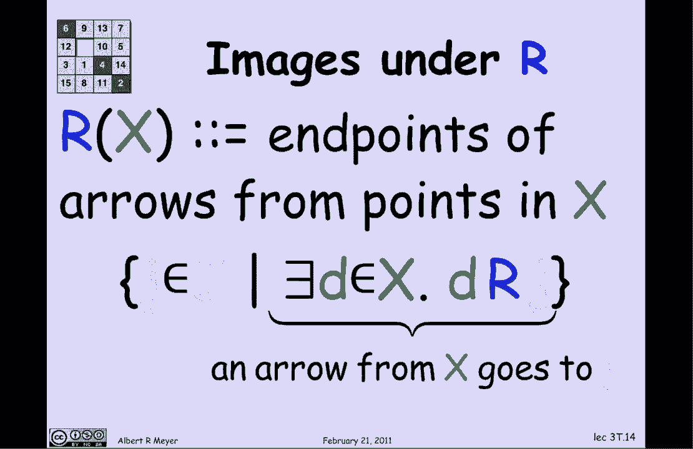
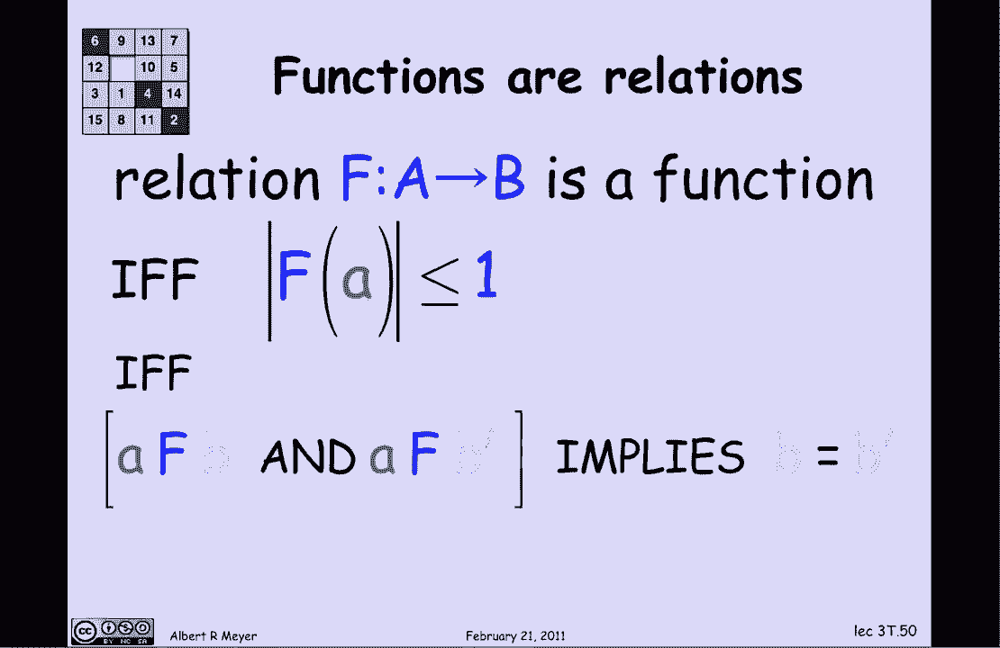

# 【双语字幕+资料下载】MIT 6.042J ｜ 计算机科学的数学基础(2015·完整版) - P17：L1.7.1- Relations - ShowMeAI - BV1o64y1a7gT

you've seen a lot of functions in，introductory calculus trig functions。

rational functions Exponential's logs，and so on I don't know whether your。

calculus course has included a general，discussion of functions the。

old-fashioned ones didn't and we will go，into that now in this segment and we're。

going to be interpreting functions as a，special case of binary relations so。

let's just say what a binary relation is，a binary relation is a mathematical。

object that associates elements of one，set called the domain with elements of。

another set called the codomain and I'm，gonna give you a bunch of examples of。

binary relations you know in a short，moment but let's just talk about what。

they're for and what their role is so，they may be Camilla familiar to you as。

computer scientists if you've worked，with any relational databases like SQL。

or MySQL my sequel and will see an，example that indicates where the。

original ideas behind those relational，databases came from but even more。

fundamental relations are one of the，most basic mathematical abstractions。

right after sets and they play a role，everywhere we're going to be looking in。

later lectures as special kinds of，binary relations like equivalence。

relations and partial orders and，numerical congruence --is but today。

we're gonna set up the machinery to be，using binary relations for counting。

which will be another important，application in this class so let's look。

at an example and I'm gonna take one，that's close to home the registered for。

relation which is a relation between，students that's going to be the domain。

in this case for students Jason Joan，away and Adam and subjects for subjects，as a coincident 6：

04 to double O 3 0 1 2，and double o4 and the relation R is，going to be indicated by。

arrows would show just which students，are associated with which subjects。

meaning that they're registered for that，subject so if we look at Jason we can。

see that there there's a particular，arrow connecting Jason and 604 2 and。

what that tells us is that Jason is，registered for 604 - now there's a bunch。

of notations that are used with respect，to binary relations so let's look at。

some one way to write it is if you think，of the relation R as like an equality。

sign or a less than sign where it's，normally written in the middle of the。

two things that it's connecting as in，this example Jason R 604 2 that would be。

called in fix notation sometimes it's，written as a binary predicate R of Jason。

comma 604 - that would be kind of prefix，notation where the relation or operator。

comes first and then if you start being，a little closer to the formal definition。

of what a binary relation is you could，say that the ordered pair jason 604 2 is。

a member of the relation if you wanted，to be really precise you would say that。

it was a member of the graph of the，relation and I'll come back and。

elaborate further on what the graph of a，relation is and and what this ordered。

pairs business is but for now just let's，continue with this example and a basic。

concept with relations is the idea of，the image of a bunch of domain elements。

under the relation so you can think of，the relation as an operator that applies。

to domain elements or even sets of，domain elements so if I write R of Jason。

that defines the subjects that jason is，registered for so looking at the picture。

or is not a function so that there may，be more than one subject as is you'd。

expect for a student to be registered，for multiple courses at MIT so Jason in。

this diagram is registered for 604 - and，601 - as indicated by the。

highlighted two connection arrows which，we've made red which means that our of。

Jason is that set of two courses that，he's associated there that he's。

associated with or that are associated，with him that he's registered for 604。

two and 601 - so at this point we've，applied our - one domain element one。

student Jason but the interesting case，is when you apply are to a bunch of。

students so the general setup is that if，X is a set of students a subset of the。

domain which we've been showing in green，then if I apply R to X it gives me all。

the subjects that they're taking among，them all the subjects that any one of。

them is taken let's take a look at an，example well another way to say it I。

guess is that R of X is everything in，our that relates to things in X so if I。

look at Jason and a way and I want to，know what are they connected what do。

they connect to under R these are the，subjects that Jason or equated four-way。

I'd find that is by looking at the arrow，diagram and I find that Jason is taking。

oh four two and oh one two and eva is，taking oh one two and double oh four so。

between them they're taking three，courses so R of Jason a way is in fact。

oh four two oh one two and double oh，so another way to understand this idea。

of the image of a set R of X is that X，is a set of points in the set that。

you're starting with called the domain，and R of X is going to be all of the。

endpoints in the other set the code，domain that start at X if I said that as。

a statement in formal logic or in set，theory with logical notation I would say。

that R of X is the set of J in subjects，such that there is the in X。

such that D RJ so what that that's，exactly saying that d rj says that D is。

the starting point in the domain D is a，student J is a subject the RJ means。

there's an arrow that goes from student，D to subject J and we're collecting the。

set of those J's that start at some D so，an arrow from X goes to J is what exists。

at the in X the RJ means written in，logic notation it's really talking about。

the endpoints of arrows and that's a，nice way to think about it but you ought。

to be able also to retreat to give a，nice crisp set theoretic definition。

without reference to pictures if need be，so that's an official definition of the。

image under R let's turn now to an，operation on relations which converts。

one relation into another relation，called the inverse of r and the inverse。

of R is what you get by turning the，arrows around so let's look at the。

relation R which is the registered for，relation going from these students to J。

subjects and then if I look at our，inverse or inverse I could think of as。

the registers relations 604 2 registers，Jason and and 601 2 registers jason and。

a way it's a funny usage of the word but，I needed something short that would fit。

on the slide so registers is basically，turning the arrows backwards of is。

registered for and now I can apply the，definition of image to R inverse in a。

useful way but just to be crisp about，what we're doing here is formally our。

inverse has gotten by flipping the role，of the domain and the code domain so we。

have that drj if and only if J R inverse，D so let's look at our inverse of 601 to。

what that's gonna mean is all the，students that are taking 601 to，so we start off at 6：

01 - and we go back，to all the students that are registered，for it it's Jason and a way again and so。

our inverse of 601 to is Jason anyway，our inverse of 601 to and six double O。

three well same deal let's look at six，double O three and six oh one two and。

look at all the students that are，registered for either one of them now。

it's Jason Joan and equation by those，red arrows those all the arrows coming。

out of those two courses double of three，and a one two and so our inverse of the。

below three and a one two is that set of，three students Jason Joan and a way and。

in general when you start off with a，bunch of subjects a bunch of elements of。

the codomain and you apply our inverse，to it it's called the inverse image of Y。

under R well let's look at the set J of，all the subjects and think about what is。

our inverse of J what does it mean well，our inverse of J is all the students。

that are registered for some subject at，all which is a good thing to have so now。

I can start using these sets to make to，make assertions about my database that。

can be useful to know so for example if，I want to say that every student is。

registered for some subject which of，course they are what I would say is that。

V the set of all students is a subset of，R inverse of J so this concise set。

theoretic in a containment statement D，is a subset of R inverse of J is a slick。

way of writing the precise statement，that says that all the students are。

registered for some subject now it，happens not to be true by the way。

because if you look back at that example，Adam was not registered for a subject so。

we're not claiming this is true but，simply that there's a nice way to。

let's look at a different relation that，we could call the advisors relation now。

so the advisors relation is gonna have，codomain the same set of students D but。

it's gonna have as a domain the set of，professors and I've written down the。

initials of five prominent professors -，at the top and you may recognize some of。

the others but it doesn't really matter，if you don't and the advisors relation V。

is going to be indicated by those arrows，so in particular it shows that a RM is。

the advisor of Jason Joan equation Adam，which he happens to be FPL is an advisor。

of Joan and away so Joan has two，advisors because she's a double major he。

way does as well and Adam does as well，now that I look at this example so if I。

look at in particular now the advisees，of FTL or TLP I'm looking at V of the。

set consisting of FTL and TLP and it's，going to be Joan equal and atom so。

taking the image of FTL and TLP that，that's the set of advisees of either of。

those two professors I get this set of，three students Joan a way and Adam well。

that's a set of students and the，registered relation applies to a set of，students so let's do that。

if I now apply our to Joan and eat way，and Adam what I'm getting is the。

subjects that they're registered for so，this is called composing R and V I've。

applied V and then I'm applying our to，the result in this case R of V of FTL。

and TLP is the same as R of Jony way and，Adam it's the courses that any of them。

are taken taking and it's double O 301 -，and double O four so the way to。

understand this R of V in general is you，start off with any set X of professors。

in the domain you take V of X，are the advisees that they have and then。

you take our of the advisees and you get，the subjects that the advisees are taken。

so R of V of X is the subjects that，advisees of X are taking are registered。

for well we can abstract that out and，call this the composition of R and V。

it's defined the same way that，functional composition is so R of V is。

the relation and the images of that，relation the images of a set of。

professors under our V is defined to be，apply V - X and then apply our - V of X。

and it's again called the composition of，R and V what it means now is that two。

things are related by our a V it relates，professors and subjects and it says that。

a professor and a subject are related if，the professor has an advisee some。

advisee in that subject P for a，professor composition of our with V J。

for a subject holds if and only if，professor P has an advisee registered in。

subject J let's see how you figure that，kind of thing out so I'm gonna draw the。

V relation which goes from P professors，to these students and then the our。

relation that goes from these students，to J subjects and by showing them in。

this way I can understand the，composition of R and V as following two。

arrows you start off say at a RM and you，follow a V arrow from a RM to his。

advisee away then you follow another，arrow from a way to 601 - and you。

discover hey a RM has an advisee in so，now we can say that professor a RM is in。

the relation R composed with V with 601，- because of this path a RM has a way as。

an advisee and a way is registered for，out，the relation that the professor has an。

advisee in the subject so in general，what we can say is that a professor。

payee is in the ROV relation to Jay if，and only if and here we're going to。

state it in formal logical notation，which really applies in general and not。

just to this particular example so the，definition of our composed with V is。

that P are composed with VJ means，there's a D that connects P and J。

through V and D in particular that，there's a D such that P V D which means。

there's an arrow of V arrow from P to D，and the RJ there's an R arrow from v2 j。

for some D by the way there's a，technicality here that when you write。

the formula P V D and the RJ following，the diagram where you start with V on。

the left and follow of ero and then an R，arrow it's natural to think of them as。

written in left-to-right order of what，you apply first V R but of course that's。

not the way composition works when you，apply a one function or 2v2 something。

you're applying v first and you write it，on the right so ro V is written like。

function composition where V applies，first but the logical statement the。

natural way to write it is to follow the，way the picture works and the v's and。

ours get reversed so watch out for that，confusion well I want to introduce one。

more relation to flesh out this example，and that'll be the teaches relation so。

the teacher's relation is going to have，as domain professors again and as Co。

domain subjects and it's simply gonna，tell us who's teaching what so here。

we're going to see that a RM is teaching，604 - as you well know an FTL is。

teaching 604 - which he does frequently，but not this term and now I can again。

use my relational operators to start，making assertions about this about these，people in relation。

involving teaching and advisees so I，ended the useful way to do that is by。

applying set operations to the relations，because I can think of the relations as。

being that set of arrows so suppose I，wanted to make some statement that a。

professor should not teach their own，advisee because it's too much powerful。

one person to have over a student this，is not true by the way it's common for。

professors to teach advisees but there，are other kinds of rules about dual。

relationships between supervisory，relationships and personal relationships。

but anyway let's say if we can say that，profs should not supervise or should not。

teach any one that they're advising well，if we were saying that in logical。

notation what we would say is that for，every professor and subject it's not the。

case that the professor has an advisee，in subject J and the professor is。

teaching subject J so that's how you say，it in logic but there's a very slick way。

to say it without all the formulas and，the quantifiers I could just say that T。

the relationship of his teaching，intersected with the relationship of has。

an advisee in the subject is empty there，is no pair of professor and subject that。

is in both T and in R of V and this，bottom expression here gives you a sense。

of the concise way that you can express，queries and assertions about the。

database using a combination of，relational operators and set operators。

another way to say it by the way there's，a general set theoretic fact is the way。

to say that T and R of V intersected is，empty is to say that they that the set T。

and the set R of V whatever they are，have no points in common an equivalent。

way to say that is that one set is，contained in the complement of the other。

set so I could equally well have said，this as R composed with V is。

subset of not T well let's step back now，and summarize what we've done by example。

and say a little bit about what it how，it works in general so as I said a。

binary relation um and we'll start to be，slightly more formal now a binary。

relation are from a set a to a set B，associates elements of a with elements。

of B and there's a picture of a general，set a called the domain and a general。

set B called the codomain and R is given，by those arrows well what exactly are。

arrows well if you're gonna formalize，arrows the set of them is what's called。

the graph of R so technically a relation，really has three parts it's not to be。

identified with just its arrows a，relation has a domain and a code domain。

and some bunch of arrows going from the，domain to the code domain the arrows can。

be formalized by saying all that matters，about an arrow is where it begins and。

where it ends because it's just designed，to reflect an association between an。

element of the domain and an element of，the codomain so technically the arrows。

are just ordered pairs and in this case，there are three arrows one from A to B。

to and so you see at the bottom of the，slide an ordered pair a one B to another。

arrow goes from a1 to b4 so you see the，ordered pair a1 before and the final。

arrow is BA three beef four and you see，that pair so all the language about。

arrows is really talking about ordered，pairs it's just that the geometric。

vision image of these diagrams of their，arrows makes a lot of properties much。

clearer so the range of R is an，important concept that comes up，regularly and tends to be a little。

confusing for people the range of R is，simply the elements with arrows coming。

in from our it's all of the elements，that are hit by an arrow that starts。

in the domain so it's really our of the，domain is the range of our now notice。

that this is typically not equal to the，whole code domain let's look at this。

example here the range of our are the，hit the points that are hit by elements。

of a under our namely just B 2 and B 4，the codomain has elements B 1 in B 3。

that are missing and that are not in the，range well as I said functions are a。

special case of relation so let's just，look at that a function f from a set a。

to a set B is a relation which，associates with each element in the。

domain each element little a in the，domain capital a with at most one。

element of the codomain B so this one，element if it exists is called F of a。

it's the image of the element a under，the relation F but what's special about。

it is that F of a contains at most one，element so let's just look at an example。

again a way to say that that a relation，is a function is to look at all of the。

points on the left in the in the domain，and make sure that none of them have。

more than one arrow coming out well in，this picture there are a couple of。

violations about that of that there are，a couple of points on the left in a that。

have more than one arrow coming out，there's our two bad edges but if I erase。

those now I'm left with a function and，sure enough there's at most one arrow。

coming out of each of the points on the，left in a some of the points have no。

arrows coming out that's fine and so for，those green points with an arrow out。

there's a unique F of the Green Point，equal to a magenta point in B that's。

uniquely determined by the functional，relation F which may not be defined for。

all of the green points if they don't，have any arrow coming out of them so。

function means less than or equal to one，so if we set this formally without。

talking about the arrows one way is，simply to say that that a relation is a，function。

if f of little a is let if the size of f，of little a is less than or equal to 1。

for all of the domain elements a and a，more elementary way to say it using just。

the language of relations and equality，and boolean connectives is to say that。

if a is connected to two things by F if，a FB and a FB prime then in fact B is。

equal to B Prime and that wraps up。

