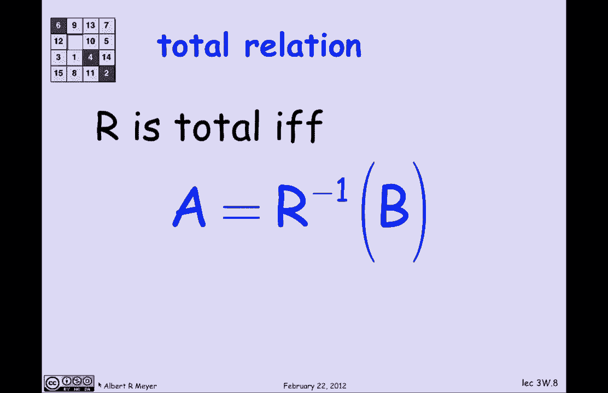
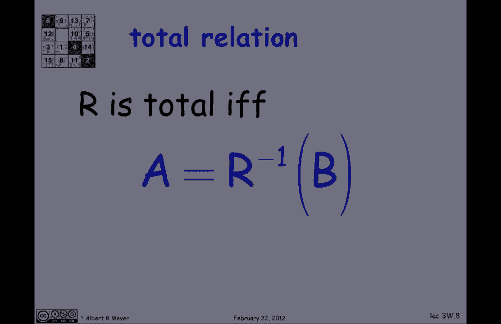
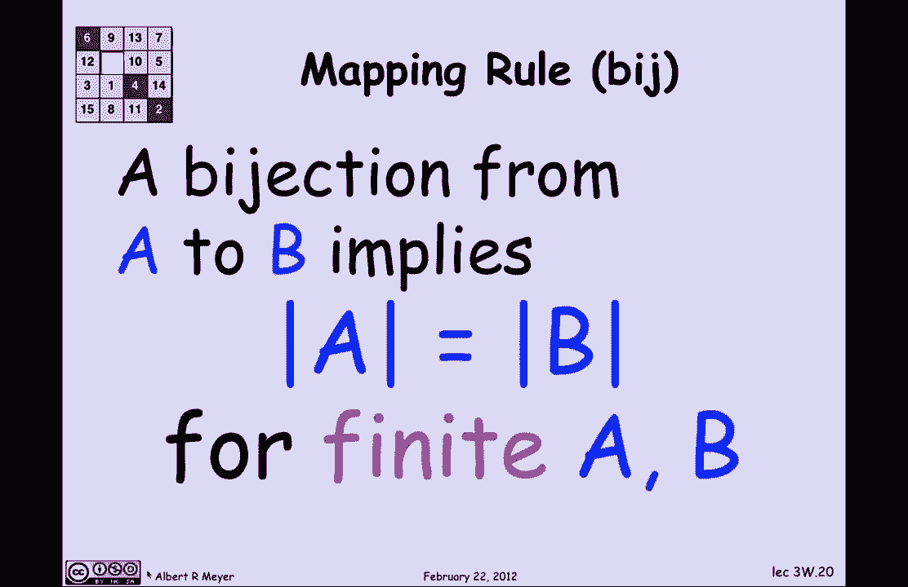

# 【双语字幕+资料下载】MIT 6.042J ｜ 计算机科学的数学基础(2015·完整版) - P18：L1.7.3- Relational Mappings - ShowMeAI - BV1o64y1a7gT

so in this short segment we'll talk，about some relational properties that I。

call mapping properties they can also be，referred to as archery on relations this。

segment is mostly vocabulary there are a，half-a-dozen concepts in words that are。

standard in the field and the one needs，to know to be able to do some discrete。

math and so on the applications will，come in the next short segment where we。

start applying of these properties to，counting although there'll be a。

punchline about counting at the end of，this segment so let's go back or proceed。

and remember that a relation is a binary，relation is a thing with three parts。

it's got a domain illustrated by as a，here a codomain Illustrated is B here。

and relationships an association between，domain elements and code domain elements。

indicated by the arrows arrows being，called the graph of the relation and we。

already observed one aspect of archery，and arrows that the concept of a。

function could be captured by saying，that there was less than or equal to one。

arrow out of every element in the domain，that employed that that there was a。

unique other end of an arrow out of a，domain point called the value of that。

point under the relation which is in，fact a function f so f of green equals。

magenta where there is an arrow out of a，green element but in this picture as is。

typical not every domain element not，every green dot has an arrow out of it。

so this would be an illustration of a，partial function where f of a green。

element isn't always defined if there's，no arrow out well the general idea of。

our relations pursues this function idea，that basically we're going to classify。

relations according to first how many，arrows come out of domain elements。

really in three categories the relations，where there's at most one arrow out of。

every domain element there's exactly one，arrow out of every domain element。

or there's at least one arrow out of，every domain element and symmetrically，we're going to classify。

codomain relations with respect to code，domains in the same way relations where。

every code domain element has greater，than or equal to one arrow in has，exactly one arrow in or。

at most one arrow in is the other part，of the classification and various。

combinations of these things have，standard names which it turns out that。

you'll need to know so will lead you，through them okay so let's begin with。

the idea of a total relation total，relation means there's at least one。

arrow out of every domain element so if，you look at this picture it's not quite。

total yet because there are two green，domain elements with no arrows out of。

them so I've just highlighted them in，red and we can fix this by making them。

disappear now I'm left with a total，relation every domain element has at。

least one arrow coming out of it so，that's what makes it total another way。

to say total is to say that if you look，at the inverse image of the codomain it。

is equal to the domain that means if you，take all the arrows that are coming out。

of the domain and you turn them around，and then and you look at all the things。

that have arrowheads into them it's the，entire domain so that's what our inverse。

of B is nice slick way to say it using，relational operators and sets related to。

applying relations so total and function，means that there's exactly one arrow out。

and that's probably the most familiar，case of functions and lots of fields。

just assume that functions are total but，the truth is that there often is not not。

total and people aren't careful about it，so let's look at a calculus like example。

here's a function J that takes a pair of，reals and returns a real it Maps the。

real plane into the real line and the，of it is G of X Y is 1 over X minus y。

now the domain of this function G is in，fact all the pairs of reals that's what。

it means to say that it goes from our，cross our shorthand R squared to the。

codomain are the codomain is the set of，all reals but this G is obviously not。

total because 1 over 0 is not defined，which means that on the on the 45-degree。

line G is not defined G of our R is not，defined so G in fact is not a total。

function even though it's familiar and，and you not worry about partial。

functions normally but without you you，wouldn't notice that this was partial。

cuz you're not used to paying attention，to that ok let's look at a slight。

variation this is function G 0 that goes，from some unspecified domain specified。

in a minute to the reals it has exactly，the same formula G of X Y is 1 over X。

minus y but now I'm going to tell you，that the domain instead of being all the。

reals is the reals except for that 45，degree line I just want to get rid of。

the bad points and not worry about them，the minute I do that I have these two。

functions relations that have the same，graph but different domains and the。

result is that I've removed from the，domain of G all the bad points I'm left。

with a total function G 0 ok let's keep，going，the next concept is of a surjection and。

that's a relation where there is at，least one arrow into every point in the。

code domain there's at least one arrow，into every point in B well again this is。

a picture where that doesn't quite work，because there's at least one bad point。

there there it is in red that doesn't，have an arrow in so let's fix things。

again by making it disappear now I'm，left with a surjective relation or a。

surjection that because in fact，everything in the code domain and B has，at least one arrow coming in。

everything's the endpoint of an arrow so，likewise we can say in terms of set，operations that are。

surjection if and only if the image of，the domain is the codomain or still。

another way to say it is if and only if，the range of the function is its entire。

code domain remember the range of the，points that are hit，that's R of a it's not always equal to。

the code domain but when it is that is，what makes it a surjection alright。

injections another version that our，variation on the theme an injection is a。

relation where there is at most one，arrow into every element in the。

co-domain so looking at this picture now，this is not quite an injection because。

there are at least two points here that，have more than one arrow coming into。

them that's what keeps it from being an，injection so let's fix that by deleting。

a couple of those edges that are，crowding up points and now I'm left with。

a situation where in fact everything in，B has at most one arrow coming in and so。

I'm showing you a picture of an，injection and the final concept is when。

you have all the good properties a，bisection is when you have exactly one。

arrow out and exactly one arrow in it's，a total function that is an injection，and a surjection。

because it's got greater than or equal，to 1 and less than or equal to 1 and。

equal to 1 for all of the domains and Co，domains now there's an obvious thing。

about by jek shion's which we'll wrap up，with which is why they're useful in。

counting theory because it's clear that，since there's exactly one arrow out of。

every element in a there the number of，arrows is the same as the size of a and。

since there's exactly one arrow coming，into every element of B the number of。

arrows is the same as the size of B and，guess what that means that where there's。

a bijection the sets are of equal size，if there's a bisection between two。

finite sets a and B that means that。

