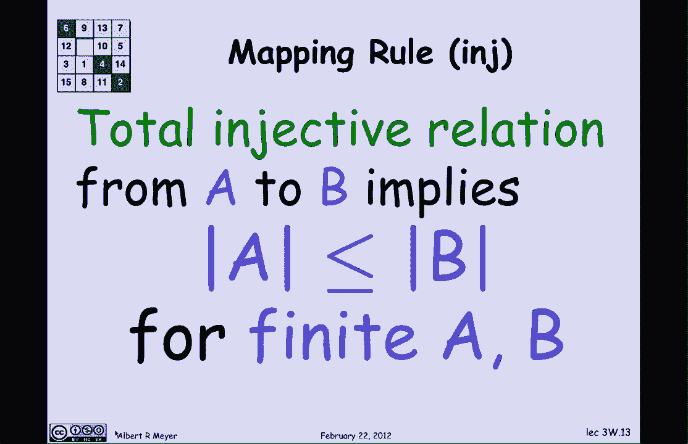
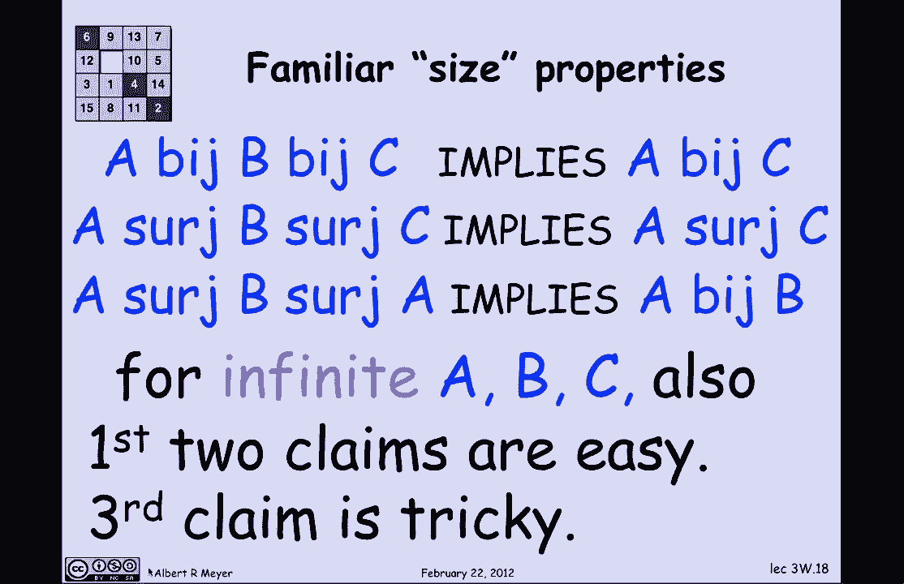

# 【双语字幕+资料下载】MIT 6.042J ｜ 计算机科学的数学基础(2015·完整版) - P19：L1.7.5- Finite Cardinality - ShowMeAI - BV1o64y1a7gT

so we're finally ready to tie up these，ideas about mapping properties to。

counting properties and let's begin with，the remark that we already made that if。

there's a bisection from one set to，another if there's a bijection from a。

finite set aid we'll finite set B then a，and B have the same size by the way。

those vertical bars absolute value of a，when it's a set refers us to the size of。

the set for finite sets of it it means，if a has n elements then the absolute。

value of a is n ok let's use this，bhaijan idea immediately here's a nice。

example suppose you want to figure out，how many subsets are there of a finite。

set a and suppose you didn't know yet，all right so what we're asking about is。

what's the size of the power set of a，room and the power set of a is all of。

the possible subsets of the set a well，suppose a has three elements what is the。

power set of a look like if Capital a，has elements little ABC it's a set of。

size three then the power set of a is，going to have one subset with no。

elements three subsets with one element，they're listed there it's going to have。

three more subsets with two elements and，one subset with three elements for a。

total of a subset in the power set of a，so let's see what the counting argument。

in general would be so suppose that a，has n elements and we'll number them。

from a zero up through a n minus 1，because computer scientists usually 0。

origin index so a is a set of n elements，indicated there suppose I have some。

arbitrary subset of a let's suppose that，it has a zero then there's no a 1 that's。

what the space is for it has a 2 it has，a 3 it doesn't have a 4 then it goes on。

for a while in some uncertain way and it，ends it actually has the last element a。

n minus 1 in it well I can take the，subset like this and cut and have it。

correspond to a bit string where I put a，1 where the element is there in the，subset and a 0。

where the element is not there in the，subset so there's a 1 because a 1 a 0 is。

in the subset followed by a 0 because a，1 is not in the subset followed by two。

ones because a 2 and a 3 are in the，subset followed by a 0 because a for is。

not and so on ending with a 1 because a，n minus 1 is in the subset so in short。

the bit string the cave bit in the，string is 1 if and only if a sub K is in。

the set now this clearly defines a，bijection between subsets and strings。

because given a subset I can uniquely，determine the string and given the。

string I can uniquely determine the，subset so there's one arrow in and one。

arrow out of each of those things so I，can immediately conclude then by the by。

this by action theorem that the number，of n bit strings is equal to the size of。

the power set of a well now every，computer scientist knows how many n bit。

strings there are right there are 2 to，the N and bit bit strings and therefore。

the power set of a has 2 to the N，elements we can get rid of the end。

because it was the size of a and we have，this nice formula the power set the size。

of the power set of a finite set a is 2，to the size of a well there are some。

more counting rules like the bijection，rule that relates sizes obsessed by。

inequalities according to whether the，mappings are surjective injective。

functions and so on so let's take a，quick look at those suppose that I have。

a surjective function from A to B well，that means there's less than or equal to。

one arrow out of every element of a，that's what function means and there is。

greater than or equal to one arrow in to，every element of B that's what。

surjective means so here's this function，from A to B that means less than or。

equal to one arrow out and that means，that there have to be more elements in a。

than there are arrows since there's at，most one，arrow out of every element of a and that。

accounts for all the arrows so the size，of a has to be Gregor drink'll to the。

number of arrows when you have a a，partial function when it's a surjection。

that means that there's an arrow coming，in to every element of B that means that。

there have to be at least as many arrows，as there are and B because everything in。

B has at least one arrow coming in so if，you look at these two pieces the size of。

a has to be greater equal to the number，of arrows and the size of B has to be。

less than or equal to the number of，arrows putting them together we have the。

mapping rule for surjections if I have a，surjective function from A to B it means。

the size of a is greater than or equal，to the size of B for finite a and B well。

the same argument goes for injections，with an injection I have less than or。

equal to one arrow in and what does that，tell me well if it's total then there's。

at least one arrow out of everything and，that means that the size of a has to be。

less than or equal for the number of，arrows because every element that。

contributes an arrow may be more than，one okay if it's an injection there's。

less than or equal to one arrow coming，into each element of B that means that B。

had better be big enough to catch all，the arrows so the number of arrows has。

to be less than or equal to the size of，B put those two inequalities together。

and you find that if you have a total，injective relation from A to B that。

implies that the size of a is less than，or equal to the size of B for finite a。

and B the statement here that it's a，total injective relation is for。

generality but the truth is whenever，there's a total injective relation。

there's also a total injective function，I'll leave that to a class exercise to。

work out so to summarize what we can do，is characterize these kinds of of jetson。

relations between sets so let's define a，by B so this is going to be a binary，relation between。

two sets a and B and its meaning is that，there's a bi action from A to B so the。

definition of BI is a binary relation，where the domain and the codomain are。

the class of finite sets or all sets for，that matter，Serg be a surge be is means that there。

is a surjective function from A to B，again surge is a binary relation between。

sets and finally a inge B says there's a，total injection relation from A to B so。

we have those three relations between，sets and what we've just shown is that。

if there's a bisection between a and B，that's true implies that the size of a。

is equal to the size of B and in fact，it's not hard to prove the converse if。

the size of a and the size of B are the，same then it's easy enough to find a，bisection between them。

similarly if there's a surjection from A，to B that's true if and only if the size。

of a is greater than equal to the size，of B and if there's an injection from A。

to B that's true if and only if the size，of a is less than or equal to the size。

of B so the this the existence of these，kinds of of relations between sets is a。

handle on their relative sizes and this，implies for finite sets a and B because。

we don't really know what the size of，infinite sets are so it wouldn't make。

sense to talk about the mapping lemma，for infinite sets however we can ask。

some questions about infinite sets so，one a natural question to ask is let's。

look at some finite properties if the，size of a and B are the same and the。

size of B and C are the same obviously，the size of a and C are the same and。

that corresponds directly to an，assertion about bi because the size of a。

equals the size of B for finite sets is，the same as a by G B so what this says。

is that if a by b and b by C then a by C，if there's a bijection from A to B in a。

bijection from b to c then there's a，bijection from a to c corresponding。

property for finite States again is，greater than or equal to if a is square。

root will to be greater linked to the C，then a is the size of a is greater than。

equal to the size of C and now it，corresponds to a similar statement about。

the surjection relation a search BB，search C implies a search C and finally。

more interesting one is that if a and B，are each greater than equal to each。

other if a is granule to B and be the，size of B is greater than equal to a。

then in fact they're the same size a is，equal to B now in correspond to the。

following statement in terms of jek，shion's if a search b and b search a。

then a by b now all of these facts，follow immediately for finite sets a and。

B but we're going to be interested in，whether they hold for infinite set so。

they follow immediately for finite sets，from the mapping lemma because the。

mapping lemma says that these bhaijan，surge relations are the same as equal。

and greater than or equal to sign so，again this is immediate from the mapping。

lemma but now I can ask whether or not，these same properties hold for infinite。

sets it's an exercise in reasoning about，properties of mappings and relations and。

the answer is that the first two claims，go through easily if you're trying to。

prove them for finite sets for infinite，sets the basic idea is let's look at the。

first one says that if a if there's a，bijection from A to B and there's a by。

checks you from B to C then there would，it be one from A to C how do you find it。

well it's actually easy you just compose，the by action from A to B with the by CH。

action from B to C and it's a very easy，exercise that the composition of by。

actions is a bijection likewise the，composition of surjections is a，surjection。

and that proves the second claim easily，but the third claim is much more。

interesting and is not obvious it's，called the Schroder bernstein theorem。

and it will come up a little bit in a。

