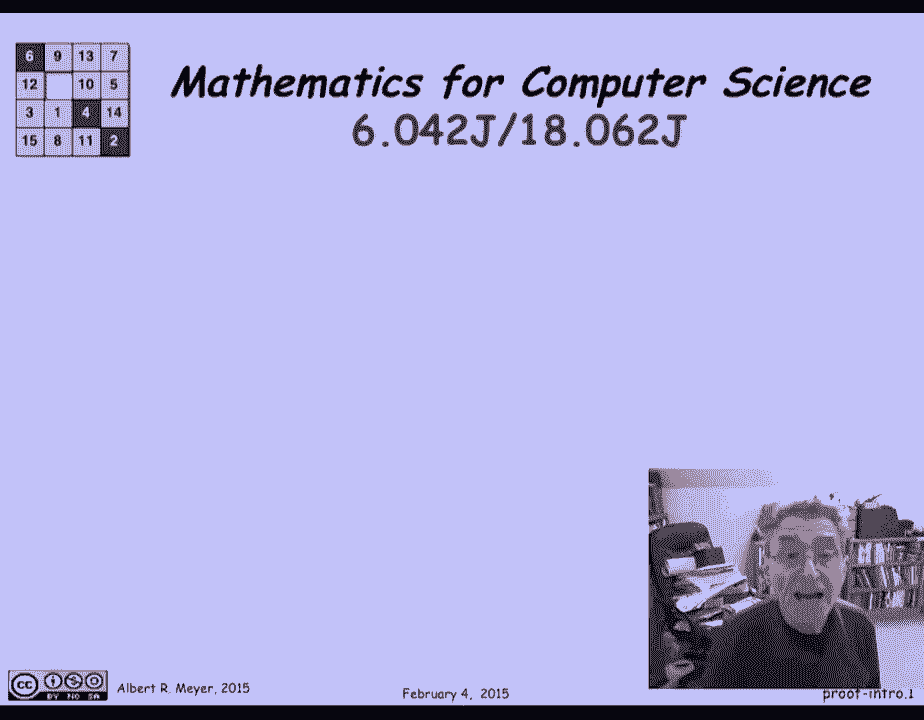

# 【双语字幕+资料下载】MIT 6.042J ｜ 计算机科学的数学基础(2015·完整版) - P1：L1.1.1- Welcome to 6.042 - ShowMeAI - BV1o64y1a7gT

这是计算机科学的数学，六零四二j十八o六二j，电气工程与计算机科学和数学的联合学科。

欢迎导师是亚当·查拉教授和阿尔伯特·梅尔教授。

我是艾伯特你好。

快速总结本课程的内容，是关于，呃，计算机科学家几乎都经常需要的数学，这是你在标准微积分课上不太可能遇到的，你可能在高中见过一些这种东西，比如说，在微积分课程中，人们谈论实数上的函数。

有时他们会谈论复数上的函数，但是计算机科学家通常处理数据类型上更抽象的函数，甚至函数上的函数，我想知道你们中有多少人，如果我让你抽象地定义什么是函数，可以在几周内在这门课上给出这个定义。

你可以很方便地做那件事，我们还将讨论各种标准离散结构，从数字开始，我们认为这是一个结构，因为它是包装在上面的操作的数字，就像加号、乘法和幂，我们还将讨论各种其他标准图形数据结构，像图形和树。

我们将研究计算这些数字的方法，不同类型的数据结构作为计算机科学中一个典型的基础问题，您通常想知道搜索空间有多大，比如说，密码的搜索空间最好大，或者一个饼干可以把它们都搜索一遍找到一个有效的。

最后我们将讨论离散概率论，这只是概率论的一个版本，在那里我们可以用和来度过，而不是进入积分的复杂性。

所以这里有一个快速的理智检查或词汇检查，你知道离散是什么意思吗，我会给你一个提示，这并不意味着离散，如果你不知道。

