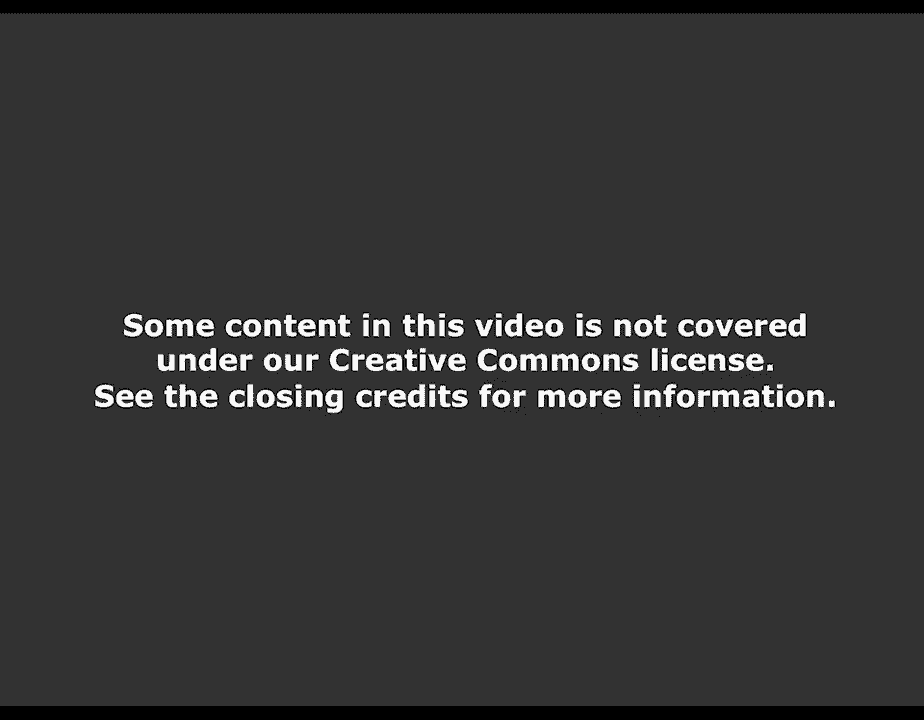
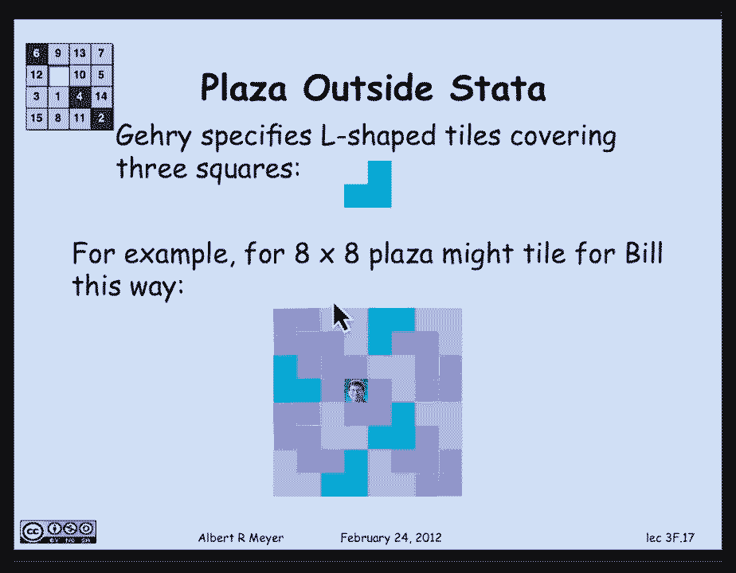
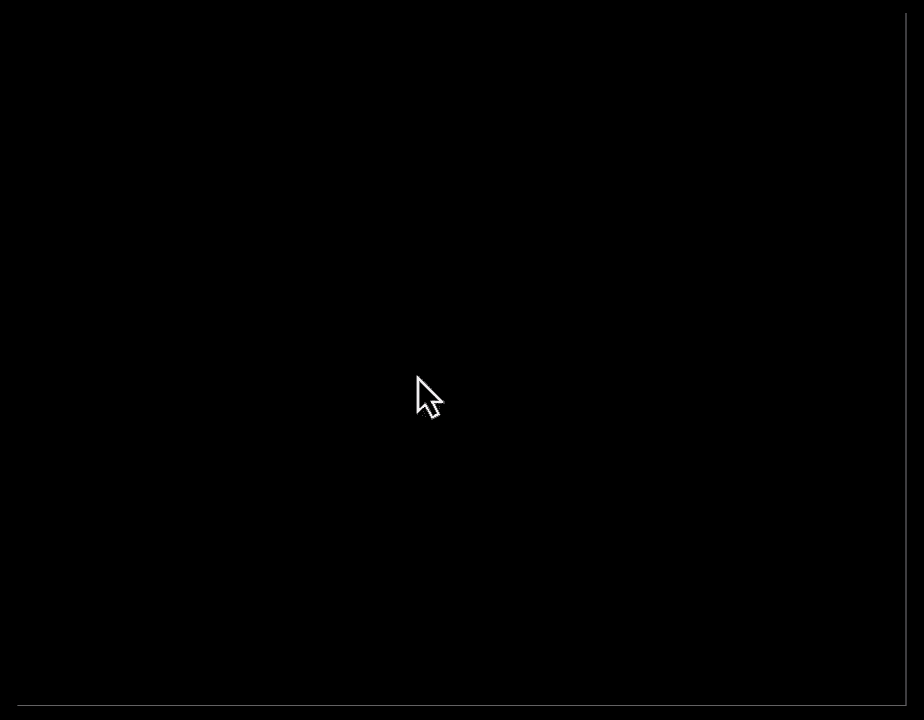
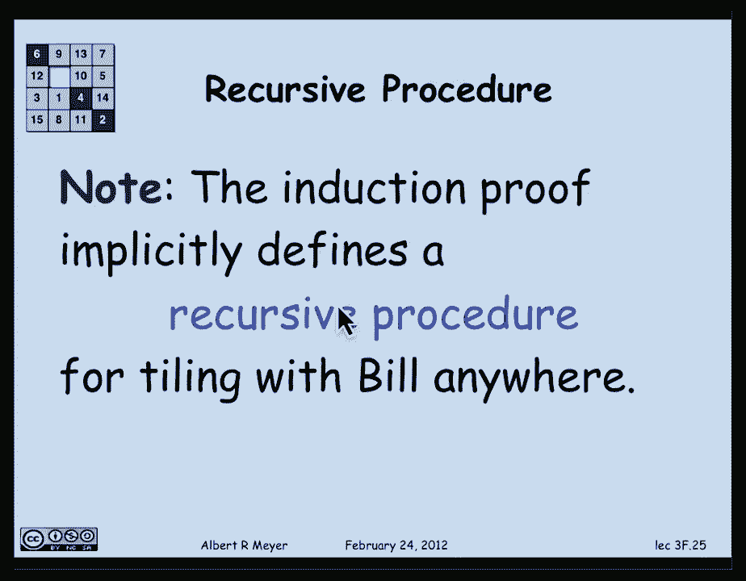
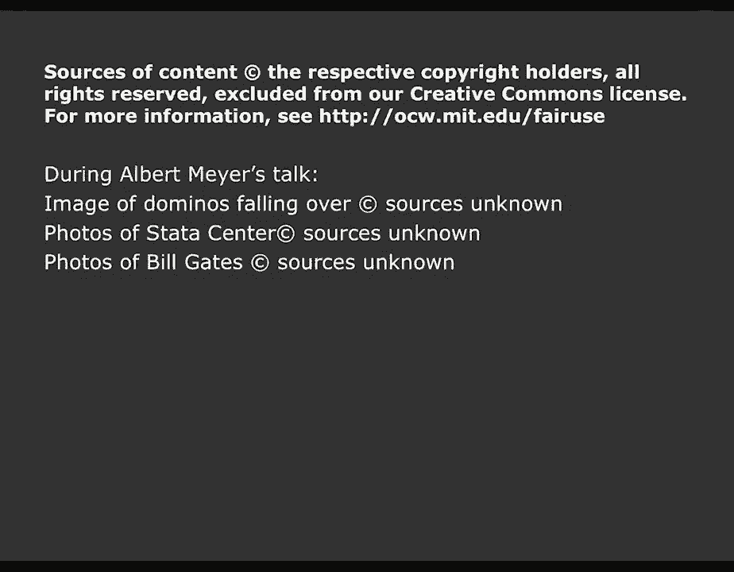

# 【双语字幕+资料下载】MIT 6.042J ｜ 计算机科学的数学基础(2015·完整版) - P20：L1.8.1- Induction - ShowMeAI - BV1o64y1a7gT

所以我们现在来讨论归纳法的话题，这是高中课程的标准部分，你可能以前见过，但仍然值得我们在这门课上看东西的水平上看，所以归纳法的概念可以是解释它的一种方式是这样的，假设我计划为非负整数分配颜色，就像。

在这个例子中说，我的颜色是零蓝，一红，二蓝，三红，四绿，五绿，继续前行，还在继续，不知何故，好的，现在我要向你们描述一种我心目中的颜色，我们看看你能不能弄清楚是什么，下面是我的着色的属性，首先呢。

我没有染红，我也继续上色了，满足以下规则，如果我有一个整数，在一个红色整数旁边，然后它是红色的，也是，红色整数旁边的任何整数都是红色的，也是，那么我的颜色是什么，嗯，你显然意识到，如果它们都是红色的。

他们必须在那里，他们在那里，这实际上是一个陈述，可以理解为归纳法规则的陈述，这是一个关于数的不言而喻的公理，但让我们抽象地陈述一下，所以首先，归纳法假设你有一些数的性质，称之为红色R和零的R。

你还被告知零的r意味着一的r，1的r表示2的r，2的r表示3的r，一般来说，n的r意味着n的r，加一，以此类推，所以我们把它写成了一个无限的含义集，强调这就是我所说的规则。

如果一个整数紧挨着一个红色整数，那它的红色是，它实际上是无限多不同含义的速记，每一个都必须保持，为了让你能够应用归纳法，嗯，你能得出什么结论，如果所有这些都能让你，那么你可以得出零是红色的结论。

一个是红色的，第二个是红色的，n是红色的，以此类推，好了，现在，嗯，当然啦，有一种更简洁的方法来表达这两个先行词，在线上和在线下的结论，使用量词，即先行词可以简单地用两个谓词公式来表示。

零逗号的r对于所有n的r意味着n加1的r，这实际上是我们在第一张幻灯片上说的话的总结，如果一个整数小于一个红色整数，然后它是红色的，也就是n加1在n旁边，如果n是红色的，那么n加1是红色的，同样的。

线下的东西，呃那个零的r，1等于零的r简单地表示为对于所有m保持的m r，这就是归纳规则的形式，据说如果你证明了r为零，你已经证明了，意味着n加1的r，那么你就可以得出结论，对于m中的每一个m r。

其中变量都在非负整数上，顺便说一句，请注意，我在代入中的行上方使用了n作为变量名，和m表示下面的变量线，在随后的，我可以为绑定变量使用任何我喜欢的名称，就像在，定义过程时，您可以命名过程的参数。

你喜欢的任何东西，因为它们是局部变量，我在底部用了一个m，在顶部用了一个n，只是为了强调，这些变量彼此无关，这一点有时会让学生感到困惑，好的，有时归纳法可以用多米诺骨牌来解释。

你让所有这些多米诺骨牌挨着排成一行，你把它打翻了，打翻下一个，以此类推，如果这能帮助你思考和记住，多米诺骨牌那很好，好的，让我们应用归纳法，也许最基本和标准的应用之一是证明一个数字恒等式。

所以让我们证明一个我们以前真正见过的，这是我们以前证明过的公式，利用几何和的井序原理，几何和，r与0的和r与1的和r与n的和，这等于r除以n加1减去1，除以r-1。

所以这个n加1项的和实际上可以简洁地表示出来，有一个相当单一的，一个简单的术语，当然，这只在r不是1的情况下才有效，因为我不能有分母，等于零，所有的权利，嗯，我们如何证明，我要去证明，在我做证明的同时。

我将向你们展示一种标准模板，你可以拿出来做感应证明，所以模板只是一种组织方法，嗯，做证明，呃，我在做，洋红色的模板，所以这才是真正的形式，非实质性，这里面没有数学，这只是我们要组织校样的结构。

至少在开始的时候，所以我们开始了，你要做的第一件事就是告诉你的读者你将使用证据，通过归纳法帮助他理解将要发生的事情，所以你从这条线开始，对n的归纳法证明现在n不是品红色的，因为有时你使用不同的变量。

有时断言中会有很多变量，所以你需要告诉读者，哪一个是你要应用归纳法的，也就是说证明最重要的部分，证明，通常有错误的部分，如果哪里有错误，通常是在没有归纳假说的情况下，或者是被误导的归纳法假设。

所以模板的下一部分说n的归纳假设p是，在这种情况下，我们的归纳假设是，这个等式成立，这就是我们要证明的，所以归纳法假设是目标的p，然后含蓄地说，当我们用，这个归纳法假设是为了证明对于n的所有np都成立。

此恒等式适用于所有非负整数，好的，在陈述了归纳法假设之后，我们要做的第一件事就是在基本情况下工作，那就是证明n等于零，现在我们告诉读者它是n等于零，因为有时从n等于1开始很方便，或者n等于二。

然后你就得出结论，这个性质对所有n大于，或等于1，或者所有n都大于等于，无论你从哪里开始，所以我们从零开始，哪个是标准的地方，嗯，我们要检查什么，当n到时，我们必须检查左边的和，当n为零时，当n为零时。

等于右边公式的和，当n为零时左边的和，真的只是一个，因为它从r到零再到r到零，r和r的平方，他们有点误导人，因为他们不是真的在那里，当n为零时，所以左手边是一个，右手边是r-1除以r-1，这是一个。

因为r不是1，所以它果然检查了，我们都很好，n等于零的情况现在已经证明了，所以说，我们要在模板中做的下一件事，就是去归纳步骤，这就是我们假设n的p成立的地方，我们可以使用n的p假设。

为了证明n加1的p成立，我们对N的唯一了解，另外，n的p成立，就是n大于或等于零，我们的证明必须适用于所有大于或等于零的可能n，好吧好吧，现在我们可以开始做与，我们实际上试图证明的内容。

这就是我想证明的，这是n加1的p，它是通过将前一个方程中的末端替换为n加一得到的，我希望没问题，我怎么去那口井？我可以假设n的p，看起来已经是这样了，这是一个好头，从得到n加1的p开始。

所以我可以假设这个等式对n成立，我不知道n是什么，除了它是一个非负整数，但这个等式对n成立，我必须证明它对n加1成立，嗯，如果你看看这个，我想证明的是关于R的和，n加1，所以给出这个方程。

我可以把左手在里面变成我感兴趣的和，那是r到n的幂之和，再加上r的一次幂只要把r加到n的两边再加上1，和明显的战略举措或战术举措，好的，所以这样做我得到了这个平等，我现在已经从归纳法假说中证明了这一点。

即从r到n加一的和，这正是我所感兴趣的，等于右边的这个代数表达式，如果我幸运的话，我当然会在右手边，将被简化为目标表达式，用n加1代替n，所以发生的事情是，让我们把r加n加1在这个公分母上，r减1。

我得到了第二个学期，然后你可以做一点代数简化，琐碎，你肯定会意识到，它简化为r到n加一，加1减去1/r减去1，这正是我希望证明的平等，所以说，事实上，在这一点上，我们可以说，我们已经证明了n的p加一。

我们已经完成了感应证明，归纳证明的第一个基本例子，整个模板现在都可见了，除了可能应该有一个QED或一个done语句，好吧顺便说一句，我们已经看到了这个的一个小问题，和中出现的三个点称为省略号。

复数是椭圆，它们被用于作者试图告诉读者，有一个明显的模式，读者应该看到，我认为这很清楚，在这种情况下，你去，你知道它是r到0，R到那个，R到两个，R到三个上面，到R到N，困难在于有时椭圆会造成一些混乱。

比如说，我们必须计算出当n为零时，左手边实际上只是一个，刚刚是r的零次方，所以r和r的平方并不存在，一种方法真的可以避免那种栅栏柱的问题啊，你所展示的，为了弄清楚图案是什么，你表现出的比它更多。

比可能永远表现出的模式更多，必须使用精确的数学符号，我实际上告诉你I的模式，然后告诉你应该从i=0和到n，所以西格玛符号是一些，我告诉你，我，和中的第n项是r对i，它将从i=0运行到n。

所以这是一种用于for循环或do循环的数学符号，从i=0到n，在i中添加r，加r到i，呃，有一些符号肯定更精确，呃，但有时它实际上比简单地向你展示模式更难读懂，因为图案往往是可见的，好的。

现在让我给你讲一个小故事，这是个编造的故事，但讲起来很有趣，嗯，这是熟悉的建筑，数据中心，嗯，这实际上是一个设计模型，为麻省理工学院团队制作的架构师，监督大楼的建造和设计。

展示学生大厅学生街会是什么样子，现在故事是这样的，嗯，学生街计划的哪一部分是要有一个广场，它将由单位大小的正方形建造，但数量不确定，会有一个参数来决定正方形和正方形的大小，正方形的大小实际上是二的次方。

所以会有2到N次，2到n个单位大小的瓷砖，把这个填满，这个广场和广场是用这些单位瓷砖铺成的，但有一个瓷砖空间是空白的，这样一个雕像，那么潜在的捐赠法案可以放在中间，作为他为大楼竣工捐款的激励。

他确实做到了，嗯，所以建筑师弗兰克·盖里提出了这个谜题，许多人认为他是弗兰克·劳埃德之后，赖特，加里是20世纪最伟大的建筑师，因美观原因而指定，他想在广场上铺L形瓷砖，由三个单位正方形组成。

他认为这会给出一个漂亮的设计，它实际上是这样做的，这里有一个平铺n等于3的例子，二乘二的立方等于八乘八的正方形，比尔在中间，有一个八乘八的广场，上面铺着这些L形的瓷砖，每个由三个单元瓷砖组成。

所以问题是，广场的确切大小将由其他建筑考虑因素决定，所以它的参数是n，这将是2到n乘2到n，问题是，你总能找到这样的瓷砖。

不管方块有多大，把比尔留在中间。

嗯，让我们试着用归纳法来证明，归纳假说，试图证明一个定理，对于任意2到n乘2到n广场，我们可以让比尔和弗兰克开心，这就是比尔在中间时的快乐，弗兰克很高兴看到广场的其余部分都覆盖着L形瓷砖，顺便说一句。

中间有点模棱两可，因为中间真的有四个正方形，但当然你填哪一个并不重要，因为如果你想要一个不同的，你可以把整个正方形旋转一下，把四个中间的方块中的任何一个空出来给比尔雕像，好的。

归纳法证明将通过对某物或其他事物的归纳法来进行，显而易见的是定理陈述中的结尾，归纳法假设直截了当地说，我们可以把这两个平铺到n上，把这两个平铺到n广场上，中间是比尔，好的，基本情况是n等于零。

那是二比一，二比一，这是一个接一个的正方形，好的，嗯，没问题，你只要把比尔放在一个正方形里，剩下的你用没有L形的瓷砖瓷砖，符合规则的基本情况n等于1，n等于零好了，所以现在我们来到了双倍大小的正方形。

2号的正方形，n加1乘2到n加1，我得把比尔铺在中间，但我有一个相当有力的归纳假设，我可以假设，就是我可以把一半大小的正方形，2到n乘2到n的平方把比尔放在中间。

所以很明显双倍大小的正方形是由四个半大小的正方形组成的，所以我可以试着填满整个广场，那是全尺寸正方形或双尺寸正方形的两倍，二乘n加一乘二乘n加一，用我的能力用L形瓷砖瓷砖，把比尔放在这四个子方块的中间。

所以我可以假设，现在我真的卡住了，什么，我该怎么办，我如何使用这个能力，把比尔放在这四个象限的中间，为了上色，用n个形状的瓷砖把整个东西填满，这个例子的重点是向您展示摆脱困境的方法，这有点出乎意料。

我实际上要通过证明一些更强的东西来摆脱困境，我要证明我们能找到瓷砖，使用L形正方形，把账单放在你喜欢的任何指定的正方形里，你想把它们放在哪里，剩下的我可以用L形瓷砖瓷砖，并将指定的单格留空。

以便将帐单插入，把比尔的雕像放在那里，所以这不直观的是，我证明了一些更强的东西，为了更难证明是对的，我试图证明一个更有力的结论，我也有一个更强的归纳假设来进行证明，而净证明实际上，你会看到会更容易。

所以让我们用更强的归纳假说来做，定理也是对n的任意二乘n的二乘n的平方，我们可以让比尔和弗兰克，快乐，用n上的归纳法证明，我又叫它p of n了，我可以在任何地方用比尔铺正方形，所以基本情况n等于零。

和之前一样，嗯，只是一个接一个，所以我把比尔放在唯一的瓷砖里，中间和角落都是，归纳步骤的基本情况不变，现在，我有一个更有力的东西，我可以假设是归纳假说，我可以假设在任何给定的2到n的平方中。

2到n任意给定的平铺位置单位，二的正方形到n乘二的正方形到n的正方形，我可以用L形的方块平铺其余的，然后得到比尔，我想让他们在哪里，我必须用这个假设来证明我可以在任何地方得到比尔，这在二中是必需的。

n加1乘2到n加1平方，所以假设我们要在指定的任意正方形中平铺Bill，n加1乘2到n加1广场，我们碰巧选择了一个位置，比尔在右上象限在右上半大小的正方形中，所有的权利，所以根据假设。

我可以用L形瓷砖填充紫色的方块，把比尔留在那个地方，他应该很好，其他三个的诀窍是这样的，因为我可以和比尔一起瓷砖，任何地方，我要把它们和比尔贴在一起。在其他三个子方块的各个角落。

它们在全尺寸广场的中心相遇，如图所示，现在这样做了，很明显如何填满整个，二乘n加一乘二乘n加一个广场，因为我要把这四块碎片拼在一起形成完整的尺寸，2到n加1乘2到n加1广场看。

我只是在中间放了一个L形的瓷砖，填满那三张角落的钞票，我受够了，证明是完整的，我们刚刚通过归纳法证明了，事实上，你可以用2平方的幂来平铺2的任何幂，你想让他们去哪里就去哪里，其余的用L形瓷砖填充，现在。

请注意，这个过程的一部分实际上是隐式定义的，如果你观察证据的方式，如果我要写一个递归过程来做平铺，我会做的是说，好的，你给我输入n加一，就是尺寸，广场尺寸的规范，输入n加一或输入n表示，2到n乘2到n。

我是怎么做好的，嗯，你告诉我你想去哪里，Bill be是另一个参数，然后我会，那就是让我自己用尺寸参数做正方形，减去一，每个象限四次，每次指定在这些季度，其中我希望Bill是递归过程。

将返回这四块的L形瓷砖，然后我把它们放在一起，中间的瓷砖，我最终得到了整个地区的瓷砖，所以我刚才说的是，一个非常容易编写的递归过程的描述，它将打印出作为输入的L形瓷砖的图片，任意数n，事实上。

这就是我们如何得到八乘八的瓷砖，尽管我们是手工做的，而不是编写程序。

