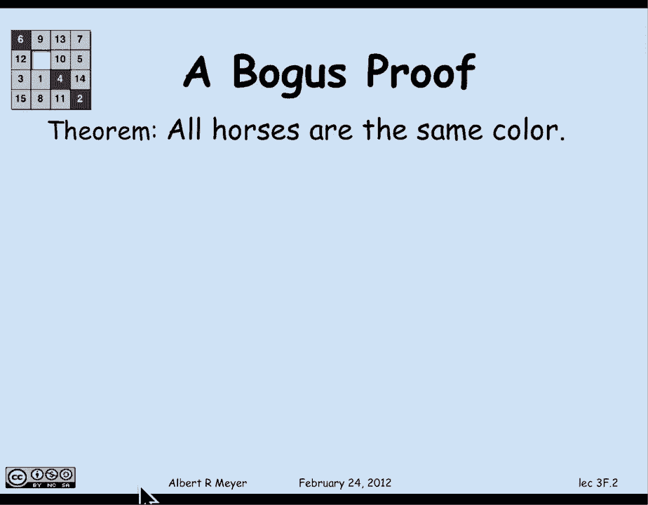

# 【双语字幕+资料下载】MIT 6.042J ｜ 计算机科学的数学基础(2015·完整版) - P21：L1.8.2- Bogus Induction - ShowMeAI - BV1o64y1a7gT

understanding proofs includes the。

ability to spot mistakes in them and as，a test of that skill and also your。

understanding of induction let me see if，I can put one over on you I'm gonna show。

you a bogus proof by induction and I'm，gonna prove something that's patently。

absurd namely that all horses have the。

same color say they're all black so，there's a bunch of black horses with。

maybe some highlighted Brown Mane's。

all right I'm gonna prove this by，induction and for a start。

there's no end mentioned in the theorem，so that's common for various kinds of。

things that you need to prove by，induction so I have to rephrase it in。

terms of n it's gonna be by induction on。

n the induction hypothesis is gonna be，that any set consisting of exactly n。

right。

let's proceed to prove this now I'm，going to use the base case N equals 1。

just because I don't want to distract，you with suspicions that the base case N。

equals zero that is know horses is，cheating somehow the B in fact be。

perfectly legitimate to start with N，equals zero and argue that all the。

horses in the empty set have the same，color because there's nothing in the。

empty set however let's not get into。

that well we'll start with N equals 1，and indeed if you look at any set of 1。

horse it is the same color of its as，itself and in fact I've proved the base。

case N equals 1 all right let's keep，going now in the inductive step I'm。

allowed to assume that n horses have the，same color where n is any number greater，than or equal to 0。

now right here students complain that，that's not fair because you're already。

assuming something false and that's，absurd well yeah it is absurd but that。

can't be the problem I'm just allowed to，assume an induction hypothesis all I。

have to do is prove that and implies n，plus 1 since it's absurd there would it。

be some problem with the proof well。

let's watch and say if there's a problem，with the proof so again I。

assume that any set of n horses have the，same color I have to prove that any set。

of n plus 1 horses have the same color。

how will I do that well there's a set of。

n plus 1 horses and let's consider the，first n of those horses now by induction。

hypothesis the first end of them have，the same color black maybe ok。

well so by induction hypothesis the，second set of n horses that is all but。

the first horse have the same color yeah。

and what that tells me is that the first，and the last horse have the same color。

as all of the horses in the middle and，therefore in fact they all have the same。

color end of proof QED。

all right so there better be something。

wrong and what's wrong well what's wrong，is that the proof that P of n implies P。

of n plus 1 is wrong it looked good but，the proof that P of n implies P of n。

plus 1 has to work for all N greater，than or equal to the base case and if。

you look at this proof it doesn't work，in in the base case when n is 1 and。

you're trying to go from the base case，to 2 and so on by implication the proof。

breaks down because what happens with，our argument in the case that we're。

trying to prove that p of n implies P of，n plus 1 in the case that N equals 1。

well in that case there aren't any，middle horses n plus 1 is 2 so there's a。

first horse and that's the first n，horses and then the second had a set of。

n horses is the other horse and there。

are no middle horses that they both have，a color in common with so the proof just。

broke there but you might not have，noticed because that was the only place。

that was broken this is a case where we。

were misled by ellipses by the way where。

because I was drawing n plus 1 horses，with Allah showing a lot of horses with。

dots in the middle it looked like there，were some but there weren't and。

again the boys I said the point though。

is that the only fallacy in this proof，was that it didn't work when n was 1 but。

it certainly worked and for implying，that if all sets of two horses are the。

same that does imply that all sets of，three horses are the same color and。

again it's a false will imply anything a，kind of example but even here the the。

proof was logically ok but if it breaks，at one place if there's one Domino。

that's missing from the line when the。

