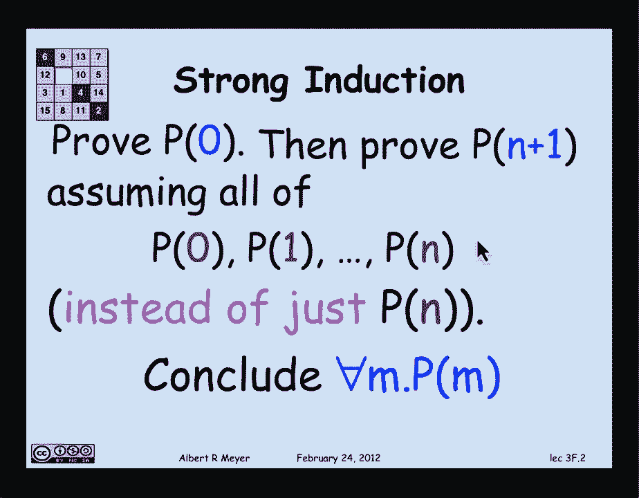
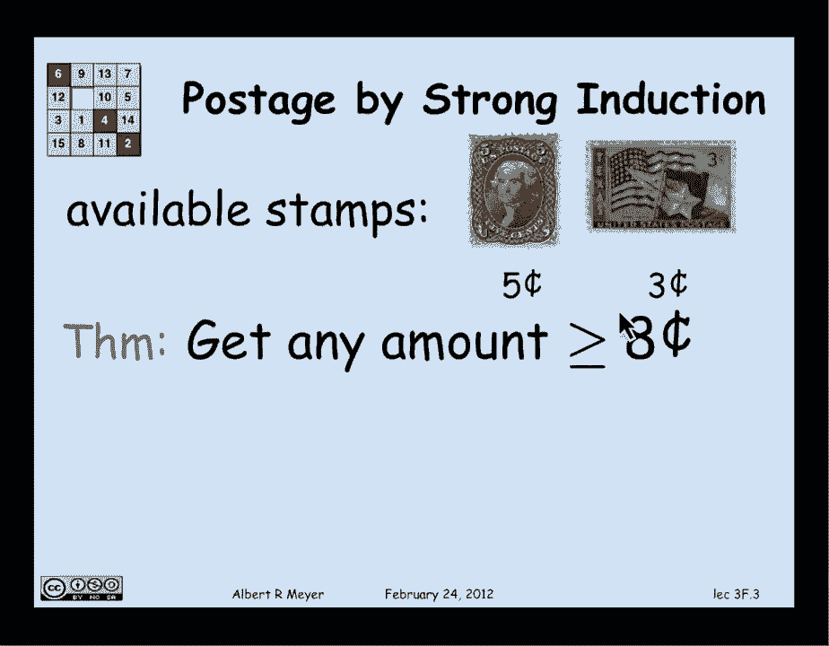
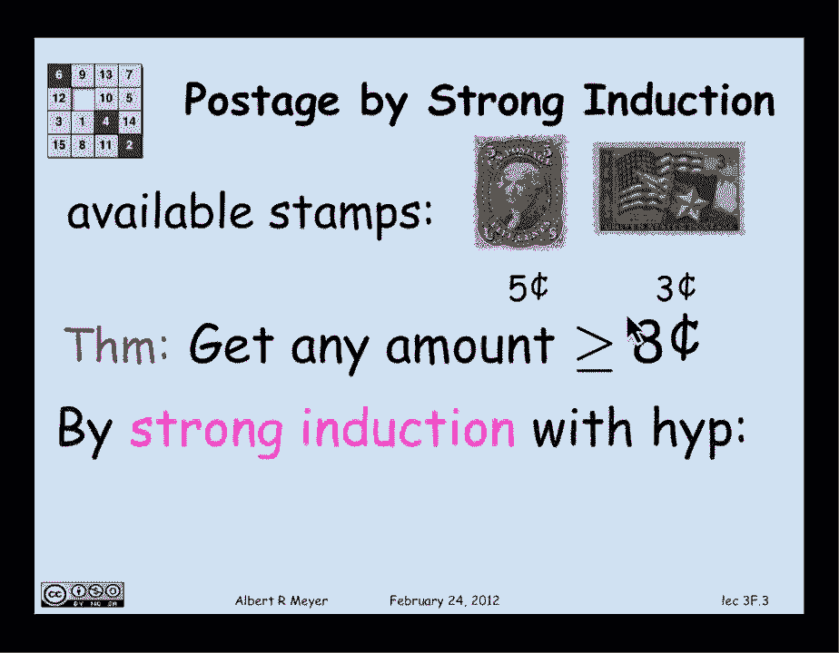
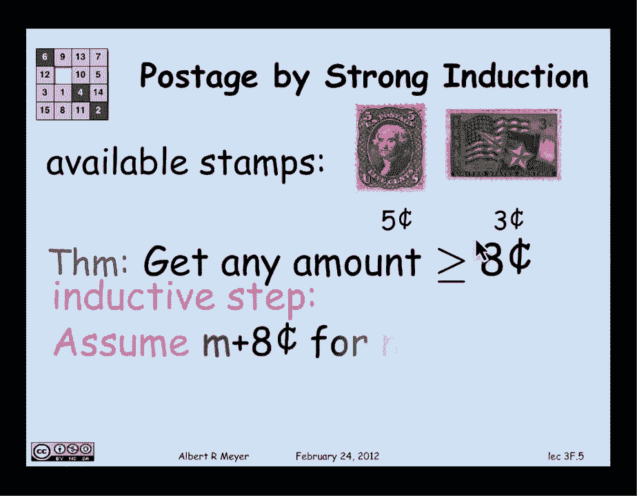

# 【双语字幕+资料下载】MIT 6.042J ｜ 计算机科学的数学基础(2015·完整版) - P22：L1.8.4- Strong Induction - ShowMeAI - BV1o64y1a7gT

so now we come to a interesting variant。

of ordinary induction called strong，induction and here's how it works。

strong induction just as with ordinary，induction you prove the base case P of 0。

you're trying to prove for all N P of n，so you prove P of 0 but now in order to。

prove P of n plus 1 in the inductive。

step assuming P of N with ordinary，induction with strong induction you can。

assume not just P of n but you can，assume P of 0 P of 1 all of the。

properties that all the numbers up，through n have the property and from。

this of course you could conclude that，for that everything has the property。

that for all N P of M now an intuitive，way to justify this is you think about。

it the way the induction works is you，start off at 0 and then you make a step。

to 1 and you make another step to 2 and，you make another step to 3 and the。

induction step going from n to n plus 1，justifies each of those steps by the。

time you get to N and you have to prove，you can get to n plus 1。

you've already been through 0 1 up to n，you might as well take advantage of that。

fact instead of only remembering that，you're at the end step you might as well。

remember that you got there that's an，intuitive hand-wavy argument which can。

be justified formally in a way that will，emerge in the next segment so let's hold。

off on that and just bite the bullet and，accept this as a basic principle of math。

that we're gonna live with and use all，right as an application of it let's。

prove something that we've already，proved by well ordering in fact strong。

induction well ordering are closely，related as will also discuss later so。

let's prove that using 3 & 5 cent stamps，that you can get any amount of postage。

greater than or equal to 8 cent stamps，and I'm gonna prove this by strong。

induction with the induction hypothesis，P of n that says I can form n plus 8。

cent stamps clearly if I can prove for，all n P of n then I've proved that I can。

get for every amount greater。

equal to 8 cent stamps and let's do the。

base case well the base case P of 0 can，I make 8 cent stamps sure 3 & 5 that's。

that one and that's okay for the。

inductive step I have to get aa M I'm，allowed to assume rather that I can get。

M plus 8 cents for any M from n down to，zero instead of just assuming that I can。

get n plus 8 cents to get n plus 1 plus，8 cents I can assume any amount less。

than what I'm aiming for so I may as，well assume that I can get any amount of。

postage from 8 up to n plus 8 cents and，my objective then is to get n plus 1。

plus 8 cents namely and plus 9 cents so，I have to prove that for all N greater，cents。

assuming I can get from 8 to n plus 8。

cents well it's not too hard to do the，inductive step is actually going to。

break up into a couple of cases，depending on other value event have to。

prove n plus 9 cents for all n so。

suppose N equals zero I have to get 9，cents。

well three threes if n is one I have to，get one plus nine cents or ten cents two。

fives so those cases are disposed of so，now my job is to get n plus nine cents。

where n is greater than or equal to two，well the nice thing about n being。

greater than or equal to two is that if，I subtract two from it it's a smaller。

number and it's still non-negative and，that means that I can get that amount。

plus eight cent stamps so I'm in this，nice situation where I buy strong。

induction I can get n minus two plus，eight cents dance there they are and how。

do I get 2n plus nine well it's easier，at a 3-cent stamp and you have n plus。

nine cents which completes the proof of，the induction case and the whole theorem。

is proved，we can conclude then that it works for，all n and that you can indeed get n plus。

eight cents using three and five cent。

stands for all of them so much for that，example alright let's look at another。

example this is a game that we used to，play in class you start off with a stack。

of blocks say ten blocks and you're，allowed to make a move that consists of。

splitting the stack into two smaller，stacks so if the stack has height a plus。

B you can split it into a stack of，height a and a stack of height B and you。

get a score for that move the score is 8，times B and then you keep doing that。

until you can't make any more moves that，is when all you have left our stacks of。

height 1 which you can't split anymore，and then your overall score is the total。

that you got for all the moves that you，made until that point now when we played。

this in class we would have students，competing and they would try various。

strategies so one strategy the the，simplest strategy maybe not the best but。

the simplest strategy would be you start，off with a stack of 10 so you take one。

off and that leaves you with a stack of，1 and 9 your score is 9 then you take。

another one off of the stack of 9 and，you're left with a 1 and an 8 your score。

is 8 and so on and you can see in fact，if you took the one-at-a-time。

process then your score with a stack of，hide n would be n minus 1 plus n minus 2。

Delta 2 plus 1 another strategy that，might be sort of more in the spirit of。

computer science would be to keep，splitting in two，so for example if you had a stack of。

height n you can split it into two fives，and then you take one of the fives and。

split it into a three and a two and then，you'd split the two into two ones and so。

on splitting as evenly as you can each，time and it seems like it might be a。

better strategy and again we would have。

students try various strategies and，guess what they all came in in a tie and。

that's what we're going to prove now，every way of unstacking end blocks gives。

the same score well what's，score well we know that the score for。

the simple strategy of taking one block，off at a time is this sum from 1 to n。

minus 1 and that has a nice formula n，times n minus 1 over 2 so we can。

formulate our claim that no matter how，you play the unstacking game with a。

stack of size n your final score will be。

n times n minus 1 over 2 and we're going，to prove this by strong induction with。

this statement called a claim of n is，going to be the induction hypothesis。

that's what we're trying to prove well，let's start in the usual way the base。

case is N equals 0 well you might be，bothered that's no blocks well let's see。

what happens with no blocks the score is。

0 because there's nothing to do and，indeed the formula that is alleged to be。

your score comes out to be 0 so in the，base case N equals 0 works let's。

continue for the inductive case I have，to assume that the given score formula。

holds for all stacks of height and or，less and I have to prove that it holds。

for a stack of height n plus 1 that is，that an N plus 1 stack score is n plus 1。

times n over 2 well how shall I do that，well I'm gonna split the inductive case。

into two cases it turns out that I need，to prove that C of n plus 1 holds。

assuming C of n fir and less than n but，in particular let's just deal with the。

case that n plus 1 is 1 the smallest，value it could have and knock that one。

off separately namely if the stack is of，height 1 again my score is zero because。

there's no move to make and the formula，still evaluates to 0 so in the case that。

n plus 1 is 1 I've proved the claim at n，plus 1 which I was obligated to do for。

the base case for the inductive step，well the other case in the inductive。

step is that n plus 1 is greater than 1，this is the interesting one because now。

it's possible to make a move so since n，plus 1 is greater than 1 it's 2 or more。

blocks I can make a move into 2 stacks，suppose I do，that suppose I split the stack of size n。

plus one into an a stack and a b stack。

where a and b sum to n plus 1 and what's。

my score gonna be then well my score on，that move that I make where I split into。

the a stack and the B stack is a B and，the rest of the game consists of playing。

as well as I can on the a stack and as，well as I can on the B stack but a and B。

is smaller than n plus 1 they're less。

than or equal to n which means that by，strong induction I know that no matter。

how I play on the a stack I'm gonna wind，up with this score a times a minus 1。

over 2 no matter how I play on the B，stack I'm gonna wind up with B times B。

minus 1 over 2 so that means that my，score on the a plus B stack is gonna be。

this form to let a be Plus 8 times 8，minus 1 over 2 plus B times B minus 1。

over 2 so you simplify that into to，organize it so it's a plus B times a。

plus B minus 1 which is exactly n plus 1，times n over 2 which is what we were。

trying to prove we've proved C of n plus，1 the inductive step is complete and。

indeed we've proved that no matter how。

