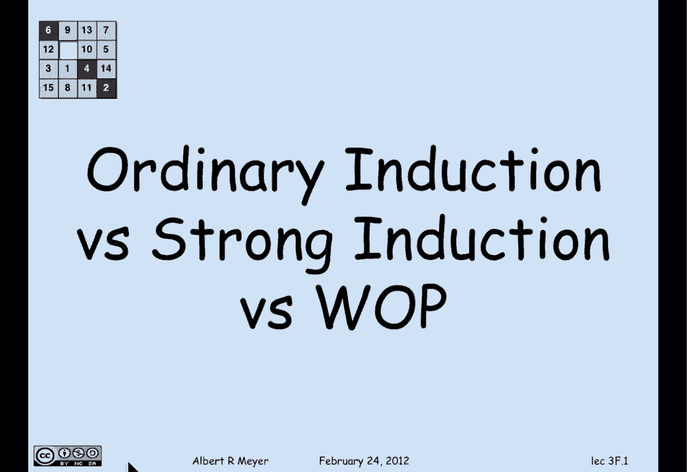
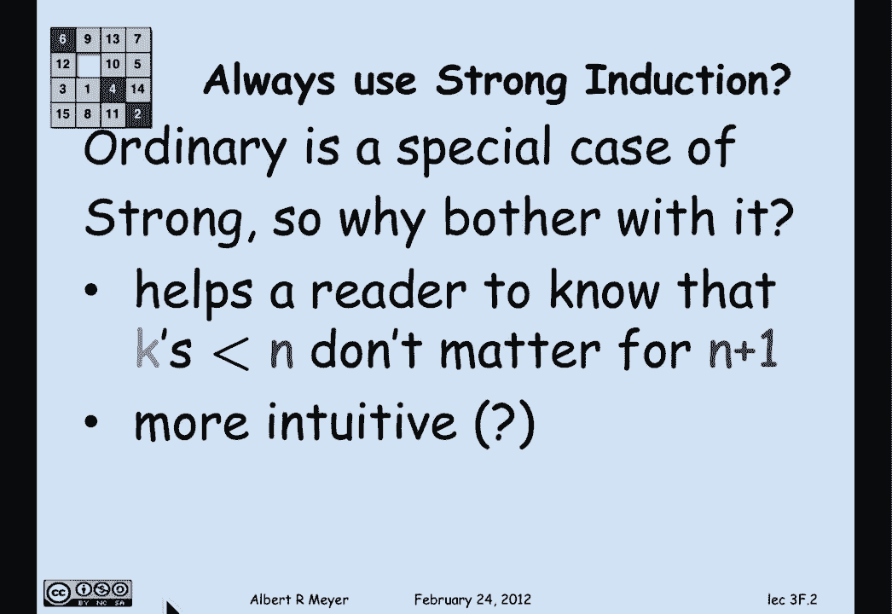
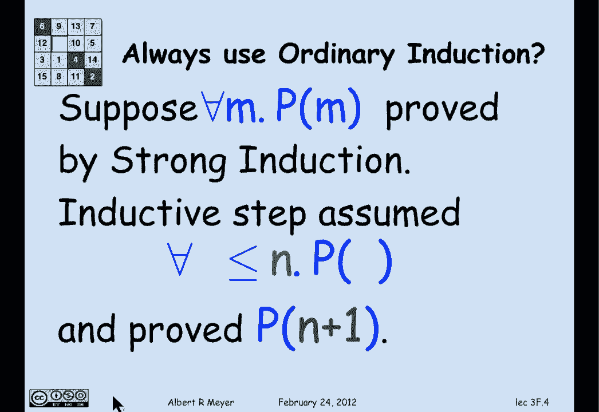
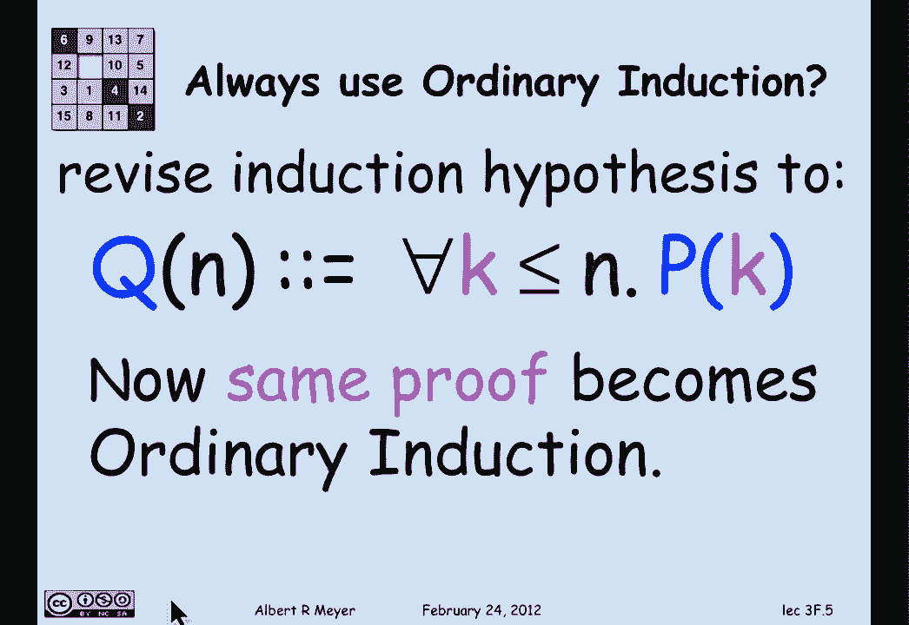
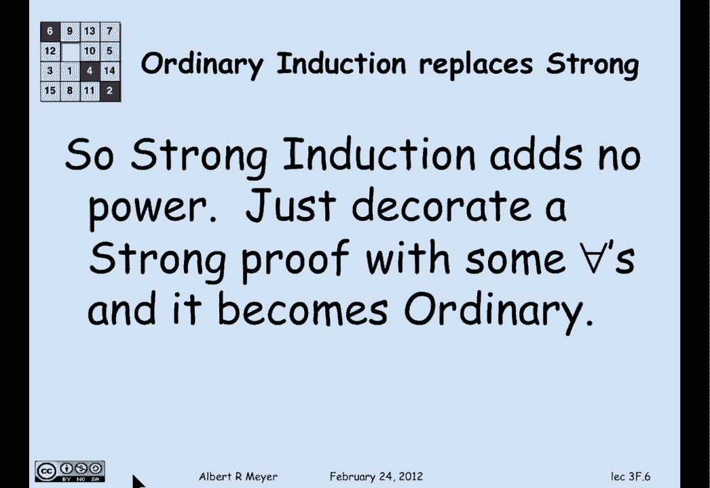
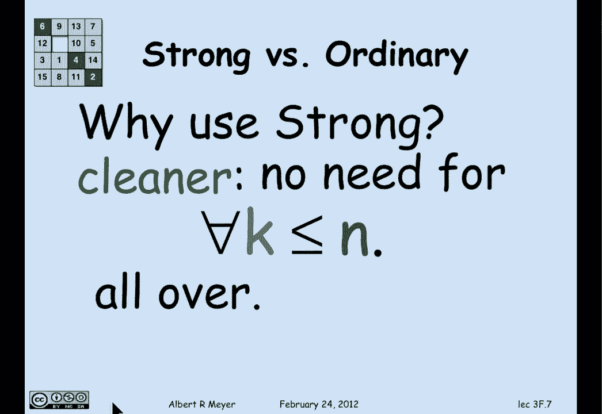
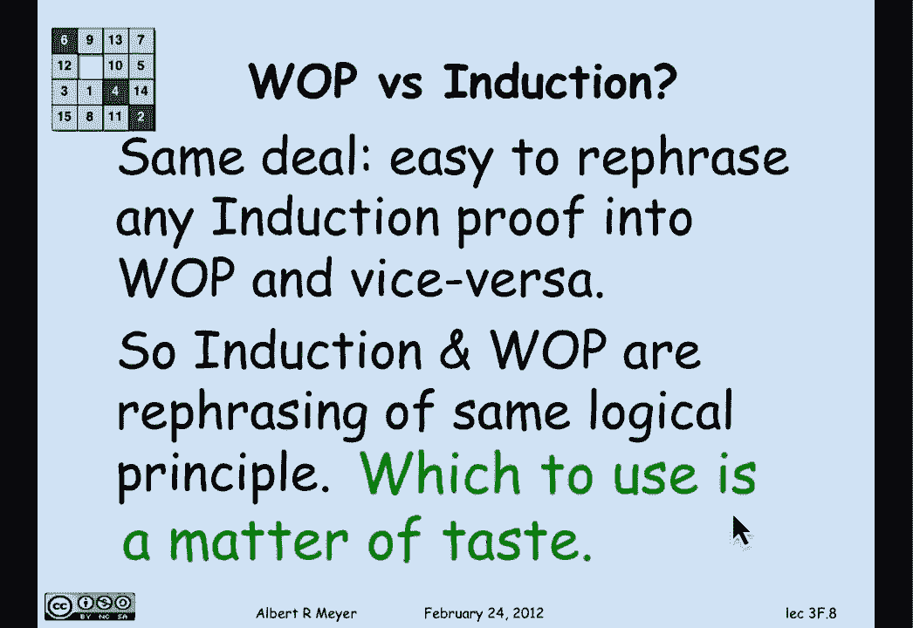
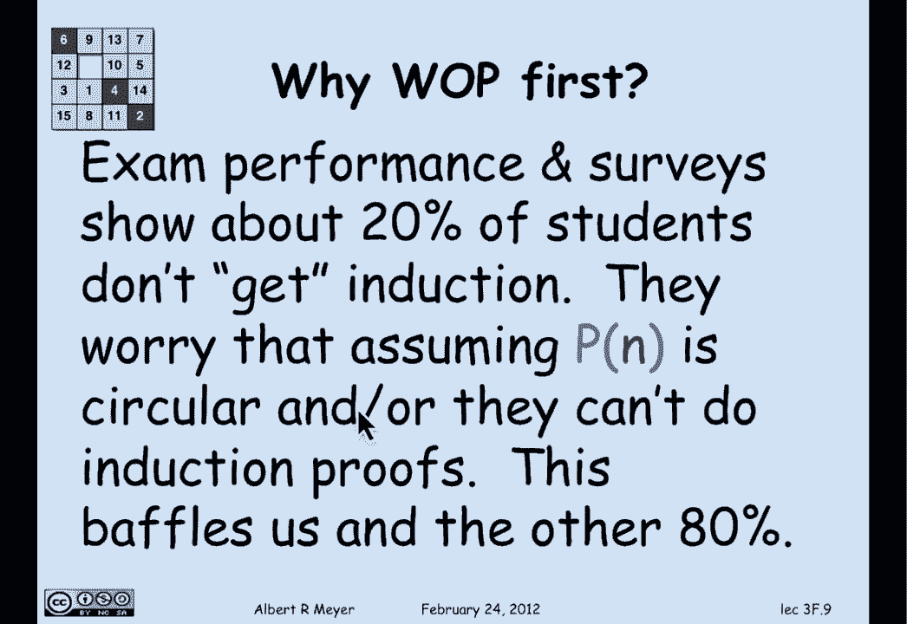
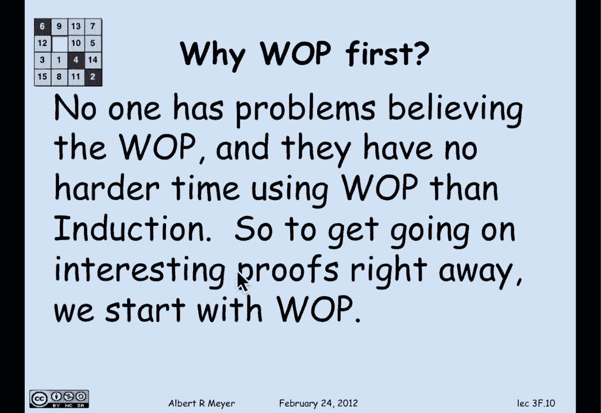

# 【双语字幕+资料下载】MIT 6.042J ｜ 计算机科学的数学基础(2015·完整版) - P23：L1.8.6- WOP vs Induction - ShowMeAI - BV1o64y1a7gT

so we come to the part that a lot of，students have been asking about but。

which in fact is entirely optional so，that if you care to stop this little。

piece of video welcome to it's not going，to appear on any exam or anything but。

people have consistently asked whether，how they choose which method of proof to。

use among ordinary induction or strong，induction or well ordering and the。

answer is that it's hard to tell them，apart because in a technical easy。

technical sense they're really all，equivalent so let's look at them one by。

one first of all it's clear that，ordinary induction is a special case of。

strong induction in ordinary induction，you're allowed to assume only P of N and。

strong you can assign everything from P，of 0 up to P of n to prove P of n plus 1。

but you don't have to use all the extra，assumptions you could just use P of n so。

that any ordinary induction can be seen，as just a special case of a strong。

induction would be a little misleading，to call it strong induction but it is。

strong induction so why bother with it，well your answers basically it's an。

expository difference it helps your，reader to know that the proof for n plus。

1 is only going to depend on n not on，the case that are less than n as they。

would typically in a genuine strong，induction proof second there's some。

argument that ordinary induction going，from n to n plus 1 is more intuitive。

than strong induction that goes from，anywhere less than or equal to n up to n。

plus 1 I'm not sure that I subscribe to，that but I've heard people make that。

claim all right there's another，perspective which is interesting and。

maybe surprising which is why not always，use ordinary induction oh wait a minute。

how do you replace strong induction with，ordinary induction well it's easy。

suppose that you've proved for all N P，of M using strong induction with。

induction hypothesis P of M what have，you done well，you've it's the same base case whether。

you using Orden，you're strong but in strong you would do，an inductive step where you actually。

assumed not just P of n but P of K for，all K less than or equal to n right and。

then using all those hypotheses about P，of K you prove P of n plus 1 in the。

strong induction well how do you turn it。

into an ordinary induction just let Q of，n be that assumption that for all K less。

than or equal to n P of K and if you，think about it for a moment just。

revising the induction hypothesis to，include that universal quantifier for。

all K less than or equal to n means that，the strong induction on P of K becomes。

an ordinary induction on a Q of N and we，have with a trivial change decorating a。

bunch of occurrences of formulas with。

with frawls we have converted and strong，induction into an ordinary induction so。

we see that strong induction and no，power above beyond ordinary induction it。

just lets you omit a bunch of universal，quantifiers that would otherwise have to。

be made explicit if you were going to do，it by ordinary induction ok then why you。

strong just precisely because it's。

cleaner you don't have to write those，for all K less than or equal to ends all。

over and now we come to the final，question about what's the relation。

between the well ordering principle and，induction well it's basically the same。

deal you can easily rephrase an，induction proof an induction proof just。

transform its template to fit the，template of a template of a well，ordering proof and vice versa and。

without going into the details of，exactly how because it's not important。

but it is routine it follows that well，ordering principle is not adding any new。

power or even new perspective on the，mathematics of any given proof it's just。

a different way to organize and tell the，same story，and it also means conceptually which is。

nice that these apparently different，inference rules strong induction。

ordinary induction while ordering，principle there's really only one and。

the others can be justified in terms of，it and explained as variations of it so。

that's intellectually economical to not，have a proliferation of different。

reasoning principles which brings us to，the question of which one to use and。

well I can say is that it's a matter of，taste the truth is that when I'm writing。

up proofs I will often try different，versions I'll try it by ordinary。

induction and I'll try it by well，ordering and I'll read the two and。

decide which one seems to come out more，cleanly and I'll go with that one so。

there isn't any simple rule about which，to choose but in a certain sense it，really doesn't matter。

just pick one the only exception to that，of course is when on an exam or similar。

setting you're told to use one of these，particular methods as a way to。

demonstrate that you understand it then，of course you can't pick and choose so。

finally we come to a pedagogical，question about why is it that in this in。

604 2 we taught well ordering principle，first in fact the second lecture and are。

only now in the third we at the end of，the third week getting to the induction。

principle which is much more familiar，and people argue is they like it better。

at least most of them well the answer is，that there it's a pedagogical strategy。

and it's one in fact which the authors，disagree with some I'm not united on my。

view is that we're better off doing well，ordering principle first and the reason。

is that our impression from，conversations with students and surveys。

and from exam performance shows that，only about 20% of the students get。

induction no matter how hard we try to，explain it and teach it they worry about。

they report worrying about things about，that assuming P of n to prove P of N。

plus 1 is somehow circular and they and，it's certainly measurable that 20。

percent or so of the class just can't，reliably do proofs by induction，now this。

baffles the 80% to whom it's obvious and，who know how to do it easily and it。

baffles us instructors we can't figure，out what the problem is that those 20%。

have and we've been trying to teach。

induction lots of different ways on the，other hand nobody has trouble believing。

the well ordering principle and working，with it and it certainly certainly don't。

have any harder time using it than they，do using ordinary induction or strong。

induction and this conceptual problem，about is it safe and do I really believe。

and it just doesn't come up with the，well ordering principle everybody agrees。

that it's obvious that a non-negative，set of a non-empty set of non-negative。

integers is going to have a least one，and so we chose to do well ordering。

right away because there's no overhead，in explaining it and it lets us get。

going on interesting proofs from the，get-go as opposed to waiting a while or。

spending a couple of lectures working，through induction and leaving that with。

the main if only method that people have，for proving things about non-negative。

