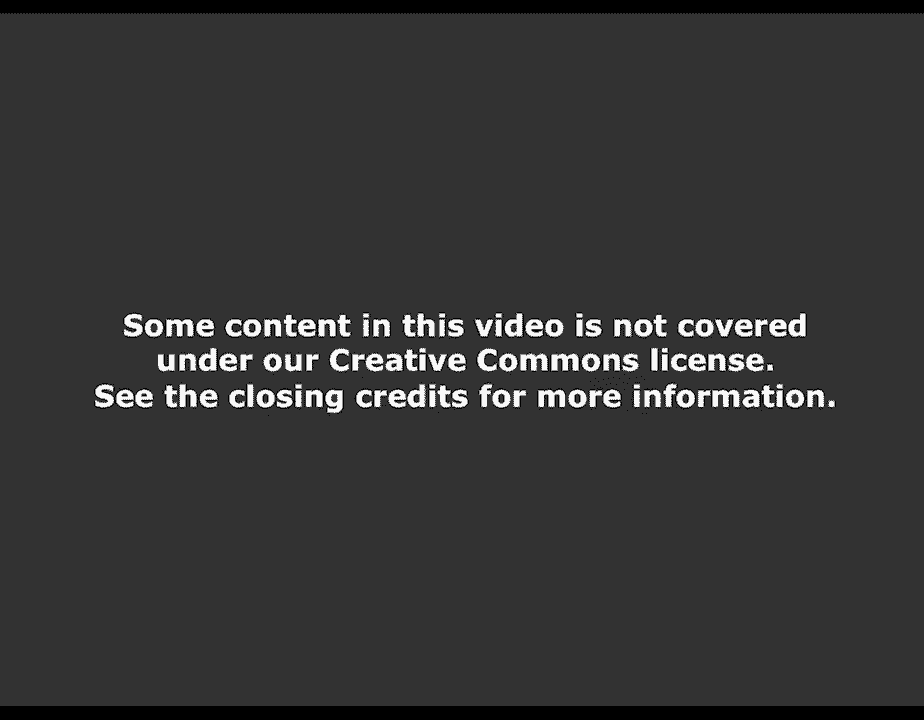
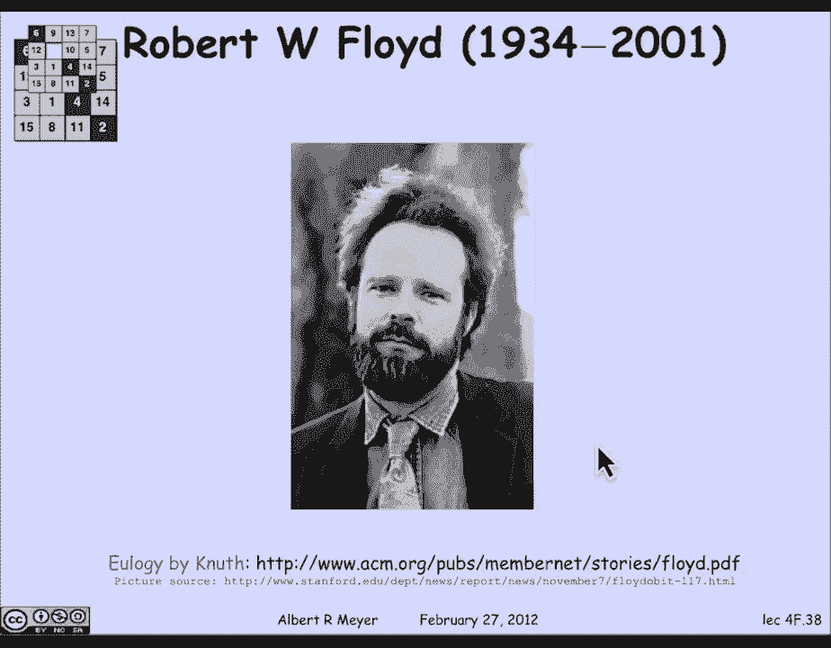

# 【双语字幕+资料下载】MIT 6.042J ｜ 计算机科学的数学基础(2015·完整版) - P24：L1.9.1- State Machines Invariants - ShowMeAI - BV1o64y1a7gT

so we're going to talk about state，machines which is a topic that you're。

gonna see on many further courses，because state machines model step by。

step processes and of course you if you，think about a computation the normal way。

you think about it is that it's doing，instructions step by step one after。

another until it finally reaches，termination，likewise various digital circuits move。

through stages or states until they，produce a final answer so state machines。

come up and at least those circumstances，and many others now the general model of。

state machine involves the idea that you，can give an input and it responds to。

them but we don't really need that for，our purposes so let's look at our。

example of a state machine here's maybe，here's a particular simple one this is a。

description of a state machine that，counts to 99 so the circles are。

indicating what it states are we've，named them from 0 through 99 and then。

there's a final state called overflow，and that funny arc is an indication that。

if you're about if you're in overflow，mode and you make another step by。

following the arc you get back to，overflow mode but if you're in zero you。

can make a step to one and if you're in，one you can make a step to two and so on。

so starting off at the start state which，is generally indicated by that double。

mark so to indicate where to start then，the description of this machine。

consistent in complete description is a，set of states which are pictured as 0。

through 99 plus overflow a set of，transitions which are indicated by the。

arrows which is how one state can move，to another state and the transitions can。

be summarized by saying that they're of，the form i to i plus 1 for i between 0。

and 99 and then there's a 99 transition，to overflow and once you're an overflow。

you stay in overflow so the picture at，the top is saying exactly the same thing。

as we've said here in mathematical，trends，azar so so this is a machine that if you。

really build something that behaved this，way it wouldn't be much use because once。

it's overflowed its dead because it，stays there a real machine to be useful。

would have a reset transition which took，overflow back to zero but this。

illustrates the basic idea so let's look，at a fun example from a die hard movie。

my forgotten which one it was but there，was one with Bruce Willis and Samuel。

Jackson playing a detective and a friend，that he meets who helps him deal with a，movies。

this time the mad man's name is Simon，and what Simon says to them as they。

stand behind the fountain in the park，shown on the previous slide is that on。

the fountain there should be two jugs do，you see them a five gallon and a three。

gallon fill one of these jugs with，exactly four gallons of water and place。

it on the scale and the timer will stop，the timer in the scale are not shown in。

that picture but there's a scale and a，timer nearby you must be precise one。

ounce more or less will result in，detonation if you're still alive in five。

minutes we'll speak okay so let's think，about formalizing this as a state。

machine to see what's going on so first，of all to understand the the the。

specification informally what there is，is a three gallon jug and a five gallon。

jug that is capable of holding water and，an unlimited supply of water that you。

can get from the fountain and the basic，moves that you can make so with this。

setup the kind of moves that you can，make would be say you fill up the three。

gallon jug with water and then you could，pour the three gallon jug into the five。

gallon jugs or the three gallon jug was，empty in the five gallon jug you knew。

had exactly three gallons in it and then，you can do other things like empty a jug。

and fill a jug and empty them into each，other so let's model this as a state。

machine and the first decision we need，to make is what's the state going to be。

well the state of the obvious model for，the state is the amount。

water in each of the jugs so B is the，amount in the big jug and L is the。

amount in the little jug and what we，know about BNL is that they're gonna be。

some amount between 0 & 5 for B & 0 & 3，for L where but we're gonna quickly。

realize that we need them to be integers，but offhand we can allow them to be real。

numbers because after all you could just，pour some arbitrary amount of water into。

the big jug any amount that will hold，between 0 & 5 although that'll be。

dangerous because as soon as you do that，you're gonna lose track of exactly how。

much is in there and you won't know when，you have 4 gallons or not。

so let's formalize the possible moves，that we can have so first of all the。

start state is zero zero because we，start with both jugs empty and then what。

are the possible transitions of how，being elmo's well let's see the the fill。

the little jug move amounts to saying，that if you have an amount of being big。

and Ellen little then you can make a，transition called fill the little jug in。

to be in big still unchanged and three，in little 4l less than three I'm gonna。

forbid the vacuous move where you the，little jug is already felt full and you。

try to fill it that doesn't count so L，has to be less than three you can make。

it three by filling the little jug，similarly you can fill the big jug if B。

is less than five then you can turn it，into five by filling it and then you can。

empty the little jug which is easy if，you go from BL you go to be zero and。

likewise you can empty the big jug those，are the easy moves slightly more。

complicated move is pour the big jug，into the little jug well if there's no。

overflow what that means is that there's，Ellen the little jug and B in the big。

jug and after you've poured the big jug，into the little jug there's B plus L in，big one。

but let's be careful here about what，exactly we're doing math we're not sort。

of we're trying to get away from the，metaphor so what is no overflow means it。

simply means that B plus L will fit B，plus L is less than or equal to three。

all right what's the other case of，pouring the big jug into the little jug，well that's when。

plus L won't fit in which case you pour，into the little jug，it's got L so you pour in three minus L。

to fill it up and then what's left in B，is B minus the three ones little L that。

you poured so that's the otherwise case，when there is overflow and similarly。

there are moves for pouring the little，jug into the big jug so that then is a。

formal specification of the die hard，machine and the moves that we're going。

to allow now you could allow other moves，like randomly pouring out a little water。

or randomly filling up a little water，but if you did that again you'll lose。

track of how much water is in the jug so，these are the only safe moves and。

they're the only ones we're gonna model，alright so let's go back to Simon's。

challenge he wants to disarm the bomb by，getting exactly four gallons of water on。

the sky in a jug and measure it on the，scale or things will blow up and how do。

you do it well why don't you take a，moment to think about it before I。

proceed to the next set of slides or，before you let me proceed but just to。

understand the rules again and watch the，work here's how we're gonna start off。

with both jugs empty so we start off in，state zero zero and the first move is。

gonna be to fill the big jug which takes，us to state five zero where the big jug。

has five and the little jug is still，empty then we're gonna pour from the big。

into the little so now the little jug，one，and that leaves two in the big jug now。

we're going to empty the little one and，we still have two left in the big one。

and now we're gonna pour from the big，one into the little one so the little。

one has two gallons and the big one is，empty now we fill the big jug and。

there's still two gallons in the little，one and five gallons and the big one now。

we pour off from the five gallon jug，into until the one gallon jug is full。

that's removing the one gallon that the，three gallon jug still has capacity。

or we reduce to full three gallons in，the little jug and four gallons our。

target in the big jug and so we've，accomplished it，and we're done so the bomb doesn't go。

off all right so the point of this，exercise is really just to practice how。

the moves work and what the states are，but the questions I want to raise is。

suppose that we want to have a die hard，once in for all scenario in which we're。

tired of the remakes of these movies and，we propose that in the next movie that。

Simon if he's still around offers an，alternative challenge or instead of a。

three gallon and a five gallon jug，there's a three gallon jug an annoying。

gallon jug and now the question is can，you get four gallons into the big jug by。

pouring back and forth with rules like，these or can't you and can you prove it。

well my guess is that you probably can，figure out what's going on because。

what's happening is if you start off，with nothing in either jug and you do。

these moves of filling up a jug or，pouring one jug into another you'll。

discover that the amount of water in any，jug is always divisible by three this is。

a preserved invariant any state that you，can get to starting off from zero zero。

three will divide the number of gallons，in each jug we could state it this way。

there's a property of states property of，B and L which is the state which is that。

three divides B that vertical line isn't，is a shorthand for the simple divides so。

three divides B or B as a multiple of，three three divides L synonym L is a。

multiple of three and the claim is that，that's always gonna be true so in case。

that's not obvious you might not have，all the rules in your head but let's。

just take a look at one of the more，complicated rules this was the rule。

where you're pouring the big jug into，the little jug up till the until the。

little jug is full and that transition，is that if you're in state B。

you move to be minus three minus L and，three and if you look at this now。

clearly if three divides both B and L，both components of the state your ad。

then in the new state well three，obviously divides the contents of the。

little jug which is three but three also，divides the contents and the big jug。

which is a multiple of three namely B，minus three which is a multiple of 3。

minus W which is a multiple of three，when you take a linear combination of。

multiples of three you get a multiple of，three and you look at all the other。

transitions and they check equally well，if you are in a state B L and you move。

to a new state B prime L prime if three，divides B in L then three divides B。

Prime and L prime so this is what's，called a preserved invariant and of。

course the corollary is that in the，die-hard once-and-for-all game with the。

three jug three gallon jug and the nine，gallon jug you can't get to any state of。

the form 4x because four is not，divisible by three and therefore Bruce。

is gonna die now what we've Illustrated，here is an argument that's known as。

Floyd's invariant principle and it's，really nothing but induction。

reformulated for state machines the，statement of Floyd's invariant principle。

is that we're going to define a，preserved invariant is a property of。

States and a preserved invariant means，it has the property that if you're in a。

state that has property P and it's，possible to make a single transition to。

a state R then R will also have property，P this is just like the induction step。

you have to prove that p of n implies P，of n plus one so if you have a preserved。

invariant then if the property holds at，the start state then it's obvious that。

the property will hold for all of the，states that you can possibly get to that。

P of R will hold for all reachable，States so you can prove this by。

induction on the number of states but I，think it's clear that if you have a。

property that you begin with and it，going to，change and that's all that Floyd's。

invariant principle states so in，particular since the property P holds in。

all reachable states if there is any，final state within which the machine。

reaches then P is going to hold in that，state and what we saw was that it said。

we're using the word preserved invariant，to distinguish the definition here from。

another usage that's co-opted the word，invariant to mean a property that's true。

in all states and while it's nice to，know that some property is true in all。

states the way you prove that is by，having a preserved invariance so you。

want to distinguish the two technically，if you look at this the predicate that's。

always false is a preserved invariant，because of the condition as usual the。

way implication works if the antecedent，is false then the entire implication is。

true so if you're always false then it's，always the case that if false held in a。

state which it never does then it has to，hold in any state you can get to so the。

that implication is true so just，remember that preserved invariants that。

are constantly false exist they are good，preserved invariants but they're not。

what other people would call an，invariant we use preserved invariants to。

prove that a property is true in all，states it's a methodology so let's do。

one more example to wrap this up suppose，I have a robot on a grid and the integer。

grid and we can think then of the，coordinates of the integer as a pair the。

coordinates of the robot as the，coordinates of the square that it's in a。

pair of non-negative integers now the，way this robot can move is it can make a。

diagonal move in one step so it can move，one step to the northeast or south east。

or north west or southwest and that's it，and the question I want to ask is。

suppose you start the robot off at the，origin at 0 0 is there some way that it。

can wander around following its moves，and get to a net state where it's moved。

1 square over that is it gets to the，square 0 1，and the answer to that is settled again。

by a preserved invariant I don't know，whether it's obvious to you yet but it。

will be in a moment I'm claiming you，can't get to the square zero one and the。

reason is that there's a preserved，invariant of that set of robot moves。

namely the sum of the coordinates is，even isn't invariant if the sum of the。

coordinates is even it stays even and，why is that well any move and plus or。

minus 1/2 the coordinates of both x and，y may be x and y both go up by one in。

which case the sum of x and y increases，by two so if it was even it stays even。

or they both go down by one or maybe one，goes up and the other goes down in which。

case the sum doesn't change in every，case if X plus y was even it stays even。

and as a matter of fact if it was odd it，stays odd moves actually preserve the。

parity of X plus y but the invariant is，that X plus y is even now what else is。

the case well zero zero zero plus zero，is zero which is even and so we're in a。

floyd invariant principle case where all，the positions you can get to from the。

origin 0 0 which has an even some have，to have an even sum and since 1 plus 0。

is odd you can't get to that square 1 0，it's not reachable，so the parity in variant of the。

diagonally moving robot will set us up，for an analysis of the 15 puzzle game。

that's this logo that we've had on every，slide in 604 2 so far with 6 blank for 2。

on the diagonal this is a game where，there are these little numbered slaw as。

tiles that slide into the blank square，and the question is how to permute how。

to get from one permutation of the，numbers to another and it turns out that，power。

in variant reminiscent of a slightly，more sophisticated than the diagonally。

moving robot let's look at one more，example of using the invariant to verify。

a little algorithm that actually will be，quite important as the course progresses。

and that is fast exponentiation so in，this setup a as a real number and B as a。

non-negative integer and I want to，compute the beef power of a let's say B。

was a hundred and twenty eight and I，want to compute a hundred and twenty。

eighth power of some real number a well，I can multiply a by itself one hundred。

and twenty seven times that would work，fine but if you think about it。

suppose I square a and then I square it，again and I square it again。

then in about eight squarings instead of，ninety nine multiplications I'm gonna。

get a to the 128th now if B is not a，power of two you adjust it slightly and。

using that idea you can compute the beef，power of a much more rapidly than if you。

just naively multiply it out B minus one，times so let's look at the pseudo code。

for this algorithm here X Y Z in our，temporary registers y&z hold at Y Z and。

are all hold integers and X holds this，real number a and you can read the code。

if you wish but in fact I'm going to，immediately jump to the slightly more。

abstract and easier to understand，version of it as a state machine so what。

matters about this fast exponentiation，algorithm as a state machine is that。

first of all there are three states two，real numbers and a non-negative integer。

and the start state is going to be that，the number a is in the first register or。

in the first location first coordinate，of the States one is the real number in。

the second coordinate and be the target，exponent is the non-negative integer in。

the third component the transitions are，going to be as follows here's a simple，one if I have。

Mount X in the first location Y in the，second location C in the third。

then if Z is PI F Z is positive and even，then I'm gonna square X leave Y alone。

and divide Z by total and that's the new，state that I get at on the other hand if。

Z is odd and positive then I'm gonna，square X multiply Y by X and again take。

the quotient of Z divides e by 2 ok why，does this state machine come too fast。

exponentiation why is it correct and the，insight is that there's a preserved。

invariant of this machine and the，preserved invariant is that Y times X to。

the Z is always a to the B so let's see，how to verify that that Y X to the Z is。

equal to a to the B well let's just look，at maybe the slightly more interesting。

of the two transition rules which is，when Z is positive and odd the XYZ state。

moves to a new state indicated in green，where the new value of x is x squared。

the new value of y is XY and the new，value of Z is Z minus 1 over 2 remember。

you went to the quotient of Z divided by，2 and when Z is odd that means the mine。

it's literally Z minus 1 over 2 well，they're the new values satisfy the。

invariant if I plug in the Green values，of x squared for Y and x/y for X sorry x。

squared for X X Y for y and z minus 1，over 2 for Z well let's see what happens。

if I take the new value of y which is X，Y and I multiply it by the new value of。

x which is x squared raised to the new，value of Z which is Z minus 1 over 2。

let's do a little algebraic，simplification of that well the x。

squared to the Z minus 1 over 2 becomes，X to the Z minus 1 and I'm just carrying。

over the X Y and then that simplifies to，simply Y times，times X to the Z minus 1 or Y X to the Z。

which we assumed was equal to a to the B，so sure enough the new values of x y and。

z satisfy the invariant it is a，preserved invariant and an even simpler。

argument applies to the other transition，when Z is positive and even so we。

verified that this is a preserved，invariant now if the start remember we。

start off with the real number a and，register X the real number B in Z and。

the real number 1 in Y which is the，accumulator and 1 times a to the B is。

equal to a to the B so this is a this，preserved invariant is true of the start。

State and that means by Floyds invariant，principle that it is true at the final。

state if and when the thing stops well，when does this machine stop as long as。

he is positive it can keep moving so it，gets stuck when Z is 0 what happens if。

it ever gets to Z is 0 if it gets stuck，then the invariant says that Y X to the。

0 has to equal to a to the B but of，course Y X to the 0 is nothing but Y and。

what we conclude is that sure enough，this machine leaves the desired。

exponential value in the register Y，which is where we get the answer and。

that's why this algorithm is correct now，another aspect of of what's going on。

here is proving that the algorithm does，terminate so let me just say a word that。

floyd distinguished sort of these two，aspects of program correctness that。

typically come up one is showing that if，you get an answer it's correct and。

that's what we just did if this machine，stops if it ever gets to the case where。

Z is 0 then Y has the right answer but，we haven't proved that it stops so we've。

shown that it's partially correct like a，partial function it might not be defined。

everywhere you haven't shown that yet，but when it is the fun it gives the。

right answer and the other aspect of，correctness is termination showing in，effect that。

function is total that the program，always does stop well in this case there。

is an easy way to see why it always，stops because at every transition Z is。

being halved or more Z is a non-negative，integer valued variable and since we're。

having it or make it even smaller than，half of it and every step it means that。

since it starts with the value Z it，can't get smaller more than log to the。

base 2 of B times because by then it，would have hit zero and so we can be。

sure that this machine makes it most log，to the base 2 of B transitions and then。

it has to get stuck at the only place，that it can stuck which is when Z equals。

zero and there is a picture of my friend，and early colleague Bob Floyd whom I met。

at the very beginning of my career at，Carnegie Mellon University we worked。

together for about one year before he，went off to Stanford and you can read。

much more about his life in a warm and，and detailed eulogy written by his best。

friend Don Knuth Floyd won the Turing，Award and may effort his major，contributions both to program。

correctness and to programming language。

