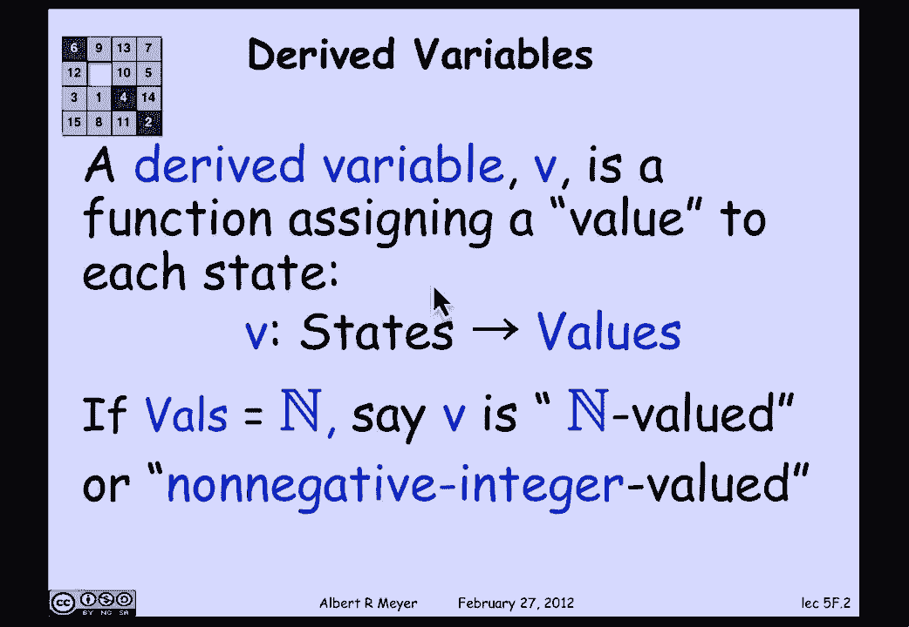
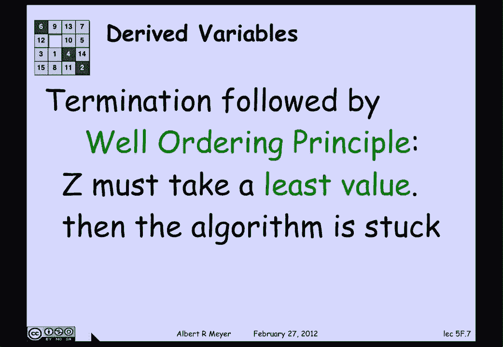

# 【双语字幕+资料下载】MIT 6.042J ｜ 计算机科学的数学基础(2015·完整版) - P25：L1.9.3- Derived Variables - ShowMeAI - BV1o64y1a7gT

在分析状态机时出现了派生变量技术。

所以让我们一起快速看看，因此，派生变量只是状态机状态的函数，这给状态分配了一些值，所以这只是一种函数映射。

如果值碰巧是，说非负整数，它叫做非负整数值，但它可以是实值的，也可以是复值的，甚至接受其他奇怪的价值观。

不一定是数字，没有双关语，不是奇数，但是，所以让我们看看网格上的机器人的例子，状态是一对非负整数，给出机器人所在的坐标，我们发现其中一个非常有用的派生变量是和值，定义为x加y um的状态的sigma。

这将是一个非负整数值派生变量，所以派生这个词是因为我们编造的，它不是状态机规范的一部分，或者定义最好的A程序的一部分，状态机，所以在机器人的例子中，实际状态由两个坐标x和y组成。

但是我们编造的派生变量在那里。

一些西格玛，机器人示例的另一个有用的派生变量是，呃，对西格玛的戏仿，这个数字是偶数还是奇数，所以sigma是一个零值变量，如果和是偶数，则取值为零，如果和是奇数，则取值为一。

所以在快速幂的情况下，我们看了实际变量z，这是不变量的一部分，也是程序的关键部分，我们注意到的是，z是一个严格递减的自然数值变量，事实上，我们注意到它每走一步就减半，但它的值是非负整数。

而且每一步都在严格地减少。

所以井序原理意味着，它会取一个最小值，我们对严格递减变量最小值的了解。

算法卡住了，因为一旦z达到最小值，如果，如果A机器再走一步，然后它就会变小，所以它不能，这意味着算法必须终止。

所以这给了你一个证明终止的一般方法，求一个非负整数值的严格递减变量，保证程序事实上停止，你有时可以说程序需要多长时间才能停止，就像我们在快速指数中看到的那样，它不需要Z，这是明显的界限，而是Z的对数。

因为Z不仅在每一步都下降，它每走一步就减半，所以总的来说，严格递减变量的概念如下所示，在状态机的每一步，在每一次转换中，它会变得更小。

一个相关的想法是一个弱递减变量，这些不一定有助于证明终止，但它们往往很有用，如你所见，当我们在术语示例中前进时，它帮助您分析算法的行为，所以弱递减变量是一个向下或保持不变的变量。

所以如果我们看看西格玛的例子，到处上下的坐标之和。

它既没有增加也没有减少，另一个极端是奇偶校验变量pi。

是A还是1，根据坐标之和是偶数还是奇数，圆周率是常数，这意味着它既弱增加又弱减少，在退化的意义上，弱增加被允许说同样的话，事实上，某物在弱增加和弱减少，顺便说一句，当且仅当它是常数。

我们过去把弱递减变量称为非递增变量，这是这个领域的标准术语，微积分谈论非递增函数，我们只是发现它引起了很多混乱，因为你必须记住，不增加和不增加是不一样的。

所以有一个函数不增加的例子，但如果没有登记，它肯定不是没有增加。

顺便让你考虑一下，通过查找，自然数值变量直接概括为变量。

它从一组有序的实数中获取值，记住一组有序的实数，它的定义之一是它是一组数字，在那里不可能找到无限递减的值序列，w 0小于w 1，小于w 2小于w 1，永远持续下去，如果那不能发生。

那么这个集合叫做有序集合，当然啦，非负整数是最明显的基本情况，但笔记中描述了一堆其他人。

呃，和一般情况下，终止原则是，如果你能找到一个严格递减的，派生变量的，其值总是来自有序集，这也是证明终止的一种方式，这将保证终止，出于同样的原因，变量必须取最小值，那是井然有序的另一个定义。

当它这样做的时候。

