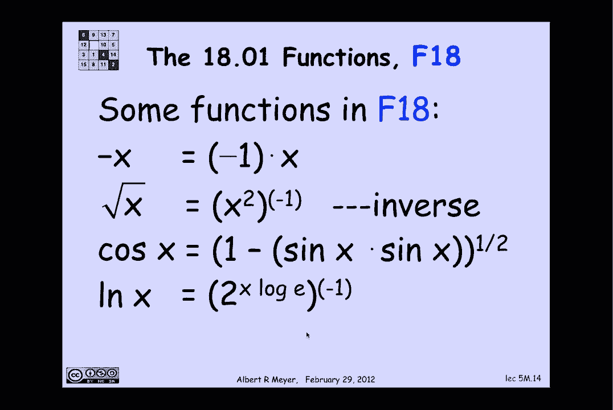
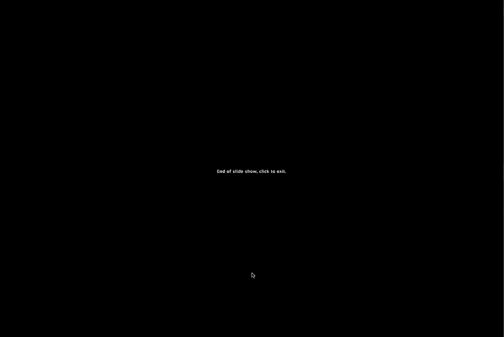

# 【双语字幕+资料下载】MIT 6.042J ｜ 计算机科学的数学基础(2015·完整版) - P26：L1.10.1- Recursive Data - ShowMeAI - BV1o64y1a7gT

递归数据在编程中起着关键作用，所以让我们用数学来看看发生了什么，所以递归数据的基本思想大致是，你要定义一类对象，根据同一对象的更简单版本，再精确一点再精确一点，嗯，我们，这个想法是。

您可以构建一个递归数据类型，从一些你理解的不是递归的东西开始，你给我一些基本的对象，我可以开始，并声明它们属于这个递归数据，然后你给我一些叫做构造函数规则的规则，它使我能够构建递归类型的新对象。

通过将这些构造函数应用于我已经建立的对象，这件事没有什么循环往复的，因为我总是从一些东西中积累新的东西，我已经有了，让我们看一个例子，我要定义一个集合，e，那是整数的子集，我会给你一个递归的定义，e。

基本情况是，我要告诉你零，我会给你们两个构造函数，第一个说，如果你有一个n，那就是一个e，你可以在上面加两个，并在e中得到一个新元素，前提是n是非负的，第二个构造函数是，如果你有一个n，那就是一个e。

你可以否定它，你可以取-n，假设n为正，这是两个构造函数规则，嗯，让我们看看这里发生了什么，这很好地告诉我们什么，让我们只使用第一个构造函数规则，并重复使用它，我可以从零开始，这是基本情况。

然后我可以应用构造函数向它添加两个，然后我可以再次应用构造函数来添加到加二到零加二，然后我可以第三次应用它得到加二到零，加二加二，很明显我得到的是0 2 4 6等等，我要用这种方法得到所有非负偶数。

好吧，现在我可以申请这些，正数，我可以应用否定构造函数，所以我可以得到负2，减四，减六，很明显我可以得到所有的偶数，我们刚刚发现它包含偶数，E里还有别的吗，答案是否定的，原因是对定义的理解的一部分。

就像这样，事情进入的唯一方法，E是作为基本情况，或通过建造，前面构造元素，通过应用构造函数规则，换句话说，这里有一个隐含的从句说，就是这样，隐式子句被称为极值子句，这被认为是理所当然的，很少明确提及。

作为递归定义的一部分，但它总是要被理解的，好的，让我们来看看一个，所以我们可以由此得出结论，e正好是偶数整数，因为那里没有别的东西，除了那些以指示的方式建造的，让我们看一个稍微有趣的例子，现在。

我想定义仅由左括号和右括号组成的字符串集，这样左括号和右括号就很匹配了，在幻灯片上写圆括号会和圆括号混淆，实际上是用来划界的，所以我要用蓝色的括号代替括号，右括号和左括号，这个符号，顺便说一句。

代表右括号和左括号的有限字符串集，这是一个一般的表示法，如果你有一些你认为是字母的对象集合，你写一个星号作为上标，这意味着这些字母的有限字符串，所以这些是右括号和左括号的有限字符串。

我想给出一个集合的递归定义，我计划的正是那些弦，左右括号适当匹配的地方，考虑配对的方法是采取一个，让我们说，包括加号和乘号等的标准算术表达式，并确保它完全用括号括起来，所以每当你加上两件事，周围有括号。

当你要把两件事相乘的时候，周围有括号，um意思是括号，如果你把一切都抹去，但是括号，你会剩下一组匹配的括号，实际上，它将是一组匹配的括号，或者你可以让几个挨着，那些仍然可以被考虑。

这就是我们定义的行为方式，让我们给它，所以基本情况是最简单的，这可能是，我要从空字符串开始，空字符串是这样的东西，它的作用就像一个零，在把字符串放在一起的情况下，或者串联操作。

如果将空字符串与任何字符串连接起来，它不会改变弦，根据定义，则空字符串是节点字符长度为零的字符串，它在把字符串紧挨着的情况下充当身份，好的，M中会有一个构造函数，这有点巧妙，还有其他的。

也许更简单或更自然的方法来构造定义m的构造函数，但是这个特别好看，因为我只要一个就能逃脱惩罚，它有一些很好的特性，我们稍后会探索，所以规则是这样的，如果我建立了两根弦，以m为单位的匹配括号的s和t。

然后我可以通过在S周围放置匹配的括号来构建一个新的，并将其与T串联，也就是说，如果s和t是m中括号的字符串，那么如果我从左括号开始，后面是s中的括号，后跟右括号，后面是T中的括号。

new string是我在m中建立的另一个元素，让我们练习一下，看看它是如何工作的，又是构造函数，好吧，我该如何开始，我所拥有的只是基本情况，s和t必须都是空字符串，因为这是我唯一能鼓掌的。

唯一可以应用构造函数的东西，所以如果我那样做，基本上，s和t在这个构造函数表达式中消失了，我只剩下一个匹配的左右括号，但现在我有了一个匹配的左右支架，所以我可以用它来应用构造函数。

所以我可以让我们成为匹配的括号，现在还不是空字符串，当我插入构造函数时，仍然消失的T，但我发现括号里有括号，这是我建立起来的另一根弦，我现在也可能是有条不紊的，我可以让我们空着，T是括号。

如果我那样做了，然后S就消失了，T成为匹配的一对括号，我和一对配对的人在一对配对的人旁边，然后我当然可以让他们两个都是匹配的括号，然后我得到一个匹配的一个嵌套的对旁边的一个匹配的对。

现在我也回到了最开始，下一个最复杂的字符串是嵌套的一对括号，我可以让我们成为那样，不要空虚，然后我会把括号嵌套到深度3，以此类推，就是这个意思，嗯，所有权利，现在可能很清楚，也可能不清楚。

您是否得到了匹配括号的字符串，以这种方式，在笔记和一些问题中得到了进一步的讨论，但我们只是试图理解这个定义是如何工作的，并认为这是理所当然的，事实上这是对的，让我们用定义来证明关于M的一些事情。

但我想证明基于M定义的事情，不假设它按预期工作，所以我要声称，基于不可能在，现在从右括号开始，当然啦，因为我们假设m是匹配括号的正确定义，很明显，以右括号开头的字符串，已经没有什么能与之匹敌了。

虽然没有左括号匹配，所以它不应该在里面，但让我们确保定义的行为符合，我们打算，也可能是错的，那么我如何证明m中没有字符串以正确的括号开头，嗯，让我们看看定义，大写根本没有括号。

所以它肯定不是从一个正确的括号开始的，查看构造函数规则，您可以构造的所有字符串都从左括号开始，所以我们真的很吸引含蓄的，这就是全部条款，极端条款说，因为在m中获取东西的唯一方法是应用构造函数。

你将无法得到任何以正确的括号开头的东西，所有的权利，有趣的递归定义数据类型的另一个示例，我们会做一些可爱的课堂问题，是我称之为F十八函数的类，这些是微积分第一项的函数。

就像你在18个真正的函数中学习一样，存在单个实变量，这里有一个递归定义，我认为，涵盖了1801中考虑的所有功能，我将从恒等函数和任何常量函数开始，和x的函数正弦，并声明这些是基本情况，这些是f中的函数。

下面是构造函数规则，如果我有两个f十八的函数，我可以添加它们，把它们倍增，或者拿两个到F，F在那里，这些也都是F18中的函数，这样我就可以开始积累一堆有趣的东西，像多项式和指数，此外。

如果我有一个F18的函数，我可以取它的逆，至少在函数中定义逆的情况下，我也可以组成F18中的两个函数来得到另一个，让我们看看这个定义是如何工作的，我声称事实上函数减去x是一个f十八。

我如何从规则中很好地建立负x，减一是常数函数，所以我有这个，x只是恒等函数，我可以把我有的两个函数相乘，如果我乘以-1，猜猜我得到了什么，所以我刚发现它的功能是在F18，x的平方根呢，嗯。

如果我将等式本身相乘，我得到函数x的平方，然后如果我取它的逆，那是x的平方根，我给了你正弦x，但不是余弦x或任何其他三角函数，为什么不好，我是说我都想要，但我已经可以按规则得到他们了。

那么如何得到余弦x，cosx就是x加上pi的正弦，为什么圆周率是一个常数，x是恒等式，所以和是一个f 18的函数，然后如果我用正弦组成这个函数，我得到x加pi的正弦，也就是余弦x，所以余弦x现在在那里。

我做的这件事实际上是学生们向我指出的，得到cos和x的这种简单方法，我最初的想法，我用平方根运算，我将使用余弦平方的恒等式，正弦平方等于1，所以如果我取一个负正弦的平方，然后取平方根。

这是得到余弦x的另一种方法，关键是有很多方法可以导出相同的函数，从应用于其他功能的操作中建立起来的F18，x的对数呢，我们就以这个结束吧，如何获取x的日志，我怎么把e到x，E到X是你得到的。

把2到圆木到底座，e的两个，也就是E，然后把它提高到x的次方，所以如果我拿一个log e，这是一个常数，记录到底座，v的两个，这是一个常数，我把它乘以x，恒等函数，我拿两个到我正在创作的力量，换句话说。

函数的x对数x，与构造函数，二到F，然后我用函数e到x结束，当我取它的逆，我得到X的日志。

