# 【双语字幕+资料下载】MIT 6.042J ｜ 计算机科学的数学基础(2015·完整版) - P27：L1.10.4- Structural Induction - ShowMeAI - BV1o64y1a7gT

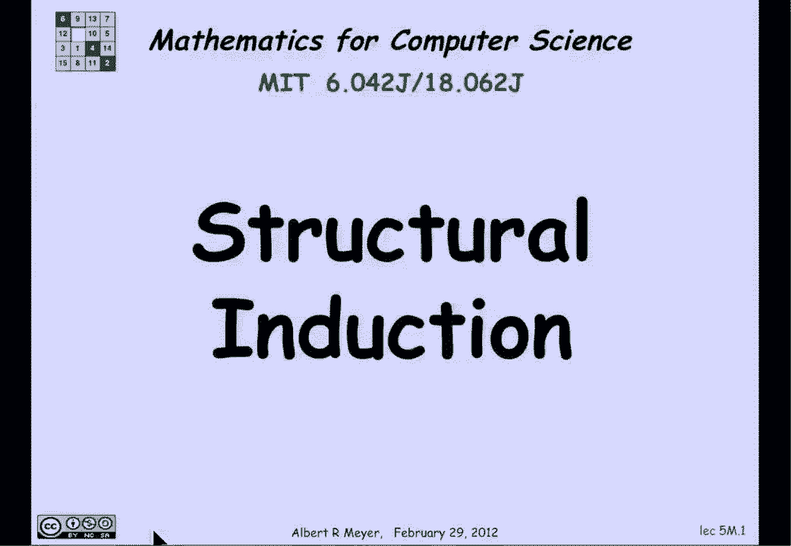

so whenever you define a recursive，datatype the part of the implicit in the。

definition is a method for proving。

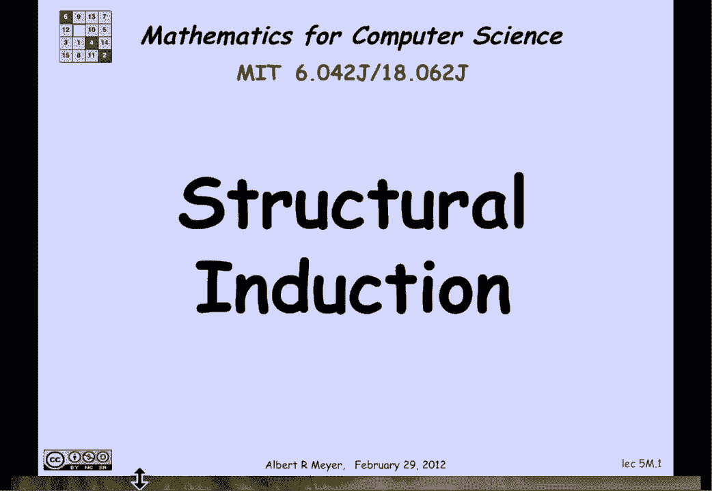

things about it called structural，induction and the way structural。

induction works is that if you want to，prove that every element in some。

recursively defined data type has a，particular property P then you proceed。

by showing that every one of the，elements in the base case that are in R。

has property P and moreover that if you，apply a constructor to an element X then。

it has property P whenever X has，property pay that as you can assume as。

an as a structural induction hypothesis，P of X and then you need to show that P。

of C of X holds in the supplies for each，constructor see some constructors take。

more than one arguments but this is，meant to illustrate the general pattern。

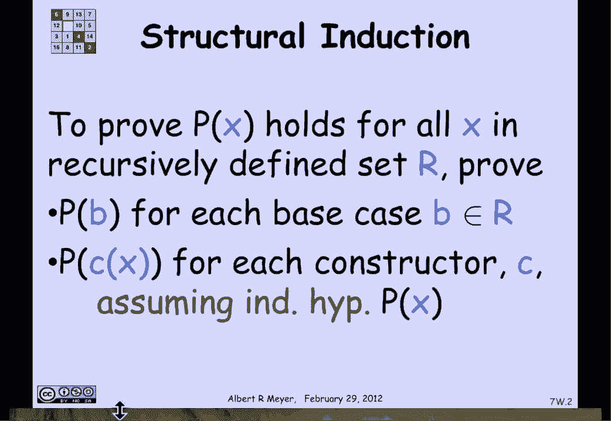

let's do an easy example first this is，when we've actually seen and we took for。

granted this method of proof without，highlighting it when we argued that the。

set e that was recursively defined in，the last presentation contained the even。

only even numbers so remember the，definition of E was that zero is in E。

and we're going to be proving that X is，even by induction so we need to check。

the base case yes zero is even and then，we need to show that assuming the。

structural induction hypothesis that n，is even then when we apply the。

constructor n plus two it's even well，obviously it is or if we constructor。

minus n that's also even and it is as。

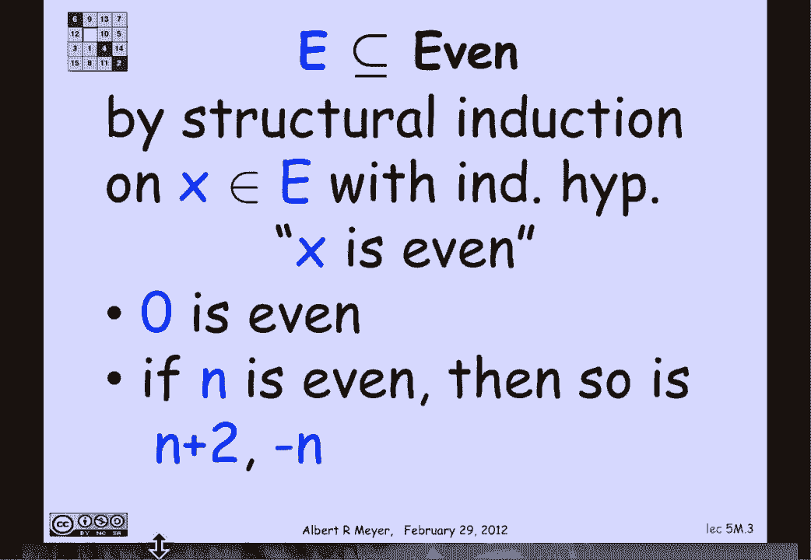

well and that's why structural induction，tells us that in fact every string in。

the set E is even now let's look at a，somewhat more example interesting。

example which was the set M of matching，right and left brackets and what I want。

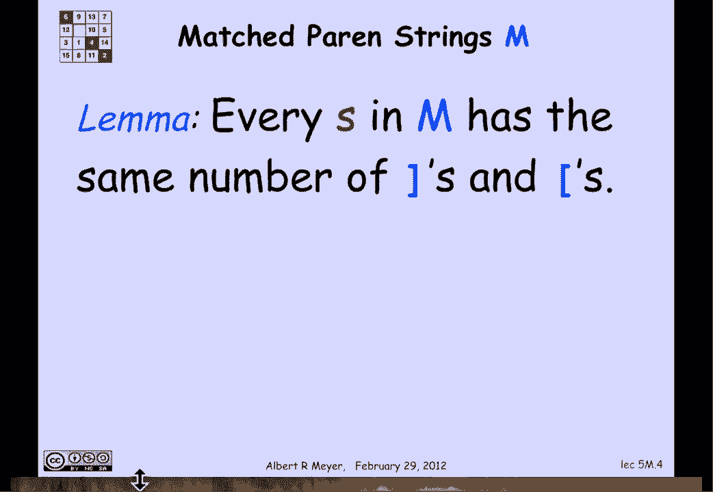

to prove by structural induction is that，every string in M has the same number of，left brackets and。

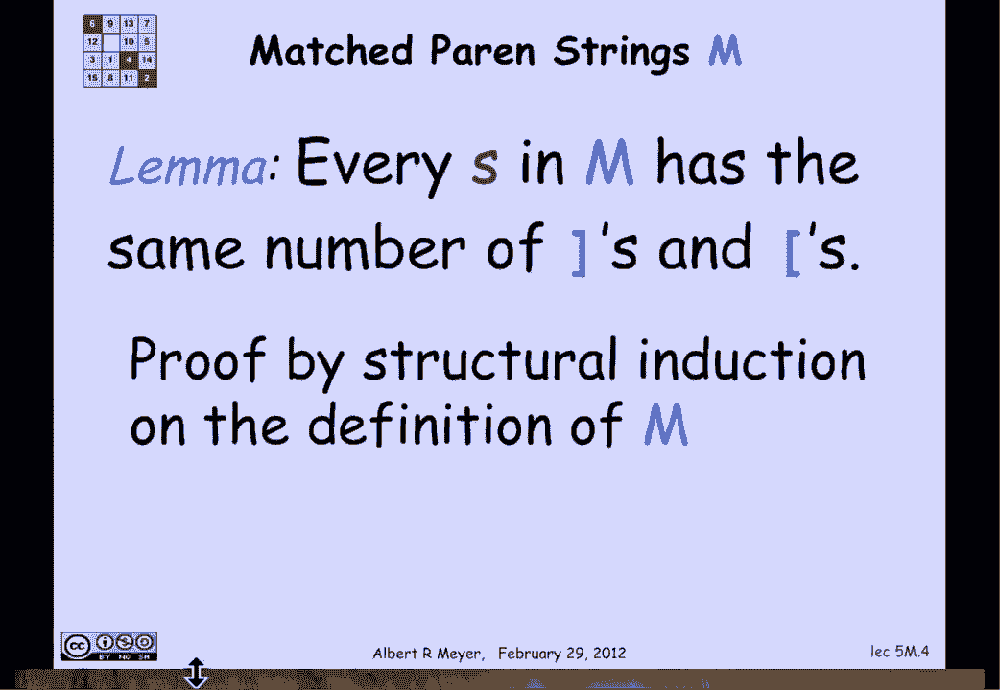

brackets all right，I can restate this by defining EQ to be，the set of strings with the same number。

of right and left brackets and what I'm，really trying to say is that M is a。

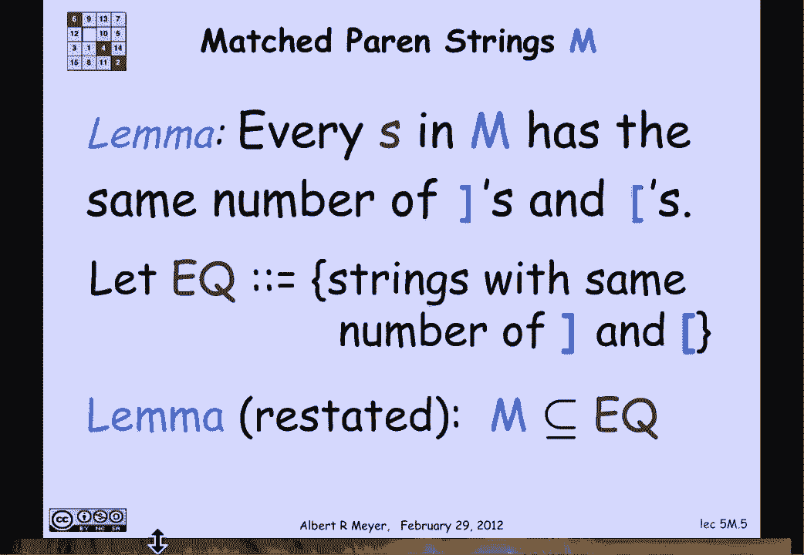

subset of EQ all right now the way I'm，gonna prove this is by defining my。

induction hypothesis P of s to be that s，is an EQ that is s has an equal number。

of left and right brackets well let's，remember what the definition of M was。

the base case of M was the empty string，with no brackets at all and does the。

empty string satisfy P of s well yeah it，has zero right brackets and 0 left。

brackets so it does have an equal number，of left and right brackets so we've。

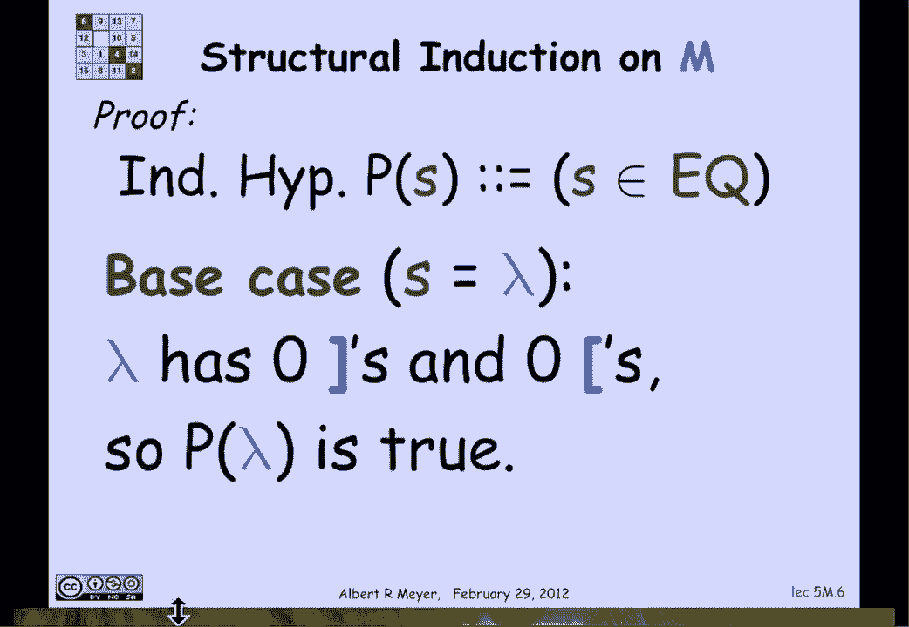

established that the base case P of and，of the empty string is true ok now we。

have to consider the constructor case in，the case of M there's only one。

constructor namely if R and T are in M，then so is s which you get by putting。

brackets around R and following it by T，well here's the argument we're allowed。

to assume when we're trying to prove，that s has an equal number of left and。

right brackets and we're allowed to，assume that R does and so does T so。

let's look at the number of right，brackets in s well where do they come。

from the right brackets in S consists of，well the first symbol in S is a left。

bracket so that doesn't matter then it's，the right brackets in R and then there。

is a new right bracket that gets added，and then there are the right brackets in。

T so what I can say is that the left，bracket the right brackets in S are。

simply the number of them is the sum of，the number in R plus the number and T。

plus 1 more because the constructor，threw in one more right bracket by。

exactly the same reasoning the number of，left brackets in s is the number of left。

in are left in T plus 1 now because of，hypothesis P of R，the number of right and left brackets in。

our are equal and likewise by the，induction hypothesis P of T the number。

of right and left brackets in T are，equal and so the right-hand sides of。

both of these equations are equal and，equal，we've just proved that the number of。

right brackets in s in the number of，left brackets in s are the same so P of。

S is true the constructor case is。

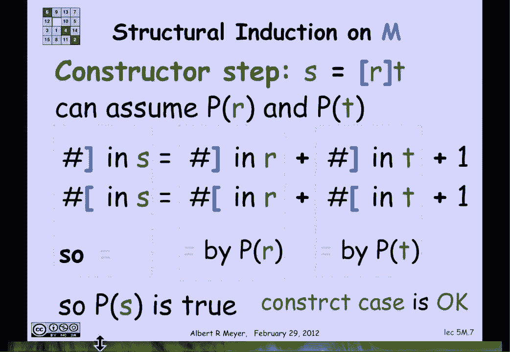

covered and we can conclude by，structural induction that every s in the。

set M recursively defined set of strings，of match brackets is in fact has an。

equal number of left and right brackets，which means that M is a subset of Q as。

claimed well those are pretty easy，structural inductions and as with。

regular induction proofs when you get，the right induction hypothesis the。

proofs tend to be easy and we are going，to work on an interesting example having。

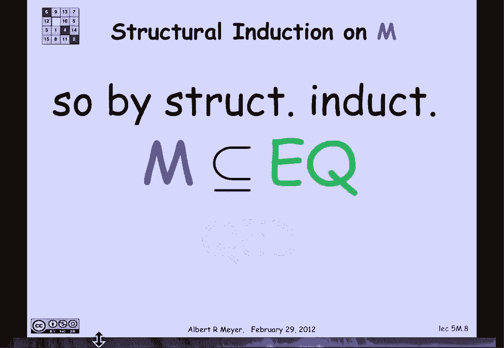

to do with the f18 functions one of the，reasons why the f-18s are what's。

considered in first term calculus is，that if you look at all of those。

functions remember you got them by，taking constant functions and the。

identity function and function sine X，and then you could combine them in。

various ways by adding multiplying，exponentiating composing thinking。

inverses that we didn't need to add a，constructor of taking the derivative。

because it turns out that you can prove，by structural induction that the FA。

teens are closed under taking。

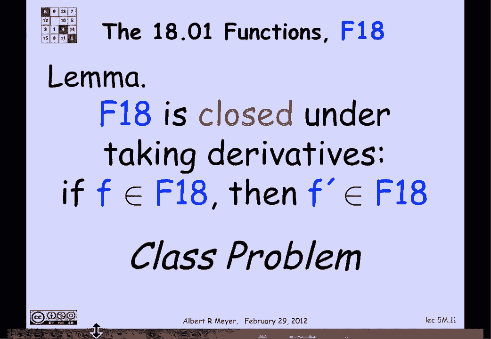