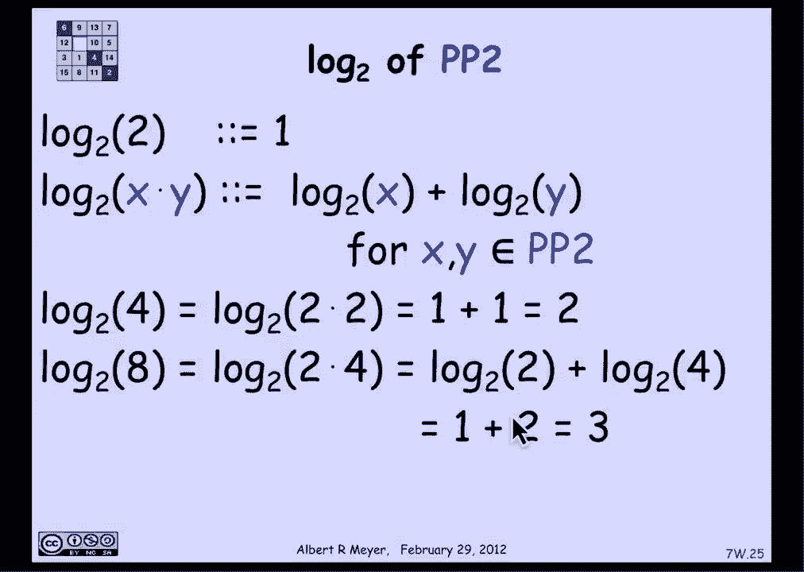
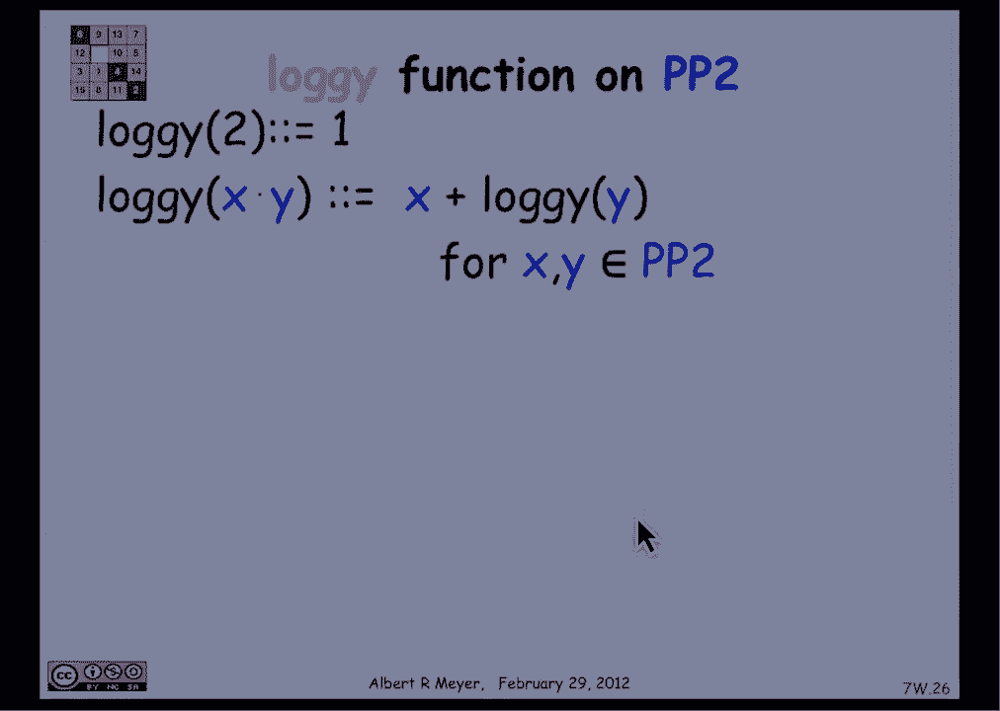
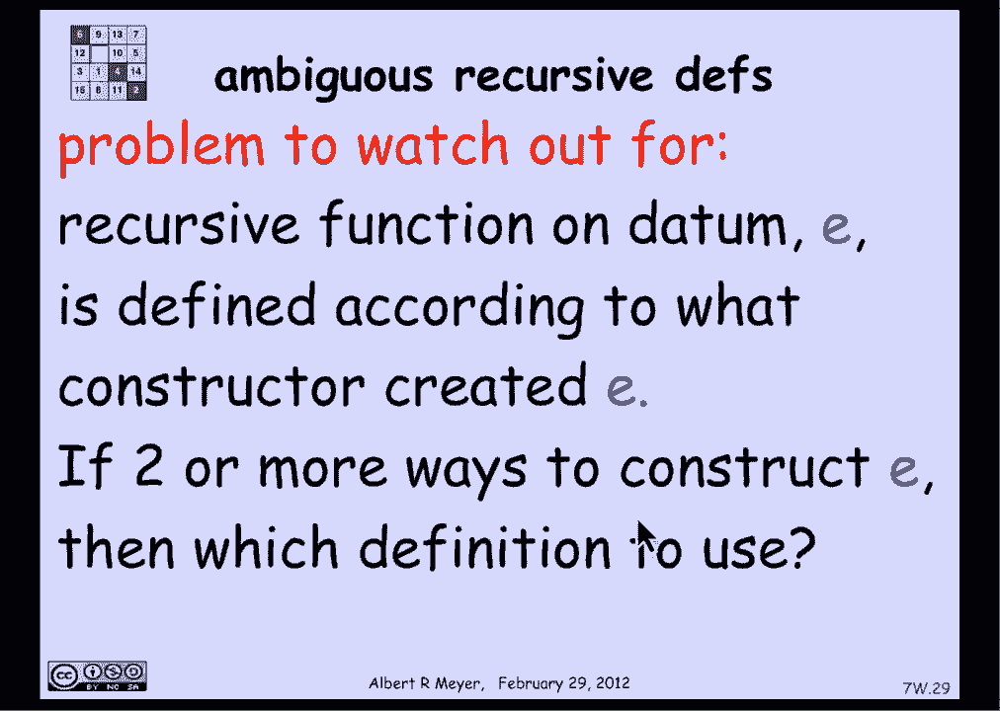

# 【双语字幕+资料下载】MIT 6.042J ｜ 计算机科学的数学基础(2015·完整版) - P28：L1.10.7- Recursive Functions - ShowMeAI - BV1o64y1a7gT

现在，在编程中使用递归数据类型所做的标准事情是，在它们上定义递归过程，所以呃，让我们看看这是如何工作的，我将在递归定义的数据类型上定义一个函数f，r，我要做的方法是，我将用b来明确定义b的f。

对于b中r的所有基本情况已经理解的操作，然后我将定义一个应用于x的构造函数的f，用x和x的f表示，如果我保持这种结构，这给了函数f的递归定义，在递归定义数据集上的，让我们看一个例子。

使这个食谱更加明确和清晰，让我们考虑一个在匹配括号集上的递归函数，这是一个有点有趣的，让我们定义字符串的深度如下，这个想法是，左括号和右括号的连续对嵌套有多深，空字符串的深度为零，我们得从某个地方开始。

它有足够的没有括号，我们称之为深度为零，现在构造函数在s周围放置括号的深度是多少，然后跟着T，嗯，在s周围加上括号会得到一个比s深一个的字符串，然后你跟着T，它和T一样深。

因此结果是构造函数的深度是一个字符串，它是一个等于1的数，加上s的深度和t的深度，以较大者为准，1的最大值加上s的深度和t的深度，这就是我们对深度的递归定义，嗯，让我们看看另一个更熟悉的递归定义示例。

让我们定义一个的n次方，整数或实数k，k的零次幂定义为1，k的n加一次幂定义为k，乘以k的n次方，这将是指数函数的可执行定义，在很多编程语言中，我的观点是，这个熟悉的定义。

非负整数n上的递归定义实际上是，结构感应，利用自然数对不起的事实，非负整数um可以递归地定义如下，零是非负整数，如果n是非负整数，那么n加1是一个非负整数，所以总结一下递归函数的配方。

定义是定义f从递归数据类型到值，无论您想为这些递归数据分配什么样的值，b的f直接为基本情况定义，基本案件b，x的构造函数的b和f用x的f定义，得到递归定义的函数，你可以通过结构归纳法来证明它。

或者根据自己的定义归纳法，它自己的递归定义，让我们看一个例子，我想证明…的深度的以下性质，也就是说，如果我看一个字符串r加2的长度，所以r周围的括号表示括号的数量。

所以r周围的竖线意味着字符串中的括号数是，加二小于，或者等于深度的2次方，加一两倍于二的深度，我想证明这对所有括号匹配的字符串都成立，我将用结构归纳法来证明这一点，就像演练一样，证据是这样的。

让我们假设R是基本情况，这个不等式对空字符串是否成立，r的长度为零，所以r加2的长度等于0加2或2，和两个一样，到零加一，实际上等于空字符串深度的2加上1，所以这个不等式在基本情况下实际上是一个等式。

我们我们在那里很好，我们接下来需要展示的是，这个不等式在构造函数的情况下成立，所以我们在看一个任意的字符串，r是由s和t构成的，r是左括号，It’右括号，我想通过归纳法假设证明r很好地满足这个不等式。

我可以假设s和t满足不等式，所以我知道s加2的长度最多是2，到s加一的深度，t加2的长度最多等于t加1的深度，让我们看看证据，你可以慢下来重播，如有需要，所以我要快速浏览一下。

r加上两个r的长度是在所有括号后面，所以它只是字符串的长度加上2，根据r的定义，嗯，括号的长度，st是t的长度加上s的长度再加上2，对于我们添加的两个括号，所以我们把它插入上一个项，得到它的加二。

那就重新排列条款，它与s加2的大小相同，加上T的大小加上2，我是这样安排的，因为根据归纳法假设，我知道s加2的大小小于或等于2，到s加一的深度，对于p也是如此，现在我只是玩一个很好的把戏。

让这两个指数看起来很像，我说s的深度小于，或等于s的深度和t的深度的最大值，对于T的深度也是如此，所以在这两个术语中，我可以替换指数，或者用深度s和t的最大值代替s的深度，同样的。

现在我有两个相同的术语，所以我可以说它只是最大深度的两倍，当然，根据定义，这等于r的深度，r的深度的两倍，它的深度是r加1的2次方，我或多或少地自动插入了定义，和结构诱导。

我已经证明了这个不等式对于递归定义的，让我们再看一个熟悉的例子，我想给出2的正幂的递归定义，所以基本情况是2是2的正幂，构造函数只是一个构造函数，我要用那个，如果x和y是2的正幂。

那么他们的乘积是二的正幂，所以让我们看一些例子，我可以从两个开始，作为一个构造函数，我唯一能做的就是，2乘以2得4，一旦我得到四个，我可以做四乘二得到八，我可以做4乘以4得到16。

我可以做4乘8得到32，所有这些都是两个的正幂，现在让我们把对数定义为2的正幂的基数2，递归井，2中的2的对数是1，我必须在基本情况下将log定义为基数2，这很容易做到，在构造函数的情况下呢，嗯。

x的基数2的对数，y等于x的基数2的对数，把对数加到y的基数2，对于所有的x，是2的正幂，所以我定义了构造函数x y的日志，就功能而言，x的对数和应用于y的函数对数，它符合递归函数的标准定义。

在递归定义数据类型上，两个的正能量，现在看起来还可以，我们去看看，所以4的对数是2乘以2的对数，根据日志的定义，两人的日志，加上2的对数，就是一加一，等于2，猜猜这是对的，八号井的对数，八是二乘四。

所以通过递归定义，那是二的对数，加上4的对数，我们之前发现，四的对数是二，所以我们有三个，答案现在就出来了，记住你不应该结束这个推理，使用以下属性，你知道到基地的日志，谁有，因为我们在定义这个函数。

我们称之为对数到基数2，并含蓄地声称这是正确的，但为了证明这是对的，我们只需要使用，对数到基数二的结构定义，来证明它的性质，这就是我用这个推理来说明的，只需插入x的log的构造函数大小写，y是x的对数。

加上y的对数，我可以得到这些数字。

所以这样做的目的只是为了让下面的定义看起来合理。

我要定义一个新函数，我要调用log函数，这是二的正幂上的另一个函数，下面是logi函数的定义，两个的记录将是一个，就像原木一样，但是xy的对数是，加上所有x y的对数，在两个井的正幂中。

让我们试试那个定义，4的对数是2乘以2的对数，根据递归定义，二加二的对数，这是一个，就是三个，好的，八井基因座，八是二乘四，所以八的对数是二，加上四个的对数i，我们刚刚发现四的对数是三，所以是两个。

加三等于五，8的log i是5，最后是16的log i，十六等于八乘以二，所以8乘以2的对数i是8，加上2的对数i，我们知道这是一个，九点了，所以我们才发现，十六的对数是九，但现在问题来了，嗯十六岁。

当然不只是八乘二，但它是二乘八，所以二乘八的对数是二，加上8的对数i，八对数，我们之前发现是五个，所以十六的记录是七，现在我有一个不一致的地方，我使用了日志的递归定义。

我得出16的log i既是9又是7的结论，我们有麻烦了，这不是函数的好定义，这个问题很简单，叫做歧义，有不止一种方法来构造P2的正幂元素，构造函数的子二x乘以y，嗯，呃，十六等于八乘以二，但也是二乘八。

当然也是四乘以四，取决于您使用哪个构造函数来构造16，您将得到分配给log i函数的不同值，嗯，因此，当您有一个定义模糊的递归数据结构时，例如，F18是非常模棱两可的，然后定义一个函数。

在这个定义上定义递归函数不会很好地工作，你必须非常小心地证明，如果递归定义实际上在单个值中工作，所以说，比如说，记录到基数2确实有效，但这需要证据，它不符合一般原则，在不明确的数据类型上定义递归函数时。

另一方面，我们为平衡字符串选择一个有点意外的构造函数的原因，平衡括号字符串是，它是明确的，所以深度的定义是一个很好的定义，任何基于集合m的递归定义的定义也是如此，所以我们要注意的一般问题。

构造函数创建了数据e，如果有不止一种方法来构造E，那你就要，你不太确定用哪种情况来定义函数f，这就是为什么数据结构是否模棱两可的问题。

