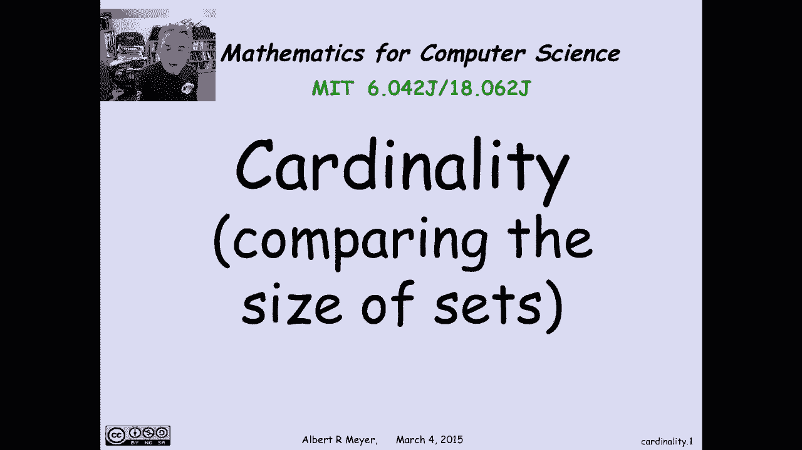
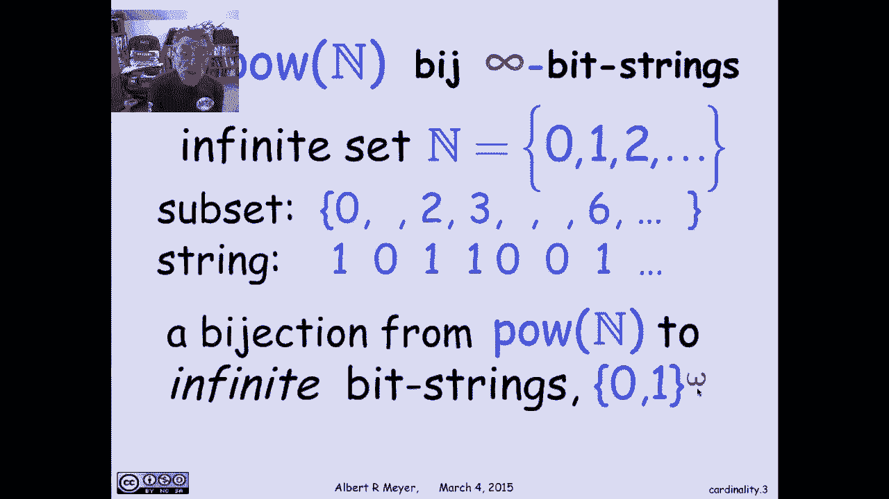
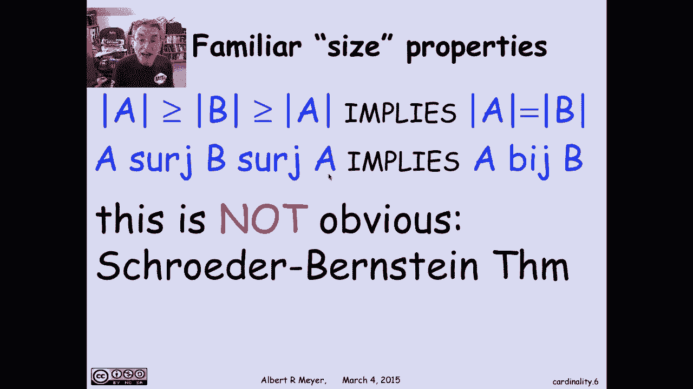
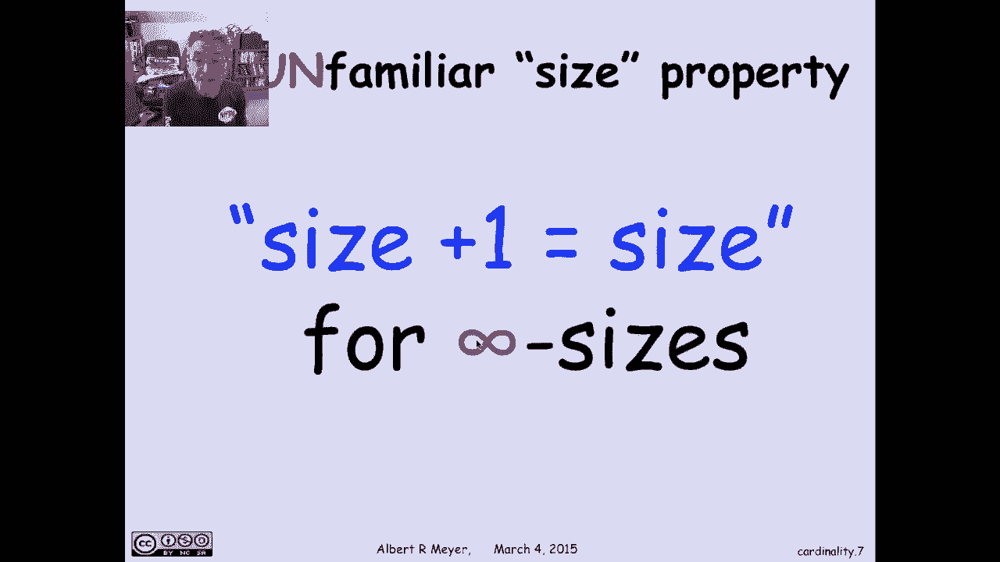
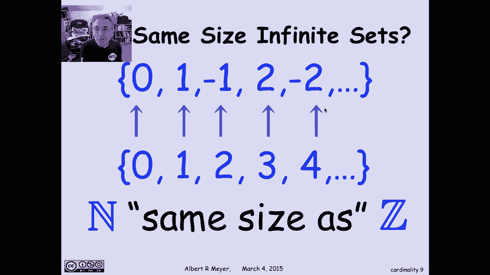
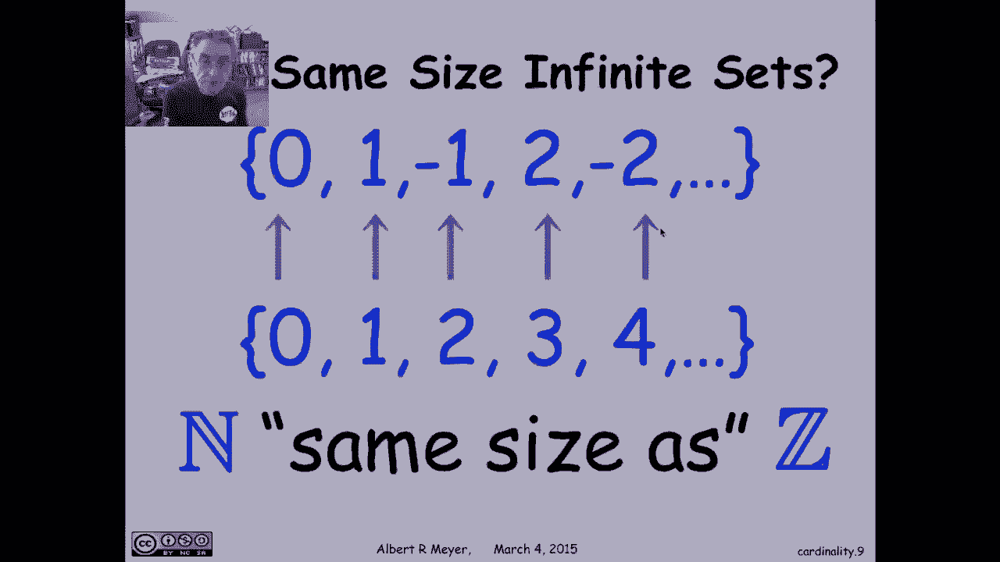

# 【双语字幕+资料下载】MIT 6.042J ｜ 计算机科学的数学基础(2015·完整版) - P29：L1.11.1- Cardinality - ShowMeAI - BV1o64y1a7gT

cardinality is the word that's used to，refer to the size of infinite sets and。

before we go further let's take a quick，look at why we're interested in infinite。

sets in a course that's mathematics for，computer scientists why does computer。

science care about infinite says well，you know like every data structure that。

you'd examine in computer memory is，finite and the integers individually are。

finite you only calculate with finite，things but the infinite abstraction。

happens right at the beginning although，any given integer is finite the set of。

all integers is infinite and although，any given matrix is finite a set of all。

the matrices that might be represented，in a computation，I'll find out an infinite set so we we。

take infinite sets for granted and，reason about them all the time。

the second from a pedagogical point of，view introducing the concept of infinite。

sets and reasoning about them carefully，forces you to go beyond your intuition。

and really follow the rules and reason，in a careful mathematical way because。

although some properties that you're，familiar with from finite sets carry。

over to infinite sets others don't and，in order to know which is which you have。

to be thinking carefully about the rules，and properties that they have as opposed。

to just going by intuition and familiar，properties and finally the reasoning。

that goes goes into comparing the sizes，of infinite sets which is the topic of。

today's video has profound implications，in computer science because it leads to。

the insight of ethological limits of，computation and examples of specific。

problems that computers can't solve，which we'll be taking up in a later。

video but for now let's go back to the。

topic of cardinality so there was this，mathematician in the 19th century late。

19th century named Cantor who was，actually working on，a 40 a series and he discovered that the。

the kind of series that he was working，with diverged an infinity of many places。

which sounds kind of bad but he wanted，to get across the idea that it didn't。

diverge it very many infinite places and，that led him to this idea of comparing。

the sizes of infinite sets so this is，Cantor's idea will you know from the。

mapping lemma that if you're looking at，finite sets a and B then the size of a。

is greater than or equal to the size of，B if and only if a surge B where surges。

this technical relation which means，there exists a surjective function from。

A to B that is a function with greater，than or equal to one arrow into every。

element of B and Cantor's idea was say，well it works fine for finite sets why。

don't we take this as the definition of，what we mean by a is at least the size。

of B for infinite sets so we're gonna，think of a surge B now as saying a is as。

big as big and for finite sets we can，it's literally true that a surge B if。

and only if the size of a is greater，than or equal to the size of B now let。

me take a moment to say that this notion，of size or cardinality when you're。

talking about infinite sets it's kind of，a no no there's a an abstract concept of。

the of what cardinal numbers are what，these infinite numbers are but the truth。

is they're technical and not a very much，use so we will never actually be talking。

about the cardinality or size of an，infinite set but what we will do is。

compare them we're going to have a nice，elementary theory of the idea that the。

cardinality of one set is greater than，or equal to the cardinality of another。

set and the basic definition is going to，be based on surge similarly by ejection。

is even easier on a by B means that，there's a bisection from A to B and。

we're going to interpret that as saying，that a and B of the same size that is。

for finite sets it literally means a and，B have the same number of elements and。

we're going to adopt the notion of a by，jected relation for infinite sets as，meaning okay。

I don't know what their size is but I，know it's the same because there's a。

bisection between them there's a perfect，one-to-one correspondence between a is，and B's um。

let's look at an example of where by，Jack she comes up the power set of n if。

n is the non-negative integers the power，set of n is all the subsets of。

non-negative integers and let me just，remark that there's an obvious by。

ejection between the subsets of integers，and the infinite bit strings the。

infinite strings of zeros and ones so n，is the set of non-negative integers 0 1。

2 if you take any subset of and here's，one with a 0 missing one has 2 & 3。

missing 4 5 has 6 and so on then what I，can do is represent such a subset。

possibly an infinite subset now by an，infinite sequence of ones and zeros put。

in ones in the position where elements，in the subset occur and zeros in。

positions where elements don't occur，this was exactly the same logic ssin。

that we had found between the，non-negative the bitstrings and the。

subs' and the finite subsets of the，non-negative integers but now we're just。

extending it to arbitrary subsets of the，non-negative integers so this defines a。

bisection between any subset of integers，corresponds to an infinite bit strings。

and conversely from any infinite，different you can reconstruct what。

subset it refers to so here's this，notation 0 1 to the Omega meaning the。

infinite bit strings that are infinite，to the right they have a beginning in。

comparison to 0 1 superscript star which，refers to the finite set some districts。

so now let's examine the standard size，properties that you'd expect if these。

relationships of surgeon behaved like，relationships between sizes so one basic。

property that finite sizes have is that，if a is equal to billion B is equal to C。

in size then the size of a and the size，of say are the same that's certainly。

true for finite sets does it hold for，infinite sets where now equality is。

going to be replaced by by well we have，to，is it true that if a by HB and B by C。

implies a by C well how do you prove，that well it's true and here's how by。

definition since a by CH B that means，that you have a bisection F G from A to。

B and since B by C you have a bisection，F from B to C now I need from these two。

by ejections that I'm given I need to，find a bisection between a and C well。

that's easy what you do is you use G to，go from A to B and then you use F to go。

from B to C and you compose them and，that gives you the needed by ejection。

from A to C so you find H to be the，composition of F and G and it's easy to。

check that if G and F or by sections，then their composition is a bisection so。

that's how I find the needed by ejection，from A to C so this property works out，just fine。

the similar property applies to at least，as big as greater than or equal to four。

finite sets if a is greater equal to b，and b is great length of C in size then。

a is great an equal to C and actually，the same argument that worked for equal。

for budget works for search because the，composition of surjection of surjective。

functions is a surjective function so if，a search b and b search c implies a。

search see now again remember although，we're thinking of surges meaning greater。

than or equal to in size you cannot take，these size properties for granted they。

have to be proved search has a technical，definition having to do with surjective。

functions functions with greater equal，to one arrow in that is not the same as。

talking about equality of some kind of，sizes well let's look at an example。

where the designs properties hold but，they're less obvious because here's a。

another familiar size property if a and，B are each of size greater three go for。

the other one then they're the same size，so if the size of a is greater equal to。

the size of B and the size of being a，screaming over the size of a then a and。

B of the same size now this is certainly，true for finite says it's kind of you。

don't even think about the fact，and it holds for infinite sets but it's。

not so obvious so what we're saying is，that if I have a surjective function。

from A to B and I have another，surjective function from B to a then。

there's a bisection between a and B and，the problem here is that this surjection。

from A to B might not be a buy action，and this surjection from B to a might。

also not be a buy ejection so where's，the buy action going to come from I have。

to build it and so this is not an，obvious property it's true it's called。

the Schroder Bernstein's theorem and the，trick basically is you take the buy。

ejection from A to B and the by GX u，from B to a and you take parts of one。

and combine it with parts of the other，and in a slightly ingenious way that。

actually is contained in a problem in，the text you can find the buy action。

from A to B but it does take a little，bit of ingenuity so this is a SCI's。

property that works for surge and bodge。

but it's you can't say it's obvious well，let's look at an unfamiliar sized。

property something that's not true of，finite sets where we have to start being。

careful and not just hand-wave and use，our intuition about finite sets namely。

for infinite sizes size plus 1 is equal，to size now what exactly does that mean。

well let's just illustrate it with an，example in fact in some ways you could。

say the definition of an infinite set is，that its size plus 1 is equal to its。

size let's look at a simple example so，on the bottom I have the non-negative。

integers and on the top I have the，positive integers so I can get from the。

positive integers to the non-negative，integers just by throwing in 0 so that's。

where the plus 1 comes from here's a，nice infinite set I add another element。

to it and I get another infinite set but，they are the same size I have to show a。

by ejection between them to show they're，the same size well you know what the。

bisection is map 0 to 1 1 to 2 2 to 3，this is a bijection which you know as。

the a drum function the N 1 function，Maps the non-negative integers to the。

positive integers and it's a perfect，projection there for adding one element，to the non。

of integers to the positive integers，does not get me a larger set it gets me。

another set of the same size and this，argument actually generalizes to any。

infinite set if you throw in one extra，element you could still find a bisection。

between the original set and the set，with one extra element so and is the。

same size as the positive integers well，in fact let's look at this one I can。

enumerate on the top all the integers，both positive and negative right 0 1。

minus 1 2 minus 2 and so on and that，gives me the set consisting of all the。

interviews and over here I can have 0 1，2 just the non-negative integers and you。

can see the orderly way in which I've，listed the integers at the top that。

implicitly defines a bisection I'm going，to map 0 to the zeroth element of the of。

the sequence above 1 to 1 to 2 minus 1 3，to 2 4 to minus 2 and in this way I。

actually defined a bijection between the，non-negative integers and all the。

integers in other words you take a half，of the integers namely the non-negative。

integers and it's still the same size as，all of them there's a bisection between。

N and C now before you could write a，formula actually if you were trying to。

figure out what does the number n go to，what a positive or negative integer。

there's some not very hard formula，involving dividing n by 2 and rounding。

but that doesn't matter once I figured，out some sensible way to list all the。

elements of the integers in a row then I，can line them up against the。

non-negative integers and and that。

listing in effect defines the mapping in。

