# 【双语字幕+资料下载】MIT 6.042J ｜ 计算机科学的数学基础(2015·完整版) - P2：L1.1.2- Intro to Proofs - Part 1 - ShowMeAI - BV1o64y1a7gT

六秒一四二，我们会很关心证据，我们会试着帮你学习如何做基本的证明，不要害怕他们，在某些方面，最重要的技能是区分非常合理的论点的能力，从一个完全正确的证据来看，这可能不是完全正确的，那是一项重要的技能。

这是对什么是数学的基本理解，这是知道什么时候一件事在数学上是绝对不可争辩的之间的区别，而且是不可避免的，而不是很有可能，有趣的是，物理学家大体上做了大量的数学工作，他们往往不太担心证据。

但是所有的理论家和数学家都同意，你并不真正理解这个主题，直到你知道如何证明基本事实，务实地，证明的价值，这个主题有很多内容，在许多其他数学科目中，如果你想知道确切细节的唯一方法是记忆，你会迷路的。

我们证明的大多数规则和定理，我记不清楚了，但我知道如何证明他们，这样我就可以调试它们并使它们完全正确，所以让我们从看，呃，在我们开始得到之前，一些只是证明的例子，试着抽象它们是什么。

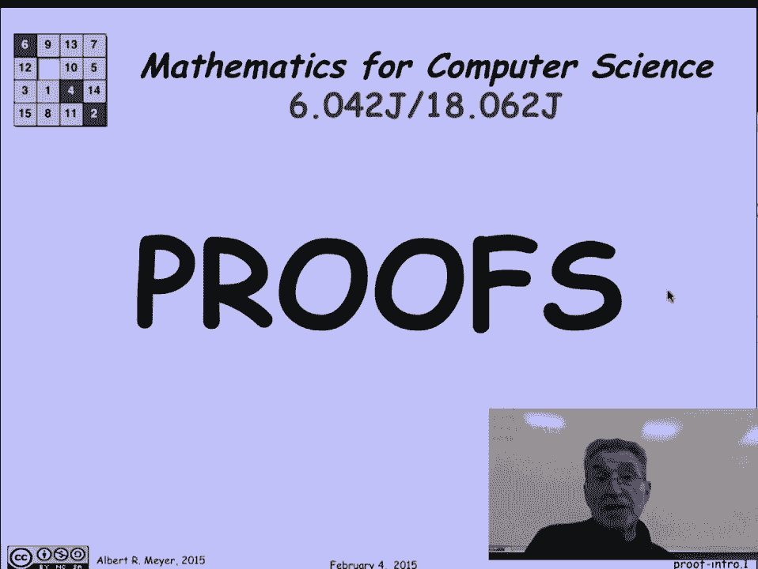

我们来看看，嗯，你们在高中早期就见过的著名定理，毕达哥拉斯定理，它说如果我有一个边为a和b的直角三角形，和斜边c，那么A B和C之间是有关系的，也就是a的平方加b的平方，等于c的平方，现在，这是。

正如我所说，完全熟悉，很明显吗，每隔一段时间，学生们说很明显，但我想他们真正的意思是很熟悉，不太明显，这并不明显这一事实的部分论点，几千年来，人们一直觉得有必要证明这一点，为了确定它是真的。

并解释为什么它是真的，在一个，一个专门收集毕达哥拉斯定理证明的网站，他们有一百多个人，包括美国前总统的一篇文章。

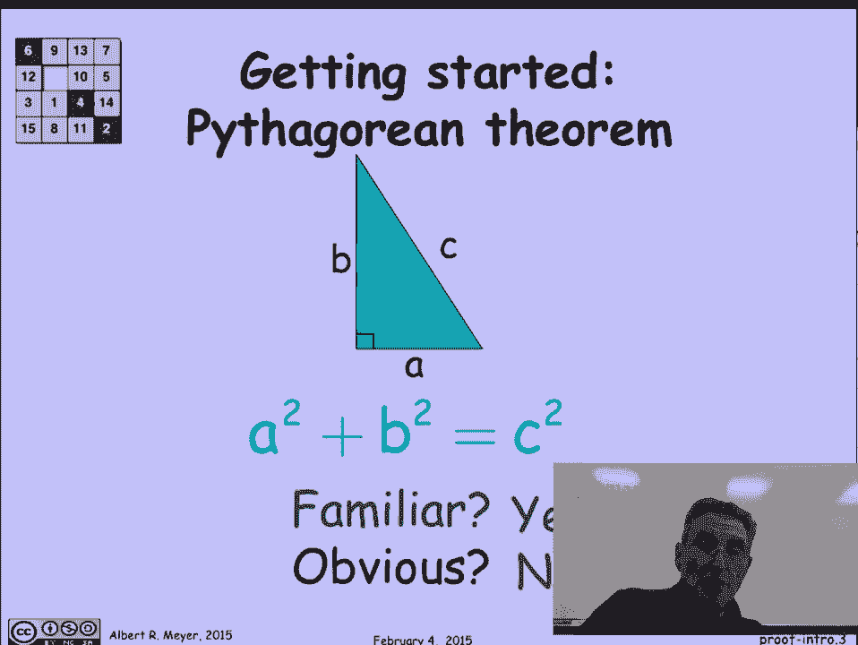

所以说，让我们来看看我最喜欢的毕达哥拉斯定理的证明之一，它是这样的，嗯，有四个大小相同的三角形，这个ABC三角形的四个副本，我们用不同的颜色来区分它们，和一个正方形，呃，目前规模未知。

毕达哥拉斯定理的证明，将包括把这四种形状重新组合起来，让它们先形成一个c乘c的平方，然后找到第二个安排，使它们形成两个正方形，a乘a平方a乘b平方，然后根据纸的守恒定律或面积守恒定律，它必须是呃。

c乘c的面积与a乘a加b乘b的面积相同，所以a平方加b平方等于c平方，嗯，让我们看看那些重新安排，也许你应该花点时间自己试试在我拿出解决方案之前。

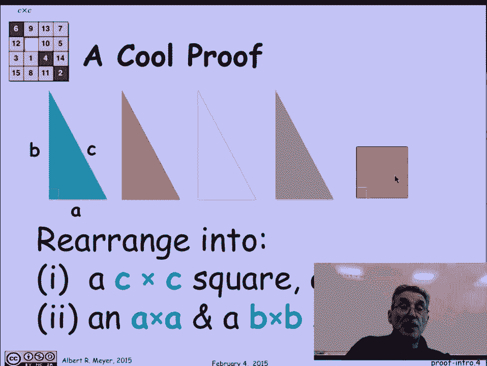

但第一个问题有解决办法，那是两者中比较容易的一个，这是C比C的安排，提示是，如果它是C乘C，你没有很多选择，除了把c长斜边放在外面，然后就是摆弄周围的三角形，所以它们很合身，你发现中间有一个正方形。

这正是提供的额外正方形所适合的地方，这也使你能够计算出正方形的尺寸是，因为如果你看着它，这是B面，我们设B为三角形两条边中较长的一条，这是A面，另一个三角形较短的边，所以这里剩下的是b减去a。

所以现在我们知道它是a b减去a乘b减去a平方。

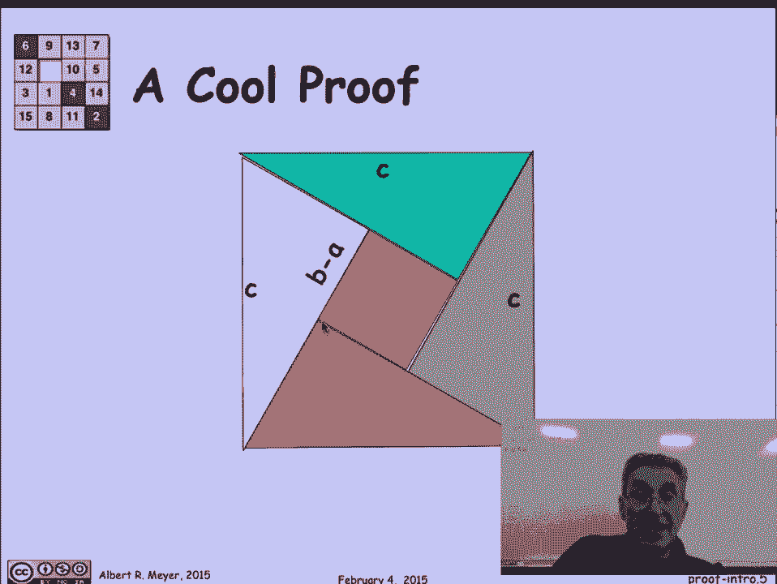

从这个安排中，嗯，这就是我们在这里指出的。

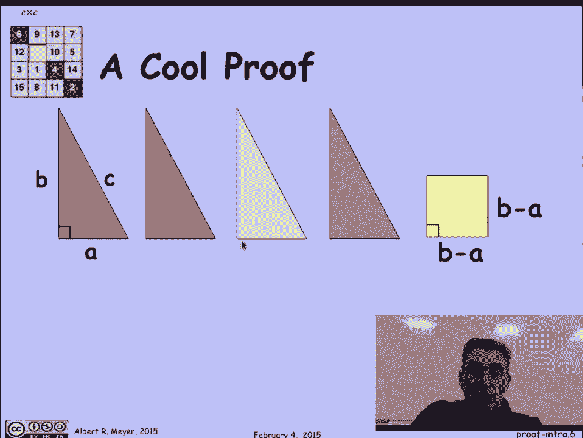

现在下一个安排是这样的，我们要把这两个，把这两个三角形折成一个长方形，另外两个三角形形成一个长方形，这样对齐，把b减去a乘以b减去a平方，这两个正方形在哪里，嗯，我没说a乘a和b乘b，平方需要分开。

事实上他们不在那里，但他们在哪里，让我们看看这个，呃线，井有多长，是a加b减a长，这意味着它是B长的，突然有一个b和一个b，我有一个B一个B的长方形就在那里，但等一下，这里是b减去a，它对着b的一面。

所以如果我看看剩下的，是b减去b减去a，它告诉我那一小块是一个，果然，当我添加这条隐藏线时，这条概念上的线把两个正方形分开，这部分是a乘a，那部分是b乘b。

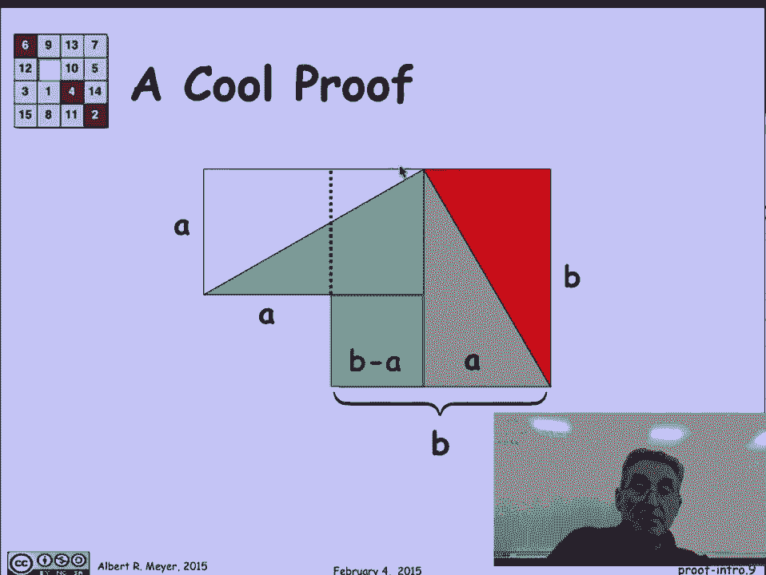

我们证明了毕达哥拉斯定理，那么这个证明呢，嗯，它真的很优雅，这是绝对正确的，我希望这有点令人信服，所以这是一个很好的图片证明的案例。

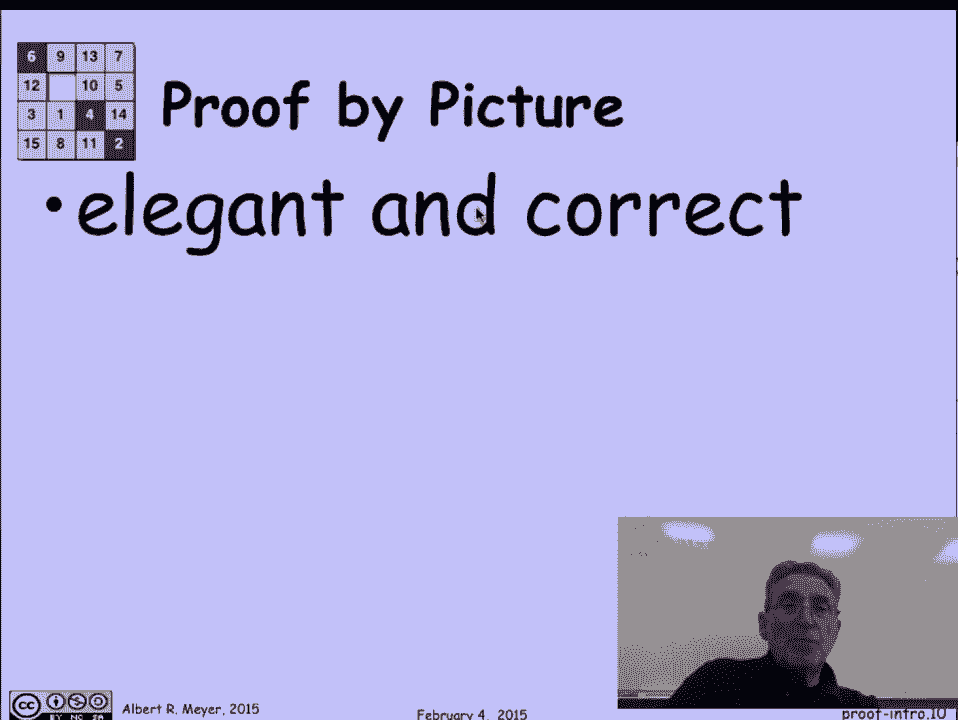

在这种情况下真的有效，但不幸的是，生物证明了这一点，担心数学家，他们理所当然地令人担忧，因为有很多隐藏的假设和练习，你可以通过，就是回到过去，思考所有的几何信息。

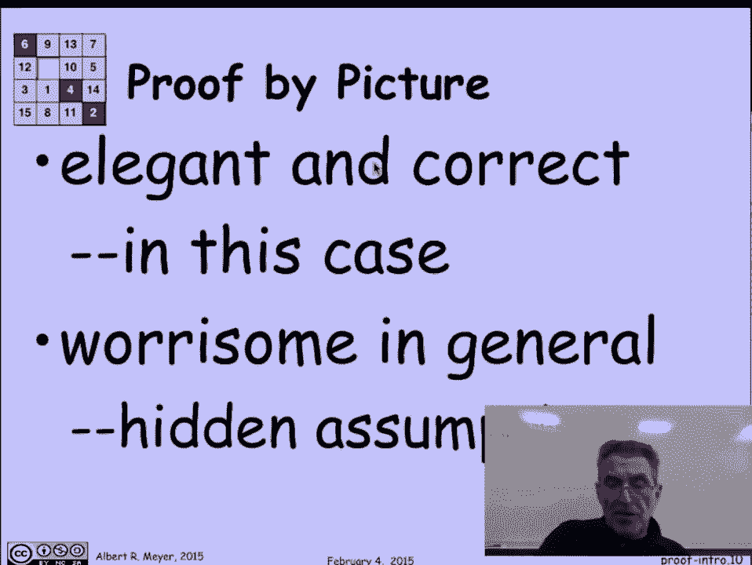

在这张照片中，这有点被认为是理所当然的，就像这里，我们怎么知道那是直角，这个东西是一个长方形，我们需要它是一个直角，因为我们声称这是一口方形的井，我们怎么知道那是个长方形，嗯，答案是显而易见的。

我们利用了这个事实，直角三角形的互补角，有些到九十度，因为三角形的角一般，有的到180度，我们正在其他很多地方使用它，你也利用了这是一条直线的事实，这可能很明显，也可能不明显啊，但这是真的。

这就是为什么把这些距离加起来是安全的。

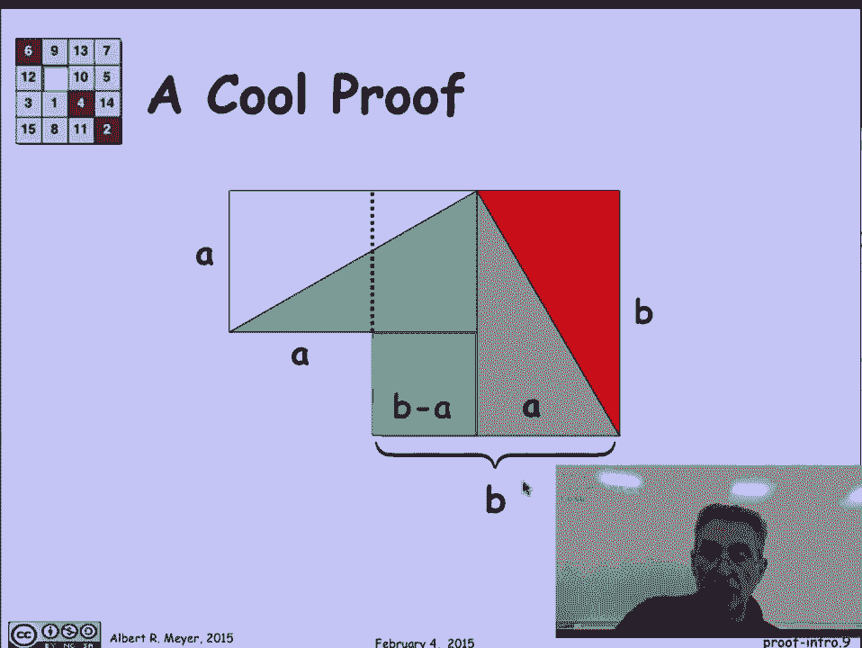

它是，我的观点是图表中真的有很多隐藏的假设。

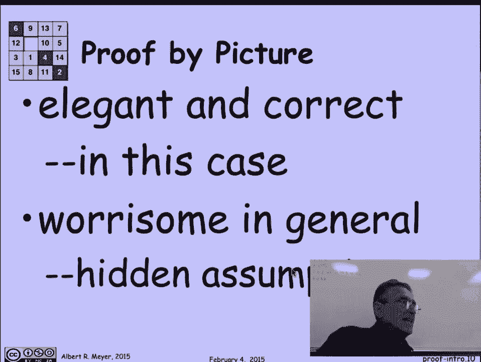

很容易被忽视和被愚弄，所以让我给你看一个被图表证明愚弄的例子，以下是如何获得无限的财富，让我们想象一下我有一张十乘十一的金箔，不错嘛，实际上它们可能是金板，但让我们把它想象成一个长方形，那是金子做的。

它将是矩形的，这些是直角，我要做的是把角标记掉，我要划出一个长度，然后我要划出1的长度，这样移动它，这样它就能接触到对角线在这个下角做同样的事情，现在让我们把这些形状，上面的那个，呃。

西南和第二个向东北，我最后得到的是这张照片，所以我现在得到了那些突出在形状上方的红色小三角形，好的，凉凉的，我们知道什么，现在是第十面，因为我在这里从它的长度中减去了一个，这是第十一面。

因为那曾经是十个，我在它的长度上加了一个，所以这很酷，因为现在我能做的就是把那些突出的三角形去掉，它们会一个接一个地形成一个小的，长方形或正方形，突然间我有了一点额外的金子，但看看这里有什么。

又是十乘十一的长方形金箔，所以我把这个旋转90度，我从头再来，我可以一直不断地生成这些小的一个一个形状的金箔，我可以变得无限富有，好吧好吧，那是有问题的，它违反了各种保护原则，更不用说它会破坏黄金价格。

有什么问题吗？嗯嗯，如果你能发现这个。

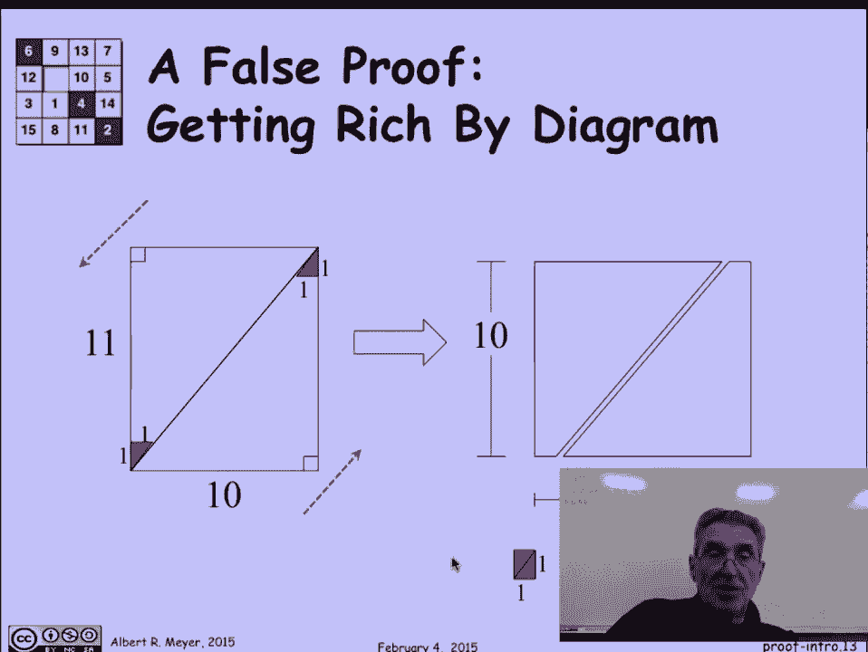

但也许你被愚弄了，发生什么事了？有一个隐含的假设吗，我剪掉的那些小三角形是直角三角形，我声称长度为11的这条线是一条直线，不是那些三角形有两个长度为1的边，它们是等腰的，三角形，但他们躺在对角线上。

那不是45度，所以他们是不对的，三角形，这条线不是直的，十和十一已经足够近了，它在视觉上并不明显，所以这是一种简单的方法，用图片证明给你看，如果我被要求证明，我怎么知道这是一条直线，那个bug就会出现。

但你不太可能注意到，如果它在视觉上不明显。

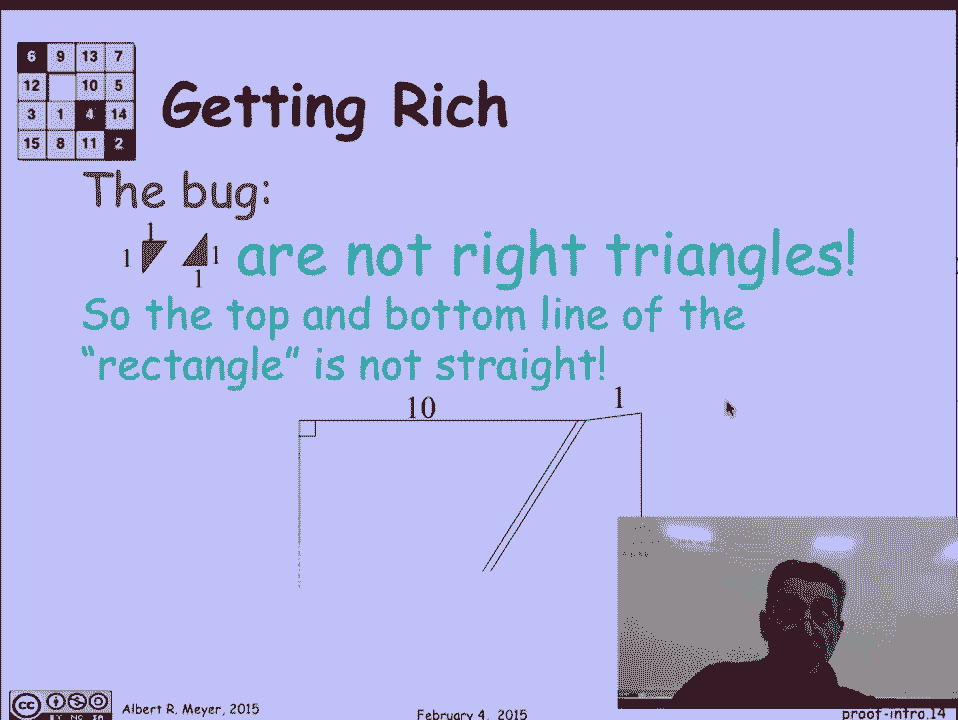