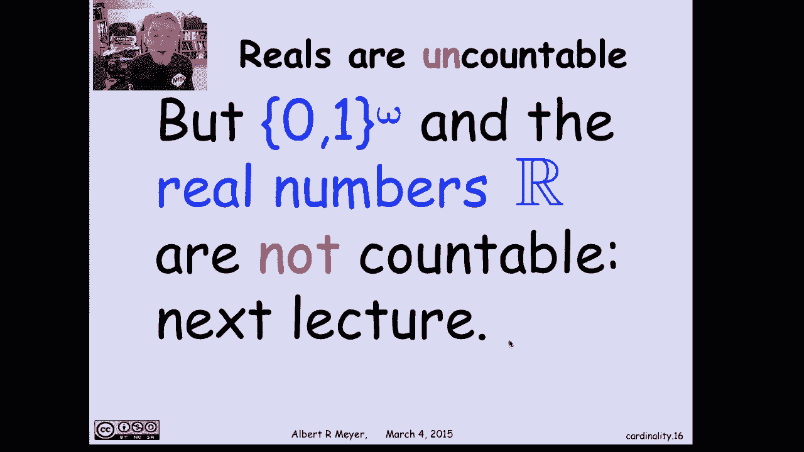

# 【双语字幕+资料下载】MIT 6.042J ｜ 计算机科学的数学基础(2015·完整版) - P30：L1.11.3- Countable Sets - ShowMeAI - BV1o64y1a7gT

所以我们有了可数集的概念，这是一种最熟悉的无限集合，可数集是一个可以列出元素的集合，一个零，一个1，一个二，以此类推，所以有一个，有一个所有元素的列表，其中a中的每个元素都在某个点出现，可以数到。

你最终会得到的每一个元素，你就能数到了，所以这只是一个列出它的问题，嗯，A的技术定义是可数的，如果A和非负整数之间存在双射，因为这个清单，实际上是从非负整数到零的映射，是一个零，一个映射到一个。

两张地图对一张二，这里隐含着一个双射，这是假设所有的，因为它是双射，所以我们也有，作为特例，有限集也被认为是可数的，所以真的，如果n是a是a的双射，则a称为可数无限，另一种可能性是A是有限的。

两者加在一起只是说a是可数的，所以我们刚刚发现，那么从前面的例子来看，正整数是可数的，所有的整数都是可数的，因为在这两种情况下，我们都展示了对非负整数的双射，另一个重要但不是很难的例子是有限二进制词集。

所以我们用这个符号零一星，意味着所有的有限星号意味着这些元素的所有有限序列，零和一，所以这只是有限二进制单词，嗯，它们是如何可数的，嗯，我需要一种方法能够以某种有序的方式列出它们，嗯。

我们就按长度来做吧，让我们首先列出长度为零re的空字或字符串，然后我将列出所有的一位字符串，长度为1的弦，嗯嗯，其中有两个，就像第二个元素一样，列表的下一个元素，空字符串之后为零。

然后之后的下一个元素是1，然后让我们列出所有的长度两个字符串，嗯，有四个长度，两个二进制字符串，让我们按合理的顺序列出它们，通过它们的二进制表示，然后继续列出所有长度的三个二进制字符串，有八个这样的。

最后继续上升，直到你得到长度和二进制字符串，其中有两个n的，这是对一个接一个列出的方法的描述，所有有限二进制单词或有限二进制字符串，并且该列表隐含地是对双射的描述，从非负整数n到列表中的元素。

这是一个双射，所以二进制单词是可数的，嗯，一些其他的，可数集的另一个例子是非负整数对，那么现在我如何得到非负整数，我得找到一对非负整数的双射，我怎样才能做好那件事，这和我们用二进制字符串的想法是一样的。

有很多方法可以证明，但是让我们传播二进制字符串的想法，让我们开始列出非负整数对，在零点之后，我要列出两对零，一和一，在他们之后，我会列出三对零，二，二，零，一，一，在他们之后，零，三，三，零，一，二。

一，如果你能看到我在做什么，我基本上是按照它们的坐标之和的顺序列出这些对，所以我要列出的第n块配对，将是两个坐标之和为n的对，会有n个加一个，我继续往这边走，这是对一个很好的有序描述。

一种很好的有序方式的描述，列出块内的所有非负整数对，发明一些字母规则来列出配对，所以我要，嗯，我在这里暗示了一个列出有限对集合的规则，它的和是n，你可以，任何人都会做的，所以说。

它告诉我们在非负整数之间有一个双射，和非负整数对，这是另一个重要的双射，当你试图证明责任的时候，有下面的引理是非常有用的，对问责制的另一种定性，即集合A是可数的，当且仅当您可以列出允许重复。

记住我们最初的定义是你可以列出一个没有重复的，如果它是无限的，否则它是有限的，所以非负整数和，实际上是说，这是一个无限集合的所有列表，没有重复的a，因为这是双射，否，我们在绘制地图。

如果一个元素出现两次，我们会有两个不同的非负整数映射到它，会破坏双射属性，注入特性，所以假设我们允许重复，声称这很好，因为你可以解决这个问题，所以引理说如果有满射函数，从非负整数到，那么A是可数的。

让我们在一个方向上快速检查，如果a是有限的，那么显然有一个满射函数，从非负整数到，嗯，有很多额外的非负整数，你不需要，你知道，如果有一个有限集，就像地图上的十个元素，从零到九到那十个元素，呃。

其他每一个非负整数，比如第十到第十张专辑，um的第十个元素或最后一个元素，所以a的满射是有限的，现在，假设a是无限的，我有一个从非负整数到，所以我列出了一个带有重复的，我应该有一个双射。

如果它符合另一个定义，1。你是怎么做到的？如果你是一个计算机科学家，你知道如何把有重复的序列变成没有重复的序列，你只需过滤它从左到右的重复，取一个的无限元素序列，其中有重复。

并只保留每个元素的第一次出现，这将定义双射，a的非负整数是有限的，如果a是无限的，这就是我们如何证明这个引理，我只是想解决这个问题，所以现在我们有了另一种方便的方法来证明集合是可数的。

仅仅通过描述不是双射，而是一种惊讶，在非之间，负整数和a满射通常比双射更容易描述，这就是为什么这是一个有用的引理，这样做的一个推论是，如果一个集合，如果我试图证明集合A是可数的。

所有我真正需要做的是找到一些其他的设置，我知道是可数的，并从另一个集合描述一个惊喜，c至a，因为我知道如果C是可数的，那么在非负整数和c之间就会有一个双射，因为当你把双射和满射结合起来。

你最终会有一个惊喜，它将隐式定义从非负整数到，哪个匹配通过引理告诉我A是可数的，所以证明某件事的一般方法是可数的，只是描述一个从你知道的可数的东西中产生的惊喜，击中你的目标，让我们看一个例子。

我声称有理数是可数的，有理数是可数的，一开始这有点引人注目，因为你知道你可以看到如何计算非负整数，正整数，所有的整数，因为有一个很好的明智的方法让一个接一个，但是用理性，在任何两个理性之间都是混乱的。

还有另一种理性，没有任何第一理性，没有任何明显的方法来列出它们，但真的，如果你停止思考理性，它们是如何在真正的线上布局的，但只要把它们想象成整数对，然后就很清楚如何列出它们了。

因为我们已经知道非负整数对是可数的，所以我要映射一对非负整数，m n到有理数m除以n，n可能是零，所以如果n为零，只需将所有这些对映射到一些，你最喜欢的有理数，就叫一半吧，然后呃，这给了我们一个，呃。

一个很好的满射映射，因为每个有理数都可以表示为m over，至少每一个非负有理数，所以实际上，我们得到的是一对非负整数的满射，我们知道它在非负实数上是可数的，对不起，非负有理数，整数商。

这意味着有理数肯定是可数的，尽管它们似乎分布在整个线上，我们再一次看到交叉n是可数的，有一个上面描述的激增到非负理性，所以它们是可数的，嗯，嗯，只是向前看一点，结果会证明，与有理数相反，实数是不可数的。

事实上，无限二进制序列也不是，我们看到无限二进制序列之间有一个双射，和非负整数的幂集，和，这两个都是不可数集合的基本例子，不可数的。

