# 【双语字幕+资料下载】MIT 6.042J ｜ 计算机科学的数学基础(2015·完整版) - P31：L1.11.4- Cantor's Theorem - ShowMeAI - BV1o64y1a7gT

所以是时候研究不可数集了，这就是我们在这个片段中要做的。

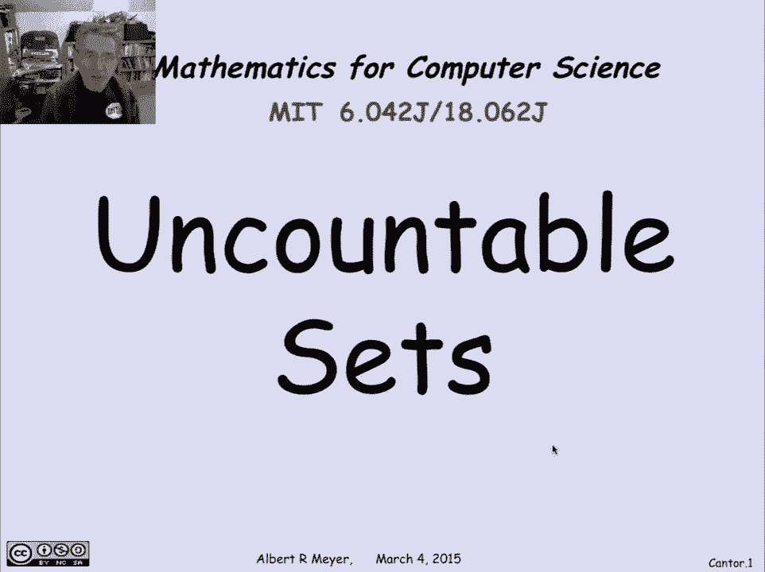

所以康德的问题是所有的集合都是相同的大小，他给出了没有康托尔定理的明确答案。

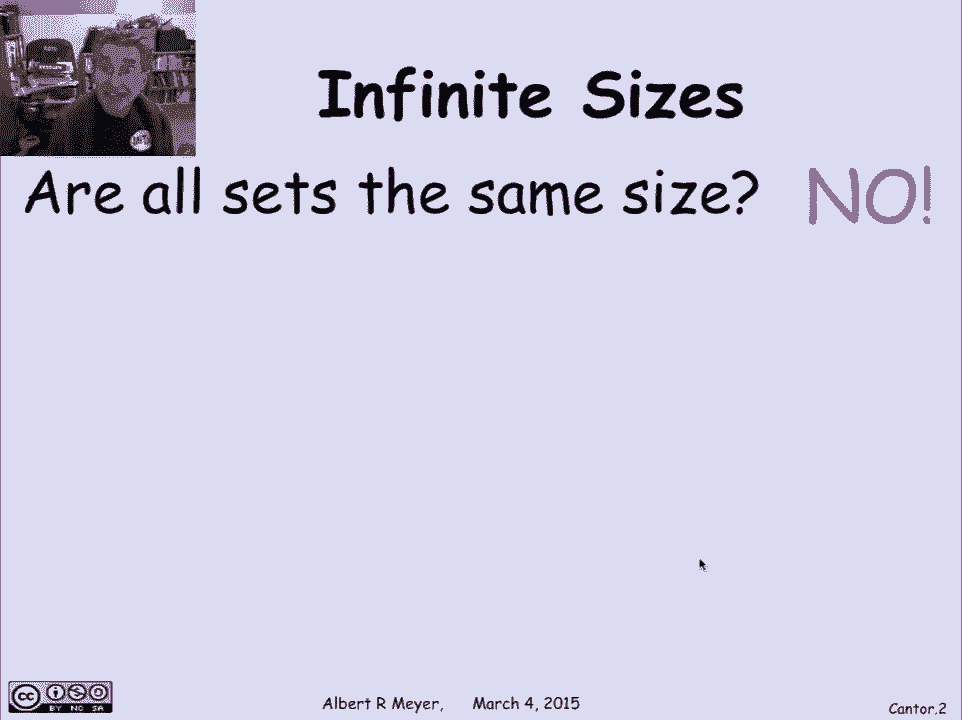

我们即将呈现的，会说明其实，对任何给定的无穷大都没有最大的无穷大，你可以用很简单的方法找到一个更大的。

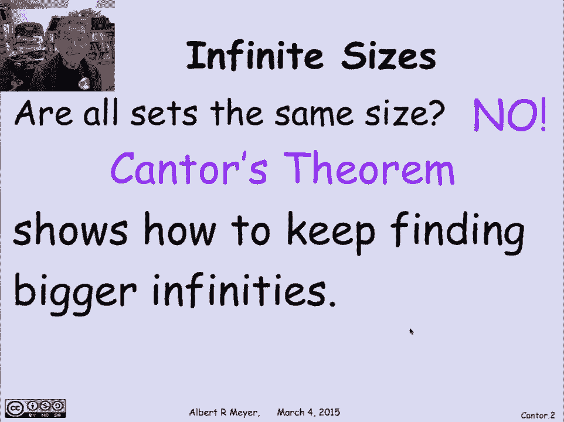

让我们从最简单的康托尔的形式开始，如何证明集合不可数的对角线论证，记住集合是可数的，如果你能列出，可能有重复，所以A是可数的，如果有一个序列，一个零，一一二，使得集合中的每个元素，A在某个时候出现。

或名单中的其他，可能不止一次，列表中唯一的东西是一个啊的元素，我们看到了一个例子，有限位串，0和1的有限字符串，或者有限二进制词是可数集的一个例子，我上次回收了，现在我们要证明区别在于。

如果你看无限位串，它们跑得无边无际，他们有一个开始，它们向右无限延伸，符号为零，一个到欧米茄，其中欧米茄是一种无限的符号之一的指示，这将是一个不可数集的例子。

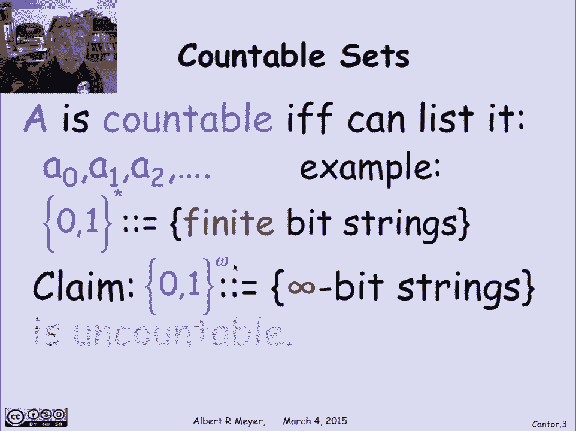

我们如何证明使用对角线参数的设置，就是考虑画一个矩阵，假设我有办法，从零到欧米茄的无限二进制序列，所以有一个序列，It’零度，有一个序列，It’只有一个，有一个序列是二，让我们把它们摆出来。

就像它们是矩阵的行一样。

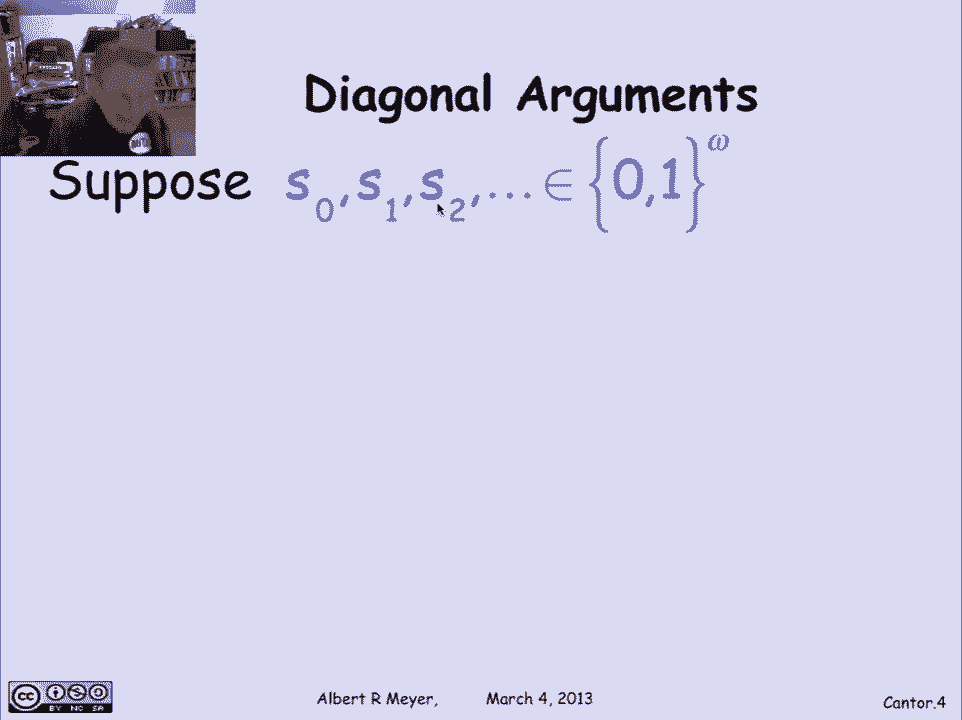

所以是零，这个无限二进制序列，零零一零，以此类推，嗯，列标签只是s零的坐标标签，所以这是零，以此类推，It’一个是下一个，这个假设列表中的无限二进制序列，从零点开始，一个零，然后继续，以此类推。

所以行标签是二进制序列的枚举，列标签是坐标标签，这是一个向右无限向下无限的矩阵，但它肯定有一个左上角，所以诀窍是试图找到一个无限的二进制序列，不在这个列表中的，它不同于每一行，如果我能做到。

然后我已经证明了，以零到欧米茄的方式枚举所有二进制序列的任何尝试，任何像S0这样的序列，二进制序列的第一和第二缺少了一些东西，这意味着你不能很好地列出它，你如何找到缺少的东西。

你怎么找到一个不在这里的序列，嗯，这很容易，嗯，你看第一个数字，那是一个零，所以你选择新序列的第一个数字为1，零的对立面，你选择第二个数字与s的坐标相反，的毛皮，呃，一个数字，这里的数字是一个补码。

S2中的2是零，所以让我们把它变成一个，对角线上的下一个是零，以此类推，我们要沿着这条对角线把所有的部分补齐，所以我得到了一个对角线序列，这就是为什么这个论点被称为对角线论点。

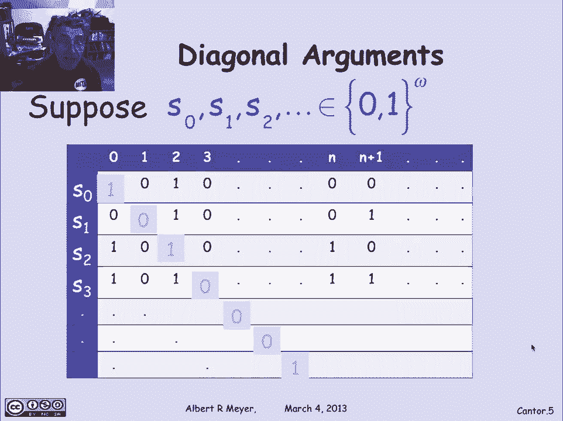

嗯，让我们想想这个对角线序列，它就沿着这个二维无限矩阵的对角线往下走，我们可以说它不同于每一行，为什么那口井，它不同于第15行的第15位或坐标第15位，它与坐标999处的第九十九行不同，它不在矩阵中。

它不是任何矩阵的一行，这立刻告诉你一切都结束了，任何以零为单位列出所有元素的尝试，一个到欧米茄会省略一个对角线元素，不可能列出所有的。

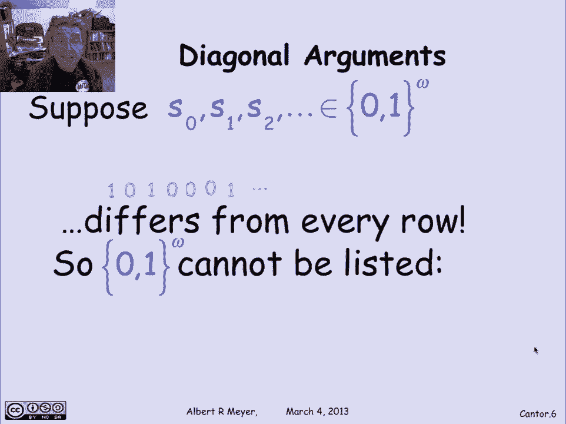

换句话说，非负整数没有任何满射，到零到欧米茄，因为我刚刚向你展示了，如果你给我一个关于二进制序列的惊喜，实际上我给你的是一个零序，第一个序列，第三个，第二个序列，以此类推。

那么我就知道如何找到不存在的东西，对欧米茄不可能有零比一的惊喜，只是不是真的，这就是为什么我们可以说，零到欧米茄是不可数的，可数的定义或可数的等价表述，记住有一个惊喜，从非负整数到集合，嗯，没有任何。

我们刚刚证明了，所以n不是浪涌零，顺便说一句，也很容易看出，从无限二进制序列到非负整数有一个满射，你可以将一个二进制序列映射到其中第一个序列的坐标，它将每个无限二进制序列映射到一个非负整数。

命中每个非整数，非负整数，我打了很多次，你知道的，五个，序列以四个零和一个一开始，唯一没有去任何地方的序列是全零序列，但顺便说一句，如果你检查浪涌的定义，它不要求函数是完全的。

浪涌意味着有一个函数是n的满射，但不一定要有更大的，等于一个箭头只需要小于或等于一个箭头，这是一个函数，但当然很容易让它完全，全零序列，只要把它映射到零，所以现在你有了零点和以序列开始的序列。

任何以1开始的序列都将映射到零，好的，所以如果我们记得我们的直觉浪涌被解读为大于或等于，所以这告诉我们无限二进制序列是一个更大的集合，至少与非负整数一样大的集合，反之亦然，非负整数至少不是。

至少和无限二进制序列一样大，所以说，我们真的可以说，负整数严格小于无限二进制序列的集合，现在严格意义上的更小是在报价中，因为再一次，我们不知道无限集合的确切大小，就是我们所做的，真的在谈论属性，反对。

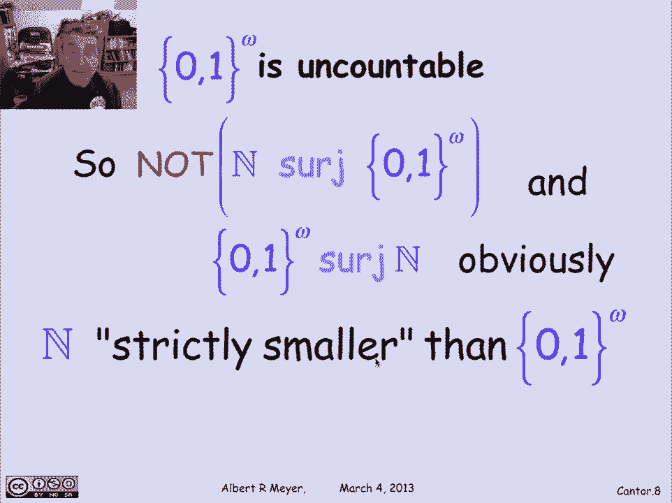

双射，预测数，注射，好的，所以让我们做一个明确的定义，我想说严格的b意味着没有猜测，从a到b，所以如果我们读到一个满射B，直觉上为A大于或等于B，这是说A大于或等于B是不正确的，或者用普通语言思考集合。

如果你大于或等于b不是真的，你必须严格小于B，所以这就是严格这个词的动机，但请记住，我们说的是无限集，我们不能假设太多的严格性质，直到我们证明了它们的一个重要性质，顺便说一句，我定义了严格的，那个。

从a到b有满射是不对的，但我并不坚持一定要有一个惊喜，从b到a，这将是第二个同伴部分，A不大于或等于B，而b大于等于a，从技术上来说，你可以证明如果没有任何猜测，从a到b，从b到a会有一个满射。

但那是用一套，不太明显的理论论点，我们不需要它，这就是严格A的定义，严格B意味着你不能从A到B得到一个惊喜，我们直观地把它读成a严格小于b，我们刚才展示的是非负整数。

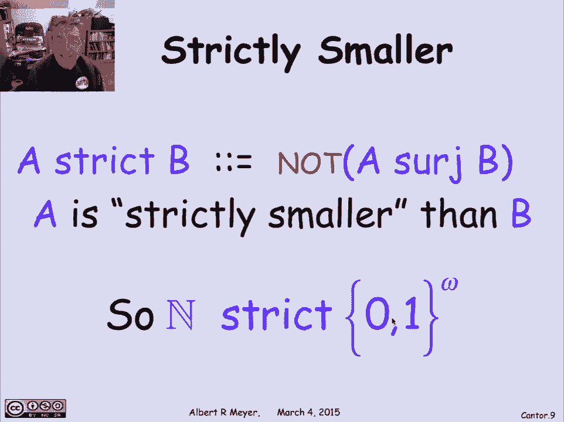

呃，零到欧米茄，无限二进制序列，好的，现在，康德定理是一个奇妙的，呃，对此的概括，这是一个强有力的概括，但证据几乎是一样的，虽然它有时看起来有点不同，因为它是写的，康德定理说的是，它是。

它只是美丽、优雅和简单，很简单，它简单地说，功率集严格大于，A的严格幂集为每集A，即使A是有限的，记住如果a是有限的，说a有n个元素，那么A的幂集有2到n个元素，即使n等于零，你也可以检查。

n小于等于2的n小于2的n，0的2次方，这是一个，2小于2的平方，也就是四个，以此类推，所以即使对于有限集，我们有一个严格的权力集，但很酷的是，它甚至适用于无限集。

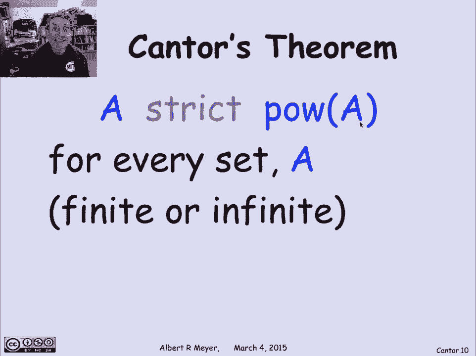

让我们来看看，又是对角线论证，但现在我不能假设a是可数的，我不会假设我真的可以列出一个，但我们会考虑的，好像我们可以，让我们再想想这个矩阵，所以假设A是这组元素，阿B S T D E。

我故意把字母表弄乱，因为我不想让你觉得，我们假设a是可数的，您可以列出，我不认为，但我只是写出了一个元素的示例，让我们假设我试图得到一个惊喜，从a到a的幂集，所以假设我有一个函数f。

它映射了a的每个连续元素，的某个子集，所以a的f是a的幂集的一部分，它是资本的一个子集，b的a f是资本的子集，以此类推，假设我有这样的设置，我要画一个看起来像对角线矩阵的矩阵，我们要提取一个对角线集。

并发现那个对角线集不是F的一个，没什么大不了的。

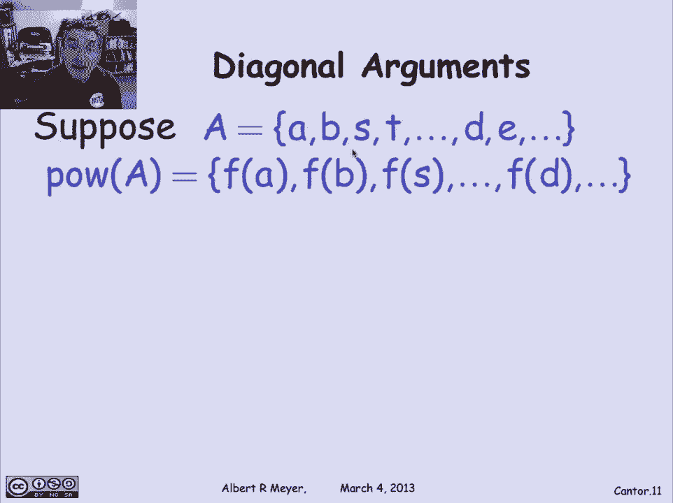

这意味着f不会是一个满射，所以让我们再看一遍，这是这个矩阵，其中我用矩阵的元素标记矩阵的列，这里没有特别的顺序，但是为了画一个矩阵，我得把它们按某种顺序写下来，同样地，第一行是这个元素的f，一口井。

什么是a的f，f是一组元素，所以让我们把f中的元素写在相应的列标签下，这里有一个例子，其中f有一个a，没有B，但它有一个S和一个T，无C节点D，它有一个E，同样，b的f有a和a b，没有s或t。

但它必须是c，以此类推，所以我通过取a中的一个元素的f来填充这个矩阵，它应该是，并写出该子集中的所有元素，子集的相应元素，所以b在a b下面，如果是c的f，s在s下面，如果是c的f，没有什么低于T。

如果t不在c的f中，这就是我们在这里看到的，所以我在布置，就好像我在用0和1来表示无限的二进制序列，我在布置F范围内的每一组，嗯沿着这一排，现在有了这个设置，我可以定义一个新的集合，它不是f。

我怎么才能好起来，我要做的不是在我的新布景里，我不会有任何出现在对角线上的元素，所以如果a是a的f的成员，这意味着A出现在这个坐标中，它不会在我的布景里，如果b在b的f中，意思是b出现在b行的f中。

在列的下面，b，它不会在我的布景里，另一方面，呃，s不在s的f中，因为那里没有，所以我要在那里用洋红色写一个s，同样地，我将把元素插入或取出，与它们是否出现在对角线上相反，这会给我一套，d um。

这将是我的对角线集。

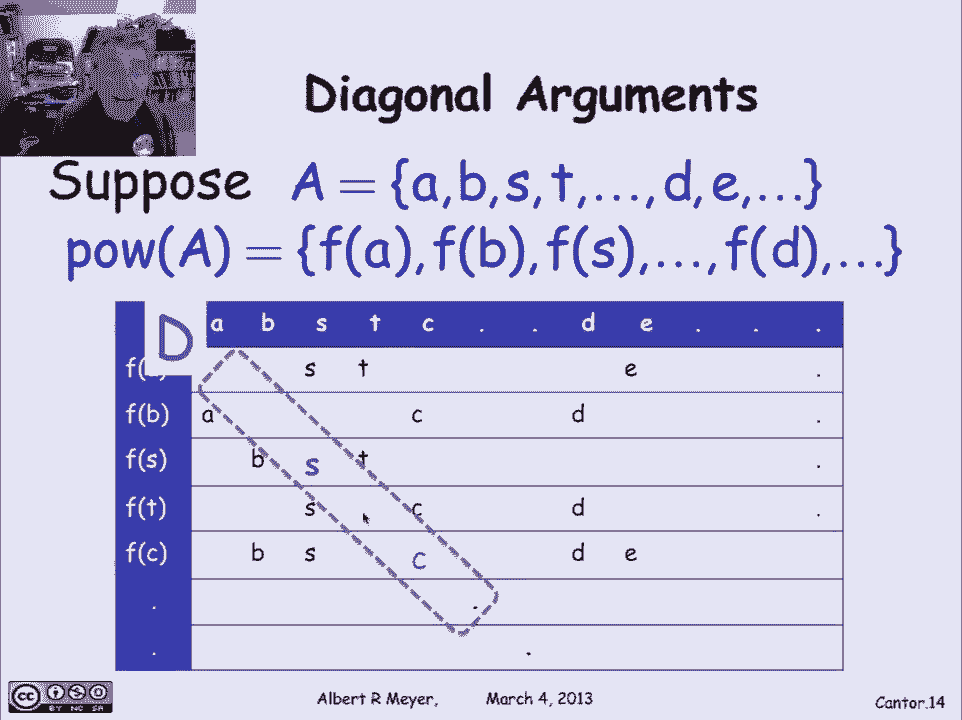

所以如果我们把这个写出来，所以我们说的是假设我有一个函数f，从a到a的幂集，那么我要做的是定义，那不在f的范围内，就是，嗯，它是，这样小A就不在A的F中，即如果一个元素出现在对角线上，因为一个元素。

带有列标签的a在a的行f中，然后我把它放在我的布景里，如果它不在矩阵中的那个位置，我把它放在我的布景里，所以我保留了所有不在对角线上的元素，那是我的对角线，我所知道的是，d不在f的范围内。

因为它不同于矩阵的每一个可能，如果行标记为，呃，用a的f作为a的f，那么它在A的A-F列中与该行不同，因此我的集合d不是这个矩阵的一行，这意味着它不等于任何东西的f，我刚发现d中没有f箭头。

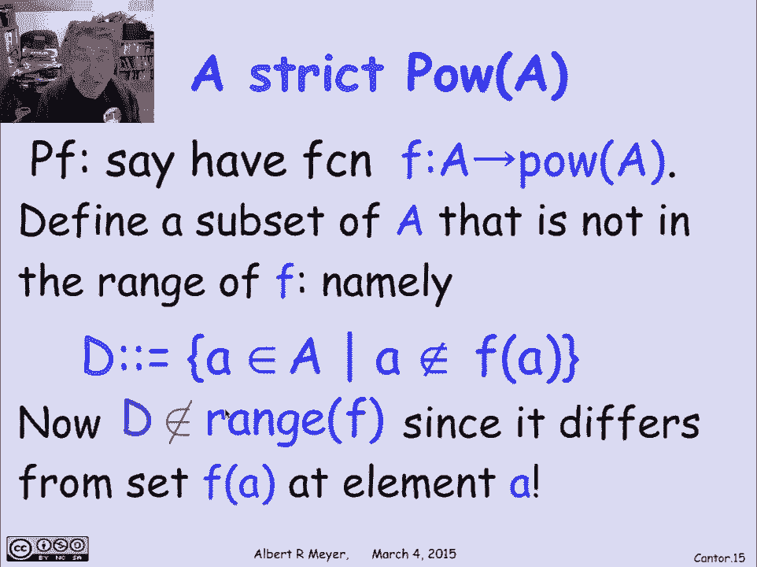

d不在f的范围内，这意味着如果我有这样一个f从a到a的幂集，这不是一个惊喜，因为d总是被漏掉，所以f不是一个奇数，因为你知道f是从a到a的幂集的任何函数，没有一个是惊喜。

这意味着没有从A到A的幂集的惊讶，换句话说。

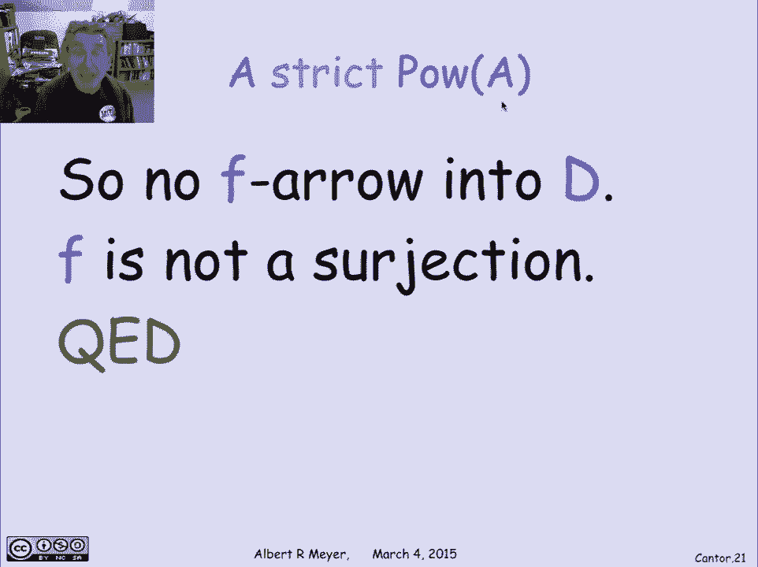

A的权力集没有惊喜，现在，这方面的一个特例，当然啦，非负整数是，小于n的幂集，因为那只是犬齿定理的一个例子，其中我们应用一个非负整数的集合，所以没有非负整数的满射，到非负整数的子集，再次。

这意味着n的幂集是不可数集的一个例子，因为，嗯，可数的定义，会有一个从n到n的次方集的满射，我们是说没有，所以它不可数或不可数，所以通常是这样措辞的，它是不可数的，所以n的幂集可能是秒的r。

不可数集的例子，第一个是二进制数的无限序列。

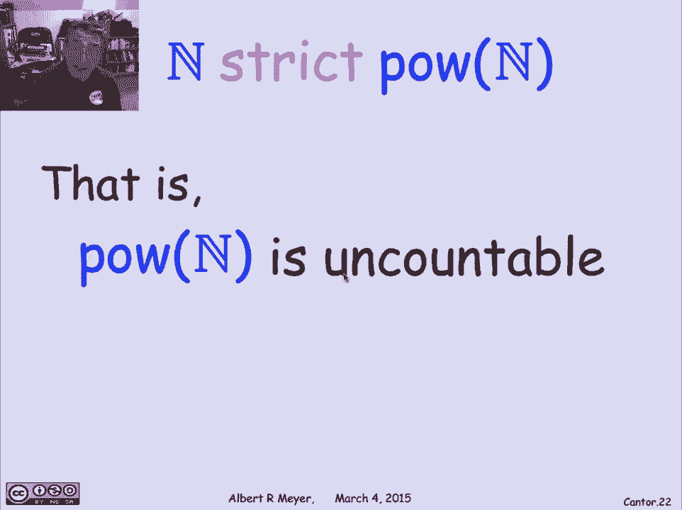

事实上，嗯，有一个，就像我们有一个一般的方法来证明可数性一样，嗯，你可以证明一个集合是可数的，如果有一个来自布景的惊喜，你知道是可数到目标上的，目标是可数的，取那个引理的逆命题。

你可以说如果集合A是不可数的，从c到a有一个满射，那么C必须是不可数的，那只是前一个的对应物，如果c是可数的，那么A是可数的，所以如果a是不可数的，c必须不可数。

所以这又给了我们一个很好的一般方法来证明集合的不可数性，一旦我有几个在我的曲目中。

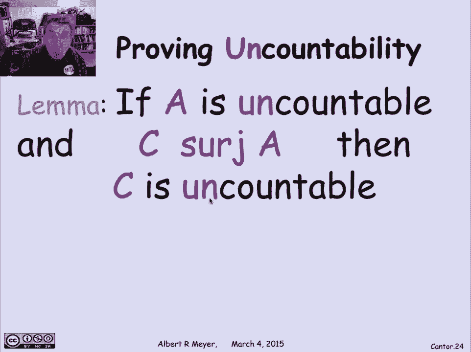

这意味着我们可以推导出零到欧米茄，无限二进制序列是不可数的，因为我们知道无限二进制序列之间存在双射，在n的幂集中，我们描述了双射，对无限二进制序列的任何其他性质一无所知，在n的幂集中，它们是否可数。

但现在，康托尔定理告诉我们n的幂集是不可数的，有一个双射，前面的引理特别说，从零到欧米茄有一个惊喜，n的幂集，这意味着欧米茄的零一是不可数的，所以我要说明的是，然后呢，我们直接用在。

通过对角线论证来计算零到欧米茄是，这确实是一个特殊的情况，我们用来证明康托尔定理的更一般的对角线论证，我们得到零到欧米茄是不可数的，关于n um的幂集的康托尔定理的一个结果，所以我们有两种不同的方法。

然后证明无限二进制序列是不可数的。

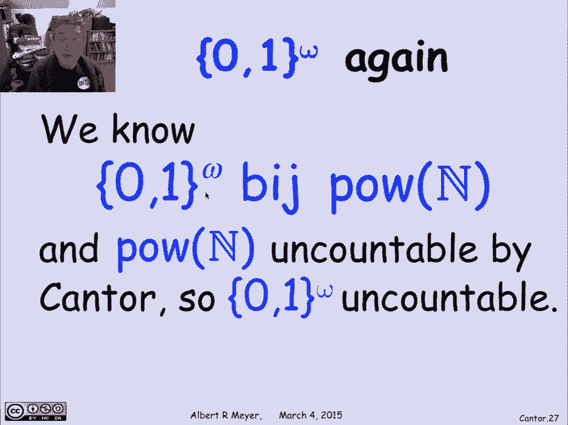

不可数集的另一个例子是实数，他们是尖锐的例子，记得我们看到有理数是可数的吗，实数是不可数的，嗯，我如何证明我只是要给你看一个惊喜，从实数到无限二进制序列，嗯，我怎样才能做好那件事，这是一种愚蠢的把戏。

但它起作用了，嗯，我同时使用正实数和负实数，所以让我们看看一些实数，看看它的二进制表示，暂时假设它是，嗯，呃积极，让我们来看看一些数字的二进制表示，比如三和三分之一。

所以这意味着如果我们把这些看作是二元的地方，这是零位，两人的地方，第四名，这是一半的地方，四分之一的地方，第八名，那么三和三分之一的二进制表示将是三，然后这个无限，呃，不是十进制而是二进制重复。

但是自行车或二元展开，零一零一零一，我们将检查我是如何知道这是第三个，这就是你得到的重复分数，你可以通过用二进制做一乘三的除法来计算，无论如何，就像每个实数都有一个十进制展开式一样，有一个二元展开。

就用二垒，这是三分之一的二进制展开式，所以我要做的是，我要把第三个和第三个映射到这个二进制序列上，我将忽略小数点后的位数，二进制，它不是小数点后的位数，它是小数点或二进制位置，我要把这个拿去制图。

序列一一零一，零一零一，好的，我声称这是一个惊喜，因为你要用这种方式很好地击中每一个可能的二进制序列。

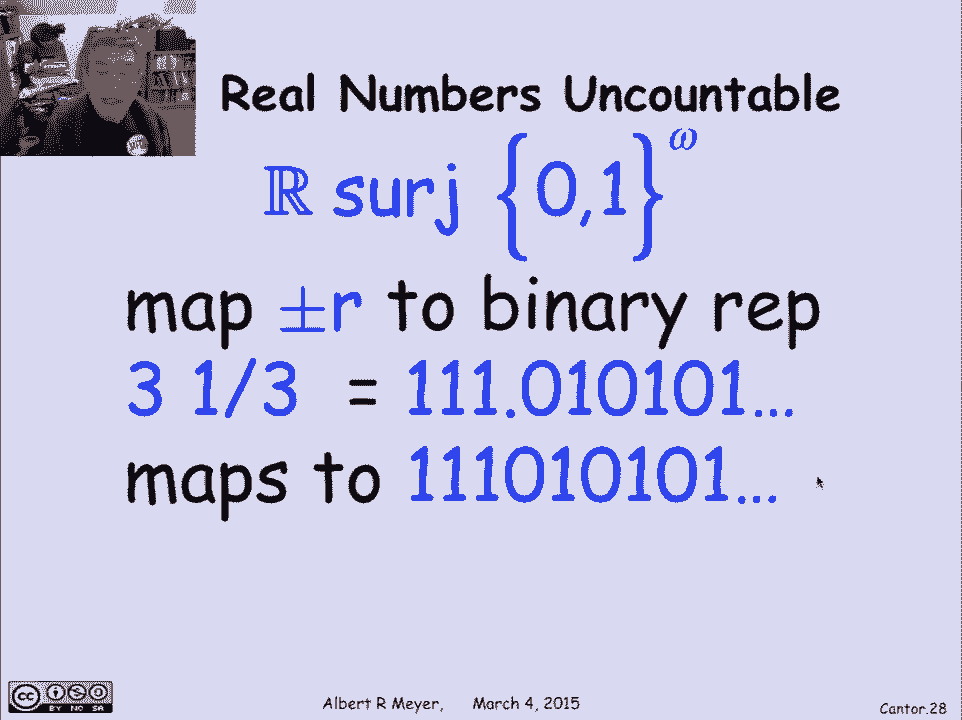

几乎让我们仔细看看，从零开始的事情，因为让我们检查一下半是第一点，哦，哦，哦，哦，所以我会把它映射到那个，就会结束，但有一个歧义，因为二分之一也等于一点，就像嗯，九点九九等于一点，哦，哦，哦，哦。

在十进制中，你会得到同样的无限进位问题，在二进制中，所以以1结尾的数字有另一种方式来表示相同的数字，以0结尾的序列，我要怎么打，如果我用完一半来打这个，还剩下什么可以打那口井，不如用-二分之一。

它在那里，这是r的一部分，所以我要绘制负数，到扩展的版本，从零开始，有无限个1，以无限个零结尾的正数，否则我会把加号和减号映射到同一个地方，所以这会给我所需的惊喜，从r到无限二进制序列。

通过我们前面的引理，这意味着足够肯定。

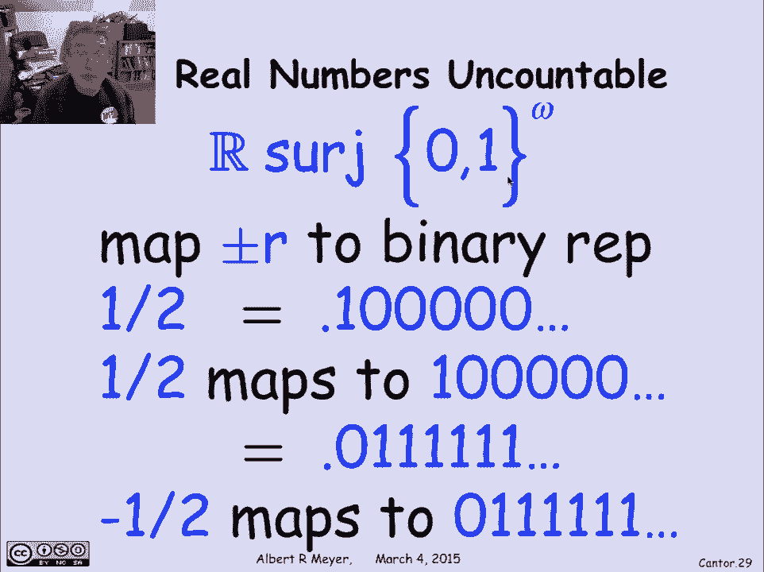