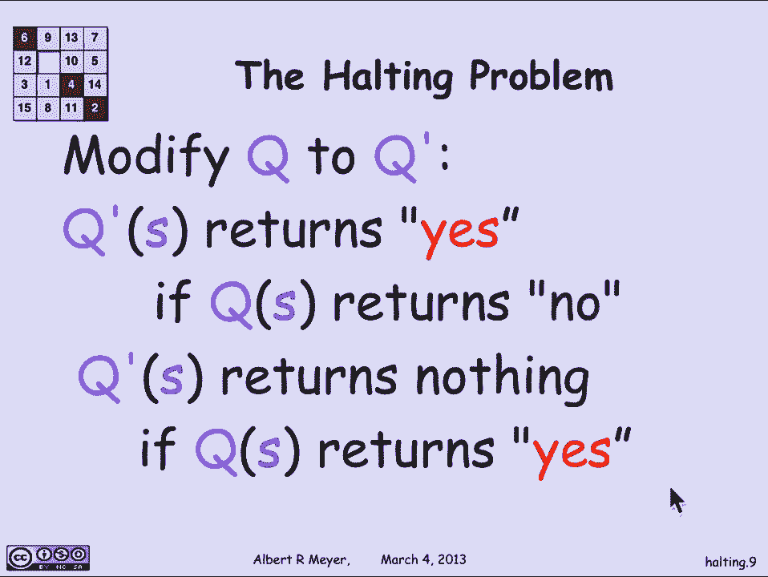
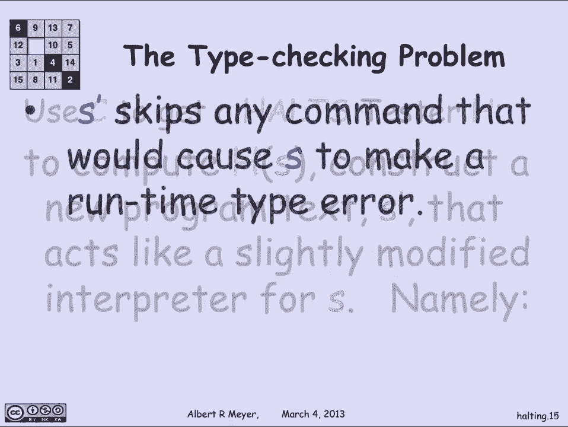
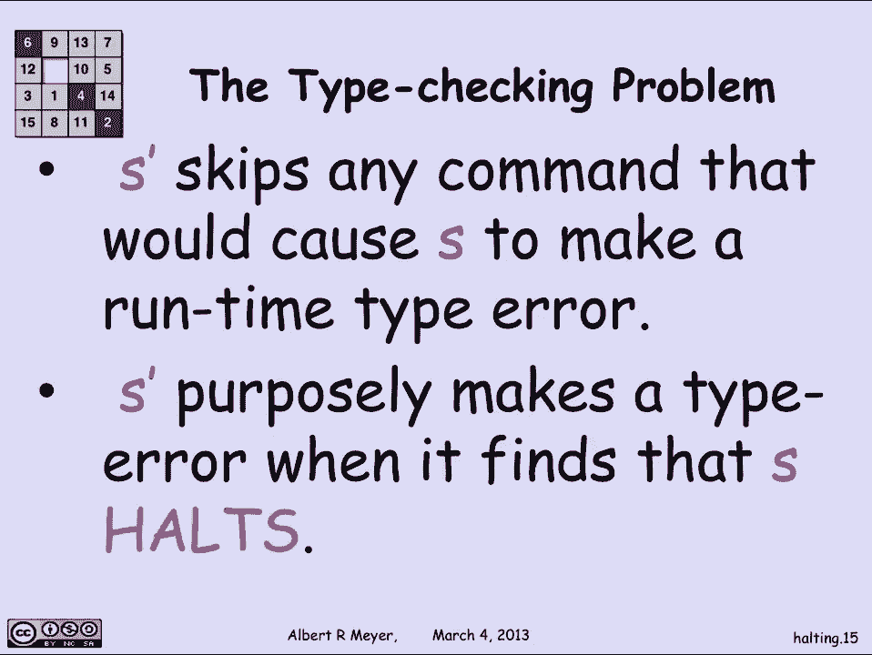

# 【双语字幕+资料下载】MIT 6.042J ｜ 计算机科学的数学基础(2015·完整版) - P32：L1.11.7- The Halting Problem - ShowMeAI - BV1o64y1a7gT

参数是优雅的无限集合，有些人认为是浪漫的，但你可以合理地问为什么这么奇怪，在计算机科学的数学课程中做无限的事情，和，原因是，对角线参数在计算理论中发挥了基本作用，我们现在要谈的是，是对角线参数的应用。

以表明存在不可计算集，和。

现在我们已经看到了，有无数的无限二进制字符串，这是因为在无限的二进制字符串之间有一个简单的双射，和自然数的子集，那是n的幂集，让我们看看无限二进制字符串中的字符串，我们可能会想到并称之为可计算字符串。

所以我的意思是，由可计算字符串，有一个简单的程序会告诉我它的数字是多少。

所以我的意思是，应用于论证的过程，并将返回字符串s的第n位，这就是我所说的定义，s是可计算的。

我可以计算出它的数字，以需要的数字为准。

我们看到只有可数的有限二进制序列，我现在提到这一点是因为我想考虑稍微大一点的字母表上的序列，而不是零一，二百五十六个ASCII字符，通过同样的论点，有限ASCII字符串的集合也是可数的。

你只需按长度顺序列出它们，与我们用于二进制字符串的参数相同，现在看ASCII弦的重点是，256个键盘字符就是我们输入计算机的每一个程序，我们输入一个ASCII字符串。

每个过程都可以用ASCII字符串表示。

因为只有可数的有限ascii弦，因此，只有可数多个可计算过程，为了成为可计算的无限二进制字符串，必须有一个程序来计算它的数字。

我们可以立即得出结论，只有可数多个无限二进制序列，可计算的，只有可数多个可计算无限二进制序列。

我已经说过在无限的二进制序列中有不可数的，所以必须有不可计算的序列，存在的不可计算无限二进制字符串，所以我们可以得出，事实上，因为无限二进制字符串的集合是不可数的。

可计算的是可数子集，必须有不可数的不可计算的，无限二进制序列，大多数无限二进制序列实际上是不可计算的，好的，那是一件很抽象的事情，他们在外面，你无法通过计算得到它们，但合理的问题是他们长什么样。

我们将要看到的是，如果你考虑一个特定的，一个明智的具体计算问题，给出一个程序，确定它是否会在某个参数上成功运行并返回值，或者不称为测试过程的停机性，我想知道，给出了一个程序和一个我可以应用它的论点。

它是否返回值，还是发生了其他不好的事情，它永远运行，它返回一个错误，我们没有得到满意的价格，如果它成功了，它令人满意地回报了一些东西。

我们说它停下来，我要说的是，停机问题是不可判定的，也就是说，没有一个过程给出一个描述过程的输入，固定过程可以计算出它的输入在做什么，让我们更详细地看看。

让我们考虑一下字符串过程，因为我们在考虑由ASCII字符串表示的程序，所以让我们考虑接受字符串参数的过程，所以一个过程p的例子，可能是当您将p应用于字符串no时，它返回到，当您将其应用于字符串时。

阿尔伯特它返回MI，当它，当你呃，将其应用于这串导致错误的奇怪符号，并将其应用于字符序列，现在怎么办，它实际上永远运行，这些只是一些奇怪的字符串过程可能表现出的行为的例证。

所以我想的是假设我有一个，一个化验字符串x一个有限的ASCII字符串，这是定义这个过程p的一个，当我试图在计算机上运行P时，我得输入S，为了给计算机P的定义，告诉它该怎么做，我要说这是停。

字符串有这样一个属性，称为整数，当且仅当s描述的此过程p成功返回时，或停止，当它应用于s时，这就是我们要去的地方，这就是我们真正做对角线论证的地方，我们把s对象，用s描述的过程，并将其应用于。

这是一种下降，s的对角线应用于s，或者第n行的第n个元素的num行，在图形对角线论证中，这就是我们要去这里的想法，但让我们回到定义，字符串被设置为停止，当您将其解释为对接受字符串参数的过程的描述时。

当您成功返回时，您将字符串过程应用于相同的事情。

这就是停顿问题，我想说的是，不可能有一个程序，决定字符串属性停止的q，也就是说，应用于字符串返回的q，是呀，如果s成功返回，如果s停止，它返回否，否则Q应用于S将说不，如果s永远运行。

或者如果s有类型错误，或者s执行除成功返回值以外的任何操作，为了避免矛盾，让我们假设，有一种霍尔茨的欲望，我声称不可能有这样的暗示，为了矛盾的贡献，让我们假设有一个。

这就是我要做的把戏，我要把q修改为act，好像在补充对角线，更准确地说，这就是我要用Q做的，我将修改q为另一个过程，只是行为有点不同，即s的q质数返回是。

当s的q返回NUl而s的q Prime不返回任何东西时，那就是，如果Q的s返回是，它就不会停止，所以q质数就像是对角线上的位的互补，但这是精确的定义，S的Q说不，s的质数q表示是，Q的S说是。

Let’成功停车，q质数则不成功停止，它什么也不返回，让我们来看看这些定义的后果。

所以s holtz表示s的q质数不返回任何值，这就是我们现在定义s的q素数的方式。

让我们成为Q Prime的文本，我们说q质数是，如果q是一个过程，那么我们当然可以调整这个过程Q来获得过程，q质数，所以Q Prime会有一个描述它的文本，它会是定义q素数的ascii字符串。

让我们让我们成为那根ascii弦，我们有什么，那么根据停顿的定义，不要停下来，当且仅当T描述的过程，即应用于T的Q Prime现在成功返回值，根据q素数的定义，然而，它在t上成功地返回了一个值。

当且仅当T不是停止的情况，好的，所以如果你把这两件事放在一起，那就是我们正在看的，t停止当且仅当t的q质数返回，t的q素数成功返回值，当且仅当不停止。

然后把两者放在一起，我们就有了矛盾，当且仅当t不能阻止它，矛盾，说我们最初的假设是我们有一个队列，这将决定停机问题不可能是正确的。

不可能编写一个确定字符串的过程，它们是否描述了一个当应用于自身时停止的过程，好的，这至少给了我们一些具体的问题，我们可以说不是电脑能做的，尽管这是一个非常明确的问题，只是不可能让一台计算机。

将对任意字符串，找出正确答案，应用于字符串是试图做这项工作，要么它会给出错误的答案，或者它从来没有给出错误的答案，意思是它根本没有给出答案，呃，一些弦，嗯，你可以说我真的不太在乎，程序是否成立。

所以让我们看看你如何应用同样的推理，或者更准确地说，你如何将推论作为推论应用，持有问题不可计算的事实。

让我们来谈谈听起来更接近实际的兴趣，即类型检查。

所以我想考虑一下类型检查问题，我想说的是，事实上没有字符串过程，类型检查程序完美。

所以我的意思是我想写一个程序，它将查看程序任务，任务，测试，一个ASCII字符串，它描述了一个过程，并计算出该ASCII字符串是否，如果运行，将导致运行时类型错误，这就是类型检查器应该做的。

他们应该检查你的程序，弄清楚程序是否会导致运行时类型错误，如果是这样，它报告了它，如果没有，上面说这个程序是安全的，其他事情可能会出错，但它不会提交运行时类型错误。

所以让我们假设我有这样一个类型检查程序，这意味着对于程序文本，返回，是呀，如果运行s会导致运行时类型错误。

s的c返回否，输出字符串no，否则，如果s um不会导致运行时类型错误。

换句话说，S是安全的，现在我要说的是，如果你给我C，如果我有手术，这是一个完美的类型检查器，我可以用C构建一个停顿测试仪，我们说这是不可能的，那么我如何使用C来获得霍尔茨测试仪H，这是如何嗯。

我要告诉你们如何计算s的h，我将如何在这里写一个过程，我在描述这个测试器h在参数s上执行的过程，它所做的是给出一个论点，它将构建一个新的程序，这是对s的一个小修改，它将构建这个新程序，s作为s的解释器。

所以s是计算一个计算机程序，我想知道如果你运行它，会不会停下来，我要稍微调整一下，所以s质数就像s。

但稍微修改一下，这是Prime的工作原理Prime将成为一名解释器。

那是一步一步地模拟，S的行为如何，但当它发现，s即将提交运行时类型错误，下一个s prime指令将在模拟中执行，这将是一个运行时类型错误，她的黄金时期会跳过它，谁知道跳过它会有什么后果，但它会跳过它。

继续前进。

如果s在模拟程序中处于首要地位，s发现事实上s成功返回，那是它的停站，那么s prime会故意犯类型错误，所以让我们想想这意味着什么。

嗯，让我总结一下h的定义，所以h的工作方式是给定输入的，它构造了程序，It’全盛时期，并将类型检查器c应用于s prime，并返回与c相同的值，根据这些定义，我们可以得出的是，这阻止了专业人士。

字符串s是a是停止字符串，当且仅当字符串的素数产生运行时类型错误，因为还记得那个翻译吗，她的全盛时期表现得就像，在看模拟的东西，她做了什么，如果S要成功守住，s prime产生运行时类型错误。

这意味着c会对s质数说是，是呀，它有一个运行时类型错误，根据h的定义，这意味着s中的h说是，因为S的H。

s素数和θ到c，好的，另一方面，如果s不成立，这意味着我们出了其他问题，它不会成功返回，那么当它模拟的时候是Prime，s永远不会出现运行时类型错误，因为就是这样，It’全盛时期过去了。

当它检测到将要出现运行时类型错误时，它跳过了，所以S Prime可能会永远运行下去，因为它在模拟这个程序，它不会停止，但它不会犯类型错误，这意味着s质数的c会说不，无类型错误，S中的H会说不。

这意味着当s不成立时，适当的h，说不，换句话说，我刚刚经历了我所描述的这个过程，实际上是停止的决定者。

这是一个矛盾，我给你的h可以解决停顿问题，如果有一个完美的类型检查器，不可能有一个完整的问题决定者，所以不可能有一个完美的类型检查器，C一定是搞错了，它不能。

这是你如何从这种人为的停顿问题中推理的一个例子，这是一种自我参照，应用于其自身定义的字符串过程是否成立，我们可以把它应用于各种问题和性质，我们真正关心的程序，事实上。

同样的原因确实表明这不仅仅是类型检查，这是一种任意的例子，但或多或少，对于过程结果可能显示的任何类型的属性，没有完美的检查器，这就是为什么，对他们的计算理论感兴趣的理论计算机科学家。

对对角线争论非常尊重和感兴趣，因为它们具体化了一整套绝对合乎逻辑的。

