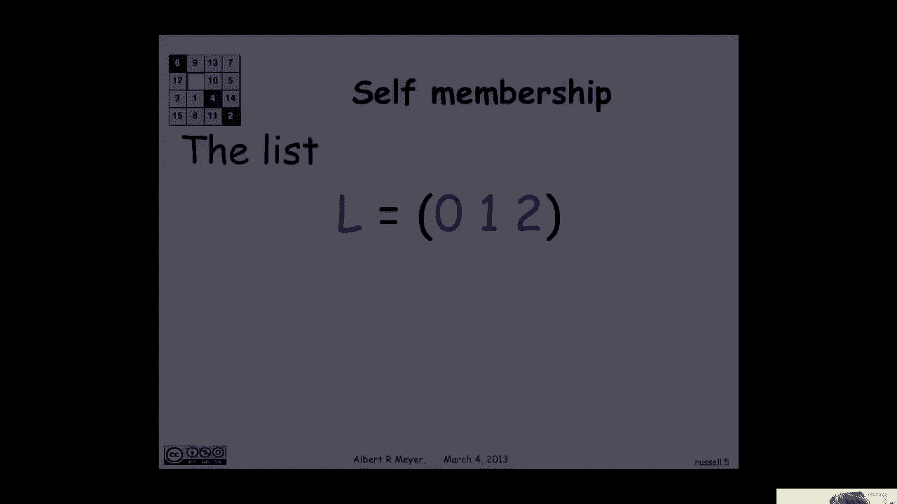

# 【双语字幕+资料下载】MIT 6.042J ｜ 计算机科学的数学基础(2015·完整版) - P33：L1.11.9- Russell's Paradox - ShowMeAI - BV1o64y1a7gT

so in this final segment today we're，going to talk about set theory just a。

little bit because if you're going to，take a math class if you're going to be。

exposed to math for computer science，it's useful to have at least a。

glimmering of what the foundations of，math looks like how it starts and how it。

gets justified and that's what set，theory does in addition we will see that。

the diagonal argument that we've already，made much of plays a played a crucial。

role in the development and，understanding of set theory so let's，begin with an issue that plays an。

important role in set theory and in，computer science having to do with the。

idea of taking a function and applying，it to itself or or having something。

refer to itself and this is one of these，things that's notoriously doubtful。

there's all these paradoxes about it，maybe the simplest one is when I assert。

this statement is false and the question，is is it true or false well if it's true。

then it's false and if it's false then，it's true and we get a kind of buzzer。

it's not possible to figure out whether，this statement is true or false I think。

we would deny that it was a proposition，so that's a hint that there's something。

suspicious about self-references。

self-application and so on on the other，hand it's worth remembering that in。

computer science we take this for，granted so let's look at an example。

here's a simple example of a list in a，scheme Lisp notation meaning it's a list。

of three things ero one and two and the，black parens indicate that we're。

thinking of it as an ordered list now，the way that I would represent a list。

like that in memory typically is by，using these things that are called。

consul so a consul has these two parts，the left hand part points to the value。

in that location in the list so this，first consul points to 0 which is the。

first element of the list the second，component of the consul points to the。

next element of the list and so here you，see one pointing to the third element of。

the list and there you see two and that，the mill marker indicates that's the end。

of the list so that's a simple，representation of a list of length three。

with three consoles well one of the，things that a computer science let you。

do in many languages let you do is that，you can manipulate these pointers so。

using the language of scheme what I can，do is do an operation called set car。

where I'm taking in this case I'm，setting the second element of L that is。

this consul to L and set car is saying，let's change what the element in the in。

the left-hand part of this cell is this，is where the value of the second element。

is let's change the value of the second，element to be L what does that mean as a。

pointer manipulation it's pretty simple，I just move this pointer to point to the。

beginning of the list L and now I have，an interesting situation because this。

list now is a list that consists of of 0，and L and toe it's a list that has。

itself as a member and it makes perfect，sense and if you sort of expand it out L。

is this list that has begins with 0 and，then its second element is a list that。

begins with 0 and the second element of，that list is a list that begins with 0。

and so on and then the third element of，L is 2 and the third element of the。

second element of L is 2 and so on it's，an interesting infinite nested structure。

that's nicely represented by this finite，the circular list ok um let's look at。

another example where in computer，science we actually apply things to，themselves so let's define the。

composition operator and again I'm using，notation from the language scheme I want。

to take two functions F and G that take，one argument and I'm going to define。

their composition the way that I compose，F and G is I define a new function H of。

X which is going to be the composition，of a change，the way I define H of X as I say apply G。

to F could you apply F to G applied to X，and return the value H so this is a。

compose as a procedure that takes two，procedures F and G and returns their。

composition H okay let's practice，suppose that I compose the square。

function that map's X to x squared and，the add one function that map's X to X。

plus one well if I compose the square of，adding one and I apply it to three what。

I'm saying is let's add one two three，and then square it and I get three plus。

one squared or 16 because the and one，and then square it is the function。

that's the composition of square and an，one now I can do the following I could。

square this I could compose square with，itself if I take the function square it。

and square that I'm really taking the，fourth power so if I apply the function。

compose of square square to 3 I get 3，squared squared or 81 or 3 to the fourth。

what makes perfect sense ok well now，let's define a a compose it with itself。

operation I'm gonna call it cop to come，to it takes one function f and the。

definition of cop to is compose F with F，and if I then apply cop to 2 square + 3。

it's saying okay compose square and，square we just did that that was the。

fourth power apply it to 3 I get 81 and，now we can do some weird stuff because。

suppose that I apply comp 2 to cop 2 and，then apply that to add one and apply。

that to 3 well that was a little hard to，follow and I'm going to let you think it。

through but cop 2 of cop tow is composed，something with it four times and when。

you do that with add 1 what happens，three，if I come to of comp two of square I'm a。

composing square with itself and then，composing that with itself I'm really。

squaring four times and I wind up with，two to the fourth or sixteen is the。

power that I'm taking and so composed，who have composed whose square of three。

is this rather large number three to the，sixteenth it could be a little bit。

tricky to think through but it all makes，perfect sense and it works just fine in。

recursive programming languages that，allow this kind of untyped or。

generically typed composition okay so，why is it that computer scientists are。

so daring and mathematicians are so，timid about self-reference and the。

reason is the mathematicians have been，traumatized by Bertrand Russell because。

of Russell's famous paradox which we're，now ready to look at so um what Russell。

was proposing and it's gonna look just，like a diagonal argument is Russell said。

let's let W be the collection of sets s，such that s is not a member of s now。

let's think about that for a little bit，most sets are not members of themselves。

like the set of integers is not a member，of itself because the only thing in it。

is in it are integers and the set of the，power set of the integers is not a。

member of itself because every a member，of the power set of integers is a set of。

integers whereas the power set of，integers is a set of sets of those。

things so those familiar sets are，typically not members of themselves but。

who knows maybe there are these weird，sets like the like the circular lists or。

a function that can compose with itself，that is a member of itself now let me。

step back for a moment and mention where，it weighted Russell yet thinking about。

this and it comes from the period in the，late 19th century when。

mathematicians and logicians were trying，to think about confirming and。

establishing the foundations of math，what was math absolutely about what were。

the fundamental objects that that，mathematics could be built from and what。

were the rules for understanding those，ABS objects and it was pretty well。

agreed that sets were it you could build，everything out of sets and you just need。

to understand sets and then you're in，business and there was a German。

mathematician named Freya who tried to，demonstrate this by developing a set。

theory very carefully giving careful，axioms for what sets were and he showed。

how you could build out of sets you，could build the integers and then you。

could build rationals which are sort of，just pairs of integers and then you。

could build real numbers by taking，collections of rationals that um that。

had a least upper bound and oh and then，you can keep going and you can build。

functions and continuous functions and，he showed how you could build up the。

basic structures of mathematical，analysis and prove their basic theorems。

in his formal set theory the problem was，that Russell came along and looked at。

frege's set theory and came up with the，following paradox he defined W to be the。

collection of essence sets such that s，is not a member of s Fraga would，certainly have said that's a。

well-defined set and and he will，acknowledge that W as a set um and let's。

look at what this means and I mean this，diagonal argument so let's remember。

what's if by this definition of W but we，have is that a set s isn't W if and only。

if s is not a member of s ok that's fine，then just let s be W and we immediately。

get a contradiction that W is in W if，and only if W is not in W port Fraga。

he's his book was a disaster math is，broken you can prove that you're the。

Pope you can prove the pigs fly verified，programs crash math is just broken it's。

not reliable you can prove anything by，in frege's system because it reached a。

contradiction and from something false，you can prove anything。

well Fraga you know had a book it was a，vanity publication and the the preface。

of it had to be rewritten and he said，look my systems broken and I know that。

and Russell showed that unambiguously，but I think that there's still something。

here that salvageable and so I'm gonna，publish the book but I apologize for the。

fact that you can't rely on the，conclusions poor Freya，that was his life work gone down the。

drain okay um how do we resolve this，what's wrong with this apparent paradox。

of Russell's well um the assumption was，that w-was a set and that turns out to。

be what we can doubt so the definition，of W is that for all sets W s is in W if。

and only if s is not in s and we got a，contradiction by saying okay um。

substitute W for s but that's allowed，only if you believe that W is a set now。

it looks like it ought to be because，it's certainly well defined by that。

formula but it was well understood at，the time that that was the fix to the，paradox。

you just can't oh wow W to be a set the，problem was it that W was acknowledged。

by everybody to be absolutely clearly，defined mathematically it was this bunch。

of sets and yet we're gonna say it's not。

a set well it's okay that'll fix，Russell's paradox but it leaves us with。

a much bigger general philosophical，question is when is a well-defined。

mathematical object the set and one，isn't the set and that's what you need a。

sophisticated rules for when is it that，you're going to define some collection。

of elements and you can be sure it's a，set as opposed to something else called。

a class by the way which is basically，something that's too big to be a set。

because if it was a set it would be it，would contain itself and be circular and。

self referential well there's no simple，answer to this question about what。

things are sets and what are not sets，but over a time by the 1930s people had。

pretty much settled on an very，economical and and persuasive set of。

