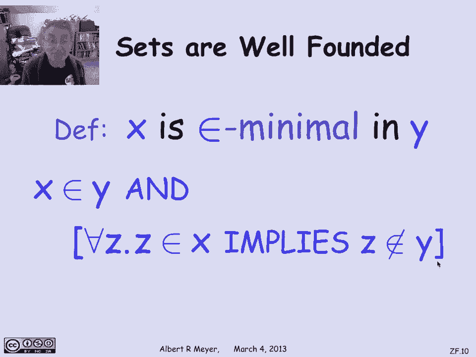
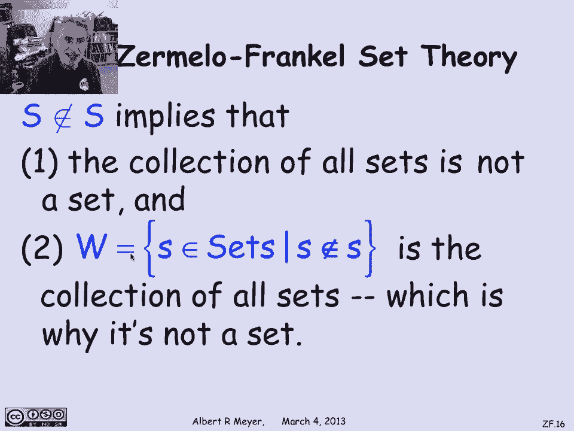

# 【双语字幕+资料下载】MIT 6.042J ｜ 计算机科学的数学基础(2015·完整版) - P34：L1.11.11- Set Theory Axioms - ShowMeAI - BV1o64y1a7gT

让我们快速看看Zermelo的公理，带有选择的弗伦克尔集合论。

所以ZFC um的公理定义了集合的标准理论。

现在被大多数数学家所接受，作为发展和证明所有数学的可靠和简单的基础。

在这些公理中，可能有一个很容易理解的公理，这个短视频的动机是双重的，一个是写谓语公式的练习，另一个是更多地考虑自我应用，所以集合论的一个基本公理叫做外延性，它抓住了一个集合是由它的成员决定的想法。

所以让我们考虑两个集合x和y具有相同元素的断言，我们可以把它写成谓词公式和集合论，至于所有x，x是y的成员，当且仅当x是z的成员，现在我们可以用它作为平等的定义，这就是我们所说的y和z相等的意思。

但我们甚至不需要把平等作为语言的一个基本部分，并添加关于它如何行为的公理，有一个公理充分地涵盖了事情，也就是说，如果两个集合有相同的成员，那么他们是同一组的成员，所以如果x和y的所有成员都是相同的。

那么x和y是完全相同的东西的成员，我们可以这样说，对于每x，y在x中当且仅当z在x中，所以呃，这是一个基本的公理，呃，集合论的，也许开始，开始的那个。

另一个是幂集公理，它简单地说，每个集合都有一个幂集，你怎么说用谓词集合论的语言，嗯，你会说对每一个x有一个p，它将是x的幂集，使得对于每个集合，s s是x的子集，当且仅当s是p的成员，记住。

我们知道如何将s表示为x的子集，在谓词演算的语言中，仅提及成员，所以这是一个很好的公理，说是的，有一个集合p正好由x的子集组成。

那个集合p叫做x的幂集，当你试图处理罗素悖论时，那种问题，其中定义满足某些属性的一组元素或一组集合，呃，保险箱，保守的说法是满足某种性质的一组元素，真的是一套，满足某种属性的元素集合。

真的是一个关于理解的集合公理是一个简单的，公理的一个版本，允许你这样做，所以基本上它说如果S是一个集合，x的p是任意的，集合论的谓词，这实际上可能是这些危险的事情之一，就像X不是X的成员，嗯，尽管如此。

如果你看集合中的这些元素，满足x的p是一个集合，换句话说，x在s中的集合，使得x的p是一个集合，嗯，然后它，它意味着集合中任何可定义的元素集合，也形成一个适当的子集，这很重要的原因是记住。

如果我刚才说的不是某一个特定集合中的x的集合，满足x的p，如果我只是说X的集合，满足x的p，那是我开始进入罗素悖论领域的时候，当我声明x的集合，使得x的p是x的无限制p的集合，但我所需要做的就是在。

在x范围超过的元素上，X是某个特定集合的成员。

那么把所有这些X都拿走是安全的，现在满足x的p，嗯另一个，呃，它解决了自我成员资格和自我引用的自我问题，直觉上的想法，集合的元素必须先于集合本身，他们必须比自我的集合更简单，比布景本身。

如果你想建立一个布景，从比较简单的元素到比较复杂的元素。

特别是，嗯，你不能有一套，成为自己的一员，因为它不是由比它更简单的东西构建的，或者在它之前发生的，事实上，你甚至不能有一个集合，它是它自己的一个成员的成员，所有这种间接成员资格现在都被禁止了。

你怎么说作为一个很好的公理，嗯，有一个非常优雅的方法来做这件事，也就是说，在成员资格下，所有集合都有很好的基础，这意味着你找不到无限的集合序列，每个都有预览，有下一个作为成员。

让我们给出一个精确的方法来表述，这也是集合论公式的良好实践。

假设x是最小成员数，y中的ε极小，表示x是y的成员，但是x中没有一个元素也在y中，换句话说，x是由不在y中的东西构建而成的，但是x本身在y中，所以x在y中的任何其他元素之前。

它是由非Y的东西建造的。

所以用一个公式来说，我们可以说x在y中，对于每一个z，如果它在x中，那它就不在Y里了。

这就是x是y中隶属度最小的定义。

这叫做基础公理，简单地说，每个非空集都有一个成员极小元素，这实际上是井序原理的一种推广，它说每个非负整数的非空集合都有一个最小元素，这是一个直接的类比，就像嗯，整数的井序原理。

意味着你不能有一个无限递减的非序列，负整数，基础公理，实际上意味着你不能有无限的集合序列，其中每一个都是前一个的成员，这里有一个公式，它断言每个x的基础，如果x不为空，这意味着有一个Y。

使得y是井中成员的最小值，基金会和会员有什么关系，基础实际上会很快让我们得出结论，没有集合是自己的成员，那怎么行得通，假设你对某一套感兴趣，你想核实一下，布景不能很好地成为自己的一员。

设r是仅由这个集合组成的集合，你感兴趣的是什么？r是单元素s它在s中的唯一元素，r不是空的，根据基础公理，它必须有一个成员极小元素，现在假设s是s，我们将达成一个矛盾，声称R没有成员最小元素。

这违反了基础公理，所以你不能把s作为s的成员，为什么接下来r应该有一个成员最小元素，只有一个元素，所以如果它有任何成员元素，一定是，但不能是最小会员，因为uh s uh在r中，它有。

这意味着s在r中有一个元素，所以s不是r极小，基础公理，然后立即暗示你不能让s成为s的成员，s不是r中的最小成员，这个论点以一种很好的方式扩展到一个成员中的一个成员，成员的成员。

很快就会在网上向你提出一个反馈问题。

研究基础公理和没有集合是自身成员的结论，我们可以立即得出的结论是，首先，所有集合的集合不可能是集合，因为如果所有的集合，如果，如果所有集合的集合是一个集合，那它就是自己的一员。

被s禁止的人不能成为s的成员，基础公理的一个结果，它告诉我们的第二件事是记住罗素悖论中的集合W，W是那些本身不是成员的集合的集合。

好吧，现在我们刚刚发现这是所有的设置，因为没有集合是它自己的成员，所以不是自己成员的集合就是一切，这就是为什么W不是集合，不是自己的成员。

