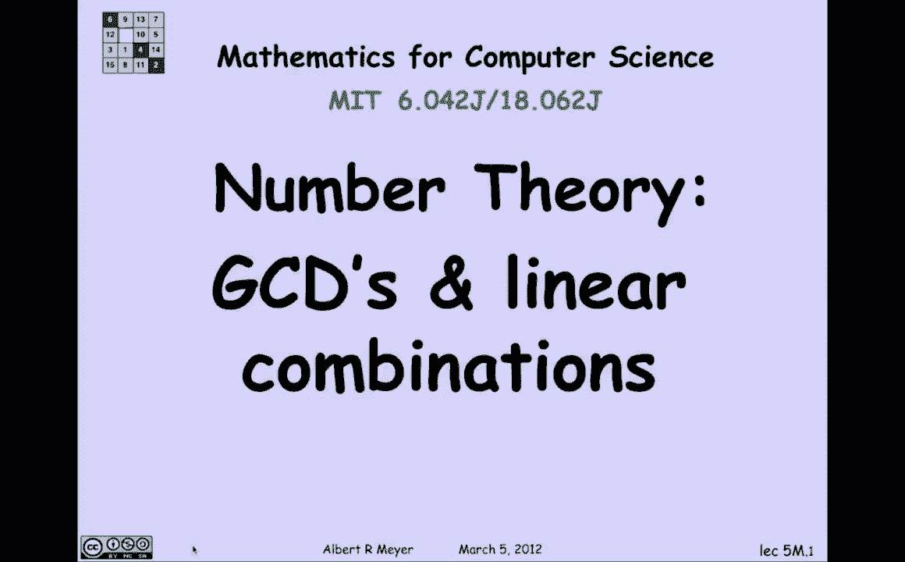

# 【双语字幕+资料下载】MIT 6.042J ｜ 计算机科学的数学基础(2015·完整版) - P35：L2.1.1- GCDs & Linear Combinations - ShowMeAI - BV1o64y1a7gT

现在我们开始四堂数论课，现在学习它的目的是我们还在练习证明，数论是一门很好的自成一体的基础学科，我们将讨论它，它有一些相当优雅的证明和说明，我们所学到的矛盾和其他结构结构。

一点点的归纳法以及井序原理的一些应用，哦，整个单元的终极笑点是了解RSA，密码系统及其工作原理，我们今天将真正建立一个我们都认为理所当然的母乳事实，关于整数到质数的唯一因式分解，但事实上。

那是一个值得举例说明的定理，在家庭作业中，我们展示了一个数字系统，这不是唯一的因素，最终我们将能够一劳永逸地结束虎胆龙威的故事。

所以让我们从陈述游戏规则开始，嗯，我们将假设加法的所有通常代数规则，乘法和减法，所以你可能知道，其中一些规则有名字，就像第一个等式一样，叫做乘法除以加的分配性，乘以加，第二个规则叫做乘法的交换律。

这里有一些更熟悉的规则，这叫做乘法的结合律，这被称为加性恒等式，减a等于零或者实际上是加法逆，零是加法单位元，负a是a的逆，嗯，加零等于A是零的定义，作为附加标识，加一大于，所以这些都是标准的代数事实。

我们将认为是理所当然的，不用担心。

还有一个我们也知道的事实，我们要把它作为一个公理，嗯，如果我把一个数除以正数，对不起，如果我把一个数a除以一个正数b，那么当我们谈论整数的时候，我要得到一个商和一个余数，商和余数的定义是什么，嗯。

除法定理说，如果我把a除以b，这意味着如果我把商乘以b加上余数，我得到a，事实上，A除以B有一个唯一的商，并且是a除以b的唯一余数，剩下的是什么使它独特，余数被限制在大于或等于零的区间内，且小于除数b。

所以我们会认为这个事实是理所当然的，证明不值得想得太苦，因为这是如此基本的事实之一，很难想象有其他事情能更合理地证明这一点，我相信这可以用归纳法来证明。

但我还没想清楚，我们今天要讨论的一个关系，是整数之间的整除关系，所以顺便说一句，接下来一周左右的所有变量，将被理解为范围在整数上，所以当我说数字的时候，我是说整数，当我谈论变量a、c和k时。

我是说他们取整数值，所以我要定义c，除a，使用这个竖条表示法，它被读作除c除a，当且仅当a等于k乘以c，对一些人来说，a除法b有多种同义词，像A是一个设备C，对不起，c除a，就是说a是c的倍数。

um和c是a的除数，好的，让我们练习一下，所以五设备十五井，因为十五是三乘以五，数字n除零，每个数n除零，偶数除零，因为零等于零乘以n，所以零是每个数字的倍数。

从定义中得出的另一个琐碎的事实是，如果c整除a，则c除以任何常数乘以一口井，让我们看看它是如何从定义中得到的，嗯，如果给定c除以a，这意味着A等于K素数，c表示某个k质数，如果我把这个等式的两边乘以s。

我知道s a等于s k一撇c，如果我把s k素数加括号，我可以称之为K，我确信a是c的倍数，那是微不足道的，我们只是在练习定义，所以我们刚刚验证了这个事实，如果c整除a，则c除以常数乘以a，嗯，事实上。

如果c除a，c除b，那么c除以a加b，让我们检查一下那个，嗯，我们得到的是c，c除a，意味着，a等于k乘以c，c整除b意味着b等于k乘以c两次，这意味着a加b就是k 1加k 2乘以c，我所做的就在这里。

用分配律来因子C，并利用乘法是交换的事实，这样我就可以排除两边的因素，让我们把这些事实放在一起，如果c除a，c除b，那么c除以s，a加tb或s和t或任何整数，所以两个数字的组合。

像这样的a和b叫做a和b的线性组合，整数线性组合，但因为我们只讨论整数，我不再说整数线性组合了，就说线性组合，A和B的线性组合是你把它们相乘得到的，通过系数s和t并将它们相加，所以我们才发现，事实上。

如果c除a，c除b，则当C整除两个数时，C整除B的整数线性组合，它被称为这两个数的公约数。

所以我们可以把这个观察改写为，a和b的公约数除a和b的整数线性组合。

这是一个很好的事实，只要在你的脑海中归档，今天剩下的时间我们要关注的是什么，是A和B的最大公约数的概念，A和B的最大公约数存在于井序原理，因为它是一组非负整数，有一个上限。

um即a是a和b的最大公约数上的上界，就像我们在一次练习中所做的那样，或者我想，在文本中暗示将会有一个最伟大的，在所有的公约数中，假设有任何，但一个总是公约数，所以肯定会有一些，嗯，让我们看一些例子。

十和十二的最大公约数，大家可以看一下，是两个，呃，主要是因为10个因素变成了2乘以5和12个因素，呃，二乘六，六和五没有共同的因素，所以他们唯一共用的是两个，他们没有共同的因素，你可以看到。

因为13是质数，所以它除了1和13之外没有其他因素，十三除以十二，因为它太大了，所以它必须是一个，那是普遍现象。对于任何正n，零和n的最大公约数等于n。

那是因为一切都是零的除数，它本身当然是n，最后一个因素，把事情安排好，不是1就是p，原因是质数的唯一除数是正负一，正负p。

