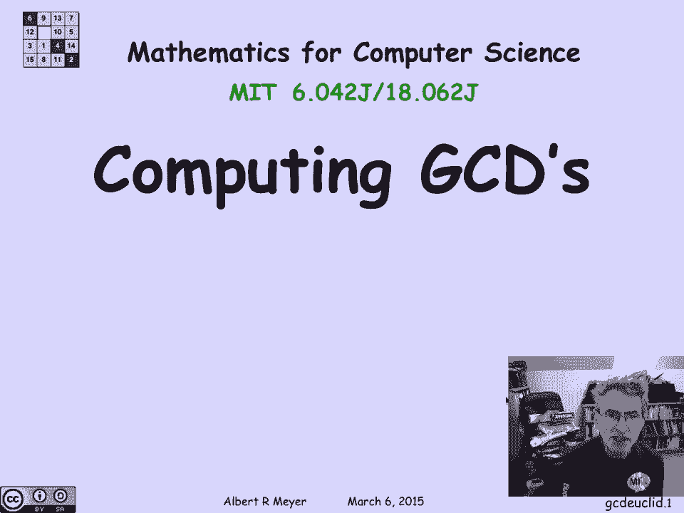

# 【双语字幕+资料下载】MIT 6.042J ｜ 计算机科学的数学基础(2015·完整版) - P36：L2.1.2- Euclidean Algorithm - ShowMeAI - BV1o64y1a7gT

the greatest common divisor of two，numbers is easy a computer and that's a。

fact that will play a crucial role in，the number theory that we're going to。

develop and the properties of some of，the modern codes that are based on。

number theory the efficient way to。

compute the GCD of two numbers is based，on a classical algorithm known as。

nucleating an algorithm which is several，thousand years old and let's describe。

how it works now so the Euclidean，algorithm is based on the following。

lemma which we'll call the remainder，lemma and it says that if a and B are。

two integers then the greatest common，divisor of a and B is the same as the。

greatest common divisor of B and the，remainder of a divided by B providing of。

course B is not zero because otherwise，you can't divide my movie okay oh how do。

you make sense out of this how why is，this true well it's actually a very easy。

proof remember that by the so-called，division algorithm or it's really a。

theorem if you take if you divide a by B，and we're doing inter division and what。

that means is you find a quotient of a，divided by being the quotient and a。

remainder and the commotions has the，property that Q times B plus the。

remainder is equal to a the remainder is，always going to be smaller than a it'll。

be in the range from 0 up to but not，including a ok if you look at this。

simple expression what it becomes，apparent is that if you've got a divisor。

of two out of three of these terms then，it's going to divide the third term so。

for example if you have a divisor of B，and R then the sum of those two things。

is also going to have the same divisor。

which means that a will have that，divisor if something divides both a and。

B then it divides R and if it divides B，and R it divides a and that means that a。

and B and B and R have exactly the same，divisors they not only have the same，green as。

devisor all their divisors are the same，so obviously the greatest one is the。

same and that proves this key remainder，llama，well the remainder lemon now gives us a。

very lovely way and compute the GCD and，here's an example suppose I want to。

compute the GCD of 899 and 493 a is 899，B is 493 well so I want this GCD 899。

afford 93 well according to the，remainder lemma if I divide 899 by 493 I。

get a quotient of 1 and a remainder of，406 and so that means that 899 and 493。

have the same GCD as 493 and 406 well，that is as the original number B and the。

new remainder 406 but now I can divide，493 by 406 I get a quotient of 0 and a。

remainder of 87 so 406 and 87 have the，same GCD dividing 406 by 87 I get that。

87 and 58 have the same GCD dividing 87，by 58 I get that 58 and 29 have the same。

GCD and now I win because look when I，divide a 58 by 29 I get a remainder of 0。

and the GCD of anything n0 is that，thinks of the GCD of 29 and 0 is 0 I。

guess the only exception is the GCD of 0，and 0 which is not defined but if it's。

if it's not 0 then the GCD of X and 0 is，X and there it is so I've just found。

that the GCD of 899 and 493 is 29 and，this is a quite fast algorithm because I。

keep dividing the numbers that I have by。

each other and it gets small fast will，be more precise about that in a minute。

okay well it's a good exercise in state，machine thinking and practice in program。

verification can reformulate the，Euclidean algorithm or formulate。

explicitly as a state machine it's very，simple kind of state machine the states。

and this Euclidean algorithm state，machine will be pairs if not，so the states are n cross and the。

Cartesian product of the non-negative，integers with itself the start state is。

going to be the pair a B whose GCD I，want to compute and the transitions are，lemma。

namely if I have a fell Maine state mix，Y where you think of X's and Y is the。

GCD that I'm trying to compute I simply，convert x and y to y and the remainder。

of X divided by Y and I keep doing that。

as long as Y is not 0 okay very simple，state machine really just one transition。

rule well according to the lemma since，I'm replacing the JC thing of x and y by。

the GCD of Y and the remainder of X，divided by Y the GCD is actually staying。

constant this transition preserves the，GCD that's left in the pair of registers。

x and y so what we can say is that since，the GCD of X & Y doesn't change from one。

step to another we can say that the GCD，of x and y at any point is equal to its。

original value which is the GCD of a and，B so in other words this equation GCD of。

X & Y and the current state is equal to，GCD of a and B the GCD of a and B that。

we started with is a preserved invariant，of the state so P of a state X Y the。

property that gcd of x and y is the，original GCD is a preservative variant，of the state machine。

moreover P of star is trivially true，because at the start x and y are a。

equals base other so P of X and y is，just saying that you see D of a and B is。

equal to GCD of a and B cool so I've，gotten that this property is true at the。

start and it's preserved by the，transitions so the invariance principle。

tells me that if the program stops I'm。

gonna have the gcd of x and y when it，terminates is equal to the actual GCD。

that I want and that enables us to prove，partial correctness the claim is that if。

this program terminates and we haven't，determined that it does yet but at，termination if。

any I claim that the that X is left in，that the GCD of a and B is left in。

register X the value of x at the end is，going to be the GCD of a and B well why。

is that we'll look at termination what，we know is that Y is 0 that's the only。

way that this procedure stops because，otherwise the transition rule is。

applicable so that means that when y，equals 0 of termination what we have is。

that since Y is 0 GCD of X & Y is equal，to the GCD of X and 0 and that's equal。

to x1 assuming again that X is positive，or not 0 so X is the GCD of X or Y and。

by the invariant the GCD of x and y is，equal to the GCD of a and B so I've。

proved this little fact this procedure。

correctly computes the GCD of a and B，leaving the answer in register X if it。

terminates well of course it terminates，and it terminates fast so let's see Y。

notice is that at each transition we're，going to replace X by Y and Y by the the。

remainder of X divided by Y let's just，assume for simplicity that love the。

pairings one in X is the bigger one so，there's two cases of Y this these。

numbers are getting small fast the first，case is supposed that Y is less than X。

over 2 or less than or equal to x over 2，well since at this step you're gonna。

replace our X by Y it means that you're，replacing X by something that's less。

than 1/2 X so X gets have the dis step，okay what about if Y is big well if Y is。

bigger than X over 2 then the remainder，of X divided by Y is simply X minus y。

and it's gonna be less than X over 2 but，that's gonna be the value of y after the。

next step so y is gonna be 1/2 either at，this step or the next half a step when。

it's replaced by the remainder of x and。

y and the net result is that y gets cut，in half or even smaller at every other，step。

which means that this procedure can't，continue for more than twice the log to。

the base 2 of the original value of y，which is be a number of steps because。

that's how many halves you can do before，you start getting hitting zero so we've。

just shown that this procedure halts in，logarithmic and logarithmic number of。

steps which is the same as saying that，it's about the length of B in binary and。

even fewer steps than the length of B in。

