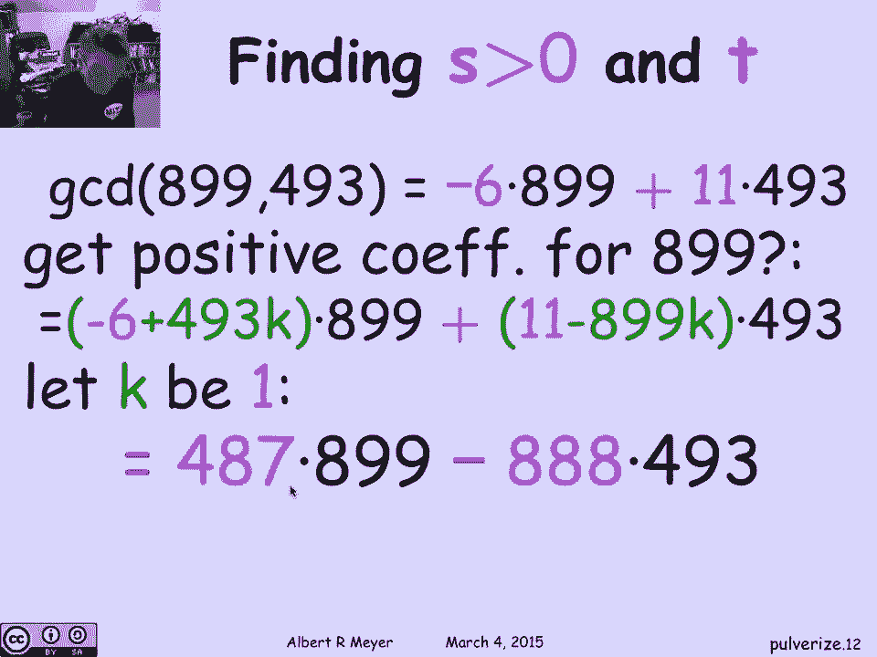
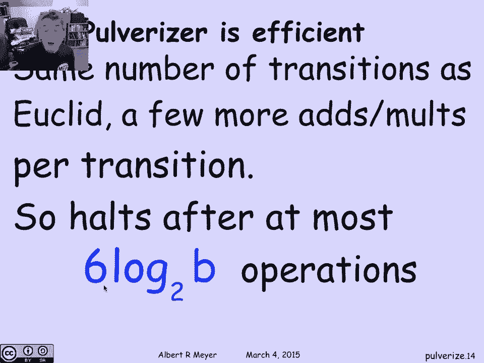

# 【双语字幕+资料下载】MIT 6.042J ｜ 计算机科学的数学基础(2015·完整版) - P37：L2.1.4- Pulverizer - ShowMeAI - BV1o64y1a7gT

让我们继续研究GCDS和线性组合，和欧几里得算法，通过研究通常被称为扩展欧几里得算法，这是个好名字，它的古老名字可以追溯到古印度是粉碎机，我们一会儿就会看到它有什么作用，所以我们的目标是达到顶峰的定理。

两个数的线性组合，其中s和t是整数，粉碎机使我们能够做的是给出A和B，我们可以找到S和T，事实上，我们可以像鱼一样找到S和T，像欧几里得算法一样有效，它只是通过执行欧几里得算法。

并在现在的进展中跟踪一些额外的附带信息，这一事实的推论是，我们现在知道，如果我们要刻画A和B的线性组合，那是因为我们知道a和b的每一个因子都整除任何a，A和B的线性组合，一旦我们知道任何线性组合。

这意味着任何线性，任何线性组合都是A和B过程的g c t的倍数，这意味着你有所有的线性组合，好的，呃，我们如何得到S和T好，基本思想是我们要找到这些系数，通过应用欧几里得算法，当我们走的时候。

我们将计算有效系数，最终当我们都结束了，我们将以特别的S和T结束，让我们记住欧几里得算法从，呃，用a和b，然后它有两个寄存器或数字x和y，它不断更新，欧几里得算法不断更新的，它保持不变。

所以我们要做的就是跟踪系数，叫他们C，d，e和f，这样x无论我们在做什么，我们知道如何表示为A和B的线性组合，不管我们为什么要这么做，我们也可以把它表示为A和B的线性组合，所以我们要跟踪这四个系数，c。

d，具有此性质的e和f，这个性质将是我们的另一个不变量，我们如何得到C的初始值，d，E和F好，一开始很容易，x是a，所以uc是1，d是零，因为a是一a加零b，同样y是零a加1 b。

所以我们知道c的这些值，d，E和F在算法的开始，问题是，我们如何很好地更新它们，欧几里得是如何，欧几里得是如何工作的，下一步记得，x的值是y的旧值，所以如果我把y的旧值作为ea加f b。

那么我显然有x的下一个值，作为与y相同的线性组合，你知道你以前的观点，接下来呢，那么在下一步，y的值就是x和y的余数，x和y的余数，记住只是X，减去商乘以y，其中商是x除以y的商。

所以这等于x和y的余数，这意味着既然我有Y，嗯，因为我也有x表示为线性组合，x减去q y就是x减去商次数的线性组合，y的线性组合，嗯，两个线性组合的差是线性组合，所以只要把系数组合起来。

我发现接下来表达Y的方式，作为a和b的线性组合，就是把前面的系数c组合起来，d，e和f的商是这样的，这就是它的全部，嗯，嗯，让我们举一个例子看看情况如何。假设a是899，b是493。

这是我们之前的一个数字，这些是我们以前应用欧几里得算法计算的数字，所以现在我们要做的是观察，我要从计算余数开始，但这次在计算余数时，让我们跟踪商，所以我要找出剩下的八九十九，除以四九十三，四零六。

商是一，是八十九是一乘以四九十三加四零六，这告诉了我什么，四零六，记住899是a，493是b，我发现第一个余数，四零六是a的1乘以a正负1乘以b，所以现在我把第一个余数表示为a和b的线性组合，嗯。

下一口井是什么，现在我得到了4 0 6和4 93，我要用余下的493除以46，嗯，那是八十七，事实上，493的商是1倍，四零六加八十七，这告诉我87是这个数减去那个数，八十七是四九十三减去四，哦六。

是啊，好吧，记住493是b，所以87是b的1倍，负1乘以四零六，但是等等，等等，等等，往上看这里，四零六，我知道怎么把它表示为A和B的线性组合，所以让我们替换这四个，哦六乘一a加减一b。

我最终会得到什么，记住这是一个，这是一个负号，所以我最终贡献了额外的B，我得到了一个负一个正，可以说，大致上A是门控的，但你可以检查我的代数，这就是表示下一个余数87的线性组合，所有权利，之后我们继续。

我们要做的是求四零六的商，呃到87岁，剩下的就这样，六之四除以八十七，你得到4的商和58的余数，余数5 8等于4 0 6减去4乘以8 87，但现在看上面，A和B的系数是4-0-6，A和B的系数是87。

所以我必须把它们乘以四和一，我最后发现用a和b来表达58的方法是，是五a正负九b，现在下一个，我应该找出八十七除以五的余数，量子人一号，余数是二九，这意味着2 9是1乘以87减去1乘以5 8，回首往事。

我知道怎么表达87了，以a和b表示，以a和b表示，以五八表示，我可以把这些表情组合起来，29等于负6乘a加11乘b下一个，我得把5 8除以2 9的商算好，商是二，但现在很酷的是余数是零。

这是欧几里得算法的停止条件，意思是答案是二九，没有余数了，但看看我们在最后一步得到了什么，那是粉碎机，我刚发现，s和t的可能值是-6和11，这是一个非常普遍的过程，总是会给你系数，有时在技术上很方便。

嗯，哪个系数是正的，哪个是负的，如果你要把都是正数的a和b组合起来，最后得到一个正数，通过将它们的倍数相加，得到一个更小的数，其中一个系数必须是负的，在这种情况下89的系数是负6，b的系数是十一。

假设我想，虽然，a的第一个系数为正数，另一个是阴性的，我怎么能做得那么好，有一个相当琐碎的小技巧可以做，真巧妙，但它可以立即验证，如何得到899的正系数，嗯，有一种获得较新系数的一般方法，好的。

如果你看-6，八九十九加十一四九三，如果我在第一个坐标上加上493的倍数，我从第二个坐标减去同样的899的倍数，我所做的就是把493乘以k，乘以八九十九到第一学期，我减去493乘以899乘以k。

它们抵消了，所以这个线性组合和那个一样，但是现在啊，顺便加上任何倍数，k可以是正的，也可以是负的，我可以做积极的事情，我可以让第一个系数变大或变小，特别是，如果我想让它是积极的，不妨取k的最小值。

这是一个，所以如果我让k成为一个，我发现我把493加到-6，我得到487，我减去十一，我从11减去899，我得到负8888，我们有了另一个表达式，因为此时s是487，t是负8888，第二个是负的。

第一个是阳性的，事实证明，这个小把戏将使我们在一个，在下一个视频中，为顽固的桶问题想出一个通用的解决方案。

很好玩的，但让我们结束当前的故事。

评论是粉碎机真的是另一个非常有效的算法，欧几里得算法的效率，它基本上有相同数量的转换，当您更新对x y以获得新的对y时，x除以y的余数，所以它需要两次原木，记录到底座，两次过渡，记录到要转换的基。

所以它的效率是指数级的，它在二进制中工作，数b的长度和二进制数，当然啦，比普通欧几里得算法用粉碎机，这么大的事，它意味着广告和广告的总算术运算的次数，乘以b的对数与基数2成正比，我说这里六个。

我想它实际上像十个，但最重要的是，它是一个小常数乘以对数到b的基数2，粉碎机是一种非常有效的算法，也是欧几里得算法。

