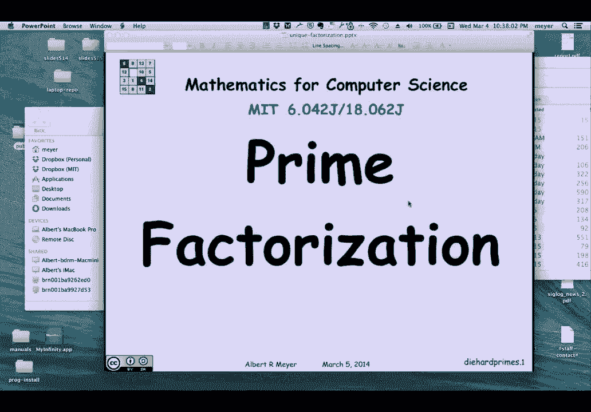

# 【双语字幕+资料下载】MIT 6.042J ｜ 计算机科学的数学基础(2015·完整版) - P39：L2.1.7- Prime Factorization - ShowMeAI - BV1o64y1a7gT

现在，我们更认真地应用了这样一个事实，我们要用它来证明素因式分解定理，我们前面已经谈过了。

这是唯一的素因式分解定理，所以让我们从素数的一个技术性质开始，这是我们熟悉的，但我们需要证明这一点，如果你相信素数因式分解，那么这个引理说如果p整除一个乘积，它将产品的一个或另一个组件分开。

这是素数因式分解定理的直接结果，但我们不能这样证明，因为我们试图用这个来证明素因式分解，那么我如何根据我们对GCDS的了解来证明，而不诉诸素因式分解，如果p是素数，p整除乘积，然后它把其中一个。

产品的成分，乘法器或乘法器，下面是如何证明假设p整除a b，但它不分割一个，当然，如果它确实除了一个，我受够了，我们不妨假设它现在不分割一个，这意味着既然，p的唯一除数是p和1，p或p的唯一正因子和1。

如果p不除以，这意味着我有一个a和p的线性组合，等于1，s a加tp等于1，对于某些系数，很酷，把右边的所有东西都乘以b，所以这意味着a b加上tpb等于1乘以b，但看看我们现在拥有的。

左边第一项是乘以b和p除以b，所以第一项可以被p整除，第二项显式地在其中有一个p，所以它肯定可以被p整除，所以左手边是p的倍数的线性组合，因此它本身是p的倍数，这意味着右手边是p的倍数，右手边是b。

果然p除以b，我们做了一个非常优雅的小证明，紧随其后的，作为这些数字的线性组合，这是我们需要证明唯一因式分解的关键技术引理，我实际上需要的一个推论，如果p除以两个以上的乘积，如果p除以很多东西的乘积。

它至少要把其中一个分开，你可以用归纳法来证明这一点，基本情况是它适用于m等于2，但不是很有趣，我们会认为这是理所当然的，如果p整除任意大小的乘积，它将产品的一个组成部分，现在我们准备证明。

所谓的算术基本定理，它说每一个大于一个因子的整数，唯一地变成弱递减的素数序列，周减少的说法有点技术性和出乎意料，我们想说的是，一个数因子到同一组素数，嗯，这是不太正确的。

因为素数集没有考虑每个素数发生的次数，嗯，你可以试着对每个数字做一个陈述，唯一是每种素数的一定数量的倍数，但一个巧妙的方法是简单地说，把所有的主要因素，包括一个素数的多次出现，以弱降序排列。

当你这样做的时候，这个序列是唯一的。

这个算术基本定理也称为素因式分解定理，上面写着，当我们不使用每周这个词就把它拼出来的时候，每周增加或每周减少，嗯，它说每一个大于1的整数n都有一个唯一的质数因式分解，主要是可以。

也就是它可以表示为p1到pk的乘积等于n um，p 1大于等于，p2大于或等于最小素数序列中的每个连续素数，最后一个，让我们举一个例子，所以有一个号码不是偶然选择的，因为我算出了因式分解是什么。

它进入以下每周递减序列，你从质数五三开始，你接下来是三十七的三次出现，两个十一，一个七和三个三，关键是，如果你试图表达这个丑陋的数字，作为素数的周递减序列，你总是会得到确切的序列。

这是做这件事的唯一方法，我们要怎么证明，嗯，让我们假设这不是真的，假设有一个数字可以用两种不同的方式分解，根据井序原则，至少有一个，所以我们说的是大于1的数字，所以至少有一个大于一的数。

可以用两种不同的方式来考虑，假设它是N，所以我得到的是n是p1到pk的乘积，它等于另一个产品，从q 1到q m p和q都是质数，这两个弱递减序列是不一样的，它们是不同的，不知何故，好的，所以说。

我们可以假设P是按每周递减的顺序列出的，Q也是以每周递减的顺序列出的，第一个观察是假设q 1等于p 1，那是不可能的，因为如果q1等于p1，2。我可以把两边的票都塞，我会得到p2到pk等于q2到qm。

这些仍然是不同的，因为他们是不同的，我从一开始就接受了同样的东西，我只剩下一个较小的数字，没有唯一的因式分解，与n的极小性相矛盾，所以简而言之，嗯，q 1等于p 1，所以其中一个必须更大。

我们不妨假设q 1比p 1大，所以q 1比p 1大，p1大于所有其他的p，所以说，事实上，q 1比每个p都大，由于推论的结果而达到矛盾，我所知道的是q 1除以n，n是p的乘积，因为q除以p的乘积。

必须把其中一个分开，必须把圆周率除以，但这与气Q 1比圆周率大的事实相矛盾，较小的数不可能除以较大的数，除以较小的数。

