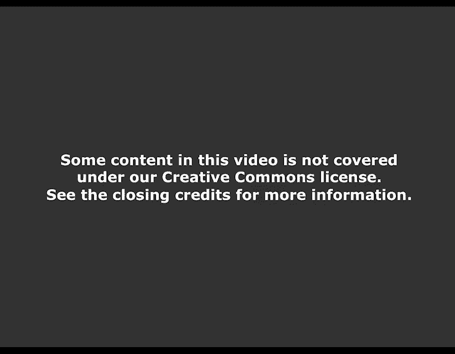
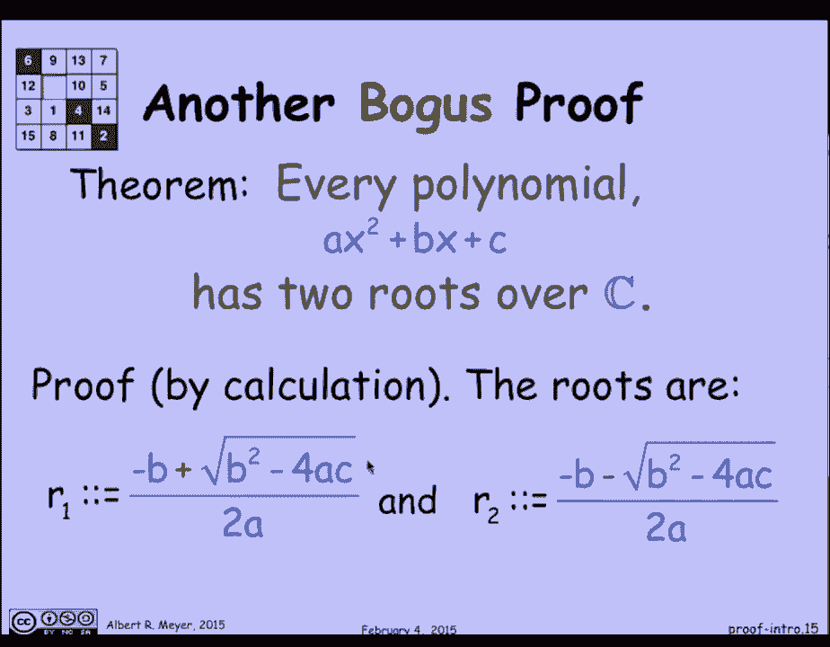

# 【双语字幕+资料下载】MIT 6.042J ｜ 计算机科学的数学基础(2015·完整版) - P3：L1.1.3- Intro to Proofs - Part 2 - ShowMeAI - BV1o64y1a7gT

还有其他类型的假证据出现，让我们快速浏览一下这个，关于多项式的根，你知道一个事实，每个多项式都有两个根，至少在c上的复数上，你怎么证明这一点，你只要写下根的公式，你知道二次公式，一个根是a-b。

加上这个量的平方根除以2 a。

另一个根是负b，减去b的平方根，平方减四c提供两个a，证明到此结束，你可以把这个公式代入r，1到这个x到这个多项式，它将简化为等于零，说明这是一个根，你可以把它代入x的这个公式中，简化代数，发现它是零。

证明r 2是根，我们刚刚证明了每个多项式都有两个根，那不是真的，我们还没有证明，这是一个有问题的计算证明，有什么问题？嗯，让我们看一个反例，多项式零x平方加零x加一，它没有任何根，只是一个不变的。

永远不会跨越原点，所以它没有根，0 x平方加1 x加1井，那是一条45度的线，x线和y等于x y，它只穿过原点，一旦它只有一个根，两个公式r 1和r 2怎么了，答案是，在这种情况下，我们必须除以零误差。

如果你看那个公式，有一个商，有2的分母，除以零，这些公式不正确，它们不是根，如此含蓄地为了有两个根，我们需要假设分母a，多项式的领先系数不为零，这样就修复了这两个bug，一切都好吗不。

因为看这个1 x平方的多项式，加零x加零有一个根，唯一可能的途径是，如果你看看这个，把某物的一乘加零到等于零的唯一方法是，如果某物为零，所以只有一个根，这里发生了什么，嗯，发生的事情是，在这种情况下。

两个公式r 1和r 2，是不同的配方，对同一事物的估价，当b为零，c为零，a为1时，这就是为什么它们看起来像不同的公式，但它们的价值是一样的，所以只有一个根，公式r 1和r 2不是零，这就是你服用的量。

判别式的平方根称为b的平方减去4，交流需要为零，我们会得到两个根，现在还有一个复杂的问题，听起来我们现在已经证实了我们的计算证明是正确的，现在我们已经加入了这些预选赛，A是正的，D是非零的。

但是如果d不是零，但是负会发生什么呢？这是一个有趣的复杂问题，然后让我们看看公式x的平方加1，b的平方减去四，交流电是负3，这将有两个根，即i和减去i，不可能分辨出哪个是，哪个r 1是负1的平方根。

R2是负1的平方根，其中一个是减去1的平方根的相加，另一个是减去-1的平方根，但是减一的平方根是没有办法区分的，在i和负i之间，抽象地说，它们的行为方式是一样的，所以我们对哪个是r有一个歧义。

哪个是R2，一点都不疼，对于r 1和r 2不同的定理，所以有两个根，但是模棱两可可能会有问题，让我给你们一个例子，嗯，当有歧义时，我可以很容易地证明，1等于-1，这是证据，我会让你好好想想。

试着弄清楚在这个推理中，循序渐进似乎很合理，但尽管如此，我还是得出了一等于负一的结论，这是荒谬的，它在利用你不知道的事实，减一的平方根是指i还是减i，所以这一切的寓意是，首先，确保你正确地应用了规则。

有一个关于代数规则的假设是不正确的，同样，这种盲目的计算是有风险的，当你并不真正明白你在做什么的时候，你不清楚确切的规则是什么，所以是理解把你从这种错误中解救出来，让我们稍微看一下1=-1。

因为它让我们用一句有趣的话来结束，1等于-1的可怕之处，它是错误的，你永远不想得出错误的结论，这令人担忧，当你断定某件事是假的时，那是灾难性的，让我给你一个例子，因为让我们假设1等于-1。

这就是正确的理由，从我们错误地证明的假设中，但是让我们假设我们从假设1是负1开始，嗯，如果我把方程的两边乘以相同的东西，它是相等的，所以我可以把两边都乘以一半，我得到的1/2等于-1/2。

现在我也可以把同样的东西加到两边，这是对等式进行推理的一个非常合理的规则，如果我把两边加两半，我把1等于-1变成了2等于1，现在，我的状态很好，可以证明各种各样的事情，这里有一个著名的，嗯。

因为我和果肉显然也是，我们得出结论，我和教皇是一体的，那就是我是教皇，我刚刚向你证明了，这个荒谬的事实，这是一个被归因于，伯特兰·罗素的一句妙语，著名的哲学家，逻辑学家，和平主义者，诺贝尔奖得主。

据说派对上的某个社交名媛找到了他，他听说数学家们认为如果一等于-一，那你就可以证明任何事情，所以她挑战并证明了你是教皇，据说是拉塞尔，他是出了名的机智，想出了这个例子，谁知道这是不是真的，这是个好故事。

有一张伟人的照片。