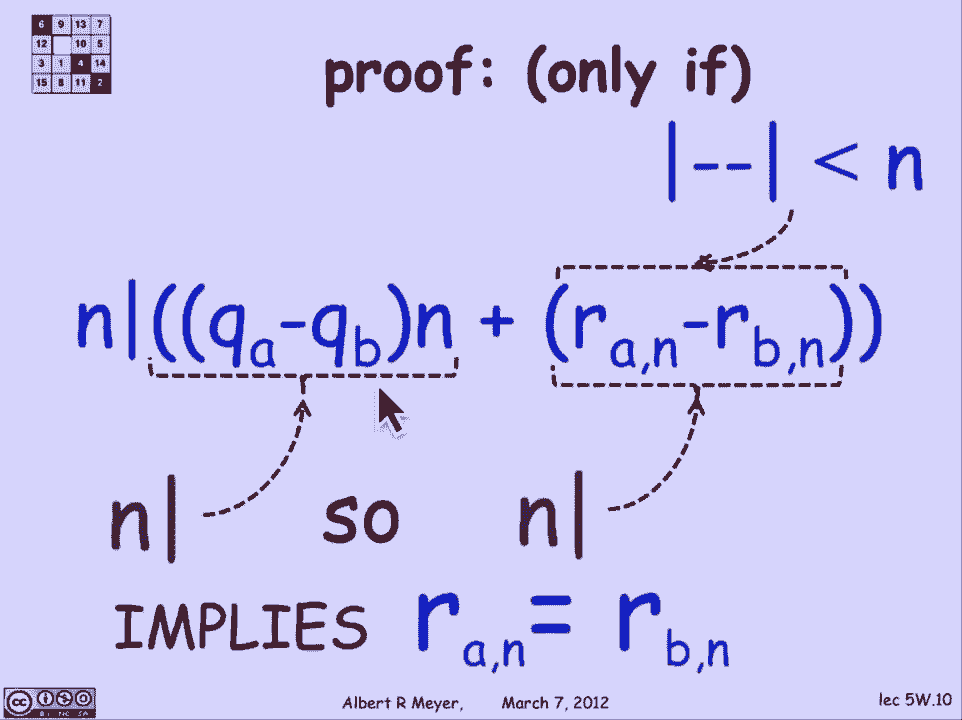

# 【双语字幕+资料下载】MIT 6.042J ｜ 计算机科学的数学基础(2015·完整版) - P40：L2.2.1- Congruence mod n - ShowMeAI - BV1o64y1a7gT

同余的概念是由高斯介绍给世界的，十八世纪初，你以前听说过他，我想他还负责一些磁学方面的工作，事实证明，这个想法在几个世纪后，仍然是一个活跃的应用和研究领域，特别是在计算机科学方面。

它在加密中得到了显著的应用，这就是我们现在要做的，在这个单元里，它还在哈希中发挥作用，这是管理内存中数据的关键方法，但我们无论如何都不会进入那个应用程序。

同余的定义是真实的，简单同余是两个数a和b之间的关系，它是由另一个参数n决定的，其中n被认为大于1，所有这些都像往常一样或整数，定义很简单，a与b模n同等，如果n整除a-b，或者a-b是n的倍数。

这是一个需要记住的关键定义，还有其他方法来定义它，我们很快就会看到，同样可以用作定义的等效表述，但这是一个标准的，a等价于b意味着a-b是n的倍数，嗯，让我们练习一下，三十等于十二，因为呃。

三十减十二等于十八，九除以十八。

好的，一个直接的应用是，这个有很多6的数字以一个，三等于七，八十八二五三模十，为什么那口井。

原因很简单，如果你想减去以3结尾的6个数字，从以三结尾的七个数字，你不用做太多减法就能立即看到的，只要做低阶数字，嗯，当你减去这些，你会得到一个以零结尾的数字，这意味着它可以被十整除。

因此这两个数是全等的，两个数什么时候全等是很容易判断的，因为它们有相同的低音或数字，一致性，它真正的意义是所谓的疯狂，它说a与b mod n同等，当且仅当a和b除以n时余数相同，所以让我们使用这个定义。

我们可以用这个公式得出结论，三十等于十二mod九的等价公式，因为三十的余数除以九，嗯，三乘以九等于二十七剩余三，十二乘九的余数是三，所以他们确实有相同的剩余三个，顺便说一句，它们是一致的，这个标志。

这个有三个单杠的等价符号是红色的，既等价又同余，我会蹦蹦跳跳，事实上，在两个发音之间，不加区别地，它们是同义词，好的，让我们考虑证明这个仍然的困境，只是为了练习。

为了适合滑梯，我将不得不缩写B的其余部分，用较短的符号除以n，R subbn只是为了适合。

所以证明余数的if方向，它们是一致的困境，当且仅当它们有相同的余数，这里的if方向，当且仅当是从右到左，我必须证明如果他们有相同的余数，那么它们是一致的，所以有两个数字a和b的除法，定理或除法算法。

它们都可以表示为a除以n的商，乘以商a，加上a除以n的余数，同样，b也可以用商和余数表示，我们在这里得到的是余数相等，但如果余数相等，然后很明显，当i减去a减去b，我得到q a减去q b乘以n，果然。

a减去b是n的倍数。

这就解决了那个问题，只有当方向从左到右，所以反过来，我假设n除以a-b，其中a和b用除法算法或除法定理以这种形式表示，所以如果n除以a-b。

以这种形式看一个负B，我们看到的是n除以q，a减去q b乘以n，加上余数的差值，这就是我减去a和b得到的，但是如果你看这个n除以那个项，商乘以n，因此，它也必须划分另一个项，因为n除和的唯一方法。

当它把一端分开时，如果它把另一端分开，所以n除以r a减去a的余数除以n，从b除以n，但请记住，这些是剩余物，这意味着它们都在0到n减去1的区间内，它们之间的距离必须小于1。

所以如果n整除一个介于0和n减去1之间的数，这个数字必须为零，因为它是n在其中除的唯一数，所以实际上余数的差为零，因此余数是相等的，我们把那个去掉了。

所以在那里它被重述了，其余，引理说如果在那里它们是全等的，当且仅当它们有相同的余数，这值得在周围放一个盒子来强调这个关键的事实，它同样可以被用作同余的定义，然后你会证明我们现在开始的除法定义。

这个余数的一些直接后果，引理是同余继承自等式的许多性质，因为这只不过意味着余数相等。

所以说，比如说，我们可以说同余是对称的，意思是如果A与B同等，则b与a同等，这是显而易见的，因为a与b同余意味着a和b有相同的余数，所以b和a有相同的余数，一个实际上需要一点工作的。

从除法定义中证明不是很多工作，但有一点点会是，如果a与b同等，和b与c同等，则a与c同等，但我们可以把它理解为第一个说a和b有相同的余数，第二个说B和C有相同的余数，所以很明显a和c有相同的余数。

我们已经证明了同余的传递性。

余数定理的另一个简单结论，是一个非常有用的小技术结果，称为剩余引理，它简单地说，一个数与它自己的余数是全等的，模n，证明很容易，让我们通过证明a和a的余数有相同的余数来证明这一点，嗯。

如果我把两边的余数，左手边成为a除以n的余数，右手边是余数的余数，但关键是余数在从零到n的区间内，这意味着当你把它的剩余mod和它自己，因此左手边是a除以n的余数，右手边也是a除以n的余数。

我们已经证明了，呃，这个推论，那是余数算术的基础，这基本上可以让我们在任何时候想要的时候，用数字的余数代替数字，这样数量就少了。

嗯，这也值得强调，好了，现在，除了这些性质，比如等式，同余有，它也与操作交互得很好，这就是为什么它被称为同余，同余是等式，尊重与讨论相关的操作的相似关系，在这种情况下，我们将讨论加号、乘法和全等。

关于同余的第一个事实说，如果A和B是同余的，那么a加c和b加c是等的，这一点的证明从定义中可见一斑，因为A与B同余，mod n说n除以a-b，如果n整除a-b显然n整除a+c，减b加c。

因为加c减去b加c等于a减去b，那一个看似微不足道，嗯。

也是这样，如果A要去B，那么a乘以c等于b乘以c，这个需要一行证明。

我们知道n除以a-b，这当然意味着n可以整除a-b的任何倍数，所以乘以c，然后应用分配性，你发现n除以ac减去bc，这意味着AC将是C，低端多。

嗯，这是我要省略的一小步，从两边加相同的常数，将任意两个同余数相加到相同大小，所以如果A与B同等，C与D同等，那么实际上a加c等于b加d，所以同余又一次表现得很像普通的等式，如果你把等于加到等于。

你得到了平等，当然，同样的事实也适用于乘法，如果你把等于乘以等于。

你得到了平等，这样做的一个推论是，如果我有两个全等的数，模n。

那么如果我有任何一种涉及正数、乘数和负数的算术公式，我想知道的是它等价于模n，2。我自己能猜到，用素数代替a或用素数代替a，1。我可以用一个数代替任何数，它与最终的一致是一致的，公式的结果将保持不变。

所以总的来说。

这说明了什么，模n的算术很像普通的算术。

关于余数的另一个关键点，是因为a与a除以n的余数同余，然后当我在同余上做算术的时候，我总是可以保持余数间隔中涉及的数字，在0到n减去1的余数范围内，我们使用这个标准的闭开符号间隔符号嗯。

表示从零到n的间隔，所以这个是红色的，这是它有时在分析中用来表示实数的实区间，但我们总是在谈论整数，所以这意味着整数，那个方括号表示包括零，圆括号表示n被排除，所以它是。

这正是对大于或等于零的整数的描述。

且小于，让我们应用这个余数算术思想，假设我想弄清楚什么是两个，到287的9次方模量，四，作为一个开始，如果我用287的余数除以4，检查那是三个并不难，这意味着287到9是全等的，所以已经。

我去掉了指数底部的三位数字，用一个数字3代替它，那是进步，或者我们可以取得更大的进步，因为三到九可以表示为三的平方，平方，平方乘以三，对呀，因为当你，当你重复获得权力时，这意味着指数相乘。

所以这是3到2乘以2乘以2或8乘以3，在指数上加一个，或者九个，这是简单指数，算术，9和9等于1 mod 4，这意味着我可以用1代替3的平方，它就变成了外面的两个平方，停留，它变成了一个平方的平方。

但那是一乘以三，笑点是两个，八十，通过简单的计算7到9等于3 mod 4。

